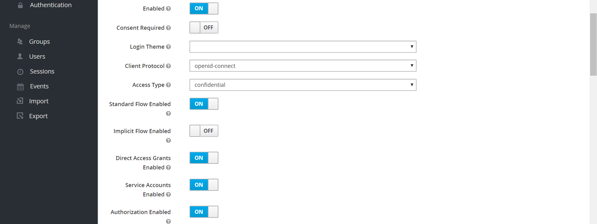
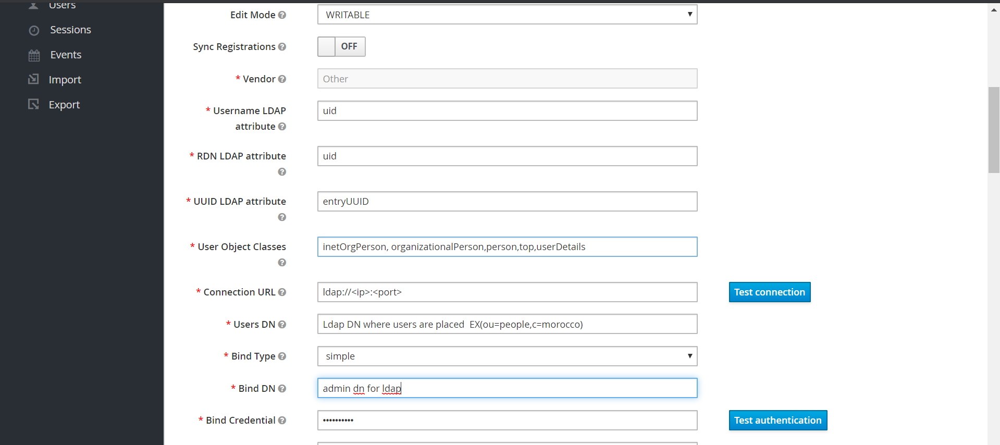
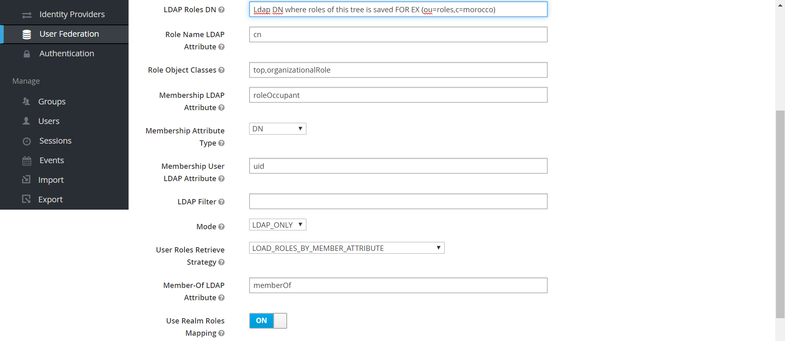

## Setup Keycloak Standalone Server setup 6.0.1
Dcumentation for setting up keycloak server

### Prerequisites

1. Install java (java-8-openjdk) in all the machines in the cluster and setup the `JAVA_HOME` environment variable for the same.
```
sudo yum install java-1.8.0-openjdk-devel
``` 
Get your Java installation path.
```
update-alternatives --display java
```

**_Note:_**
Take the value of the current link and remove the trailing `/bin/java`.
For example, on RHEL 7, the link is `/usr/lib/jvm/java-1.8.0-openjdk-1.8.0.191.b12-1.el7_6.x86_64/jre/bin/java`,
So, `JAVA_HOME` should be `/usr/lib/jvm/java-1.8.0-openjdk-1.8.0.191.b12-1.el7_6.x86_64/jre.`

#### Edit ~/bashrc.sh:
Export `JAVA_HOME={path-tojava}` with your actual java installation path. 
For example on a Debian with open-jdk-8:
```
export JAVA_HOME=/usr/lib/jvm/java-1.8.0-openjdk-1.8.0.191.b12-1.el7_6.x86_64/jre
```

### Download & install keycloak 
Download and unzip Keycloak
```  
sudo wget "https://downloads.jboss.org/keycloak/6.0.1/keycloak-6.0.1.tar.gz" 
sudo tar xzf keycloak-6.0.1.tar.gz
```
#### Install a database supproted by keycloak

We have installed postgres as the database for keycloak; you can use any database supported by Keycloak**

* [Documentation for Keycloak Database Setup is available here!](https://www.keycloak.org/docs/latest/server_installation/index.html#_database)

Install Postgres in your vm
[Install  Postgres](https://github.com/mosip/mosip-docs/wiki/Getting-Started#61-install-and-use-postgresql-version-102-on-rhel-75)

Within the  `…​/modules/`  directory of your Keycloak distribution, you need to create a directory structure to hold your module definition. The convention is use the Java package name of the JDBC driver for the name of the directory structure. For PostgreSQL, create the directory  `org/postgresql/main`. Copy your database driver JAR into this directory and create an empty `module.xml` file within it too.

**Module Directory**


After you have done this, open up the `module.xml` file and create the following XML:

**Module XML**
```
<?xml version="1.0" ?>
<module xmlns="urn:jboss:module:1.3" name="org.postgresql">

    <resources>
        <resource-root path="postgresql-9.4.1212.jar"/>
    </resources>

    <dependencies>
        <module name="javax.api"/>
        <module name="javax.transaction.api"/>
    </dependencies>
</module>
```

The module name should match the directory structure of your module. So, `org/postgresql` maps to `org.postgresql`. The `resource-root path` attribute should specify the JAR filename of the driver. The rest are just the normal dependencies that any JDBC driver JAR would have.


#### Create a service to start Keycloak
```
sudo cat > /etc/systemd/system/keycloak.service <<EOF

[Unit]
Description=Jboss Application Server
After=network.target

[Service]
Type=idle
User=root
Group=root
ExecStart=/opt/keycloak-6.0.1/bin/standalone.sh -b 0.0.0.0
TimeoutStartSec=600
TimeoutStopSec=600

[Install]
WantedBy=multi-user.target
```

#### Enable SSL for Keycloak server

To enable SSL we need a certificate which here in example we will use Lets encrypt.

Follow the steps in this [link](https://letsencrypt.org/) to create a certificate for your domain.

We will create a keystore in which we will store certificate chain and private key and give them an alias
```
openssl pkcs12 -export -inkey{{private key pem path}} -in {{certificate pem path}} -password pass:{{keystore password}} -out {{output keystore name}} -name {{alias}}
```

#### Configure standalone xml

* Go to `{{keycloak folder}}/standalone/configuration`
* Open `Standalone.xml` and make following changes
	*  Add a driver for postgres(Or your database)
		```
		<driver  name="postgresql"  module="org.postgresql">
		<xa-datasource-class>org.postgresql.xa.PGXADataSource</xa-datasource-class>
		</driver>
		```
	* Change the datasource properties
		```
		<datasource  jndi-name="java:jboss/datasources/KeycloakDS"  pool-name="KeycloakDS"  enabled="true"  use-java-context="true">
		<connection-url>jdbc:postgresql://<Host>:<Port>/{{database_name}}</connection-url>
		<driver>{{drivername}}</driver>
		<pool>
		<max-pool-size>pool size</max-pool-size>
		</pool>
		<security>
		<user-name>database username</user-name>
		<password>database password</password>
		</security>
		</datasource>
		```
	* Register the datasource
		While registering change the schema name if you want.
		```
		<spi  name="connectionsJpa">
		<provider  name="default"  enabled="true">
		<properties>
		<property  name="dataSource"  value="java:jboss/datasources/KeycloakDS"/>
		<property  name="initializeEmpty"  value="true"/>
		<property  name="migrationStrategy"  value="update"/>
		<property  name="migrationExport"  value="${jboss.home.dir}/keycloak-database-update.sql"/>
		<property  name="schema"  value="public"/>
		</properties>
		</provider>
		```
	* Change network configuration
		* Inet address for both public and management profile to access it remotely
			```
			<interfaces>
			<interface  name="management">
			<inet-address value="0.0.0.0"/>
			</interface>
			<interface  name="public">
			<inet-address value="0.0.0.0"/>
			</interface>
			</interfaces>
			```
		* Default ports from `8080 -> 80` and `8443 -> 443` to not give ports at time of accessing Keycloak
			```
			<socket-binding  name="http"  port="${jboss.http.port:80}"/>
			<socket-binding  name="https"  port="${jboss.https.port:443}"/>
			```
	* Adding a SSL certificate to Keycloak
		Here we will give the keystore we created to keycloak
		```
		<ssl>
		<keystore  path="your key store pass relative to the next property"  relative-to="jboss.server.config.dir"  keystore-password="yourpassword"  alias="your alias"/>
		</ssl>
		```
		
#### Add Keycloak Admin user

From keycloak bin directory run 
```
./add-user-keycloak.sh -u {{username}} -p {{password}}
```

#### Keycloak server start
```
 systemctl start keycloak
```

### Configure Keycloak
* Create a new Realm(eg. mosip).   
* Create clients for every module(i.e. ida,pre-registration,registration-processor,registration-client,auth,resident,mosip-client).
* Enable Authorization and Service Account for every Client and provide valid redirect uri. These clients will be used by all modules to get client tokens. 

 
#### Configure User Federation
For this Example we will be configuring LDAP as user federation 
* Go to User Federation.
* Create a new User Federation for LDAP.
* Make Edit Mode Writable.
* Configure field based on your LDAP(There are many vendors for ldap you can connect to any ldap vendor based on configurations).
* Go to Mappers and Create mappers for each field you want keycloak to take from LDAP.


```
isActive : user-attribute-ldap-mapper
username : user-attribute-ldap-mapper
rid : user-attribute-ldap-mapper
creation date : user-attribute-ldap-mapper
roles : role-ldap-mapper
last name : user-attribute-ldap-mapper
userPassword : user-attribute-ldap-mapper
mobile : user-attribute-ldap-mapper
dob : user-attribute-ldap-mapper
first name : user-attribute-ldap-mapper
email : user-attribute-ldap-mapper
 ```

* Sync Users and Roles from LDAP .
* Create INDIVIDUAL, RESIDENT Role from Keycloak in Realm Roles
* Assign Roles from LDAP and Keycloak to All Clients
```
IDA => ID_AUTHENTICATION
Registration-Processor => REGISTRATION_PROCESSOR
Registration-Client => 	REGISTRATION_ADMIN
						REGISTRATION_SUPERVISOR
						REGISTRATION_OFFICER
						REGISTRATION_OPERATOR
Resident => RESIDENT
Pre-Registration => PRE_REGISTRATION
					INDIVIDUAL
Auth => AUTH
```

#### Updation of Configuration for Keycloak
**_Note:_** <> is for variable properties with this sign need to be updated

##### Global Config
```
auth.server.validate.url=${mosip.base.url}/v1/authmanager/authorize/admin/validateToken
auth.server.admin.validate.url=${mosip.base.url}/v1/authmanager/authorize/admin/validateToken
``` 

##### Kernel
```
mosip.keycloak.base-url=https://<keycloak.domain>
mosip.kernel.realm-id=<Mosip realm id> (EX mosip)
mosip.kernel.open-id-url=${mosip.keycloak.base-url}/auth/realms/{realmId}/protocol/openid-connect/
mosip.kernel.base-url=${mosip.keycloak.base-url}/auth/realms/{realmId}
mosip.kernel.admin-url=${mosip.keycloak.base-url}/auth/admin/
mosip.kernel.roles-url=realms/mosip/roles
mosip.kernel.users-url=realms/mosip/users
mosip.kernel.role-user-mapping-url=/{userId}/role-mappings/realm

`#Domain should be updated
mosip.authmanager.base-url=https://<domain>/v1/authmanager

mosip.keycloak.authorization_endpoint=${mosip.keycloak.base-url}/auth/realms/mosip/protocol/openid-connect/auth
mosip.keycloak.token_endpoint=${mosip.keycloak.base-url}/auth/realms/mosip/protocol/openid-connect/token
mosip.admin.login_flow.name=authorization_code
mosip.admin.login_flow.response_type=code
mosip.admin.login_flow.scope=cls
mosip.admin.clientid=mosip-client
mosip.admin.clientsecret=<client secret of mosip client>
mosip.admin.redirecturi=${mosip.authmanager.base-url}/login-redirect/
mosip.admin_realm_id=<Mosip realm id> (EX mosip)

mosip.master.realm-id=master

`#Go to Mosip realm -> Go to Roles -> select INDIVIDUAL ROLE you will find hyperlink  in tab will have a id after roles-> /realms/mosip/roles/[e3bb3344-6445-4f6f-9e33-d5ec0d231327]
mosip.admin.individual_role_id=<role if of individual>

mosip.admin.pre-reg_user_password=mosip
db_3_DS.keycloak.ipaddress=<keycloak db url>
db_3_DS.keycloak.port=<keycloak db port>
db_3_DS.keycloak.username=<keycloak db username>
db_3_DS.keycloak.password=<keycloak db password>
db_3_DS.keycloak.driverClassName=<keycloak db driver class name>

mosip.keycloak.admin.client.id=admin-cli

`#First user we create when we started keycloak
mosip.keycloak.admin.user.id=<admin user name>

`#First user we create when we started keycloak
mosip.keycloak.admin.secret.key=<admin user password>

mosip.kernel.auth.client.id=<Auth Client id>
mosip.kernel.auth.secret.key=<Auth Secret id>

mosip.kernel.ida.client.id=<Ida Client id>
mosip.kernel.ida.secret.key=<Ida Secret id>
```

##### Pre-Registration
```
clientId=<pre-registration client id>
secretKey=<pre-registration-secret>
mosip.batch.token.authmanager.userName=<pre-registration client id>
mosip.batch.token.authmanager.password=<pre-registration-client-secret>
```

##### Registration-processor
```
token.request.clientId=<registration-processor-client-id>
token.request.secretKey=<registration-processor-client-secret>
KEYBASEDTOKENAPI=${mosip.base.url}/v1/authmanager/authenticate/clientidsecretkey
TOKENVALIDATE=${mosip.base.url}/v1/authmanager/authorize/admin/validateToken
```
##### IDA
```
auth-token-generator.rest.uri=${mosip.base.url}/v1/authmanager/authenticate/clientidsecretkey
auth-token-validator.rest.uri=${mosip.base.url}/v1/authmanager/authorize/admin/validateToken
auth-token-generator.rest.clientId=<ida-client-id>
auth-token-generator.rest.secretKey=<ida-secret-key>
auth-token-generator.rest.appId=ida
```
##### Registration-client
```
AUTH_CLIENT_ID=<registration-client-id>
AUTH_SECRET_KEY=<registration-client-secret>
```
##### Resident
```
`#Token generation app id
resident.clientId=<resident-client-id>
resident.secretKey=<resident-client-secret>
KERNELAUTHMANAGER=${mosip.base.url}/v1/authmanager/authenticate/clientidsecretkey
```