# 1. Introduction
## 1.1 Overview
The MOSIP architecture mainly consists of the following functional blocks/modules
* Pre-Registration - Web application designed in Angular JS
A resident can provide his demographic details in this web application and book an appointment for his future registration at a registration center
* Registration Client - A Desktop thick client application developed in JavaFX.
A resident is registered through the Registration Client software to generate get a unique identification number. The software captures demographic and biometrics information of the residents. It is connected to scanner devices (finger print, iris), camera and printer to capture resident biometrics information
* Registration Processor - A back-end server application developed using SEDA framework
It processes the client packets and generates UIN based on de-dupuplication information from ABIS (Automated Biometrics Identification System)
* IDA (ID Authentication) - A back-end authentication server developed using spring family. 
It authenticates the resident based on registered set of biometric and demographic information

Test automation is the key to the success of comprehensive test coverage and test data. However in the context of MOSIP testing, where there are external devices and integration with third party software, test automation cannot be exhaustive and comprehensive test coverage can be achieved by testing driven by manual intervention, along with test automation.

In this document we will also talk about utilities for test data generation, tools for test automation and test strategy in general.

## 1.2 Scope

### 1.2.1 Test Coverage
* Each of the modules has the following building blocks which are the testable entities, at the module level
* System Integration Testing - This involves testing functional work-flows across the modules, starting from Pre-Reg and ending in IDA
* Test Automation - tools, approach, test code configuration management process, regular usage

 Module | Testable Entities | Levels of Testing | Comments |
 -------|-------------------|-----------------|-----------
 Pre-Registration | UI   REST APIs | UI Functional Testing   Individual API testing   API level integration testing | | 
 Registration Client | Java APIs | UI Functional Testing (with simulators and with devices)   Individual API testing   API level integration testing | | 
 Registration Processor | Java APIs   SEDA vert.x stages | Individual API testing   Integration workflow testing including the APIs and Vert.x for processing various packet types| | 
 IDA | REST APIs |  Individual API testing   Integration workflow testing | | 
 Kernel | REST APIs |  Individual API testing   Integration workflow testing | | 

### 1.2.2 Data Coverage
* Data utility tools - approach, usage
### 1.2.3 Test Management Tools

### 1.2.4 Defect Management & Lifecycle

# 2. Test Approach
Each module is tested, both manually and through automation software for effective test coverage.

A progressively evolving test approach is being adopted in both cases. 
1. Manual Testing starts with module level functional coverage followed by --> integration across modules --> End to end workflow testing
1. Automation Testing starts with the fundamental building blocks like APIs, and grows up the stack. 
   * Individual API verification is followed by --> API Integration testing --> integration across modules --> End to end workflow testing

# 4. Test Automation User Guides

## 4.1 Kernel Test Automation Suite - User Guide

### 4.1.1 About the Kernel Module

A critical interface module of MOSIP, Kernel is the core package on which MOSIP services are built upon and is a platform, which provides higher-level services and functions that shall be reused by other modules of MOSIP. 

Kernel provides a foundation to build and run the services by providing several significant necessary technical functions. Kernel makes it easy to build the higher-level services (domain services, batch services and core services) by taking care of fundamental features so that individual services are concerned with specific business functions. Kernel provides an active framework that ensures structure and rules within which the higher-level services operate.

Kernel automation works with Restful and Java API’s.

The test execution module of the Kernel module involving API’s is as depicted below
 
 

### 4.1.2 Pre-requisites for understanding Java API automation
* Knowledge on Java 8
* Basic knowledge on Rest assured tool
* Knowledge on Maven 
* Knowledge on TestNg framework
* Knowledge on GitHub
* Good analytical and debugging skill

### 4.1.3 Procedure to check out the test code from the repository
* Create a workspace in the local system
* Open git bash in the workspace
* Enter the command :- git clone https://github.com/mosip/mosip-functional-tests.git
* MOSIP project shall be cloned
* Import the “automationtests” project into the eclipse.
 
### 4.1.4 Pre-configuration information prior to test run
None

### 4.1.5 Procedure to Add new test cases into the API test suite
1. From the automationtests project, the test suites and cases can be located in the folder [**src/main/resources**]
1. Every API tests structure (model, api name and test case) are stored in a folder/sub-folder approach. Let us take an example of “**Email Notification service**” and explain how to add a new test

 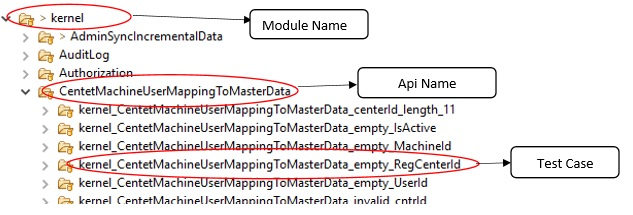 

3. Every test case will have 2 json files named [**request.json** and **response.json**] in its sub-folder as shown below

 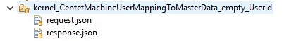 

4. In the request.json file, we need to mention the input that needs to be send to the API and response.json file contains the expected result for that particular input. 

Based on the test cases, we need to add the test case folders with request and response files.

The **readTestCases** method from **TestCaseReader** class will read the folder names and give the test case names and **readRequestResponseJson** method from **TestCaseReader** class will read the request and response files from the tests.

### 4.1.6 Procedure to execute or Run the tests on a new environment
* To run the automation suite of Kernel you will need an xml file named [**testngKernel.xml**], which will be available under [**src/main/resources**].
* Add what are the test need to run in that xml file.
* Add the path of the xml file in **pom.xml** file under maven surefire plugin.

### 4.1.7 Running a test suite
1. Right click project
1. Select “Run as configuration”
1. Under configuration select **Maven build** and create new maven build
1. Select current project as workspace.
1. Pass the below commands in the Goals:-

   Command:-**clean install** -**Denv.user**= required environment

   **-Denv.endpoint**=application url **-Denv.testLevel**=testLevel

   **Where**

   * Required environment- In which environment the suite needs to run. (Ex: qa, dev, int)
   * TestLevel- Type of tests like (Ex: smoke, regression, smokeAndRegression)

   **Note: - Here regression means all tests other than smoke tests.**
6. Select or Click the button “RUN”
1. Once the execution is completed, Test report will be generated in **target/surefire-reports** folder with the name **MOSIP_ModuleLevelAutoRun_TestNGReport.html**.

### 4.1.8 Analyze the test reports
1. Open the report in Internet Explorer
1. The report will give the module name, total number of test case execution with pass, skipped and fail count
1. Report will provide the build version and also execution time
1. Report will show API name and corresponding test case names with execution time
1. For failed test cases, it will show the cause of failure

## 4.2 Pre-Registration Test Automation Suite - User Guide
### 4.2.1 About the Pre-Registration Module
This is the web channel of MOSIP, which facilitates capturing individual information, relevant documents and booking an appointment with a registration center. This helps to reduce registration time and optimize the process. The current web application is highly modular by design and with multi language support. This UI can be customized or modified as per the country's requirements. A country can also build a new web/mobile application on top of the back end services that MOSIP provides.

The test execution work-flow for the module Pre-Registration involving Rest API’s is as depicted below

 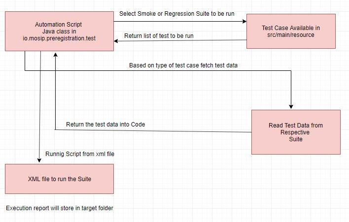 

### 4.2.2 Pre-requisites for understanding Java API automation
* Knowledge on Java 8
* Knowledge on Rest services
* Knowledge on maven
* Good analytical and debugging skill

### 4.2.3 Procedure to checkout-out the test code from the repository
* Navigate to git repository.
* Copy URI
* Open Git Bash
* Clone repository(git clone  “URI”)

### 4.2.4 Pre-configuration information prior to test run
None

### 4.2.5 Procedure to Add new test cases into the API test suite
1. From the code repository of the module, the test suites and cases can be located in the folder [**src/main/resources**]
1. Every API tests structure (test suite and test case) are stored in a folder/sub-folder approach. Let us take an example of “Create_PreRegistration” and Here you can see Create_PreRegistration is the suite name and inside that we have list of test cases.

  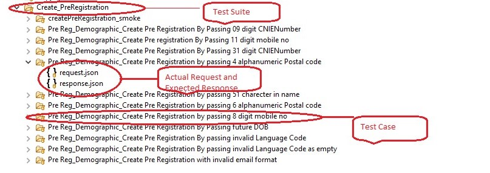 

3. To add new test case we need to create a folder inside test suite folder. You can give folder name same as test case name
1. Every test case name we need to add Create_PreRegistrationRequest.json file
 
  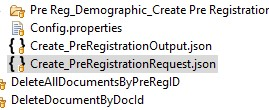 

5. In the Create_PreRegistartionRequest.json file, we need to mention all folder name(Test Case Name). 
When we run any class, then it will pick request body from folder and it will pick expected response. We will take request body, as input and it will give response (Actual Response).
For Validation, we are doing json to json comparison.
1. In Pre-Registration module, we have created on class called PreRegistrationLibrary, which is present in io.mosip.util package. In this class, we have created all reusable method, which is used, in Pre-Registration module.

   E.g.:-To book an appointment first we need to create an application, upload document, and then book appointment. Here for each operation we have created one method. 

### 4.2.6 Procedure to execute or Run the tests on a new environment
To run the automation suite of Pre-Registration module you will need an xml file named [**Pre-Registration_TestNG.xml**], which will be available under [**src/main/resources**]. In this xml file we need to add class name which we want to run.
 
  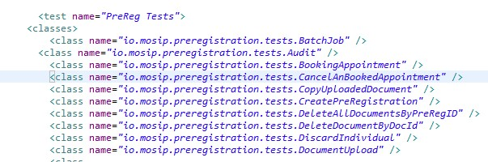 

### 4.2.7 Running a test suite
Procedure to execute the [**Reg-automation-service_TestNG.xml**] xml File:
1. Right click the xml file **Pre-Registration_TestNG.xml**
1. Select “Run as configuration”
1. Run as Maven
1. Select workspace(${workspace_loc:/automationtests})
1. In Goal Pass environment name,Base URI and  type of test case you want to run(smoke or regression)

    

   Here, 
   -Denv.user indicates environment name.
   -Denv.endpoint indicates base URI
   -Denv.testLevel indicates types of test case we want to run
 
6. Select or Click the button “RUN”
1. Test Suites execution will commence.
1. Test report will be stored in [**surefire-report**] folder under the base directory/project
 
    

### 4.2.8 Running a single test case
1. Right click on class, which you want to run.
1. Click on run as
1. Click on testing
1. Select class
1. In VM argument pass 
   -Denv.user=qa -Denv.endpoint="`eg:https://testenvname.mosip.io`" -Denv.testLevel=smokeAndRegression

### 4.2.9 Analyze the test reports
* Once run is complete, then refresh project and go to target/surefire folder.
* Open MOSIP_ModuleLevelAutoRun_TestNGReport.html report.
* To analyze failure test case check exception message. 

## 4.3 Registration Client Test Automation Suite - User Guide
### 4.3.1 About the Registration Client Module
An important client interface module of MOSIP, which captures the Biometric and Demographic information of the Individual resident. This module also stores supporting information such as proof documents and information about the guardian or introducer as per the configuration set by the Admin. The packet creation is finished in this module in a secure way using sophisticated encryption algorithm and later send to the server for online mode of processing. The registration client test suites comprises of tests related to UI and Java API’s.

The test execution module of the Registration client module involving Java API’s is as depicted below

 

### 4.3.2 Pre-requisites for understanding Java API automation
* Knowledge on Java 8
* Basic knowledge on Spring services and should know annotations
* Knowledge on maven
* Good analytical and debugging skill

### 4.3.3 Procedure to check out the test code from the repository
 
Instruction to checkout code from GitHub using Eclipse.
* Open eclipse
* Go to quick access and search “clone git”

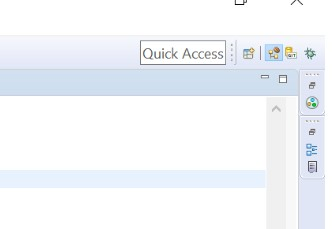 

   **Figure 1**

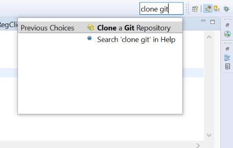 

   **Figure 2**

* A pop up will appear in that enter the URI, Host and Repository path as same as below. Pass your GitHub username and password and click on next.

 
 
* Search the branch name, select it, and then click next. Our latest branch name as [link](https://github.com/mosip/mosip-functional-tests).

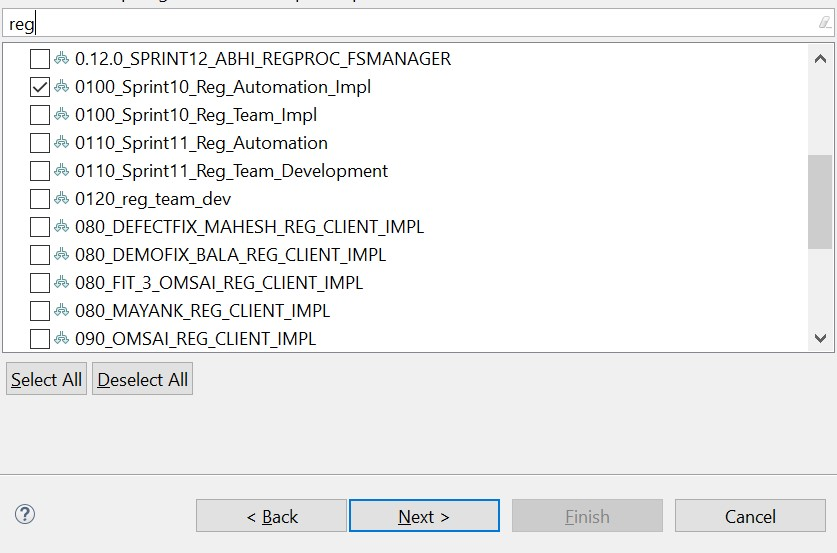 
 
* Browse the directory to pull the code.

 
 
* Now the code will be in eclipse git repository. Import the required project to the workspace. For registration client automation, we want to import kernel and registration projects.

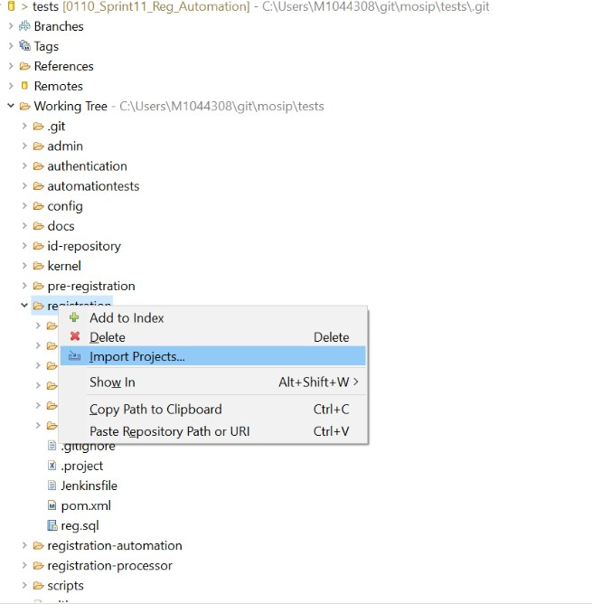 
 
### 4.3.4 Pre-configuration information prior to test run
None

### 4.3.5 Procedure to Add new test cases into the API test suite
1. From the code repository of the module, the test suites and cases can be located in the folder [**src/test/resources**]
1. Every API tests structure (test suite and test case) are stored in a folder/sub-folder approach. Let us take an example of “**Email Notification service**” and explain how to add a new test

 

3. Every test case will have a configuration property file named [**condition.properties**] in its sub-folder as shown below

 

4. In this condition.properties file, we need to mention the parameter type that needs to be sent to the API. [**valid**] indicates the value passed is a correct/right data and [**invalid**] indicates the data being sent is an incorrect/wrong data.(we can also check the parameter behavior for the empty and space also, for that we can pass the value as **space** and **empty** respectively in condition.properties) This information has to be entered for every field/parameter that the API consists. 

 

Based on values set inside the **condition.properties** file test cases will fetch the data from yaml file and then call a data generator code internally which shall add meaningful right or incorrect values as test data into these variables. 
More information on the Yaml file can be found under appendix

### 4.3.6 Procedure to execute or Run the tests on a new environment
To run the automation suite of Registration Client module you will need an xml file named [**Reg-automation-service_TestNG.xml**], which will be available under [**src/test/resources**].

### 4.3.7 Running a test suite
Procedure to execute the [**Reg-automation-service_TestNG.xml**] xml File:

1. Right click the xml file Reg-automation-service_TestNG.xml
1. Select “Run as configuration”
1. Under configuration select [TestNG] and pass the VM argument as
   -Dspring.profiles.active=required environment (which could be either of QA or INT or DEV) 
 
   -Dmosip.dbpath=DB path 

   *DB path – this is the local DB path where all the sync happens and other data’s get updated while running the code. The empty DB name is available in /registration/registration-libs/src/main/resources/db/reg . We are copying this empty DB in our project and passing as vm argument while running the code.

   -Dmosip.registration.db.key=DB key path

   Sample representation of the VM argument is as below
   
   ``-Dspring.profiles.active=qa  
   -Dmosip.dbpath=reg 
   -Dmosip.registration.db.key=D:\keys.properties``
4. Select or Click the button “RUN”
   Test Suites execution will commence.
5. Test report will be stored in [test-output] folder under the base directory/project

### 4.3.8 Appendix

**1. Java API**

   Java application programming interface (API) is a list of all classes that are part of the Java development kit (JDK). An application-programming interface (API), in the context of Java, is a collection of prewritten packages, classes, and interfaces with their respective methods, fields and constructors.
For more detail, refer to the [link](//resources.saylor.org/wwwresources/archived/site/wp-content/uploads/2013/02/CS101-1.3.5.3-Java-Application-Programming-Interface-API-FINAL.pdf)

**2. Yaml master data file**

   Yaml file is the master data set for testing the API, Sample Mater Data set is as below:

   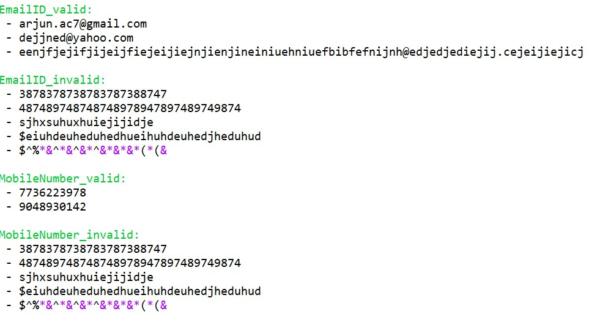 

**3. How to increase the data coverage inside Yaml file?**

   To increase the data coverage we can add as many as test data’s into the Yaml file 

**4. Any dependencies of values in the Database**

None

## 4.4 Registration Processor Test Automation Suite - User Guide
### 4.4.1 About The Registration Processor Module
Registration Processor processes the data (demographic and biometric) of an Individual for quality and uniqueness and then issues a Unique Identification Number (UIN). The source of data are primarily from
* MOSIP Registration Client
* Existing ID system(s) of a country

The workflow of testing or running the test suite of the available API’s And Stages is as depicted below

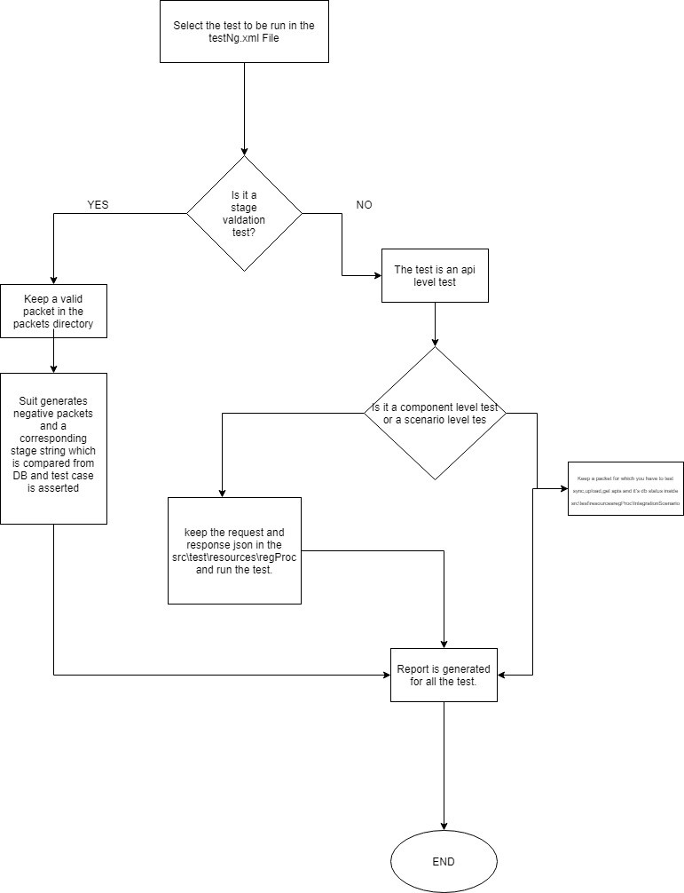 

### 4.4.2 Pre-requisites for understanding Rest API automation
* Knowledge on Core Java
* Basic knowledge on Rest assured library
* Knowledge on Maven
* Knowledge on TestNg framework
* Knowledge on Keyword, Data Driven and Hybrid methodology
* Knowledge on GitHub
* Good analytical and debugging skill
### 4.4.3 Procedure to checkout-out the test code from the repository
* Launch eclipse with new or existing workspace
* Clone project from [**link**](https://github.com/mosip/mosip-functional-tests)
* Import the automationtests project into the eclipse.

### 4.4.4 Procedure to Add new test cases into the API test suite

**Case1 : For Api Level Testing** 

1. From the automationtests project, the testdata can be located in the folder [**src/main/resources**]
1. Every API tests structure (model, api name and test case) are stored in a folder/sub-folder approach. Let us take an example of “**Sync Api Service**” and explain how to add a new test

  

**Case2 : For Stage Level Testing**
1. From the automationtests project, the testdata can be located in the folder [**src/main/resources**]
1. Every stage can be tested by feeding negative packets to the system and expecting them to fail for the particular stage. Let us take the example of “**OSI Validation Stage**”

  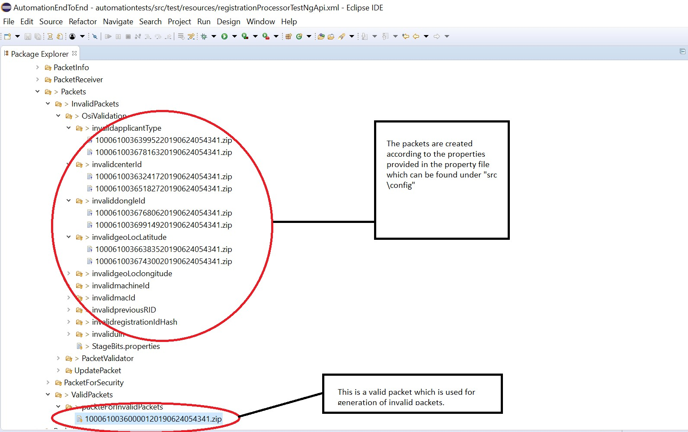 

3. A sample property file looks like as follows :

  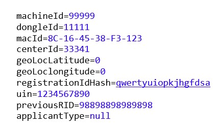 

4. The reg proc automation suite will tweak the values in a valid packet and will generate packets for the above attributes sequentially.
5. There is one more file “**StageBits.properties**” which has a stage string. The string is used to construct the status string for a packet. For eg if stage string is “**111110000**” it means that packet should go through first five stage and should fail for last 4 stages.

### 4.4.5 Procedure to execute or Run the tests on a new environment
1. To run the automation suite of Reg-Proc, build the project and get the uber jar generated under target. 
1. Run the jar using the command line “java -Denv.user=<env> -Denv.endpoint=<endpointurl> -Denv.testLevel=<testtype> -jar <jarname>”

   Example: java -Denv.user=qa -Denv.endpoint="`eg:https://testenvname.mosip.io`" -Denv.testLevel=smokeandregression -jar automationtests-refactor-0.9.1-jar-with-dependencies.jar

   Note: env = qa,dev,int | testLevel=smoke,regression,smokeandregression

3. Report will be generated under “< workspace >/testing-report.

### 4.4.6 Analyze the test reports
1. Report can be opened in any Web browser (i.e. Internet Explorer)
1. The report will consist of module name, total number of test case executed with status as either pass, skipped and fail and their count.
1. Report will also display API name and corresponding test case names with execution time along with build version and execution time.
1. For detailed analysis, refer logs or default testing-report and for failed test cases, the related cause of failure will be highlighted.

## 4.5 ID Authentication (IDA) Test Automation Suite - User Guide
### 4.5.1 About the ID-Authentication
MOSIP ID Authentication provides an API based authentication mechanism for entities to validate Individuals. ID Authentication is the primary mode for entities to validate an Individual before providing any service.

An example of how this service will work is as depicted below
    
 
The workflow of testing or running the test suite of the available API’s is as depicted below
   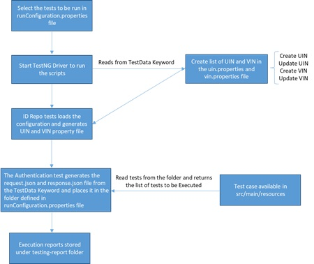 

### 4.5.2 Pre-requisites for understanding Rest API automation
* Knowledge on Core Java
* Basic knowledge on Rest assured library
* Knowledge on Maven 
* Knowledge on TestNg framework
* Knowledge on Keyword, Data Driven and Hybrid methodology
* Knowledge on GitHub
* Good analytical and debugging skill

### 4.5.3 Procedure to checkout-out the test code from the repository
* Launch eclipse with new or existing workspace
* Clone project from [link](https://github.com/mosip/mosip-functional-tests)
* Import the automationtests project into the eclipse.

### 4.5.4 Procedure to Add new test cases into the API test suite
1. From the automationtests project, the testdata can be located in the folder [**src/main/resources**]
1. Every API tests structure (model, api name and test case) are stored in a folder/sub-folder approach. Let us take an example of “**Demo-Address Authentication service**” and explain how to add a new test
   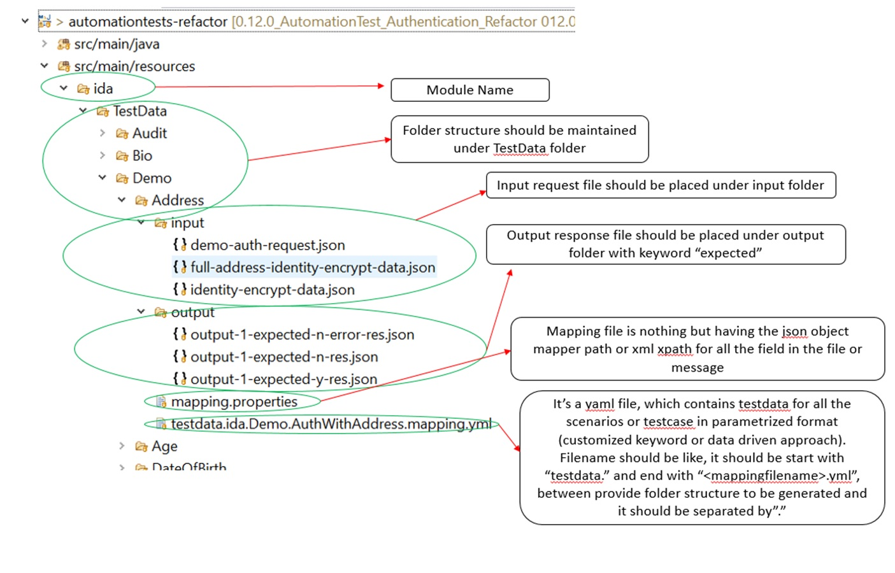 
3. **Pre-requisites**: 
   open runConfiguration.properties file

   Add the following two lines which represents your test case; one for the folder location and another on the test data as below, the array [X], where “X” represents the number of times this tests shall be repeated with different test data

   An example:
   DemographicAuthentication.testDataPath[6]=ida/TestData/Demo/Name/

   DemographicAuthentication.testDataFileName[6]=testdata.ida.Demo.Name.mapping.yml

   If you want to remove a test, kindly comment the relevant line in this file before the execution of TestNG runner class
4. **Configuration Setup for creating the request Json file**:

    

5. Please use the TestData keyword defined under in appendix for creating your request.json file. The provided keywords are sufficient for testing the ID Authentication module, however If you ever need you can add an additional attribute to the end of this list 

   **Sample structure of the request.JSON file**, which is being created at run time using the attributes defined in the TestData, which reads from the Yaml data file:

    

### 4.5.5 Procedure to execute or Run the tests on a new environment

1. To run the automation suite of ID-Authentication, build the project and get the uber jar generated under target. 
1. Run the jar using the command line “java -Denv.user=<env> -Denv.endpoint=<endpointurl> -Denv.testLevel=<testtype> -jar <jarname>”

   Example: java -Denv.user=qa -Denv.endpoint="`eg:https://testenvname.mosip.io`" -Denv.testLevel=smokeandregression -jar automationtests-refactor-0.9.1-jar-with-dependencies.jar

   Note: env = qa,dev,int | testLevel=smoke,regression,smokeandregression

3. Report will be generated under “<workspace>/testing-report

### 4.5.6 Analyze the test reports
1. Report can be opened in any Web browser (i.e. Internet Explorer)
1. The report will consist of module name, total number of test case executed with status as either pass, skipped and fail and their count.
1. Report will also display API name and corresponding test case names with execution time along with build version and execution time.
1. For detailed analysis, refer logs or default testing-report and for failed test cases, the related cause of failure will be highlighted.

### 4.5.7 Annexure
**Yaml Test Data Format**:

The sample structure should be like below:

 

**TestData Keyword repository**:

|Keywords| KeywordName/Purpose |Example|
|------|-----|-------|
|$TIMESTAMPZ$|To generate current timestamp with UTC format|2019-06-20T16:18:08.008Z|
|$TIMESTAMP$|To generate current timestamp with timezone format|2019-06-20T16:18:08.008+05:30|
|<li> $TIMESTAMP$HOUR+24 <li> $TIMESTAMP$HOUR-24 <li> $TIMESTAMP$MINUTE+23 <li> $TIMESTAMP$MINUTW-56 <li> $TIMESTAMP$SECOND+145 <li> $TIMESTAMP$SECOND-123|	To generate future or current timestamp	|
|$RANDOM:N:10$	|To generate random digit for the given number|<li> $RANDOM:N:10$ <li> $RANDOM:N:3$ <li> $RANDOM:N:14$|
|$UIN$|	To get random UIN number from uin.property file	|
| $UIN$:WITH:Deactivated#|	To get uin number from uin.property file where value contains Deactivated|	
|$VID$	|To get random VID from vid.property file where type as perpetual and status as ACTIVE 	|
|<li> $VID:WITH:Temporary$ <li> $VID:WITH:REVOKE$| To get random VID from vid.property file where value contains Temporary or Revoke	|
|$VID:WHERE:UIN:WITH:VALID$|	To get the VID from vid.property where uin.property value contains specified keyword after “WITH:”|
|<li> $TestData: indvId_Vid_valid$ <li> $TestData: bio_finger_LeftIndex_subType$ <li> $TestData:bio_face_deviceCode$|To get the random value form the list in the authenticationTestData.yml file.|
|$input.bio-auth-request : AuthReq.transactionID$|To get the already assigned for the files|<li> input.filename1:   mappingName1: value1  mappingName2: value2 <li> ouput.filename2:  mappingName3: <li> $ input.filename: mappingName2$  <li> where mappingName3 has set as value2|
|<li>  $errors:RevokedVID:errorCode$ <li> $errors:InactiveVID:errorCode$	|Get error code for the mentioned key “RevokedVID” from the errorCodeMsg.yml file.|
|<li> $errors:InactiveVID:errorMessage$ <li> $errors:RevokedVID:errorMessage$	| Get error message for the mentioned key “RevokedVID” from the errorCodeMsg.yml file.|
|<li> $idrepo ~ $input.bio-auth-request : AuthReq.individualId$ ~ DECODEFILE: individualBiometricsValue ~ //BIR/BDBInfo[Type = 'Finger'][Subtype = 'Left IndexFinger']//following::BDB$ <li> $idrepo ~ $input.bio-auth-request : AuthReq.individualId$ ~ DECODEFILE: individualBiometricsValue ~ //BIR/BDBInfo [Type= 'Face']//following::BDB$|To get biometric value for the UIN using cbeff File. It is combination of above listed keyword. <li> **Where** $idrepo -> keyword mandatory at start. <li> $input.bio-auth-request : AuthReq.individualId$ -> get the value from the previously mentioned field <li> individualBiometricsValue -> Mapping name in UINMapping/mapping.property <li> //BIR/BDBInfo[Type = 'Finger'][Subtype = 'Left IndexFinger']//following::BDB  -> cbeff xpath, where in this location biovalue will be saved for Left IndexFinger|
|<li> $idrepo~$input.demo-auth-request: AuthReq.individualId$ ~ valueaddressLine1: langcode: TestData: primary_lang_code$ <li>  $idrepo~$input.demo-auth-request: AuthReq.individualId$ ~ valuecity: langcode: TestData: secondary_lang_code$|<li> To get demographic data for the UIN and language. <li> **Where** $idrepo -> keyword mandatory at start. <li>  $input.demo-auth-request: AuthReq.individualId$ ->  get the value from the previously mentioned field <li> valueaddressLine1 -> Mapping name in UINMapping/mapping.property <li> TestData: primary_lang_code -> keyword to get language code from the authenticationTestData.yml|

	
## 4.6 E2E Test Automation Suite - User Guide

### 4.6.1 About The End To End Test Rig
End to end system level Test Rig covers the functionality across the modules starting with Pre-Registration and ending in Registration Processor or IDA.

The below diagram depicts the overall design of the end to end suite.
 
 

### 4.6.2 Pre Requisite To Understand The Flow Of E2E Test Rig
* Knowledge on Core Java
* Basic knowledge on Rest assured library
* Knowledge on Maven
* Knowledge on TestNg framework
* Knowledge on Keyword, Data Driven and Hybrid methodology
* Knowledge on GitHub
* Good analytical and debugging skill

### 4.6.3 Procedure to checkout-out the test code from the repository
* Launch eclipse with new or existing workspace
* Clone project from [**link**](https://github.com/mosip/mosip-functional-tests)
* Import the e2etestrig project into the eclipse.

### 4.6.4 Basic Code Structure Of The E2E Rig
1. The E2E rig is a basic parent child maven project
1. It contains 5 child project which are as follows: 
   * Pre Registration which will generate list of Pre-IDs
   * Registration Client which will generate list of packets.
   * Registration Processor which will generate UIN for the packets.
   * IDA to perform authentication.
   * E2E to consume the above projects
1. A basic code structure looks as follows:

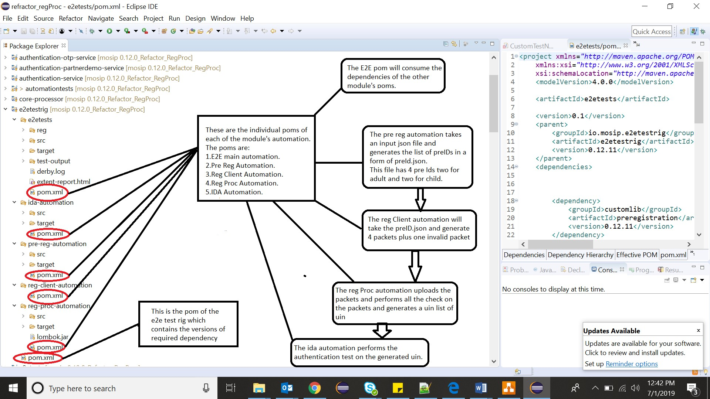 

#### 4.6.4.1 A Code Structure For E2E run
The E2E code has the following prerequisite
* Under src/test/resources we should have an input.json which contains a data to generate the list of preIDs.
* All the module level suites should be up and running.
* A sample pom for e2e looks like the following:

 
 
* The pre Reg Automation has the following pre Requisite :
   1. It should have an input.json file which will conation info about the adults and children against whom the preIDs are being generated.
* The Reg Client Automation has the following pre Requisite:
   1. The pre Reg Automation Should have run.
   1. A json file with a list of preIds must have been generated.
* The reg Proc Automation has the following pre Requisite:
   1. The reg Client and pre Reg automation should have run.
   1. A list of packets must have been generated.
* The IDA automation has the following pre Requisite :
   1. The regProc,reg Client,Pre Reg automation should have run.
   1. A list of uin should be present as a property file under src/main/resources which is generated by regProc.

### 4.6.5 Procedure to execute or Run the tests on a new environment
* To run the automation suite simply select the “EndToEndRun.java” class under the package “io.mosip.e2e.runner”.
* Report will be generated under “<workspace>/testing-report.

### 4.6.6 Analyze the test reports
1. Report can be opened in any Web browser (i.e. Internet Explorer)
1. The report will consist of total number of test case executed with status as either pass, skipped and fail and their count.
1. Report will also display applicant type and corresponding test case names with execution time along with build version and execution time.
1. For detailed analysis, refer logs or default testing-report and for failed test cases, the related cause of failure will be highlighted.
### 4.6.7 Limitations for the test rig
1. The rig is designed to run for only 5 packets.
1. The rig should run on a particular version of each module.
