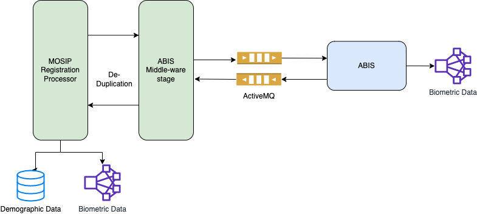

# ABIS

## Overview
Providing unique identity for a resident is one of key features of any identity platform. To achieve this, MOSIP interfaces with an **Automated Biometric Identification System (ABIS)** to perform de-duplication of a resident's biometric data. 

The ABIS system never comes to know about resident's identity. Any Personally Idenfiable Information (PII) such as demographic details or APPID (application ID for applicant) is not shared with the ABIS system. Internally, MOSIP maintains a mapping between the ABIS specific referenceID and APPID of the resident.


ABIS is used for 1:N deduplication. For 1:1 authentication [Biometric SDK](biometric-sdk.md) is used. MOSIP does not recommend using an ABIS for 1:1 authentication.


## MOSIP-ABIS interface
MOSIP interacts with ABIS only via message queues. JSON format is used for all control messages in the queue. MOSIP [ABIS middleware](https://github.com/mosip/registration/tree/release-1.2.0/registration-processor/core-processor/registration-processor-abis-middleware-stage) sends requests to inbound queue address and receives responses from outbound queue address.
ABIS must comply to the interface defined in [ABIS API Specifications](abis-api.md)

ABIS must support the following types of biometric images:
* Individual fingerprint images (segmented)
* Iris images (left, right)

For privacy and security considerations, face data **shall not be sent to ABIS** for deduplication.

Biometrics data in MOSIP is exchanged as per formats defined in [Biometric Image Specification](biometric-image-specification.md). 

## Test kits
MOSIP provides kits the test the interface. Refer [abis-testing-kit repo](https://github.com/mosip/abis-testing-kit/tree/1.2.0)

## ABIS deployment
* ABIS must comply to [ABIS API Specifications](abis-api.md).
* The queques can be configured in [RegistrationProcessorAbis-env.json](https://github.com/mosip/mosip-config/blob/master/config-templates/RegistrationProcessorAbis-env.json) file.
 ABIS system connects to the queues using a pre-defined user id and password. 
* It is recommended that ABIS is deployed in the same secure zone (military zone) where the registration processor is deployed. 
* ABIS system is not recommended to connect to any external network.

