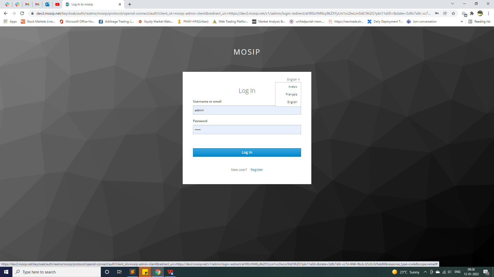
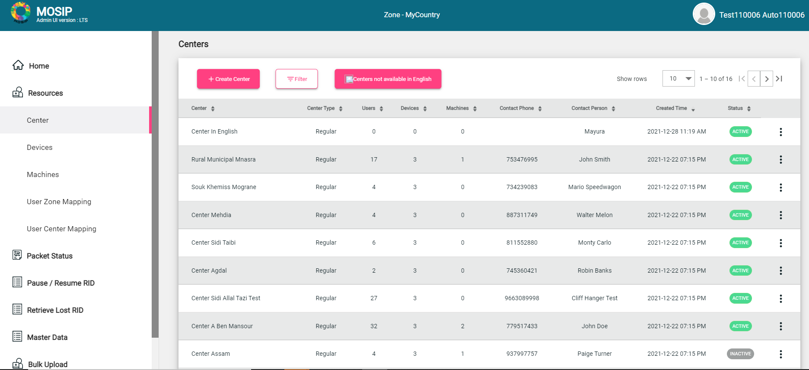
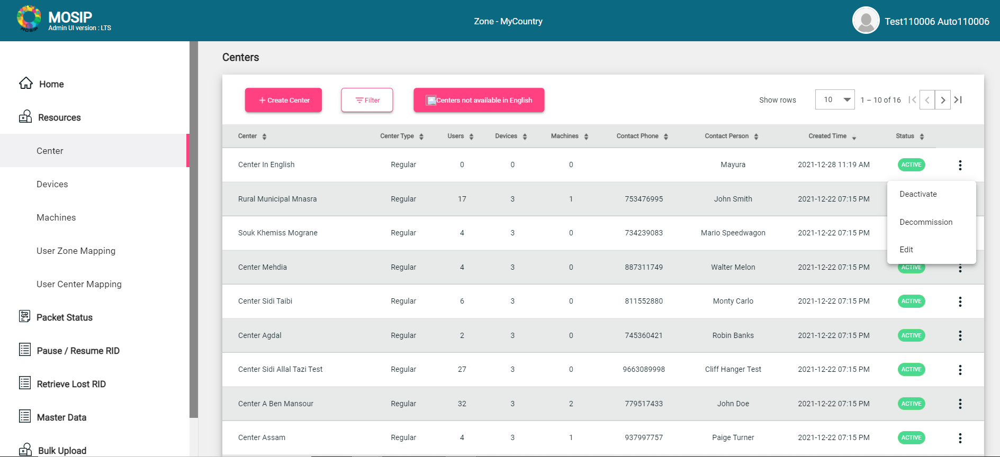
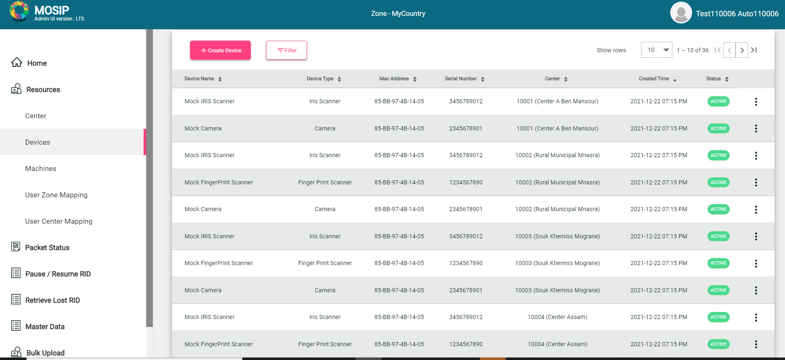
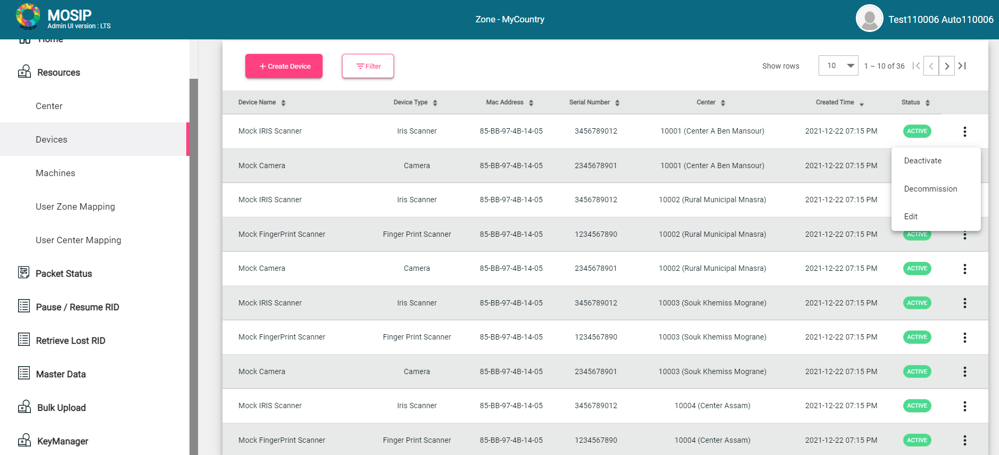
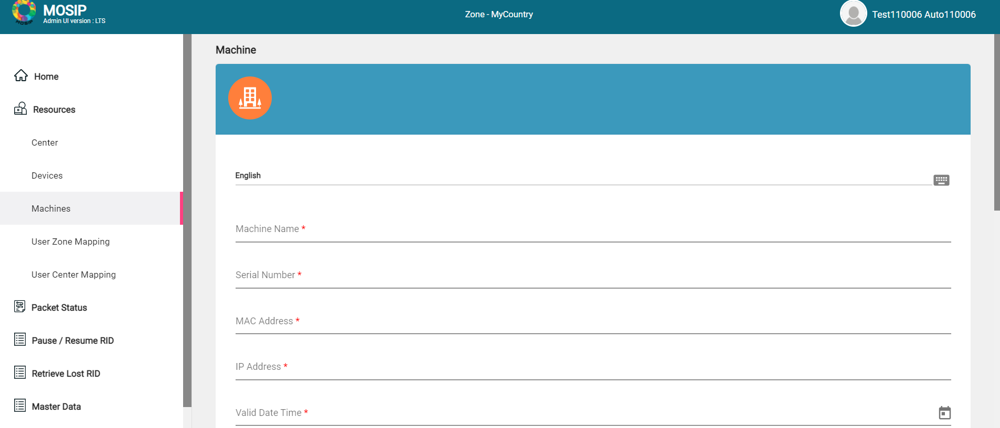
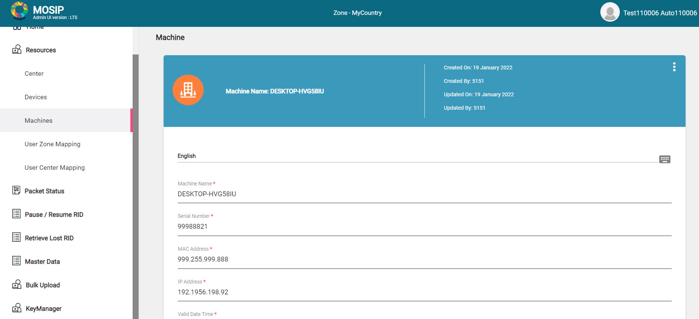
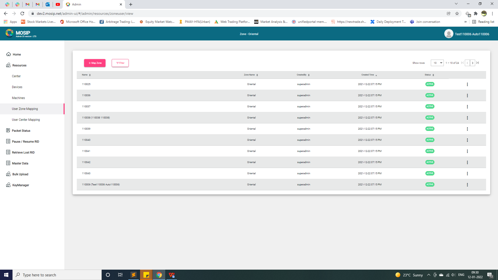
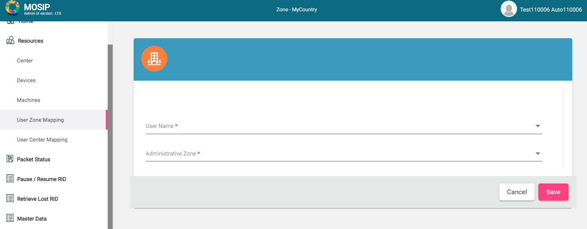
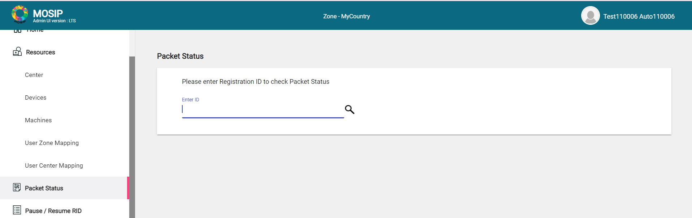

# Admin User Guide

## Overview
Admin application is a web-based application used by a privileged group of administrative personnel to manage master data, resources, etc. Admin portal supports multiple languages. An admin user can login with their preferred language amongst the list of languages configured by the country.

The MOSIP platform is configured via the Admin application. In MOSIP, a country is assumed to be divided into Zones and further into sub-zones(hierarchial data) to ensure that the zonal and sub-zonal data is handled by authoritative personnel belonging to that particular zone. Hierarchical zones enable you to establish **parent-child zone** relationships, allowing profile attributes, rights, and roles to be inherited down the zone hierarchy.

The module provides a single user interface to administer the MOSIP platform.  On initial platform installation, data and configurations may be uploaded from CSV files.  To get started with using the Admin portal, an admin user must be assigned to a zone.

### Types of data managed in Admin UI

Data Relationship 
Explain type of data and roles required to manage them
By default, the system provides the roles mentioned below

### Pre-requisites

1. Setup of hierarchial zones(using DML scripts)
2. Create Admin roles in KeyCloak(using scripts)
3. Create first admin user in KeyCloak(scripts available)
4. Assign first user to root zone(scripts available)

### First user login

 
 
1. Select the preferred language in the login screen
2. Login with the KeyCloak credentials.
3. Admin user can view the Home page.

Note: The admin portal integrates with the KeyCloak IAM to store users and provide the login functionality.
  
 ### Admin UI- Home page
 
 
 
 **MENU BAR**
 
 On successful login, the user can see the following on the menu bar:
 
     * MOSIP logo
     * Zone of the logged in user
     * Admin UserName
  
The options seen on the left navigation pane is displayed or hidden based on the role of the logged in admin user.

First user actions

When the MOSIP platform gets initialized, there are default configurations and seed data setup. Post installation, following operations can be done using the Admin application:
* Center management
* Device management
* Machine management
* User management
* Other Master Data management
* Bulk operations
* KeyManager operations

Registration related services
* Packet status
* Retrieve Lost RID
* Pause/ Resume RID

### Admin Roles

* GLOBAL_ADMIN
* ZONAL_ADMIN
*	REGISTRATION_ADMIN
* MASTERDATA_ADMIN
*	KEY_MAKER

Based on the role, following are the menu list accessible to the admin users:

|GLOBAL_ADMIN|ZONAL_ADMIN|REGISTRATION_ADMIN|MASTERDATA_ADMIN|KEY_MAKER|
|------|-----|-----|-----|-----|
|Centers|Devices|Packet Status|All Master Data|GenerateMasterKey|
|User Zone Mapping|Machines|Pause/ Resume RID|Bulk Upload||||||
|All Master Data|User Zone Mapping|Retrieve Lost RID|GenerateCSR|||||
|Bulk Upload|User Center Mapping|Packet Upload|GetCertificate||||
|GenerateCSR|All Master Data||UploadCertificate|||
|GetCertificate|Bulk Upload||UploadOtherDomainCertificate||
|UploadCertificate|GenerateCSR||||
|UploadOtherDomainCertificate|UploadCertificate||||
||UploadOtherDomainCertificate||||

### What and how to configure Admin UI

### RESOURCE MANAGEMENT

#### Center Management
* Admin portal allows an administrator to manage registration centers setup by the country for taking registrations of the residents.
* Center management includes functionalities like viewing, creating, editing, activating, deactivating and decommission of centers. 
* To be able to perform the above activites, an administrator should have the role of a zonal admin/global admin. 
* A zonal admin/global admin can manage only centers under his/her administrative zone.

**View Center**

To view the list of centers,
1. Click Resources-> Center
2. For a detailed view, click on a particular center name. 
This detailed view shows all the details of a registration center in all the country configured languages.
3. To apply a filter, click **Filter**.
The administrator can filter the list of registration centers based on parameters like *Center name, Center type, Status, Location hierarchy (all location levels)*.
 

* The admin portal allows an admin to view the list of all registration centers available in the jurisdiction of his/her administrative zone. The system does not fetch the details of decommissioned registration centers but only active and inactive centers. 
* Admin portal UI shows the list of registration centers in only the country configured primary language.
* If the admin user does not find the center, they can check the *Center not available in other language*. Using this option, they can clone the information available, 
otherwise they can create their own center.

**Create Center**

To create a center,
1. Click Resources-> Center
2. Enter the mandatory details.
3. Click **Create**.

* An admin can create a center by providing data in the fields marked as mandatory. A center needs to be created in both configured primary and secondary language. Although the portal will allow creation of a center in only primary language but will not allow activation of that center until data for that center is not updated for all the languages.
* A center is created with the following attributes: Center name, center type, address, latitude, longitude, location, contact phone, contact person, working hours, no. of kiosk, center start time, center end time, lunch start time, lunch end time, time zone, holiday zone and administrative zone the center belongs to.
* A center can only be mapped to the administrative zone at the lowest zonal hierarchy. 
* While defining centers, an admin can also define the working days of the week for a center and any exceptional holidays that might be applicable for a particular center.
* While entering data through UI in multiple languages, the dropdown values and numeric values entered in primary language gets automatically captured in all language. But the text fields (e.g., center name) needs to be manually input in all the languages.

**Update Center**

To update a center,
1. Click Resources-> Center
2. Select the **Edit** option from the Actions menu against the center name.
3. Make the changes in the required fields.
4. Click **Update**.

* Once a center is created, an admin can edit a center detail if required. The update can include adding the details in another required language that were missed during creation of the center or changing the details of a center itself.
* All the attributes mentioned in the 'Create center' section can be updated for a center.

**Activate/Deactivate/Decommission center**

To activate/deactivate/decommission a center,
1. Click Resources-> Center
2. Select the **Deactivate/Decommission** option from the Actions menu against the center name.
3. On the confirmation pop-up, click **Confirm**.

* Deactivation refers to a temporary shut down while decommission refers to a permanent shut down of the center. 
* Decommissioning a center also automatically deactivates the center. In cases where a center has some resources mapped to it (e.g. machines, devices or users), the portal will not allow the admin to decommission such a center.
* The primary difference between *deactivated* and *decommissioned* center is that a deactivated center can be activated later through admin portal as required by the country. But a decommissioned center cannot be bought into commission again as decommission refers to a permanent shutdown. To reactivate such a center (if decommissioned by mistake), the admin must directly update the database through the back-end scripts.

### Device Management
* Admin Portal allows an administrator to manage the Devices a country will use for registering residents.
* These include device for bio-metric capture (Fingerprint, Iris, Web camera etc.) 
* Device management includes Viewing, Creating, Editing, Activating, Deactivating and Decommissioning of Devices.
* An Administrator should have the role of a Zonal Admin/Global Admin to do this. A Zonal Admin can manage only Devices under his/her administrative zone.
* Device information will listed irrespective of the logged in language. Its has all the functionality of CRUD.

**View Devices**

To view the list of devices,
1. Click Resources-> Devices
2. For a detailed view, click on a particular Device. 
This detailed view shows all the details of a Device in all the country configured languages.
3. To apply a filter, click **Filter**.
The Admin can filter the list of Registration Centers based on parameters like *Device Name, Mac Address, Serial Number, Status, Map Status, Device Type, Device Spec ID.

* The Admin portal allows an administrator to view the list of all Devices available in the jurisdiction of his/her administrative zone. 
* The system does not fetch the details of Decommissioned Devices but only Active and Inactive Devices. 
* Admin portal UI shows the list of Devices in only the country configured Primary Language.

**Create Devices**

To create a device,
1. Click Resources-> Devices
2. Enter the mandatory details for creating the device.
3. Click **Create**.

A Device can be created without any language constraints.

A Device is created can be created with the following attributes: Device ID, Device Name, Mac Address, Serial Number, Device Spec ID and Administrative Zone the Device belongs to. A Device can be mapped to the Administrative Zone it belongs to.

**Update Devices**

To update a Device,
1. Click Resources-> Devices
2. Select the **Edit** option from the Actions menu against the Device name.
3. Make the required changes in the fields.
4. Click **Edit** and Confirm the changes.

**Activate/Deactivate/Decommission Device**

To activate/deactivate/decommission a Device,
1. Click Resources-> Devices
2. Select the **Deactivate/Decommission** option from the Actions menu against the Device name.
3. On the confirmation pop-up, click **Confirm**.

* Deactivation refers to a temporary shut down while Decommission refers to a permanent shut down of the Device. 
* Decommissioning a Device also automatically deactivates the Machine.
* In cases, where a Device is mapped to any Center, the portal will not allow the Admin to decommission such a Device.
* Difference between Deactivated and Decommissioned Device is that a Deactivated Device can later be Activated through Admin Portal after a period as required by the country. But a Decommissioned Device cannot be bought into commission again as decommission refers to a permanent shutdown. To reactivate such a Device (if decommissioned by mistake), the Admin must directly update the database through the back-end scripts.

#### MACHINE MANAGEMENT
* Admin portal allows an administrator to manage machines the country will use for registering residents. 
* In MOSIP, a machine is a device on which the registration client is installed.
* Machine management includes viewing, creating, editing, activating, deactivating and decommissioning of machines. 
* An administrator should have the role of a zonal admin/global admin to do this. An admin can manage only machines under his/her administrative zone.

**View Machines**

To view the list of machines,
1. Click Resources-> Machines
2. For a detailed view, click on a particular machine name. 
This detailed view shows all the details of a registration machine in all the country configured languages.
3. To apply a filter, click **Filter**.
The administrator can filter the list of machines based on parameters like *Machine name, Mac address, Serial number, Status, Machine type.*

* The admin portal allows an admin to view the list of all the machines available in the jurisdiction of his/her administrative zone. 
* The system does not fetch the details of decommissioned machines but only shows the active and inactive machines. 
* Admin portal UI shows the list of machines in only the country configured primary language.

 **Create Machines**
 

To create a machine,
1. Click Resources-> Machines
2. Enter the mandatory details for creating the machine.
3. Click **Create**.
* A Machine can be created with the attributes like *Machine ID, machine name, mac address, serial number, machine spec ID and administrative zone* the machine belongs to.
* While entering data through UI in multiple languages, the dropdown values and numeric values entered in primary language gets automatically captured in all language.
* But the text fields (e.g., machine name) needs to be manually input in all the languages. A machine can be mapped to the administrative zone which is at the any zonal hierarchy.

**Update Machines**

To update a Machine,
1. Click Resources-> Machines
2. Select the **Edit** option from the Actions menu against the machine name.
3. Make the required changes in the fields.
4. Click **Edit** and Confirm the changes.

Once a machine is created, an admin can edit a machine later if required. The update can include adding the details in another required language that were missed during creation of the machine or changing the details of a machine itself. All the attributes mentioned in the 'Create machine' section can be updated for a machine.

**Activate/Deactivate/Decommission Machine**

To activate/deactivate/decommission a Machine,
1. Click Resources-> Machines
2. Select the **Deactivate/Decommission** option from the Actions menu against the Machine name.
3. On the confirmation pop-up, click **Confirm**.

An admin can deactivate or decommission a machine through the admin portal.

### USER MANAGEMENT

* MOSIP uses Keycloak as an IAM (Identity access management tool) for managing Users. These users are internal users of MOSIP including Registration Officers, Registration Supervisors, Zonal Admins, Global Admins etc.
* User Management includes Viewing, Creating, Editing, Activating, Deactivating and Blacklisting of Users.

#### User Zone Mapping
* Once the user is created in KeyCloak, they need to be mapped to a zone to get access to specific information available in that zone.
* Administrative Zones are virtual boundaries which a country can define to manage their resources better during registrations. These resources includes Centers, Users, Machines and Devices. 
* These zones can be defined in a hierarchical fashion and a country can allocate resources to such zones based on their requirements.
* Resources under each zone is managed by a Zonal Admin. This is done by assigning an Administrative zone to the Zonal Admin during user creation. These Zonal Admins can exist at any zonal hierarchy. (For e.g, a Zonal Admin can directly be mapped to the whole country as a Zone or can be mapped to a significantly smaller zone such as a city). Thus these resources when mapped to an Administrative Zone can only be managed by the Admin of that Zone.

**View User Zone Mapping(s)**

**Map/Un-map/re-map user to a Zone**

To map a user to a zone,
1. Click Resources-> User Zone mapping
2. Click **+Map Zone**
3. Select the *User Name, Administrative Zone* from the dropdown.
4. Click **Save**.

To re-map a user to a zone,
1. Click Resources-> User Zone mapping
2. Select **Remap** from the Actions menu against the mapped user.
3. Update the *User Name/ Administrative Zone* from the dropdown.
4. Click **Save**.

Note: If the center is mapped already, the admin needs to unmap the center to remap the zone.

* Admin portal allows an admin to map users to a zone. This mapping specifies as to which zone the user will belong to.
* A user can only be mapped to a zone which belongs under the User’s Administrative Zone.
* A user can later be un-mapped from the zone in case a user needs to be moved to another zone. In such cases, the user will later need to be mapped to the new zone. 

#### User Center Mapping

* Once the user is mapped to a zone, they will be listed in the screen below. Now, the user will be mapped to a center to be able to manage their assigned center.
* Admin portal allows an admin to map users to a center. This mapping specifies as to which center the user will be used in. 
* A user can only be mapped to a center which belongs under the user’s Administrative Zone.
* A user can later be un-mapped from the Center in cases where a User is needed to be moved to another Center. In such cases, the user will later need to be mapped to the new center. In case the user is required to be mapped to a Registration Center outside the Administrative Zonal restriction, the Administrative Zone of the user must be changed.

**View User Center Mapping(s)**

**Map/Un-map/re-map user to a Registration Center**

To map a user to a center,
1. Click Resources-> User Center Mapping
2. Select **Map** from the Actions menu against the mapped user.
3. Select the *Center name* from the dropdown against the User Name, Administrative Zone.
4. Click **Save**.

### PACKET STATUS (based on RID)
* A Registration packet generated in Registration Client is sent to Registration Processor for further processing and UIN generation. 
* Using the Portal, A Registration Admin can view the status of a packet by entering the RID of the packet. 
* The packet status will contain all the stages the packet has passed through along with the last stage the packet is in. 
* In case the packet has not been processed or is marked for *Re-Send/Re-Register*, the admin will be able to view specific comments indicating the reason for that particular status.

### PAUSE/ RESUME RID 
* The Registration Admin has the privilege to view the registration packets that gave been paused for getting processed further.
* They make perform certain validations and if need be, they can resume the packet processing.

### RETRIEVE LOST RID
The Registration Admin can use this feature to retrieve lost RID. For instance, if the resident did not provide any valid email and/or phone number and has lost the RID slip received during the registration, in order to find their RID details, the resident contact MOSIP helpline and share details such as name, centre name, registration date and postal code to the admin, who will use the lost RID feature and try to retrieve the RID number.

A few filters may be applied to retrieve the RID.

Note: This feature is currently under development.

### MASTER DATA MANAGEMENT
* Admin portal allows an administrator to manage the Masterdata applicable for a country.
* These data includes list of Genders, list of Holidays, Templates etc. This data is used by all the modules across MOSIP which includes Pre-Registration, Registration Client, Registration processor and ID-Authentication.
* An Administrator should have the role of a Global Admin to manage Masterdata.

**Manage Master Data**

*Common

Center Types
Blocklisted Words
List of Holidays
Templates

Dynamic Field
Create New Dynamin Field
Registration Type 
Mode of Claim
User preferred language
residenceStatus
Blood Type
Marital Status

Device Definitions
Device Specs
Device Types

Machine Definitions
Machine Specs
Machine Types

Document Definitions
Document Types
Document Categories
Document Categoty- Type Mapping

### BULK UPLOAD

Master Data

Packets

### KeyManager

GenerateCSR

GetCerificate

UploadCertificate

UploadOtherDocumentCertificate

