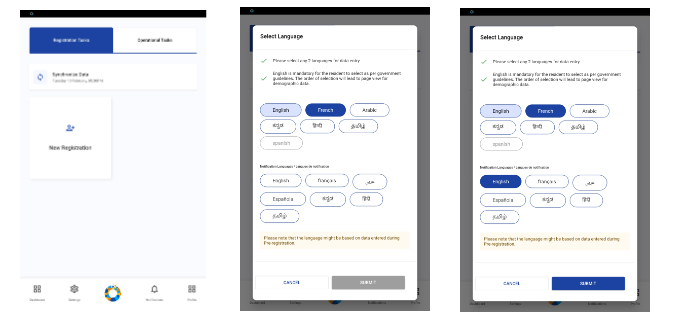
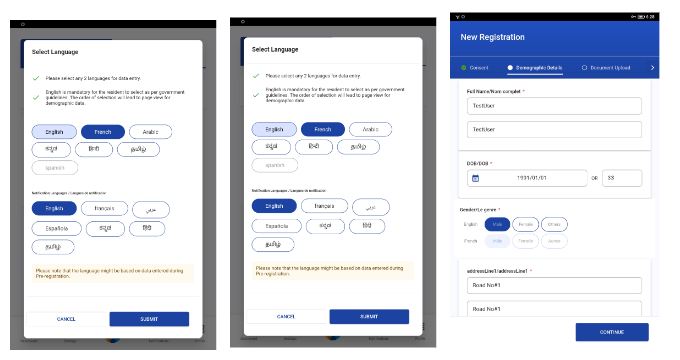
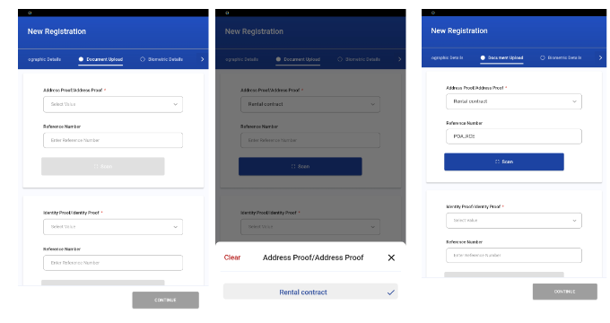
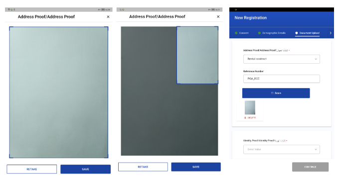
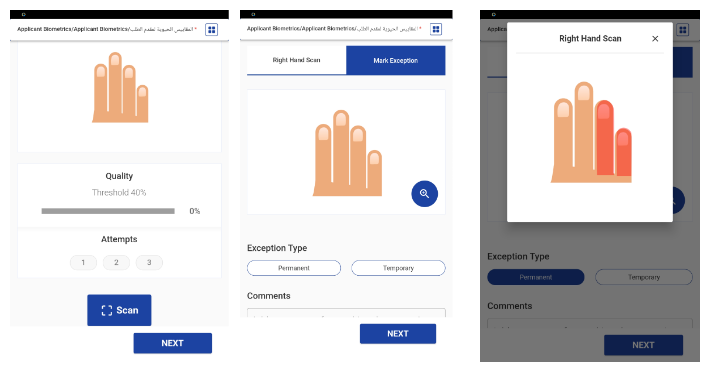
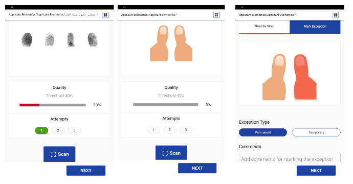
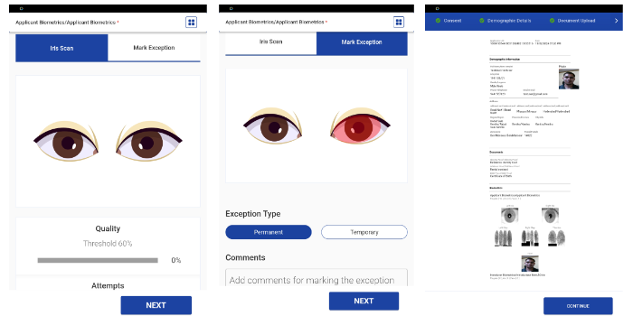
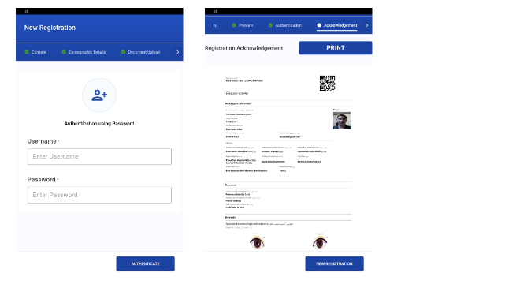

# User Guide

This user guide is designed to provide assistance to Operators and Supervisors in successfully installing, running, and registering applicants to obtain their Unique Identification Numbers (UIN) on tablet devices.

## Prerequisites

* Reliable and consistent Internet connectivity.
* Tablets running Android version 10 to 13.
* Tablets with a minimum of 4 GB RAM.
* The tablets need to be capable of capturing fingerprints, iris, and face (photo) biometrics. Additionally, they should also have the ability to scan documents. However, if the tablets do not support these capabilities, MOCK SBI can be used as an alternative.

### How to install Android Registration Client (ARC)

1. Download and install the APK on Android tablet.
2. Once ARC is installed, long press on the logo to copy the machine details.
3. On the [Admin Portal](https://docs.mosip.io/1.2.0/modules/administration/admin-portal-user-guide), using admin credentials, login and perform the following to add the device:
   * Go to `Resources/Machine` and click on **Create machine**
   * Add a new machine and enter the machine details:
     * Add the specs as **Mobile**
     * Map it to a Zone and Center
     * Add the Machine spec ID as **Mobile**
     * Enter Device name
     * Enter Public Key
     * Enter Sign Public Key
   * Create the role `Default` in KeyCloak with all the other roles.
   * Create the Operator’s user account in KeyCloak and set the password and assign the role as `Default`, `REGISTRATION_OFFICER`, `Registration Operator`, `REGISTRATION_SUPERVISOR`
   * Login into Admin Portal to perform the following and add the user:
     * After login into Admin Portal, go to `User Zone Mapping` and add the zone for the user and activate the zone.
     * Go to `User Center Mapping` and add the center for the user and activate it.

> Note: The user should be assigned to the same Zone and Center as the device.

4. The user should relaunch the ARC and log in using their valid credentials. Additionally, the operator has the option to select their preferred display language.

Upon successful login, the user will be directed to the Home page, which includes the following options:

* New Registration
* Operations Tasks (Future scope)
* Dashboard (Future scope)
* Settings (Future scope)

### New Registration

To begin the Registration process, the Operator is required to follow the steps outlined below.

1. Click on **New Registration card**.
2. Select the language to be used for data entry, which will be used to collect the resident's information. There will be a default language for data entry.
3. Choose the language in which the notification will be sent to the resident. Click **Submit** to proceed.

<figure><figcaption></figcaption></figure>

4. The operator will be redirected to the Consent page, where the resident must agree to the `terms and conditions` in order to proceed.
5. After accepting consent, the Operator will need to fill out the demographic data of the resident, including their name, age, date of birth, and address. Once all mandatory fields are completed, the **Continue** button will be enabled.

<figure><figcaption></figcaption></figure>

6. Upon clicking the **Continue** button, the Operator will be navigated to the `Document upload` page where they will need to:
   * Select the type of document (e.g. proof of identity, proof of address) from the drop-down menu.
   * Enter the **Reference Number** of the document.

<figure><figcaption></figcaption></figure>

7. Upload the document by clicking on the **Scan** button to open the camera. The Operator can take a picture of the document and then choose from the following actions:
   * **Cancel**: Clicking on the "Cross" icon will remove the captured image and return the Operator to the previous screen.
   * **Crop**: The Operator can drag from the four corners of the captured image to crop it as needed.
   * **Save**: Clicking on the "Save" button will save the captured image and return the Operator to the previous Document Upload page.
   * **Retake**: Clicking on the "Retake" button will remove the captured image, reopen the camera, and allow the Operator to take a new photo.

<figure><figcaption></figcaption></figure>

8. After ensuring all required information has been accurately entered in the `Document Upload` screen, the Operator can proceed by clicking on the **Continue** button to access the `Biometric Capture` page. Here, the Operator can capture the biometric data of the Resident, including a face photo, fingerprint, and iris scan.

**Face photo capture process**

* For capturing the face photo, the Operator should click on the **Scan** button to activate the camera and take a picture.
* The image quality will be displayed on the screen and must meet a certain threshold to be considered acceptable.
* The Operator has three attempts to capture the biometric image.
* It is important to note that no exceptions can be made for the face photo biometric capture process.

<figure><figcaption></figcaption></figure>

**Biometric Data Capture Process**:

* In order to capture biometric data, the Operator should click on the **Scan** button.
* This will allow the Operator to capture the biometric information.
* Once the data is captured, the image quality will be displayed on the screen and must meet the acceptable threshold limit.

**Note**: Three attempts are provided to capture the biometric data.

<figure><figcaption></figcaption></figure>

**Fingerprint Capture Process**:

In the event that a thumb is missing or experiencing difficulties that prevent its fingerprint from being captured, the Operator is authorized to indicate an **exception**. To mark an exception, the operator must select the affected thumb and specify the type of exception as either _Temporary_ or _Permanent_. Additionally, the operator may include any relevant additional comments.

<figure><figcaption></figcaption></figure>

**Iris Scanning Process**:

* To initiate the Iris scan, the Operator is required to click on the **Scan** button.
* This action will allow the Operator to capture the Iris image.
* Once the Iris has been successfully captured, the quality of the image will be displayed on the screen.
* It is essential for the quality score to meet the established threshold limit.
* The Operator has three opportunities to capture the biometric data.

If one or both of the Irises are not detected or encounter issues that prevent successful capture, the Operator has the option to mark an exception. To do so, the Operator must identify the specific Iris that is problematic and indicate the type of exception- either _Temporary_ or _Permanent_. Additionally, the Operator may provide any relevant comments.

<figure><figcaption></figcaption></figure>

9. After all the biometric data has been properly captured or any exceptions have been noted, the **Continue** button will be activated. The Operator can then proceed by clicking on the **Continue** button, which will redirect them to the **Preview** page. The Preview page will display the following information:

* Application ID
* Timestamp of Registration
* Demographic data collected
* Documents submitted
* Biometric data recorded

From the Preview page, the Operator can navigate back to previous screens to make any necessary adjustments to the entered or captured data. Once the Operator has verified the accuracy of the entered data, they can proceed by clicking on the **Continue** button, which will direct them to the `Operator Authentication` page.

10. On the `Operator Authentication` page, operators are required to input their credentials (username and password) that were used during the login process.

Upon successful verification of the credentials, the packet will be uploaded to the server and the operator will be redirected to the `Acknowledgment` screen. This screen includes the following information:

* Application ID
* Timestamp of Registration
* Demographic data captured
* Documents uploaded
* Biometric data captured
* Print option
* QR code for the Application ID
* Option to initiate a new registration process.

<figure><figcaption></figcaption></figure>

Upon receipt of the acknowledgment, the packet is uploaded to the [Registration Processor](registration-processor.md). Once the packet has been successfully processed, a unique identification number (UIN) is generated.

On the acknowledgment page, the operator will have two options available:

1. **Print**- The operator can click on this option to obtain a physical copy of the acknowledgment.
2. **New Registration**- The operator can initiate another registration by clicking on this option.

In summary, the aforementioned steps can be followed by the user (Operator/ Supervisor) to register an individual by capturing demographic data, documents, and biometric data to generate their UIN.

**Operator Onboarding**: To begin the Onboarding process, the Operator is required to follow the steps outlined below. The operator, in order to log in to the Android Registration Client, will have to onboard himself. This functionality will be available on first-time online login only.

a. On logging in for the first time, the Operator will be taken to the screen where they will have the following two options:

1. Get onboarded: This flow is present for the system to verify the Operator’s biometrics with their registered biometrics. This is to enable local deduplication.
2. Skip to home: This flow is to dodge “Operator’s Onboarding”. If the user selects this, they will be taken to the “Homepage” after which the user can get started with Resident registration. One of the pre-requisites of this flow is to have the “Default” role mapped to the center.

<figure><figcaption></figcaption></figure>

3.

    **Steps to Onboard Operator’s Biometrics:**

    1. The user will be taken to the Biometrics Capture Homepage where he will be able to see all the below biometrics:
       1. Face capture
       2. Iris capture
       3. Left hand finger capture
       4. Right hand finger capture
       5. Thumb capture

