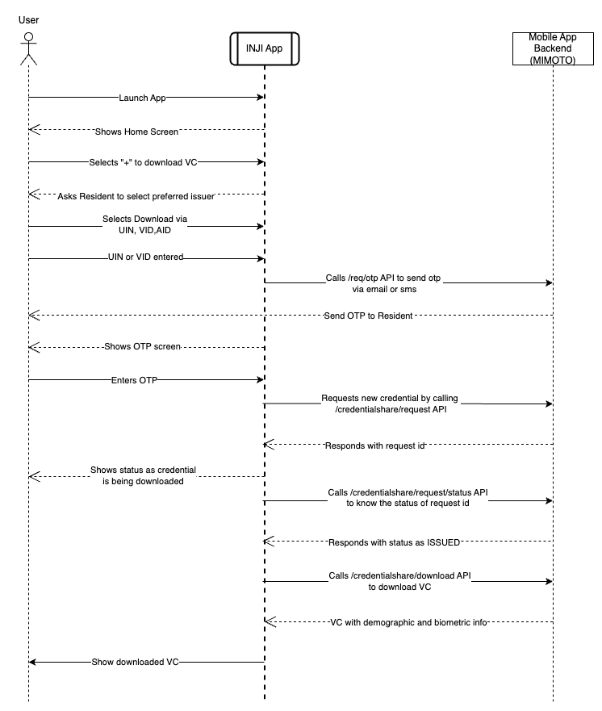
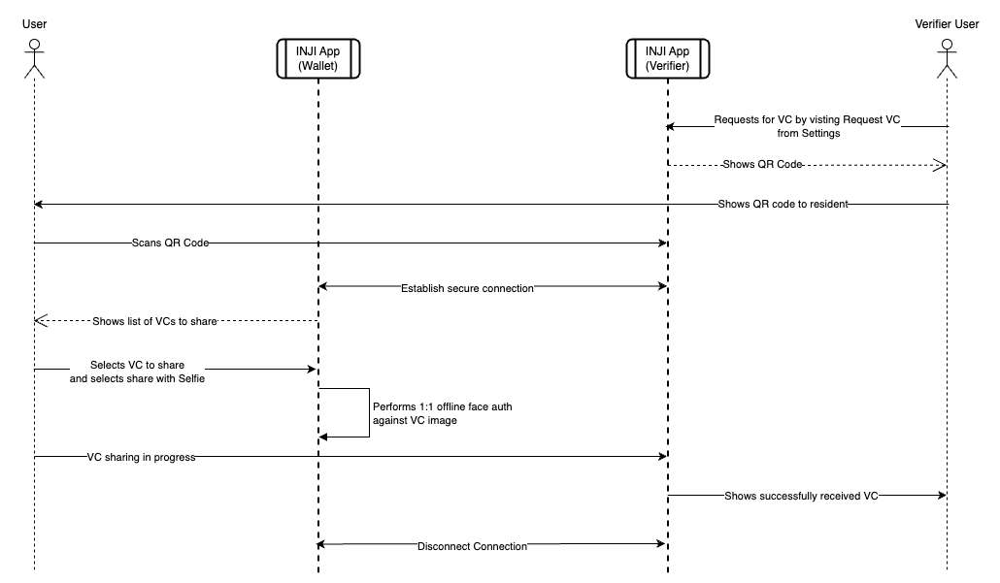

# Feature Workflows

This document delineates the workflow for essential functionalities of Inji.

### 1. First App Launch

After installing the application for the first time, the user will be asked to set up unlock method for it. The app supports biometric or PIN-based locks. For more details, refer to the [End User Guide](../end-user-guide.md).

#### Launch with passcode unlock method

<figure><figcaption></figcaption></figure>

#### Launch with biometric unlock method

<figure><figcaption></figcaption></figure>

### 2. Downloading and storing credentials

Residents have the ability to download a Verifiable Credential (VC) for themselves, their family members, or friends using a single mobile device. This can be done through two methods:

* Download via UIN/VID
* Download via eSignet

#### Download via UIN/VID

<figure><figcaption></figcaption></figure>

#### Download via eSignet

 

<figure><figcaption></figcaption></figure>

### 3. Sharing of credentials

The credentials are shared in a peer-to-peer model with the verifier application. The data exchange between devices is done using the BLE Protocol. For more information, refer to [Tuvali](../integration-guide/tuvali.md) documentation.

<figure><figcaption></figcaption></figure>

### 4. QR code login process

* Residents can use Inji to log in to any service provider app (integrated with e-Signet) by just scanning a QR code from their portal.
* The app performs offline face auth after scanning the QR code to verify the user's presence.
* Once the presence is verified, the resident is given the option to choose the optional information to be shared with the service provider portal.
* After consent is provided, the app sends a WLA (Wallet local auth) token which is a JWT token to the relying party.
* The resident is then given the access to the portal after the token verification.

#### Step 1: VC activation process

 

<figure><figcaption></figcaption></figure>

#### Step 2: QR code login

<figure><figcaption></figcaption></figure>

### 5. Data Backup and Restore

From Settings screen, users can access Backup settings screen. In Backup settings screen, users can configure their preferences for data backup. The setting, configured once during the application's lifecycle, determines whether Google Drive or iCloud will be utilized based on the device platform. To restore backup data to the mobile wallet, users must log in to the same account and configure settings within the app accordingly. Additionally, restored Verifiable Credentials (VCs) should be re-activated to enable QR Code login functionality.
