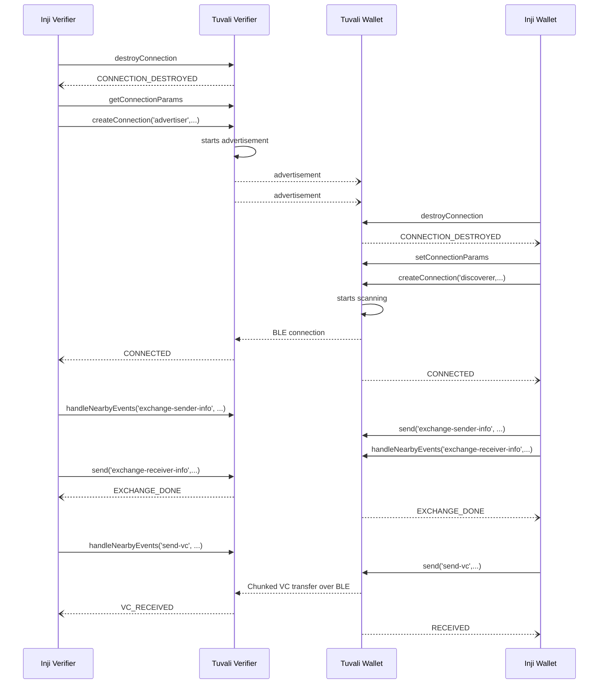

# Tuvali API Documentation

Firstly, for establishing the secured connection over BLE the connection params which include `cid` and `Public key` needs to be exchanged between the two devices. The exchange of parameters can be accomplished but is not limited to or by using a QR code.

For example, use a QR code generator to visually display params and a QR code scanner to get params. A mobile app that displays a QR code can act as an `advertiser` by including its connection params as data in the QR code and another device can act as `discoverer` which scans the QR code, it can extract the connection parameters and initiate a BLE connection with the advertising device.

> Note: The terms `advertiser` and `discoverer` are used for legacy API compatibility reasons. These terms will be replaced with `Verifier` and `Wallet` soon. Hence the terms are used interchangeably as required.

### Connection parameters exchange

* The device on which the QR code is displayed shall generate connection parameters using the `getConnectionParameters()` method:

```typescript
import OpenIdBle from 'react-native-openid4vp-ble';
const { Openid4vpBle } = OpenIdBle;

const params = Openid4vpBle.getConnectionParameters();
console.log(params);
```

* The device that scans the QR code will extract the connection parameters from the QR code and set its connection parameters using the `setConnectionParameters()` method :

```typescript
Openid4vpBle.setConnectionParameters(params);
```

The connection params contain:

```json
{
"cid": "ilB8l",
"pk": "4f56504d4f5349505f66b067c008A4484AEC5A769CED2307F59E43DC81A3F768"
}
```

* The `pk` part of the data is the same data that will be advertised by the `advertiser` device but in hex-encoded form.&#x20;

&#x20;  E.g: OVPMOSIP\_\<first 5 bytes of public key>

_Note_: The `cid` parameter is there for legacy reasons and will be removed soon.

### Establishing connection

The device that displays the QR code will become `advertiser` and waits for a connection:

```typescript
Openid4vpBle.createConnection('advertiser', () => {
  // Add the code that needs to run when bluetooth advertisement started successfully
});
```

and the other device that scans the QR code will become `discoverer` and will attempt to discover the devices:

```typescript
Openid4vpBle.createConnection('discoverer', () => {
  // Add the code that needs to run when bluetooth scan started successfully
});
```

### Share data

Once the connection is established, either app can send the data:

```typescript
Openid4vpBle.send(message, () => {
  // Add the code that needs to run once data is shared successfully
});
```

The following sequence of actions should be performed to transfer data over BLE:

1. Exchange Wallet public key - Discoverer calls `Openid4vpBle.send` with message type "exchange-sender-info". The callback passed is executed on successful writing wallet public key to Identify characteristic
2. Send VC data - At the moment, only VC data is being exchanged from Wallet to Verifier instead of the VP response mentioned in the specification. Hence `Openid4vpBle.send` should be called message type "send-vc" for sending VC data from Wallet to Verifier.
3. Send VC response - Verifier can exchange "Accept/Reject" status to Wallet with the following message type for `Openid4vpBle.send` method

* For Accept status, message type "send-vc:response\n1"
* For Reject status, message type "send-vc:response\n2"

Data received from other apps via BLE can be subscribed to using:

```typescript
Openid4vpBle.handleNearbyEvents((event) => {
  // Add the code that needs to run once data is received
})
```

Here are the different types of events that can be received

1. Advertiser gets an event when Identify characteristic value is received on the Verifier side. The format of the event is `{"type": "msg", "data": "exchange-sender-info\n{\"deviceName\": \"Wallet\"}}`
2. Advertiser gets an event when VC data is received. The format of the event is `{"type": "msg", "data": "send-vc\n<Entire VC data>}`
3. Both Advertiser and Discoverer can receive disconnected events in the following format `{"type": "onDisconnected"}`
4. Both Advertiser and Discoverer can receive error events in the following format `{"type": "onError", "message": "Something went wrong in BLE: ${e.cause}"}`

### Connection closure

The device on which the app is running can destroy the connection by calling the `destroyConnection()` method:

```typescript
Openid4vpBle.destroyConnection();
```

## Tuvali & Inji Integration


