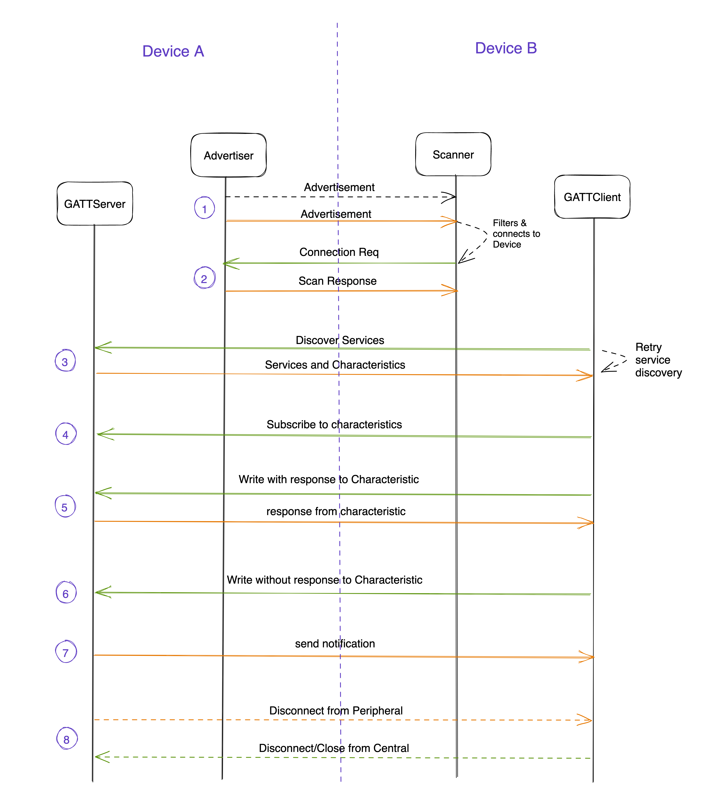

# Tuvali implementation
Before we understand how Tuvali component performs activities on the BLE layer to transfer VC/VP. We can take a look at how BLE communication works in general between two devices A & B.

## How does BLE Communication work?

In BLE communication, one device is designated as Peripheral and another one designated as Central.

Peripheral can perform advertisement which can be read by a Central device and connect to it, if the advertisement is connectable.

Once the connection is made, Central can perform further actions on the device like 
- discovering services and characteristics
- subscribing to notifications on characteritics
- write/read data from characteristics
- disconnect from device

While peripheral can perform actions like 
- sending notifications to subscribed characteristics
- respond to read requests from Central

The above diagram explains the sequence of actions for a BLE communciation in general.

1. Advertisement from Peripheral
2. Connection establishment & additional data exchange
3. Service & Characteristic discovery from Central
4. Characteristic subscription on Peripheral
5. Write with response to Characteristic
6. Write without response to characteristic
7. Send Notification from GATT Server
8. Disconnection from GATT Server/Client

More details about other BLE terminology used here can be found in standard BLE specifications of 4.2 and above.

## How Tuvali works with BLE to transfer VC from Central to Peripheral

> Note: Tuvali is supposed to implement OpenID for VP over BLE specification. As part of it, both VP request and response transfer should be implemented. However the current version of Tuvali only transfers VC from Central to Peripheral.

In case of Tuvali, the entire VC transfer flow can be divided into following stages
1. Connection Setup & Crypographic key exchange 
2. Data transfer
3. Connection Closure

### 1. Connection Setup & Crypographic key exchange 
Steps 1 to 6 mentioned in the above diagram explains how first stage is achieved. 
Before even the advertisement is started, peripheral generates a 32 byte public key. This public key is sent to Central as two parts. First part will have 5 bytes of public key sent as part of the advertisement payload and while second part is sent as part of SCAN_RESP. 

Since the advertisement from Peripheral is of connectable type, Central would send out a SCAN_REQ on receiving advertisement and gets the remaining 27 bytes of peripheral public key. 
Post that, Central would derive a public key pair and send the its 32 bytes public key on Identify characteristic of Peripheral.

Once the public keys are exchanged between Central and Peripheral, a set of keys are derived on both sides which would be used for encryption and decryption of data on the wire.

> Note: Details about the the algorithm used for public key pair generation, key derivation is available in the spec.

### 2. Data transfer
Steps 7 to 11 mentioned in the above diagram explains how second stage is achieved. 
Before VC is transferred, Central performs encryption and compression and communicate the resultant data size by writing to Response Size characteristic to Peripheral. The actual data transfer would happen on `Submit Response` characteristic.

Since the maximum allowed write value for a characteristic is limited to 512 bytes. The actual VC data is split by a component called Chunker into multiple smaller chunks. After the split, the data is transferred on the `Submit response`characteritics one after another until all chunks are completely sent.

Peripheral on the other hand, receives data on the `Submit response` characteristic. The received chunks are collected and final VC is assembled by a component called Assembler.

At the end of sending one frame of data from Central. It would request for a transfer report via `Transfer report request` characteristic. Peripheral responds with a summary of missing/corrupted chunks sequence numbers via another `Transfer report summary` characteristic. 

Central would read the Transfer report sumamry to understand if the Peripheral received all the chunks properly. If summary report has atleast one chunk sequence number. Central would send those specific chunks to Peripheral which is called Failure frame.

The failure frame will be sent from Central repeatedly until Transfer report summary is successful. If during the process, Central reached the maximum allowed failure frame retry limit, the tranfer is halted, devices will be disconnected and an error is generated (Please refer to API documentation on how this error can be read).

### 3. Connection closure
#### Disconnect initiated by Peripheral:
- On a sucessful data transfer 
- On non recoverable error occured on Peripheral

Peripheral notifies Central to perform disconnection via `Disconnect` characteristic mentioned in Step 12 of the above diagram.

#### Disconnect initiated by Central:
Central also performs disconnect in the following scenarios
- On a succesful data transfer
- Non recoverable error on Central
- Peripheral is out of range/disconnected
- Destroy Connection API

As part of Connection closure. Both Central and Peripheral objects are cleaned up along with Wallet and Verifier objects.

