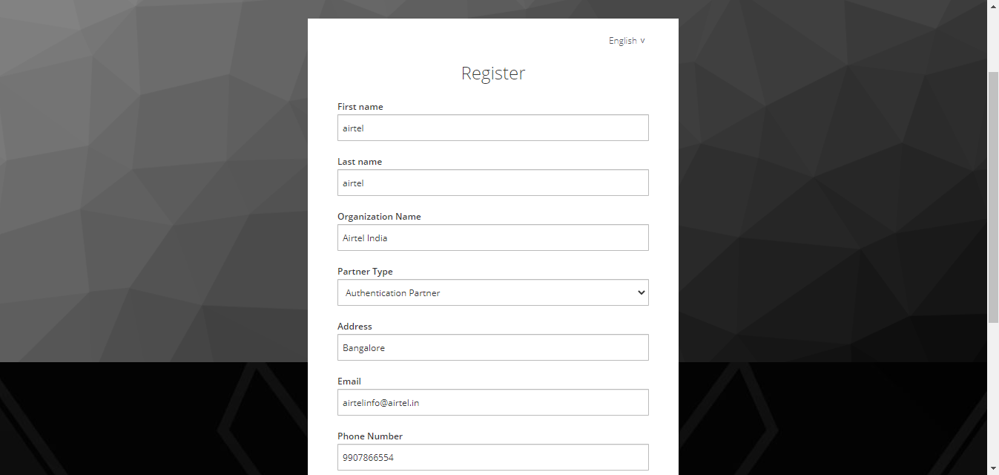

# Auth/ Credential Partner

## Overview
Below is the workflow that includes the registration process for an Auth/ Credential partner and the steps that needs to be followed for using the partner portal.

*  Partner self-registers through the portal.
*	Partner selects the relevant Policy Group.
*	Partner admin uploads CA certificate.
*	Partner admin/ Partner uploads the partner certificate.
*	Partner admin/ Partner maps the partner policy.
*	Partner admin approves/rejects partner policy mapping.
*	Partner logins after the approval and generates the API key for the approved partner policy mapping using an unique label.

### Self-registration

* The Auth/ Credential partner can register themselves on MOSIP PMS portal by clicking **Register** on the landing page.
* They need to fill up a form with the details below:
    * First and Last name
    * Organization Name
    * Partner type (Authentication Partner/ Credential Partner)
    * Address, e-mail, phone number
    * Username and password

To view the details entered, click **Home** to see the dashboard.

### Policy group mapping

On successful registration, the partner needs to select the relevant Policy Group. To do so,

1. Partner selects the Policy Group from **Map Policy Group** dropdown.
2. Clicks **Save**.

### Upload of CA certificate

The Partner admin needs to upload the CA certificate to enable the partner for using the portal. To do so, the Partner admin:

1. Clicks **Upload CA Certificate** option on the left navigation pane of the partner portal.
2. Selects the Partner Domain.
3. Chooses the certificate to upload (only files with extensions as .cer or .pem).
4. Clicks **Upload**. 

The uploaded certificates can be viewed by clicking on View Certificates-> View.

### Mapping policy to the Policy group

Once the CA certificate is uploaded by the partner admin, 

1. Partner maps the policy to the Policy group

