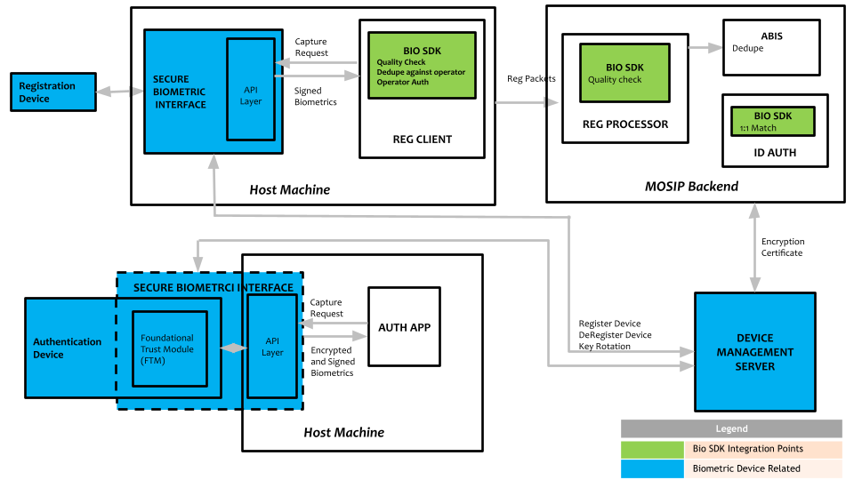
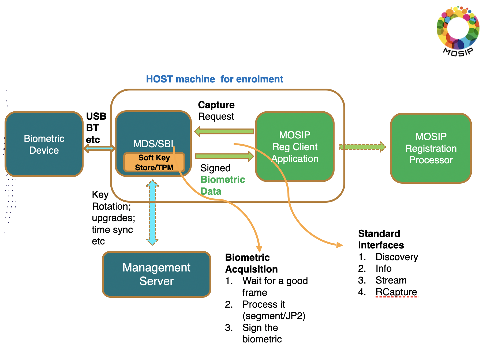

# Biometric Devices

## Overview
Biometric devices capture individuals biometric data (fingerprint, iris scan, photo) and send it to a registration client or authentication client (app). The functional architecture of various entities involved is shown below.

## Device types 
|Purpose|Type|Subtype\*|Certification|Specification|
|---|---|---|---|---|
|Registration|Fingerprint|Slap scanner|SBI 1.0|[Fingerprint image spec](biometric-image-specification.md#fingerprint)|
|Registration|Iris|Double eye scanner|SBI 1.0|[Iris image spec](biometric-image-specification.md#iris)|
|Registration|Face|Camera|SBI 1.0|[Face image spec](biometric-image-specification.md#face)|
|Authentication|Fingerprint|Single finger scanner|SBI 2.0|[Fingerprint image spec](biometric-image-specification.md#fingerprint)|
|Authentication|Iris|Single eye scanner|SBI 2.0|[Iris image spec](biometric-image-specification.md#iris)|
|Authentication|Face|Camera|SBI 2.0|[Face image spec](biometric-image-specification.md#face)|

\* An adopter may choose to have different subtypes, however, the certification needs to be adhered to.

## Encrolment flow

## Authentication flow

## Device trust 
* Device creates a key pair
* A cert signing request (CSR) is generated and sent to the device provider (management server)
* Management server signs and issues a certificate to the device
* Device private key is used to sign the data, the JWT will have the certificate issued by the device provider.
* MOSIP back end uses this certificate issued to the device by the device provider, to establish a connect with already onboarded deviceprovider cert.

### Types of encryption keys
* Device key [TBD]
* FTM key
* MOSIP public key

## Key rotation

## Test kits

## Management server

## Devices calculator 
The following calculator may be used to estimate number of devices required for a rollout. 

[MOSIPDevicesCalculator](_files/mosip-devices-calculator.xls)

## Partners
Providers of biometric devices are Partners of MOSIP and need to be onboarded to a given deployment of MOSIP. Specifically,
* [Device Partner](partners.md#device-partner-dp)
* [FTM Partner](partners.md#ftm-partner-ftmp)
 

