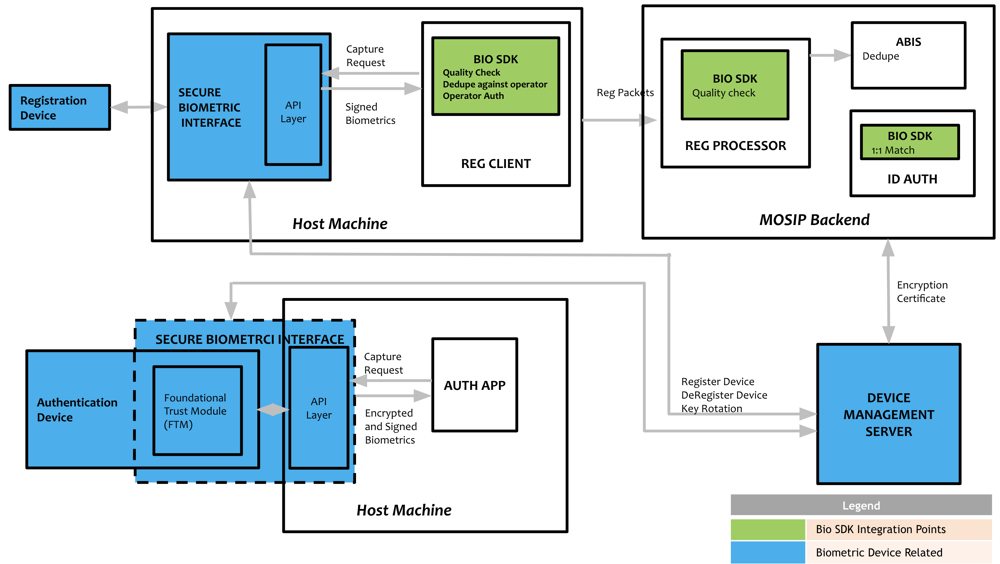
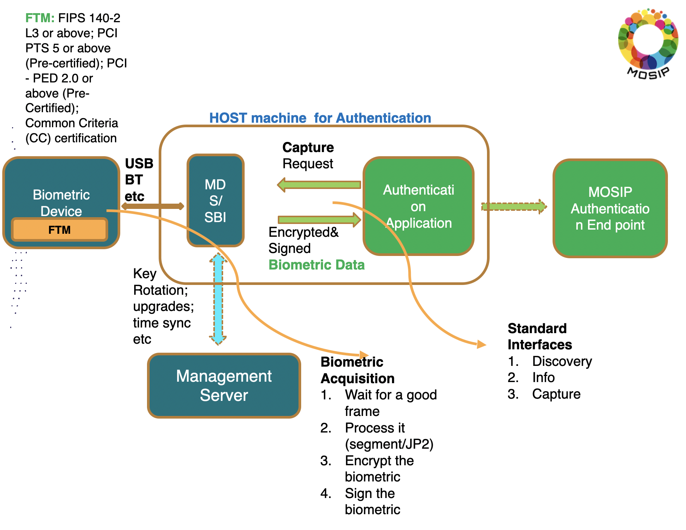

# Biometric Devices

## Overview

Biometric devices capture individuals' biometric data (fingerprint, iris scan, photo) and send it to a registration client or authentication client (app). The functional architecture of the various entities involved is shown below.

## Device types

| Purpose        | Type        | Subtype\*             | Certification | Specification                                                                                        |
| -------------- | ----------- | --------------------- | ------------- | ---------------------------------------------------------------------------------------------------- |
| Registration   | Fingerprint | Slap scanner          | SBI 1.0       | [Fingerprint image spec](https://docs.mosip.io/1.1.5/biometrics/biometric-specification#fingerprint) |
| Registration   | Iris        | Double eye scanner    | SBI 1.0       | [Iris image spec](https://docs.mosip.io/1.1.5/biometrics/biometric-specification#iris)               |
| Registration   | Face        | Camera                | SBI 1.0       | [Face image spec](https://docs.mosip.io/1.1.5/biometrics/biometric-specification#face-capture)       |
| Authentication | Fingerprint | Single finger scanner | SBI 2.0       | [Fingerprint image spec](https://docs.mosip.io/1.1.5/biometrics/biometric-specification#fingerprint) |
| Authentication | Iris        | Single eye scanner    | SBI 2.0       | [Iris image spec](https://docs.mosip.io/1.1.5/biometrics/biometric-specification#iris)               |
| Authentication | Face        | Camera                | SBI 2.0       | [Face image spec](https://docs.mosip.io/1.1.5/biometrics/biometric-specification#face-capture)       |

\* An adopter may choose to have different subtypes, however, the certification needs to be adhered to.

## Enrolment flow

## Authentication flow

## Compliance test kit

Compliance of a device may be tested using an [Compliance Tool Kit (CTK)](https://docs.mosip.io/compliance-tool-kit).

## Devices calculator

The following calculator may be used to estimate the number of devices required for a rollout.

[MOSIPDevicesCalculator](https://github.com/mosip/documentation/blob/84384099540b09b265703e96644a944adcdd2f3b/docs/\_files/mosip-devices-calculator.xlsx)

## Partners

Providers of biometric devices are Partners of MOSIP and need to be onboarded to a given deployment of MOSIP. Specifically,

* [Device Provider](../partners.md#device-partner-dp)
* [FTM Provider](../partners.md#ftm-partner-ftmp)
