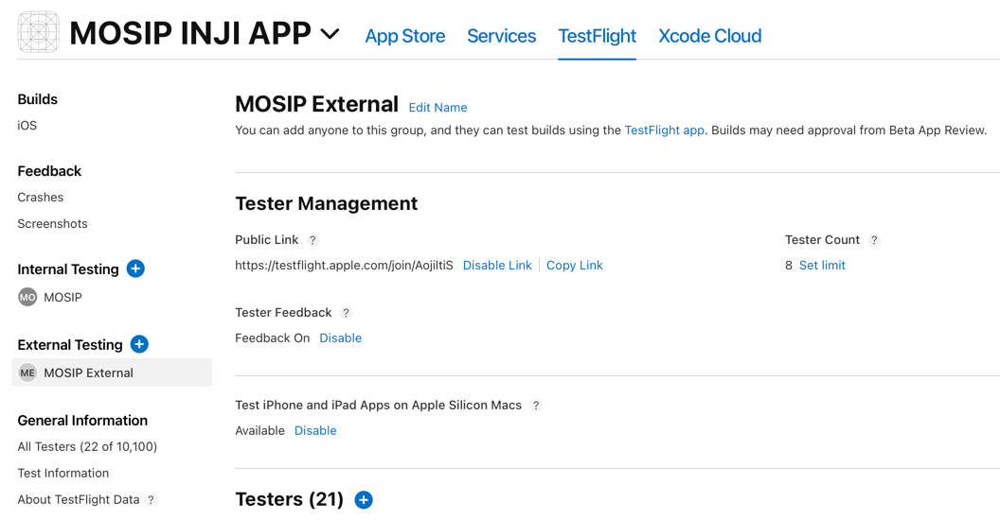
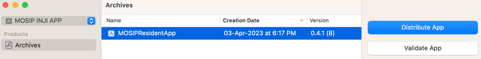
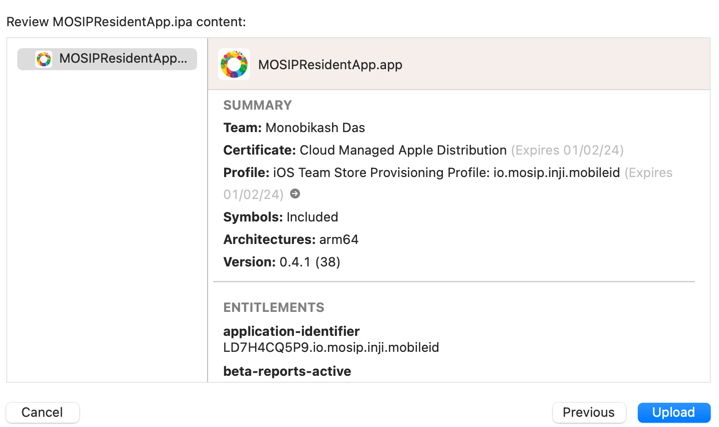
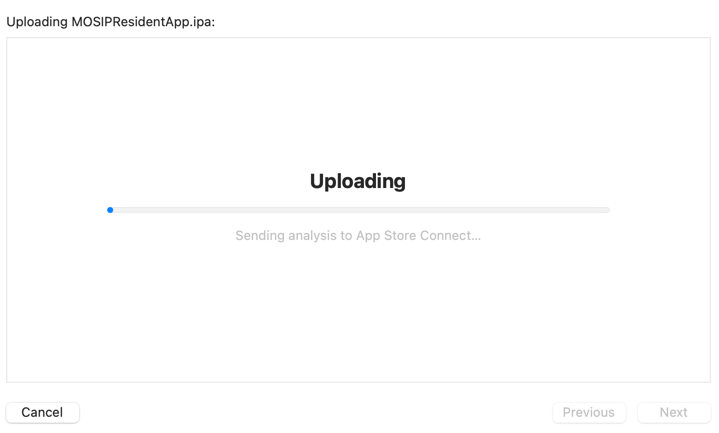
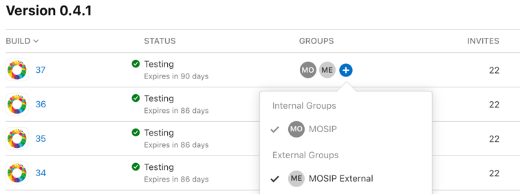

# Build & Deployment

## Repositories

Link to [Inji Repository](https://github.com/mosip/inji)

## Prerequisite

- [Gradle](https://gradle.org/install/)
- [Java 8](https://www.oracle.com/ph/java/technologies/javase/javase8-archive-downloads.html)
- [Expo](https://docs.expo.dev/get-started/installation/)
- [Android SDK](https://developer.android.com/)
- [Node](https://nodejs.org/en/download)


# Android - Build and deployment
## Command to build

### **Step 1 :**
Create a `android/local.properties` file with the following data:
```
GOOGLE_NEARBY_MESSAGES_API_KEY=
sdk.dir = <location-of-the-android-sdk>
```
Alternatively, you can open the android folder in the android studio. It will create `local.properties` file with `sdk.dir = <location-of-the-android-sdk>`. Add the `GOOGLE_NEARBY_MESSAGES_API_KEY` in it.

>Note:
>- Default path for MacOS: `/Users/<username>/Library/Android/sdk`
>- Default path for Linux: `/home/<username>/Android/Sdk`
>- Default path for Windows:` C:\Users\<username>\AppData\Local\Android\sdk`


### **Step 2 :**
Create a `google-services.json` file. Follow the below steps to generate the file:
- Sign in to [Firebase](https://console.firebase.google.com/u/0/), then click on `Add project` and create a project with a suitable name.
- Goto the `Project settings` by clicking on the gear icon on the top left. Select `Android` platform  under `Your apps` section.
- Add `io.mosip.residentapp` in the `Android package name`  section. Click. on `Register App `button. Then click on the `Download google-services.json` to download the file.

### **Step 3:**
Replace the content of `android/app/google-services.json` with the newly generated `google-services.json` file.

### **Step 4:**
Inji application currently supports two themes: orange  and purple. The default theme of the app is orange. To change the theme of the application, go to `.env` file and change the value of `APPLICATION_THEME` to `orange` or `purple`

### **Step 5:**
Go to the root folder of the project in the terminal.  Install all the dependencies using `npm install`.


### **Step 6:**
**- Build an application:**

Run `cd android && ./gradlew :app:assembleMosipDebug && cd ..` to build the application. 

**- Build and run application on device:**

- Run `npm run android:mosip` to build and install the application on the device.
- Run `npm run android:mosip --reset-cache` to build and install the application if any change is made in the .env file.


## Published artifacts

Once the build is successful, apks are available in `./android/app/build/outputs/apk/mosip/debug`.

# iOS - Build and deployment

## Build process

- install all dependencies
```agsl
npm install
npx pod-install
```


- run Metro bundler in the background
```agsl
npm start
```

- run Inji app directly to a connected device
```agsl
npm run ios -- --device
```

## Build for Testflight
The beta version of build can be uploaded to testflight for testing. The testflight allows to create internal and external testing team who will be notified once a new build is published. 


#### Publishing build to Testflight
Apple developer account is must to publish build in testflight.
1. Set backend url and choose theme (orange | purple) inside .env file.
2. Archive the build using xcode.
3. Upload the archive to testflight.
First choose Distribute App

Upload in Testflight


4. Login to Testflight and check for build upload status. Once build is uploaded successfully, add Groups to provide access to testers.

5. All group members will be notified about new build. Open Testflight and install new version.