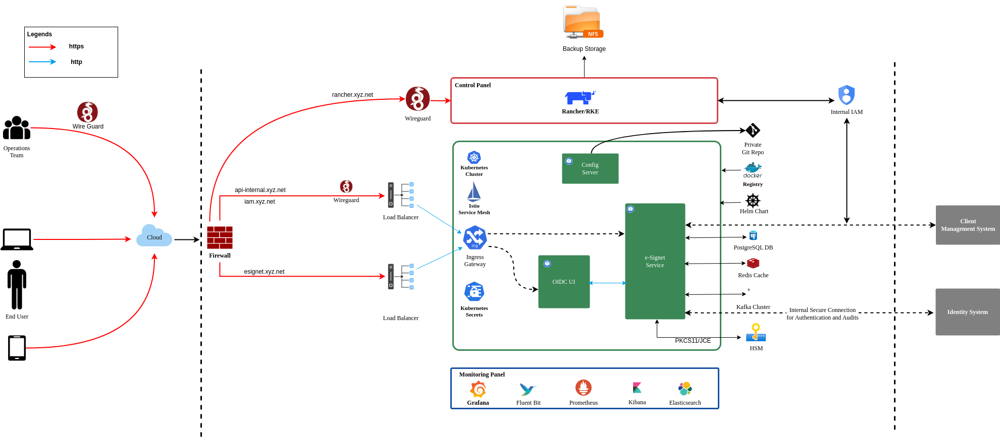

## Overview
This deployment guide provides a comprehensive, step-by-step approach to deploying and configuring eSignet on a Kubernetes based infrastructure and environment. The guide expects you to have the necessary Kubernetes infrastructure in place and required tools to integrate eSignet with various identity systems (MOSIP, Sunbird RC or Custom).


### Deployment Architecture of eSignet

The diagram below illustrates the **deployment architecture** of the eSignet, highlighting secure user access via VPN, traffic routing through firewalls and load balancers, and service orchestration within a Kubernetes cluster.

* **Key Components**: eSignet Service, OIDC UI, databases, and secure cryptographic operations via HSM.
* **Deployment**: Managed with Rancher, Helm charts, and a private Git repository.
* **Monitoring**: Ensured using Grafana and Prometheus for observability.

<figure><figcaption><p>eSignet Architecture diagram</p></figcaption></figure>


### How is this guide structured and organized? 

1. [**Introduction**](../../readme/setup/deploy.md#introduction): Provides an overview of the eSignet stack + ID System, deployment scenarios, required skill sets and system architecture.
2. [**Prerequisites**](../../readme/setup/deploy.md#prerequisites-for-overall-deployment): Outlines infrastructure details, hardware/software/network requirements, and initial setup steps.
3. [**Infrastructure**](../../readme/setup/deploy.md#base-infrastructure-setup): This section assumes that a Kubernetes-based environment is already set up and ready for deploying eSignet. Or it expects you have the ID system already deployed on a kubernettes based infra and next to which you will be deploying eSignet.
4. [**Deploy eSignet Prerequisites**](../../readme/setup/deploy.md#core-infrastructure-components-setup): Describes running `install-prereq.sh` script, which interactively installs required dependencies such as PostgreSQL, Keycloak, Redis, HSM (or key management), Kafka, API access control, and captcha validation service. The script prompts you to confirm or skip each component based on your environment, allowing you to reuse existing infrastructure or install new services as needed.
5. [**Deploy eSignet Services**](../../readme/setup/deploy.md#inji-stack-deployment): 
When you run the install script for eSignet services, it guides you through selecting the appropriate identity management plugin (e.g., MOSIP, Sunbird RC, or custom). Based on your choice, the script deploys eSignet services configured to integrate seamlessly with your selected identity system. This section provides detailed instructions for each integration scenario, ensuring a smooth deployment process.
6. [**Contribution and Community**](../../readme/setup/deploy.md#contribution-and-community): Highlights how you can contribute code, share feedback, or reach out for support while working with the application.

Each section provides direct steps and references to external resources for a streamlined deployment experience.

## eSignet Deployment and Integration Scenarios
There are different use cases for eSignet and therefore eSignet can be deployed around various scenarios. Few such examples can include enabling secure digital signatures for online transactions, integrating with national ID systems for authentication, supporting e-Government services, onboarding users for financial or healthcare applications, or providing identity verification for educational platforms.

However here within the scope of this deployment guide we will focus on how eSignet can be deployed and integrated with various identity systems. The deployment flow and integration steps may differ based on your existing setup. Below are the typical scenarios and recommended approaches.

> Note: The scenario part is discussed here [Deploy eSignet Services](link) and here you are asked to choose the plugin you want to use for identity management.

How eSignet can work with different Id systems:

* **eSignet + Mock**: Mock ID (New) + eSignet (New): 

This scenario deploys eSignet with a mock identity provider, allowing you to simulate authentication and authorization flows without integrating with a real ID system. It is ideal for development, testing, and demonstrations, requiring no external dependencies or onboarding steps.

* **eSignet + MOSIP**: MOSIP (Exists) + eSignet (New)

eSignet + MOSIP refers to integrating eSignet with the MOSIP identity system. In this scenario, eSignet leverages MOSIP as the identity provider, enabling secure authentication and digital signature workflows based on MOSIP-managed identities. This setup is suitable for environments where MOSIP is already deployed or planned, ensuring seamless identity verification and trust.


* **eSignet + Identity System (Non-MOSIP)**: Non-MOSIP ID (Exists) + eSignet

  This scenario involves integrating eSignet with an existing non-MOSIP identity system. It allows organizations to leverage their current identity management solutions while incorporating eSignet's digital signature capabilities. This approach is ideal for environments where a different identity provider is already in place, ensuring compatibility and streamlined user experiences.

* **eSignet + Sunbird RC**
  * Sunbird RC (Exists) + eSignet (New)

  This scenario focuses on integrating eSignet with the Sunbird RC identity system. It enables eSignet to utilize Sunbird RC for identity management, facilitating secure authentication and digital signature processes. This setup is particularly beneficial for organizations that have already implemented Sunbird RC, allowing them to enhance their identity verification and trust mechanisms with eSignet's features.

<!--

### Basic Skill-sets Required

Deploying eSignet is easier while you have Base Infrastructure ready, still, if you want to deploy it 'On-Premise' and from scratch, this guide helps you with the instructions to achieve this.


**Note**: The basic Skill-sets mentioned below, in fact, expects you to know the following to be able to deploy it from scratch and that too on a bare metal servers (On-Premise). This should not get intimidating as in typical scenarios we expect the infrastructure to be deployed by an experienced 'System-Admin/DevOps'. However in case you want to evangelize eSignet in your organization and want to have a hands-on with the deployment, this guide helps you with the steps and instructions to achieve this.


* **Linux System Administration**: Proficiency in Linux command-line operations, user and permission management, and basic networking.
* **Networking Fundamentals**: Knowledge of firewalls, load balancers, DNS, and secure network configuration.
* **Containerisation**: Experience with Docker or similar container technologies for building and managing service containers.
* **Kubernetes Administration**: Understanding of Kubernetes concepts, cluster setup, resource management, and troubleshooting.
* **Helm**: Familiarity with Helm for managing Kubernetes manifests and deployments.
* **Database Management**: Basic skills in managing PostgreSQL or similar databases, including initialization and schema setup.
* **Configuration Management**: Ability to manage application configuration files, secrets, and certificates securely.
* **Monitoring and Logging**: Understanding of logging and monitoring tools to observe system health and troubleshoot issues.
* **Security Best Practices**: Awareness of secure credential handling, certificate management, and access control.
* **Scripting**: Basic scripting skills (e.g., Bash, Python) for automation and operational tasks.
* **Familiarity with CI/CD Pipelines**: Understanding of continuous integration and deployment processes is a plus.

-->


<!--

### Deployment Considerations for On-Premise Inji Stack

The section helps you to have a quick understanding of what you should expect when you go about deploying eSignet, especially if you are deploying it 'On-Premise' and from scratch.

* eSignet is deployed as microservices in a Kubernetes cluster.
* Wireguard is used as a trust network extension to access the admin, control, and observation panes.
* eSignet uses Nginx server for:
  * SSL termination
  * Reverse Proxy
  * CDN/Cache management
  * Load balancing
* Kubernetes (k8's) cluster is administered using the rke tools and kubectl commands.
* We have two k8's clusters:
  * **Observation cluster** \[Optional] - This cluster is part of the observation plane and assists with administrative tasks. By design, this is kept independent from the actual cluster as a good security practice and to ensure clear segregation of roles and responsibilities. As a best practice, this cluster or its services should be internal and should never be exposed to the external world.
    * Rancher is used for managing the Inji cluster.
    * Keycloak in this cluster is used to manage user access and rights for the observation plane.
    * It is recommended to configure log monitoring and network monitoring in this cluster during production deployment.
    * In case you have an internal container registry, then it should run here.
  * **Inji cluster** - This cluster runs all the Inji components and core infrastructure components  like kafka, Postgres, minio, etc.
    * Inji Services are deployed in this cluster.

-->

# Prerequisites 
The prerequisite section is segregated into two parts:
* **Personal Computer**: This section lists the tools and utilities you need to have installed on your personal computer to create/manage the k8's cluster and deploy eSignet on it.
* **Server Requirements**: This section lists the hardware/software/network requirements for the Kubernetes based server infrastructure where you will deploy eSignet.

## PC Requirements and Environment

The **Personal Computer Prerequisites** lists the common tools and utilities which you will need to have installed on your personal computer to be able to create/manage the k8's cluster and deploy eSignet on it.


### Operating Systems

The eSignet can be deployed with a PC having one of the following operating systems, however for this guide we have considered a linux machine with Ubuntu 22.04 LTS.

* **Linux** (Ubuntu 22.04 LTS - recommended for production deployments)
* **Windows**
* **macOS (OSX)**



### Tools and Utilities

You should have these tools installed on your local machine from which you will be running the kubectl, connect to the k8s cluster and manage the deployment.

* [Ansible](https://docs.ansible.com/ansible/latest/installation_guide/installation_distros.html) - version > 2.12.4
* Command line utilities:
  * [kubectl](https://kubernetes.io/docs/tasks/tools/#kubectl)- version 2.12.4 or higher
  * [helm](https://helm.sh/docs/intro/install/)- any client version above 3.0.0 and add below repos as well

```
helm repo add bitnami https://charts.bitnami.com/bitnami
helm repo add mosip https://mosip.github.io/mosip-helm
```
* [rke](https://rancher.com/docs/rke/latest/en/installation/) : version: [1.3.10](https://github.com/rancher/rke/releases/tag/v1.3.10)
* [Istioctl](https://istio.io/latest/docs/setup/getting-started/#download) : version: 1.15.0
* Wireguard Client - Refer to the [Setup Wireguard Client on your PC](../../readme/setup/deploy.md#setup-wireguard-client-on-your-pc) section for the instructions.

## Server Requirements and Environment
**Server Requirements Prerequisites**: Kubernetes based server infrastructure is required to deploy eSignet. It can either have the Identity System (like MOSIP) already deployed on it or you can deploy eSignet along with the ID system.


# Deploy eSignet
The sub sections broadly outline the deployment process for eSignet which considers deploying it with or without Identity system (like MOSIP).

Deployment will broadly start and proceed as follows: 
The deployment process includes the following key steps:

* **Validate Existing ID System**: Ensure that your current identity system (such as MOSIP or Sunbird RC) is operational and healthy before proceeding with eSignet deployment.

* **Set Up Namespaces and Configurations**: Create and configure the necessary Kubernetes namespaces (e.g., `esignet`, `mosip`) and prepare configuration files required for eSignet.

* **Install and Initialize Prerequisites**: Deploy and initialize all required dependencies, such as PostgreSQL, Keycloak, Redis, HSM/key management, Kafka, and API access control, using the provided installation scripts.

* **Deploy Core eSignet Services**: Install the main eSignet services and select the appropriate identity management plugin (MOSIP, Sunbird RC, Mock, or Custom) as per your integration scenario.

* **Onboard eSignet as a MOSIP Partner**: If integrating with MOSIP, onboard eSignet as a MISP partner and configure the OIDC client for secure authentication and authorization.

* **Verify Deployment**: Check the status of deployed pods and services to confirm successful installation and operation.

* **Optional Components**: For comprehensive testing and integration, optionally deploy the OIDC UI and mock relying party components to simulate end-to-end flows.


Follow the subsections below for detailed instructions

## Get access to the 'Deployment Environment' (Kubernetes Cluster and Namespaces) where you will deploy eSignet
Ask your System Administrator of the 'Deployment Environment' to provide you access. This typically involves:
* Access to the Kubernetes cluster (kubeconfig file).
* Access to the relevant namespaces (e.g., `mosip`, `esignet`).
* Ensure you have the necessary permissions to create resources in these namespaces.
* Access to any required secrets or configuration files.

## Request DevOps team for below items
<!-- Ask Praful to proofcheck -->

* Kubeconfig file for the cluster (This will also contain namespace permissions).
* Confirm MOSIP is running and healthy

* Set up kubectl access
```sh
# Set KUBECONFIG environment variable
export KUBECONFIG=/path/to/your/kubeconfig

# OR copy to default location
cp kubeconfig ~/.kube/config

```
* Check cluster context
```sh
# Confirm you are operating in the correct cluster context:
kubectl config get-contexts
kubectl config use-context <desired-context>

```
> Note: Above mentioned environment variables will be used throughout the installation to move between one directory to other to run install scripts.


## Verify existing 'ID System' next to which you will deploy eSignet
In case you are deploying eSignet with an ID System (like MOSIP), you should first validate that the existing ID System is healthy and operational, after which you can deploy. 

We have considered MOSIP for an example and scope of this document.

```sh
# Test cluster connectivity
kubectl get nodes

# Check MOSIP deployment status
kubectl get pods -n mosip
kubectl get svc -n mosip

# Verify key MOSIP services are running
kubectl get pods -n mosip | grep -E "(ida|pms|kernel|postgres|keycloak|redis)"

```

## Clone eSignet Repository

This allows you to access the deployment scripts and configuration files required for installing eSignet.

> Note: Before cloning the repository, you should first ensure your `kubectl` is configured to access the target Kubernetes cluster and that you have the necessary permissions for the relevant namespaces. Once connectivity is verified, you should run the provided deployment scripts (such as `install-prereq.sh`, `initialise-prereq.sh`, and `install-esignet.sh`) from your local machine.

```sh

# Clone eSignet repository
git clone https://github.com/mosip/esignet.git
cd esignet/deploy

```

## Deploy eSignet services
Once steps mentioned above are complete and you have verified access, proceed with the deployment scripts as outlined below.


### Install Prerequisites

The prerequisites that you install ensures that the environment is ready for deploying eSignet core services and plugins.

> Note: What if I already have some of these dependencies (prerequisites) installed?
> If you already have dependencies like Postgres or Keycloak installed as part of your existing ID System (e.g. MOSIP) setup, you can skip their installation during the prerequisite step while the installation script is run and you are prompted.

When running the install scripts, you will be prompted to make selections for various components and configurations. This guide outlines the prompts you can expect, along with guidance on when to answer 'y' (yes) or 'n' (no) based on your environment. 

Some prompts are chained — your response to one may trigger additional questions. Review the following section to familiarize yourself with the installation flow and prepare your answers in advance for a smoother deployment experience.


### What all gets installed with 'Prerequisites Installation'?**

<!-- Hyperlink for definition or guides -->

This sets up dependencies like Postgres, Keycloak, Redis, and other required services.
The following components are installed as prerequisites for eSignet deployment:

- **PostgreSQL**: Database backend for eSignet services.

- **Keycloak**: Identity and access management service.

- **Redis**: In-memory data store for caching and session management.

- **HSM (Hardware Security Module) or Software-based Key Management**: For secure key storage and cryptographic operations.

- **apiaccesscontrol**: Service for API access management and authorization.

- **ConfigMaps and Secrets**: For storing configuration values, domain details, and sensitive credentials (e.g., `esignet-global` configmap, `keycloak-client-secrets`).

- **Supporting scripts**: Shell scripts for installation and initialization (`install-prereq.sh`, `initialise-prereq.sh`).


### Before you run the install-prereq.sh script what basic steps you need to do?

Before running the `install-prereq.sh` script, you need to prepare the `esignet-global` configmap, which contains environment-specific configuration for eSignet.

1. **Copy the sample configmap file:**
  ```sh
  cp esignet-global-cm.yaml.sample esignet-global-cm.yaml
  ```

2. **Edit `esignet-global-cm.yaml`:**
  - Update domain names and other configuration values to match your deployment environment.
  - Set up Google reCAPTCHA v2 by generating site and secret keys for your domain at [Recaptcha Admin](https://www.google.com/recaptcha/about/) and updating the configmap accordingly.
  - If using an external IAM, copy the required secrets and create a Kubernetes secret named `keycloak-client-secrets` in the `esignet` namespace.

> **Note:** 

1. The `esignet-global-cm.yaml` file typically contains domain names, API endpoints, and other parameters required for eSignet to function in your environment.
2. eSignet namespace is also created if it does not exist already.

Once the configmap is updated, proceed with the prerequisite installation.


### Run the `./install-prereq.sh` script

Run the `./install-prereq.sh` script (from deploy folder) to install required services such as PostgreSQL, Keycloak, Redis, HSM (or key management), Kafka, and API access control. You will be prompted for configuration details based on your environment (e.g., whether to install or skip certain components).

```sh
./install-prereq.sh
``` 

#### HSM

["hsm"]="Do you want to deploy hsm for esignet service? Please opt for 'n' if you already have hsm installed: (s - for softhsm, e - external, p - for pkcs12 based key management from mounted file)"

**Prompts**:
  1. n - If you already have hsm installed
  2. s - If you want to install softhsm
  3. p - If you want to use pkcs12 based key management from mounted file
  4. e - If you want to connect to external hsm
    1. n - If you don't have external hsm setup
    2. y - If you have external hsm setup
      1.  ["externalhsmclient"] = "Please provide the url where externalhsm client zip is located: "

      2.  ["externalhsmhosturl"] = "Please provide the hosturl for externalhsm: "

      3.  ["externalhsmpassword"] = "Please provide the password for the externalhsm: "


##### apiaccesscontrol

["apiaccesscontrol"] = "Do you want to access control the esignet client management APIs? Please opt for 'n' if not required. Press enter for default y"

**Prompts**:
  1.  n - "Warning! You have chosen to skip the keycloak initialization. The internal APIs of eSignet will run without access control."
  2.  y - "You have chosen to initialize keycloak for access control of internal APIs of eSignet."
    1.  ["iamserverurl"] = "Please provide the IAM server URL: Press enter to install default keycloak for access control"

    2.  ["adminuser"] = "Please provide admin user for initialisation"

    3.  ["adminpassword"] = "Please provide admin password for initialisation"

##### Kafka
["kafka"]="Do you want to deploy Kafka in the kafka namespace? Please opt for 'n' if you already have a kafka deployed: Press enter for default y"

**Prompts**:

  1. n - If you already have kafka deployed
    1.  ["kafkaurl"] = "Please provide the kafka url: spring.kafka.bootstrap-servers"
  2. y - If you want to install kafka


##### Postgres

["postgres"]="Do you want to deploy postgres in the postgres namespace? Please opt for 'n' if you already have a postgres server deployed: Press enter for default y"

**Prompts**:

1. y - If you want to install postgres
2. n - If you already have a postgres server deployed, **The below set of questions [b-e] should be prompted only when the answer to the above is 'n'.**

  1.  ["postgreshostname"] = "Please provide the hostname for the postgres server: "

  2.  ["postgresport"] = "Please provide the port number for the postgres server: "

  3.  ["postgresusername"] = "Please provide the username for the postgres server: "

  4.  ["postgrespassword"] = "Please provide the password for the postgres server: "

##### Redis

["redis"]="Do you want to deploy redis in the redis namespace? Press enter for default y"
**Prompts**:

  1. y - If you want to install redis
  2. n - If you already have a redis server deployed **The below set of questions [b-d] should be prompted only when the answer to the above is 'n'.**

    1.  ["redishostname"] = "Please provide the hostname for the redis server: "

    2.  ["redisport"] = "Please provide the port number for the redis server: "

    3.  ["redispassword"] = "Please provide the password for the redis server: "

The installations should begin as per user requirement based on the above set of questions/prompts. Once the installation is completed, user should be asked to enter the below details to complete the setup for captcha validation service.

##### Captcha Validation Service

["captchavalidationservice"] = "Do you want to install captcha validation service? Press enter for default y"
  **Warning message to be shown:** "It is not recommended to use the eSignet without captcha site key and captcha secret key in production env. Press enter to proceed"
**Prompts**:
  1.  y - If you want to install captcha validation service, **The below set of questions [c-d] should be prompted only when the answer to the above is 'y'.**

    1.  ["captchasitekey"] = "Please provide the captcha site key"

    2.  ["captchasecretkey"] = "Please provide the captcha secret key"

    3.  If opted 'n' what needs to be done <!-- explain -->

Pre-requisite installation is complete at this stage.

#### Initialise Prerequisites
Run the `./initialise-prereq.sh` script (from deploy folder) to initialize required services such as the eSignet database and Keycloak. You will be prompted for configuration details based on your environment (e.g., database credentials, IAM scope, service endpoints). Update the relevant values files before executing the script to ensure correct initialization.

```sh

./initialise-prereq.sh

```

You are prompted to answer following questions based on whether the eSignet database is present or not in the postgres server url provided above. Therefore, before you run the initialise script, update the Postgres and Keycloak values files as needed and then initialise.

1.  ["postgres"] = "eSignet database was not found. Running the db scripts to create and initialize the eSignet database:"

2.  Information to be added in the guide for the IAM scope in the deployment guide. <!-- add content or improve -->

3.  In the deployment script, certificate endpoint, binding endpoint and client management endpoint are to be configured as internal. 

<!-- add content or improve - below is auto added
    1.  ["esignet.certificate-service.base-url"] = "Please provide the certificate service base url: "

    2.  ["esignet.binder-service.base-url"] = "Please provide the binder service base url: "

    3.  ["esignet.client-management.base-url"] = "Please provide the client management base url: "

-->


### eSignet Services Installation

Once you have completed the pre-requisite installation and initialization, you can proceed to install the eSignet services.

#### Before you run the installation script (Decision on Plugin to install)
Before you run the installation script, you should decide which plugin you want to install, In the context of this guide this typically means which ID System you want to integrate with. Based on your decision, you should navigate to the respective folder and run the installation script. <!-- Respective folder for each plugin to be verified -->

1. **eSignet Mock Plugin** – Simulates an identity provider for testing and development; no real ID system integration required.
2. **MOSIP Identity Plugin** – Integrates eSignet with an existing MOSIP identity system.
3. **Sunbird RC Plugin** – Connects eSignet to an existing Sunbird RC identity registry.
4. **Custom Plugin** – Enables integration with any custom identity system via API access control.


##### Compatibility matrix
Here below is a compatibility matrix for different Identity Systems, eSignet versions, and plugin versions. It helps you determine which versions are compatible with each other and guides you to the appropriate integration guide/documentation. Understanding this matrix is crucial for ensuring a stable and supported deployment, avoiding integration issues, and selecting the correct components for your environment.


| Identity System | eSignet Version | Plugin Version | Status | Integration Guide |
|----------------|----------------|----------------|---------|-------------------|
| MOSIP 1.2.x    | 1.6.1         | 1.3.x          |  Stable | [MOSIP Integration](es-deployment-guide.md#mosip-integration) |
| MOSIP 1.1.x    | 1.5.x         | 1.2.x          |  Legacy | [Legacy MOSIP](es-deployment-guide.md#legacy-mosip) |
| Sunbird RC 2.x | 1.6.1         | 1.0.x          |  Stable | [Sunbird Integration](es-deployment-guide.md#sunbird-integration) |
| Custom API     | 1.6.1         | Custom         |  Custom | [Plugin Development](es-deployment-guide.md#plugin-development) |


If you want to install eSignet with plugins, you should navigate to the folder 'esignet-with-plugins' and run below command:

<!-- Does it mean that there is some folder which is simple, as first case, where in not lots of prompts are there? If yes, then we should mention that too. -->

```sh
./install.sh
```

You are prompted with following question/prompts to choose from the list of available plugins and install eSignet with only chosen plugin.

1.  ["esignetplugin"] = "Choose the required plugin to proceed with installation".

  1.  esignet-mock-plugin
  2.  mosip-identity-plugin
  3.  sunbird-rc-plugin
  4.  custom-plugin:"

The answer to the above questions is in option number - for example '1', '2', or '3'.

##### esignet-mock-plugin

If you choose 'esignet-mock-plugin', you are not prompted any questions and the installation for mock plugin is completed automatically.

When you choose the **esignet-mock-plugin** during installation, the deployment script installs eSignet with a mock identity provider integration. This setup is primarily for testing and demonstration purposes, allowing you to simulate authentication and authorization flows without connecting to a real identity system.

**Key points:**
- No additional prompts are shown; the installation proceeds automatically.
- The mock plugin provides sample endpoints and data to mimic real-world identity operations.
- You can use the mock relying party and OIDC UI to test the complete eSignet flow.
- No onboarding with MOSIP or Sunbird RC is required in this scenario.
- This setup is not recommended for production but is useful for development, testing, and API validation.

After installation, you can proceed to test eSignet using the provided mock relying party tools and Postman collections.


##### mosip-identity-plugin

If you choose `esignet-with-mosip-id` plugin, you are prompted with the questions below along with default url mentioned:

1.  ["mosip.esignet.authenticator.ida.cert-url"] = "Default url: (http://mosip-file-server.mosip-file-server/mosip-certs/ida-partner.cer) Provide custom value (if applicable) to override the default url: "

2.  ["mosip.esignet.authenticator.ida.kyc-auth-url"] = "Default url: (http://ida-auth.ida/idauthentication/v1/kyc-auth/delegated/\${mosip.esignet.authenticator.ida.misp-license-key}/) Provide custom url (if applicable) to override the default url: "

3.  ["mosip.esignet.authenticator.ida.kyc-exchange-url"] = "Default url: (http://ida-auth.ida/idauthentication/v1/kyc-exchange/delegated/\${mosip.esignet.authenticator.ida.misp-license-key}/) Provide custom url (if applicable) to override the default url: "

4.  ["mosip.esignet.authenticator.ida.send-otp-url"] = "Default url: (http://ida-otp.ida/idauthentication/v1/otp/\${mosip.esignet.authenticator.ida.misp-license-key}/) Provide the custom url (if applicable) to override the default url: "

5.  ["mosip.esignet.binder.ida.key-binding-url"] = "Default url: (http://ida-auth.ida/idauthentication/v1/identity-key-binding/delegated/\${mosip.esignet.authenticator.ida.misp-license-key}/) Provide the custom url (if applicable) to override the default url: "

6.  ["mosip.esignet.authenticator.ida.get-certificates-url"] = "Default url: (http://ida-internal.ida/idauthentication/v1/internal/getAllCertificates) Provide the custom url (if applicable) to override the default url: "

7.  ["mosip.esignet.authenticator.ida.auth-token-url"] = "Default url: (http://authmanager.kernel/v1/authmanager/authenticate/clientidsecretkey) Provide the custom url (if applicable) to override the default url: "

8.  ["mosip.esignet.authenticator.ida.audit-manager-url"] = "Default url: (http://auditmanager.kernel/v1/auditmanager/audits) Provide the custom url (if applicable) to override the default url: "

9.  ["mosip.esignet.authenticator.ida.otp-channels"] = "Default channels (email,phone) Provide the required channels to override the default channels: "

##### sunbird-rc-plugin

If you choose `eSignet-with-sunbird` plugin, you are prompted with the question below:

1.  ["mosip.esignet.sunbird-rc.registry-get-url"] = "Please provide the url for sunbird registry get api:"

Once the above decision inputs are taken from you, eSignet installation should be initialized and completed successfully.

If any error occurs during eSignet installation, You can start the eSignet installation again after deleting the existing chart or fix the issue.


##### custom-plugin

If you choose eSignet installation without plugin, below question is prompted:

1. ["custompluginurl"] = "Please provide the url for the custom plugin you want to use: "

Above url can be zip file or jar file, so both zip url and jar file url are supported for above variable.

Once the above input are taken from you, eSignet installation is initialised and completed successfully.

If any error occurs during eSignet installation, you are able to start the eSignet installation again after deleting the existing helm chart using delete.sh or debug the issue further.


#### OIDC UI Installation

Once eSignet installation is completed, now, you are prompted to provide relevant inputs for completing oidc ui deployment:

  1.  ["esignetthemes"] = "Please provide the theme for the eSignet UI. Please choose between 'blue' or 'orange' for esignet default theme: Press enter for the default theme. Please provide URL for the custom theme"

  2.  ["defaultlang"] = "Please choose the default lang for esignet. Please press enter for en: "
    - We should provide the existing list.

  3.  ["idprovidername"] = "Please provide the name for eSignet: (Note: This name will be used instead of eSignet on the login page and in other places)"


#### Mock Relying Party Installation

If you have chosen to install eSignet with mosip ID then the MISP onboarding should be initiated and completed successfully, however if you choose to continue with mock or custom plugin no MISP onboarding is required, and this step should be skipped.

- Use the onboarder script to register eSignet as a MISP partner and configure the OIDC client.
- Update any required properties (e.g., MOSIP IDA domain names, client secrets) as per your environment.

Refer to the [official onboarding documentation](https://github.com/mosip/esignet-plugins/blob/release-1.3.x/mosip-identity-plugin/src/main/resources/application.properties) for property overrides.

eSignet installation is completed at this step.


> Note: You can refer to the deployment guide to know more about the mock relying party portal installation, having mock relying party portal installed will be helpful to verify the complete eSignet flow.


<!--

## API Test Suites Installation

To verify the eSignet flow, user should be able to install the api test suites and run it. Below steps are to be followed:

1.  Create a directory for api test suites on the NFS server at /srv/nfs/mosip/<sandbox>/apitestrig/:

  1.  mkdir -p /srv/nfs/mosip/<sandbox>/apitestrig/

2.  Ensure the directory has 777 permissions:

  1.  chmod 777 /srv/nfs/mosip/<sandbox>/apitestrig

3.  Add the following entry to the /etc/exports file:

  1.  /srv/nfs/mosip/<sandbox>/apitestrig *(ro,sync,no_root_squash,no_all_squash,insecure,subtree_check)

4.  If user has chosen to install esignet with mosip id plugin, user should be prompted to provide the below inputs

  1.  ["iamadminuserformasterrealm"] = "Please provide the keycloak admin user for master realm: "

  2.  ["iamadminpasswordformasterrealm"] = "Please provide the keycloak admin password for master realm: "

5.  Navigate to the folder 'esignet-apitestrig' and run the install.sh file with below command:

  1.  ./install.sh

6.  After the installation of the api test suites, user should refer the below readme file to follow the steps to run the API test rig:

  1.  https://github.com/mosip/esignet/blob/release-1.5.x/deploy/esignet-apitestrig/README.md

7.  To confirm the test report matches the benchmark, user should refer the latest release test report present under release section in the eSignet docs:

  1.  Link to the automation report - https://docs.esignet.io/versions

-->


## Verify Deployment

You can check the status of eSignet pods after deployment, use the following command:

```sh
kubectl get pods -n esignet

```


**Next Steps:**  
Proceed to integration and configuration steps as per your scenario.
<!-- Check with Praful -->