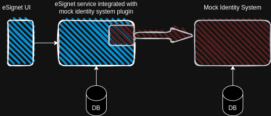

# Local Setup and Deployment

This document details the steps for running eSignet locally on your system for local development and integration.

For the local deployment, eSignet is integrated with [mock identity system](https://github.com/mosip/esignet-mock-services/tree/master/mock-identity-system) using eSignet plugins specifically developed to connect with mock identity system.You can find the mock plugin implementation [here](https://github.com/mosip/esignet-mock-services/tree/master/mock-esignet-integration-impl).

We have [docker-compose](https://github.com/mosip/esignet/tree/develop/docs/docker-compose) setup to start eSignet and its dependent services.

You can also watch below video to setup and run eSignet and its dependent services locally one by one.



## API Documentation

To know about the query parameters that are required to test the OIDC flow, refer to our stoplight [API documentation](https://mosip.stoplight.io/docs/identity-provider/jlmszj6dlxigw-e-signet).

## Postman Collection

We also have Postman scripts available under [docs/postman-collections](https://github.com/mosip/esignet/tree/master/docs/postman-collections) folder in the eSignet GitHub repository.

**Collection**



**Environment Configuration**


