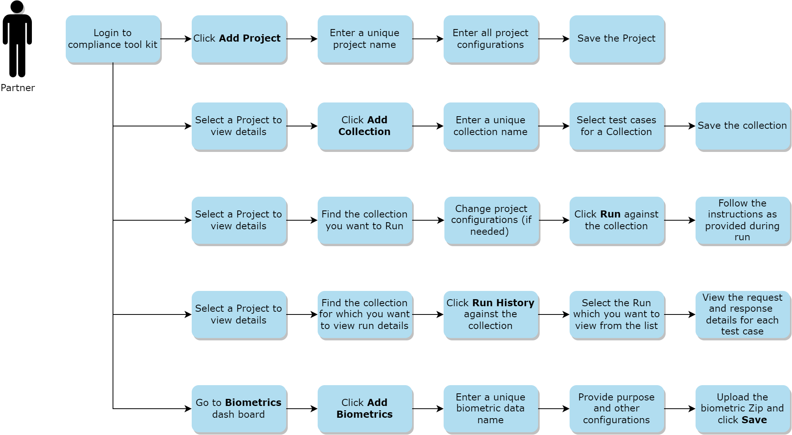

# Compliance Tool Kit

Compliance Toolkit (CTK) is an online portal that can be used by MOSIP partners to test their compliance with various biometrics related specifications (specs) published by MOSIP. 

MOSIP supports the following biometrics related specifications:

1. SBI: Secure Biometric Interface (SBI) is used to interface with biometric devices
MOSIP’s device partners are required to build a software layer for their devices to communicate with MOSIP’s registration client or authentication client. The specifications that they should follow are defined as Secure Biometrics Interface (SBI) specs. The compliance tool kit should ensure that the interface built by the device provider is following the specs, security and integrity rules defined in the SBI spec.

2. SDK: MOSIP’s Biometric Service providers provide an SDK implementation which supports quality check, 1:N match, extraction, conversion of biometrics. MOSIP defines an IBioAPI as specification for this SDK implementation.MOSIP’s Biometric Service providers are also required to build an interface between their solution and MOSIP to smoothen the communication between the two entities. The compliance tool kit would make sure that these interfaces are as per the MOSIP defined specifications for smooth interaction.

3. ABIS - Automated Biometric Identification System (ABIS) vendors provide ABIS component which performs de-duplication of a resident's biometric data. This is useful to ensure uniqueness of resident’s biometrics. MOSIP’s ABIS partners communicate with MOSIP via a queue. MOSIP defines ABIS specs for the same. 

CTK supports testing of compliance with all above specifications. 

## How does Compliance Tool Kit work?

* To support compliance with the specifications, CTK has predefined test cases for each of the above specs. 
* Each testcase is run on a given method of the specs. Each testcase defines the attributes required to create the request to be sent to the method.
* Each testcase also defines the response expected from the method. On this response various validators are run. Each validator will perform a predefined check on the response. If all validations are successful, then the testcase is passed otherwise it is a failed testcase. 
* Partners can use CTK to run these testcases to check if their implementation adheres to the MOSIP’s specs or not. 

## Compliance Tool Kit portal

MOSIP provides a **reference** implementation of the pre-registration portal that may be customized as per country needs. The sample implementation is available at [reference implementation repository](https://github.com/mosip/mosip-ref-impl). For getting started with the pre-registration, refer to the [Pre-registration user guide](pre-registration-user-guide.md)

## Build and deploy

To access the build and read through the deployment instructions, refer to [Pre-registration repo](https://github.com/mosip/pre-registration/tree/release-1.2.0).

## Configurations

For details related to Pre-registration configurations, refer to [Pre-registration configuration](https://github.com/mosip/pre-registration/blob/release-1.2.0/docs/configuration.md).

## Developer Guide
To know more about the developer setup, read [Pre-registration Developers Guide](https://docs.mosip.io/1.2.0/modules/pre-registration/pre-registration-developer-setup).

## API

Refer [API Documentation](https://mosip.github.io/documentation/1.2.0/1.2.0.html).

## Source code

[Github repo](https://github.com/mosip/pre-registration/tree/release-1.2.0).

