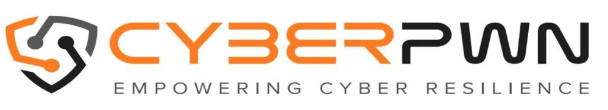

# Contributions

## Overview

MOSIP is a product of the combined efforts of multiple stakeholders. Contributions from the community form the backbone of MOSIP and drive its growth and stability. The contributions have come in multiple ways, ranging from direct code contributions, review of design and architecture, bug fixing, and support for technology evaluation. In this section the MOSIP team would like to acknowledge the contributions of organisations and groups who have been instrumental in driving the project forward.

## [LTIMindtree Ltd](https://www.mindtree.com/)

<figure><figcaption></figcaption></figure>

MOSIP partnered with LTIMindtree in August 2018 and since then it has been a fruitful association in areas of engineering, architecture, devops to name a few. Mindtree has contributed, through secondment of engineering resources, approximately 2260 person days of engineering effort, which roughly translates to more than 21000 person hours of work on the MOSIP project.

**About LTIMindtree**: A digital transformation and technology services company located in Bangalore.

## [Technoforte Software Private Limited](https://www.technoforte.co.in/)

The team at Technoforte has contributed multiple resources towards security testing, manual testing, automated testing, development, and devops. Technoforte has made significant contributions to the development of Partner Management Module, defining the partner policy, and setting up the partner portal. The team is also part of the community led effort of Android Reg Client development.

These valuable contributions were made by the Technoforte team with an approximate cumulative effort of about 4000+ person days which translates to 32000+ person hours.

**About Technoforte**: Technoforte Software Private Limited (Technoforte) is a Bangalore based firm engaged in providing enterprise solutions in the field of Information Technology.

## [Newlogic](https://newlogic.com/)

With its belief in the open source values and the transformative power of Digital Public Goods Newlogic has been partnering with MOSIP in building the next generation of digital government infrastructures.

Newlogic regularly contributes to architecture, development, product management, and testing work.

Newlogic's contribution to MOSIP include:

* Integration of ID PASS Light library to generate and read encrypted QR Codes that allow offline identity sharing with biometric verification.
* Development of the Inji resident mobile app and its Minoto backend service.
* Development of a mobile credential sharing library that works both online and offline.

Singapore based Newlogic is a software consultancy company providing innovative software solutions to companies, organizations, and governments.

## [Thoughtworks](https://www.thoughtworks.com/)

<figure><figcaption></figcaption></figure>

In 2022, Thoughtworks partnered with MOSIP as an engineering ally, embarking on a significant journey together. Key milestone was the creation of Tuvali, a BLE layer adhering to OpenID4VP standards. An alternate to Google Nearby, Tuvali facilitates the exchange of verifiable IDs across wallets and devices even without internet connectivity. This innovation empowers governments to effectively provide efficient and monitored citizen services.

Furthermore, the organization played a pivotal role in developing Inji Mobile, a digital VC wallet reference application. With a strong focus on security and inclusivity, Inji Mobile offers features for downloading, storing, managing, presenting, and verifying VCs within the MOSIP community. Built on OpenID4VCI standards, the wallet also includes data backup capabilities.

The organization has broadened its contributions to other essential components of the digital credentialing stack - Inji.

**About Thoughtworks**: Thoughtworks is a global technology consultancy renowned for integrating strategy, design, and engineering to foster digital innovation. With over 10,500 skilled professionals across 48 offices in 19 countries, the organization has a legacy of delivering impactful solutions for our clients over the past three decades. We pride ourselves on leveraging technology to address complex business challenges and drive meaningful change.

## [Infosys](https://www.infosys.com/)

<figure><figcaption></figcaption></figure>

Infosys began collaborating with MOSIP in Early 2023 as part of its Technology for good initiative. The company has been actively contributing to the development of the eSignet module, Android Registration Client, and other related modules. Through this pro bono collaboration, Infosys demonstrates its commitment to using technology for social good and empowering individuals with secure and reliable digital identities.

**About Infosys**: Infosys, a global leader in next-generation digital services and consulting, headquartered in Bengaluru, India, is a multinational corporation that provides business consulting, information technology, and outsourcing services to clients across the globe.

## [CyberPWN](https://cyberpwn.com/)

<figure><figcaption></figcaption></figure>

In January 2020, CyberPWN partnered with IIIT Bangalore to offer development assistance for MOSIP. Presently, CyberPWN's product engineering team, consisting of 30+ engineers, actively contributes expertise in multiple areas of MOSIP, encompassing Architecture, Product Management, Product Development, Quality Assurance, DevSecOps, Security, and Biometrics.

**About CyberPWN**: CyberPWN Technologies Private Limited is a respected cybersecurity consultancy and advisory firm. Leveraging their extensive expertise in the field, they collaborate with organizations to enhance their security posture, protect sensitive data, and counter cyber threats.

## [Students @ IIIT Bangalore](https://www.iiitb.ac.in/)

IIIT Bangalore has been home to MOSIP since its inception in 2018 and the students of the institute have been at the forefront of the MOSIP’s community-led development. The students have on an ongoing basis contributed to solving engineering problems in MOSIP for real-world applications. Their major ongoing contributions include:

**Project 1:** Synthetic IRIS Data generation using ML algorithms

MOSIP test automation suite requires large set of synthetic biometric data such as IRIS. This project attempts to generate larger set of IRIS images from the given set of sample IRIS images. The solution is built using Guided-Diffusion with pre-trained models MOSIP USSD Proxy feature enhancements.

**Project 2:** MOSIP USSD Proxy feature enhancements

MOSIP USSD Proxy is a bridge between Telco SDP and MOSIP Instance. This allows to build custom USSD workflows.

The following workflows were developed under this project:

* Check registration status for a given RID
* Retrieve UIN Lock/Unlock status
* Lock or Unlock a given UIN
