# CTK Dashboards in Kibana

* Kibana houses ten CTK Dashboards, which aid in presenting data in a comprehensible and significant manner.
* These dashboards facilitate continuous monitoring of data and system metrics. Users are able to establish visualizations that automatically update as new data is received.
* Kibana needs environmental access.
* Within the dashboard, **search** and **filtering** functionalities can be utilized.
*   It should be noted that the data stored in Kibana may not be completely secure. To mitigate risks, we have taken precautions such as excluding sensitive data columns and allowing only necessary information for dashboard visualization.

    Let us see list of CTK dashboards.

1.  **CTK - Onboarded Partners**

    This dashboard shows the pie chart regarding the partners onboarded in CTK, based on the type of project, list of partner id along with count of projects created and SBI projects by purpose.

<figure>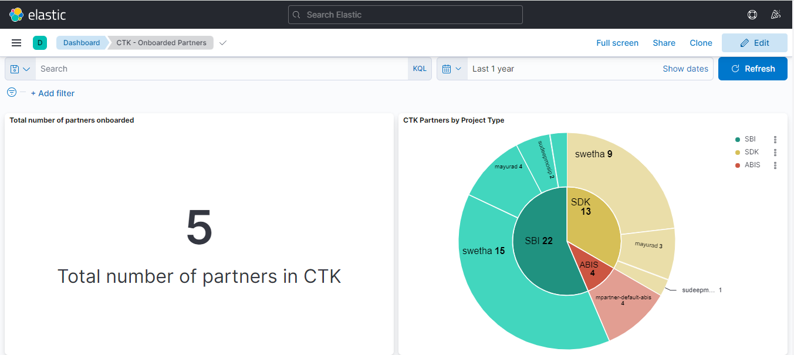<figcaption></figcaption></figure>

2. **CTK - Active Partners, Testcase Trends**

This dashboard describes most active partners in CTK, most successful top 20 testcases and most failed top 20 testcases.

<figure>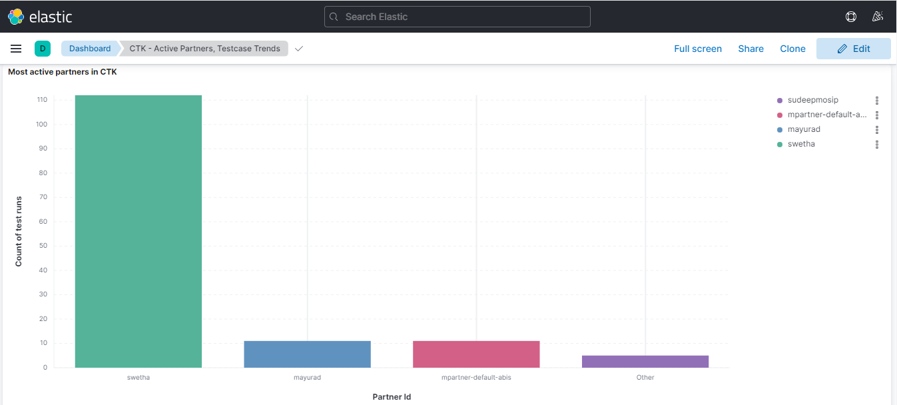<figcaption></figcaption></figure>

3. **CTK – Testcases**

&#x20;  It displays all the CTK testcase details.

<figure>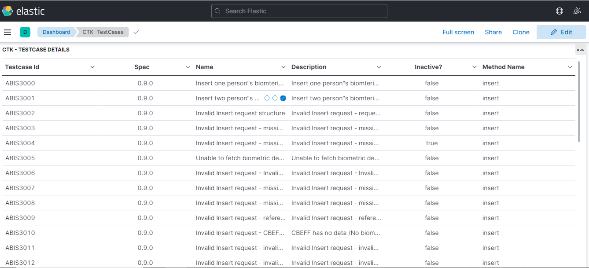<figcaption></figcaption></figure>

4.  **CTK - Top 5 Partners Successful Test Runs**

    It shows CTK - top 5 partners with successful test runs across all collections (including compliance collections).

<figure>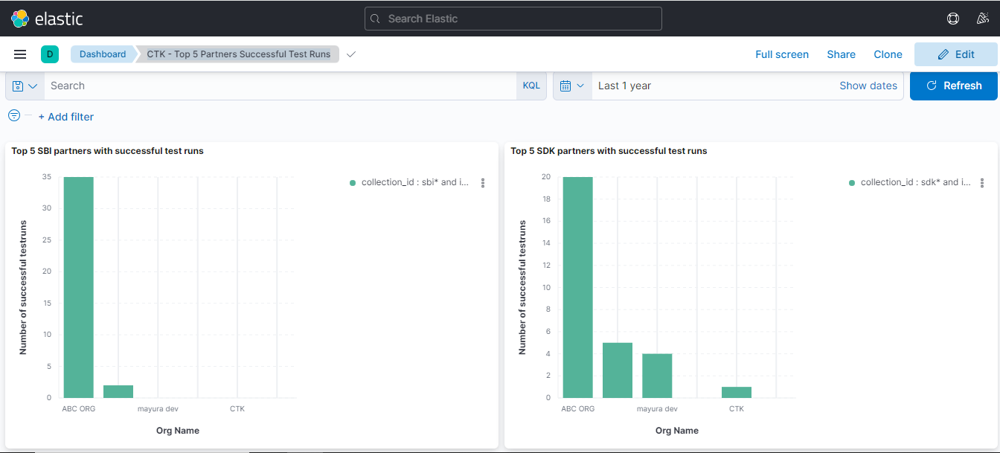<figcaption></figcaption></figure>

5. **CTK - Top 5 Partners Successful Test Runs for Compliance Collections**

The dashboard describes top 5 partners with successful test runs for only compliance collections.

<figure>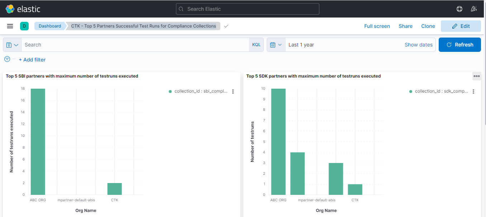<figcaption></figcaption></figure>

6. **CTK - Biometrics Quality Report of BQAT SDK**

It shows Biometrics Quality Report for scores given by BQAT SDK.

<figure>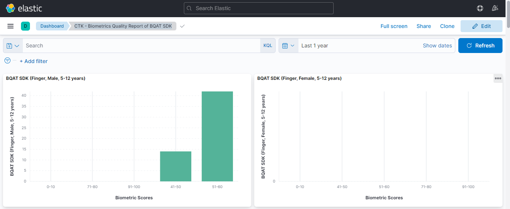<figcaption></figcaption></figure>

* Here, to add more panels like above, click the **Edit** button. This will enable you to edit the dashboard. Then, click the **Create Visualization** button to create a new panel.

<figure>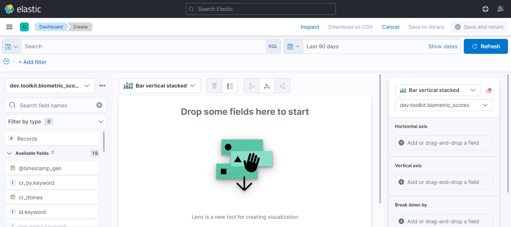<figcaption></figcaption></figure>

* Select Index Pattern and set horizontal and vertical axis.

<figure>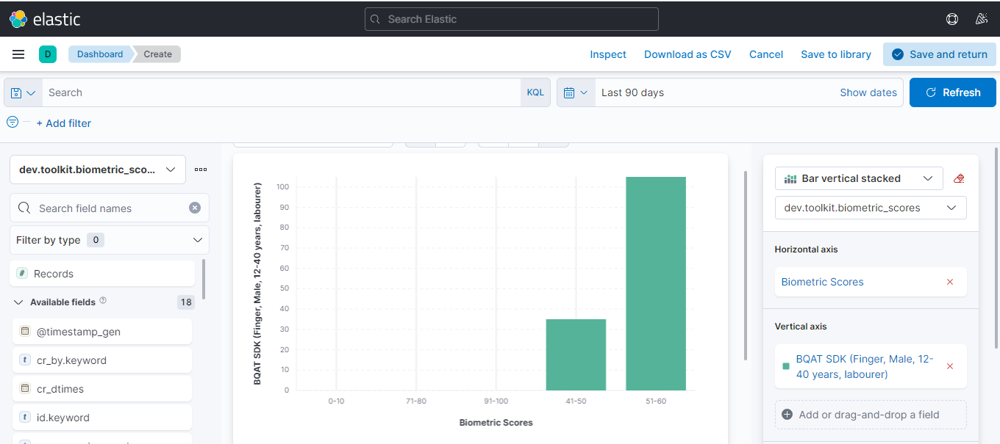<figcaption></figcaption></figure>

7. **CTK - Biometrics Quality Report of SBI**

The dashboard shows Biometrics Quality Report for scores given by SBI.

<figure>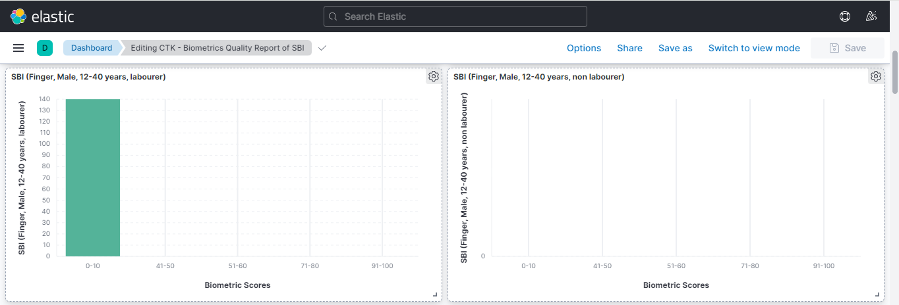<figcaption></figcaption></figure>

8. **CTK - Biometrics Quality Report Scores Comparison**

It compares the scores between different SDK and SBI.

<figure>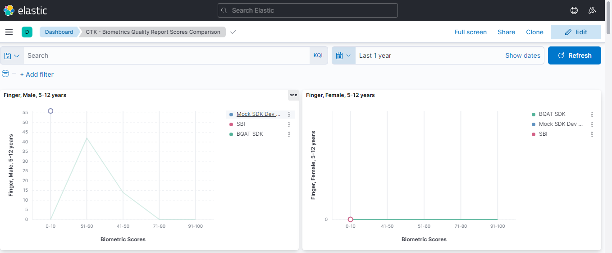<figcaption></figcaption></figure>

9. **CTK – Compliance Test Run Reports**

The number of reports submitted for review and their status are displayed on this dashboard.

<figure>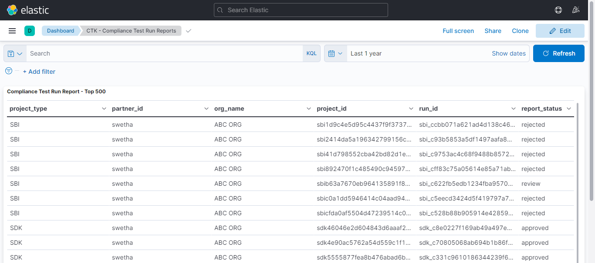<figcaption></figcaption></figure>

11. **CTK- View Partner’s Test Run**

Here we can view a partner's test run status based on partner id and test run ID.
