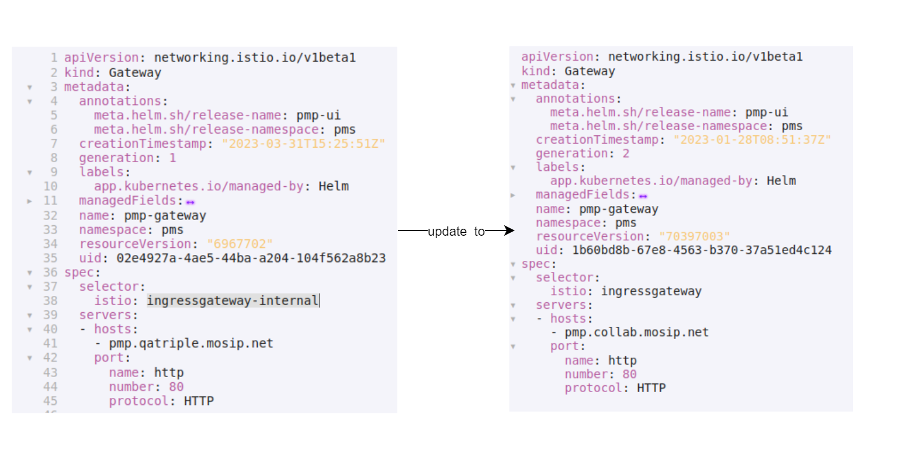
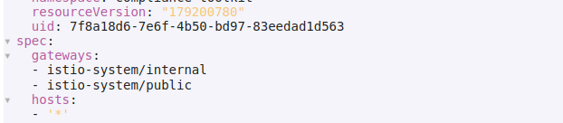

# How to make CTK publicly available

## Prerequisite

Ensure that all the deployment steps are followed as mentioned in the README.md files of the below repositories:

1. [mosip-compliance-toolkit](https://github.com/mosip/mosip-compliance-toolkit)
2. [mosip/mosip-compliance-toolki-ui](https://github.com/mosip/mosip-compliance-toolkit-ui)


### Additional steps post CTK deployment 

Below are details of some additional steps that you may need to follow so as to make CTK publicly available post the regular deployment.

#### DNS Mapping changes

Update the DNS records for the below mentioned domains to point to the public IP of nginx server associated with the corresponding cluster.

`onboarder.sandbox.mosip.net ----> public IP of nginx server for Mosip cluster`

`sandbox.mosip.net ----> public IP of nginx server for Mosip cluster`

`pmp.sandbox.mosip.net ----> public IP of nginx server for Mosip cluster`

`iam.sandbox.mosip.net ----> public IP of nginx server for Observation cluster`

#### Nginx Server changes

Add the below mentioned domains in `server_name` section of pubic nginx server.

1. sandbox.mosip.net

2. api.sandbox.mosip.net

3. compliance.sandbox.mosip.net

4. pmp.sandbox.mosip.net

*Note*: Replace “sandbox”  appropriately.

#### Istio changes

1. Update the below mentioned istio ingress gateway to point to public IstioOperator:

   Change **spec.selector.istio: ingressgateway-internal** to **spec.selector.istio: ingressgateway** as shown in the image below.
 
   
     * pmp-gateaway
     * compliance-toolkit-ui-gateway
     * keycloak
     * landing-page

2. Update below mentioned istio virtualservice to add public gateway in spec.gateways:

   

    * partnermanager
    * policymanager
    * toolkit-service

3. Update Istio gateway in compliance toolkit envoyFilter compliance-toolkit-set-cookie-header to public gateway.

```
  workloadSelector:
    labels:
      istio: ingressgateway
```
      
### Config map changes for UI

* Update `compliance-toolkit-ui.json to point` to `api.sandbox.mosip.net` instead of `api-internal.sandbox.mosip.net`.

* Update `pmp config.json` to point to `api.sandbox.mosip.net` instead of `api-internal.sandbox.mosip.net`.

### Configuration changes 

* Add `mosip.api.external.url=https://${mosip.api.public.host}` property in `compliance-toolkit-default.properties` file.

* Update `mosip.iam.module.redirecturi=${mosip.api.external.url}/v1/toolkit/login-redirect/` property in `compliance-toolkit-default.properties` file.

* Update `mosip.iam.module.redirecturi=${mosip.api.external.url}/v1/partnermanager/login-redirect/` property in `partner-management-default.properties` file.
   

 
