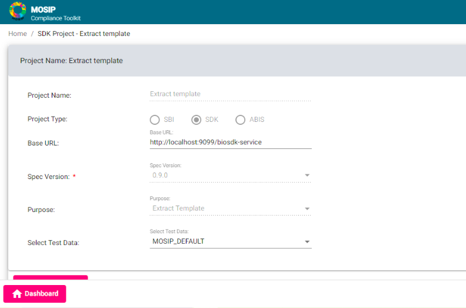
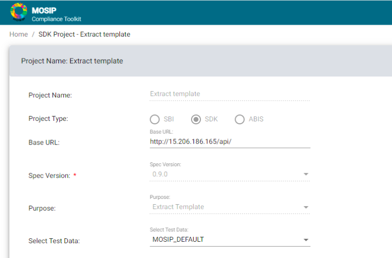

# How to set up an SDK?

A partner can test their biometric SDK with MOSIP's compliace tool kit uisng two different ways:

* Using SDK jar
* Using Docker service

## Test using a SDK JAR

Partners having SDK JARs can test thier biometric SDK JARs using compliance tool kit, by wrapping their SDKs in MOSIP’s BioSDK Services which provide REST endpoints to interact with the SDK jar.

1. Checkout MOSIP’s Bio SDK Services from `https://github.com/mosip/biosdk-services.git`. Make sure you checkout the code from **develop** branch.
2. Build the code with command `mvn clean install -Dgpg.skip`
3. After build is successful place your SDK jar in the `biosdk-services\biosdk-services\lib` folder.
4. Create a bat file to run biosdk-services
  ```
  cd <LOCAL_PATH>\biosdk-services\target
  java -Dloader.path=../lib/<SDK_JAR_NAME> -Dbiosdk_bioapi_impl=io.mosip.mock.sdk.impl.SampleSDK -jar biosdk-services-1.2.1-SNAPSHOT.jar
  ```
  Here, the `LOCAL_PATH` is the installation directory path for Bio SDK Service and `SDK_JAR_NAME` is the SDK JAR name.

5. Once the Bio SDK Service is running, please check if JAR is working using the Swagger available at URL: `http://localhost:9099/biosdk-service/swagger-ui.html`
6. In Compliance tool kit for the SDK project configure the `BASE_URL` as: `http://localhost:9099/biosdk-service`



## Test using docker service

Partners having SDK docker service can test their SDKs using compliance tool kit, by just running their docker service to provide REST API’s to access SDK methods.

Once the docker is deployed and accessible, the partner needs to add the correct URL in the SDK project to access the docker service directly.



But the partner may face the CORS issue. To get around this, they can allow the compliance toolkit URL in their controllers using @CrossOrigin("<URL>") annotation.
Otherwise, they can use a proxy service which would redirect all their calls to the docker.
