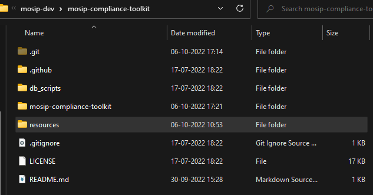
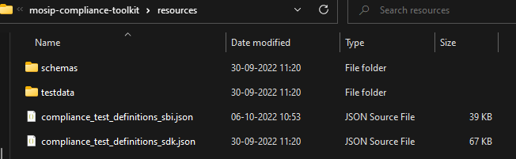
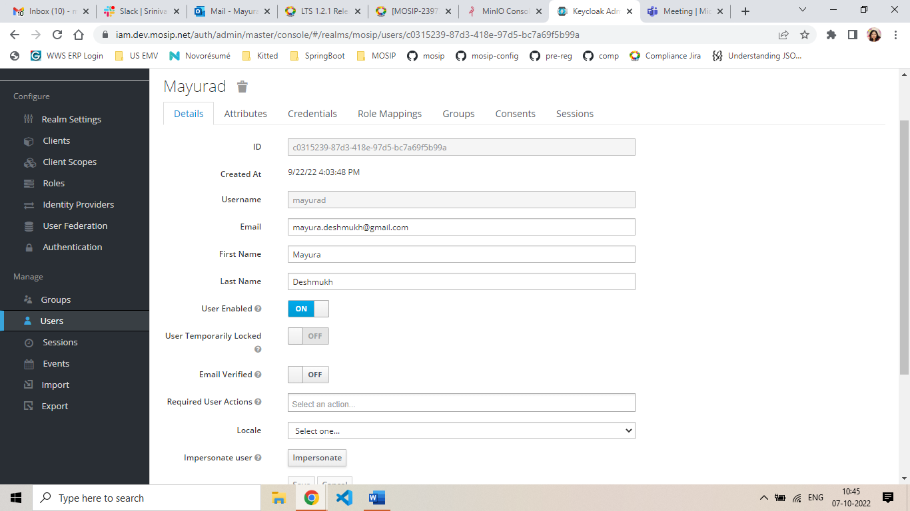
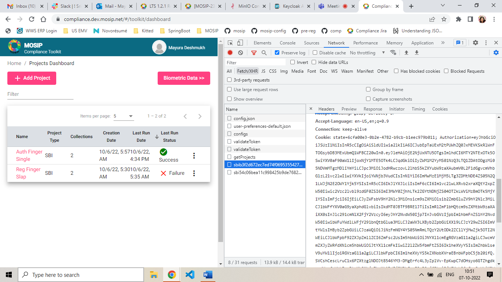
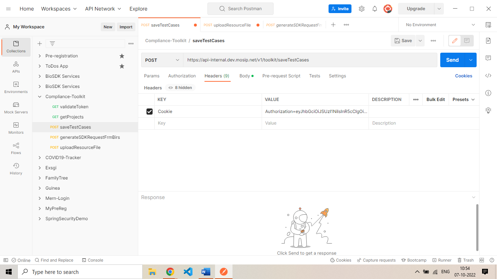

# Setting up Compliance Tool Kit (CTK)

## Pre-requisite

CTK should be deployed with the required dockers.

* compliance-toolkit-service: 0.0.9-B!
* compliance-toolkit-ui: 0.0.9-B1

Dependent Services

* artifactory-ref-impl: 1.2.0.1-B2
* kernel-auth-service: 1.2.0.1-B1
* kernel-keymanager-service: 1.2.0.1-B1
* partner-management-service: 1.2.0.1-B1
* kernel-auditmanager-service: 1.2.0.1-B1

_**Note**_: 
* Ensure that in the `kernel-default.properties`, the value of `mosip-toolkit-client` is set as `auth.server.admin.allowed.audience`. 
* If this was not set by default, then set it and restart `kernel-auth-service` and `compliance-toolkit-service`.

## Steps to setup mosip-compliance-toolkit

1\.	Clone mosip-compliance-toolkit
    `git clone https://github.com/mosip-compliance-toolkit.git`
    
2\. The project structure would be as shown below


  
3\. The resources folder would contain schemas, test data and test cases that need to be added to MinIO and DB.
  

   
## Steps to upload resources to MinIO
   
1\. Login to MinIO from the browser.
    
2\. Create a `compliance-toolkit` bucket.
    
3\. Create a new folder named `testdata` in the above bucket. Upload all test data zip files from resources to it.
    
4\. Create a new folder named `schemas` in the above bucket. Upload all **sbi** and **sdk** schemas, **testcase** schema from the resources folder to it.
    
5\. There is no need to upload `compliance_test_definitions_sbi.json` and `compliance_test_definitions_sdk.json`.
    
6\. Please restart the pods after adding new files in MinIO.
   
## Using Postman
   
1\. Using Keycloak, create a new user for the compliance toolkit.


  
2\. Make sure to add the email ID. Also, give the user `GLOBAL_ADMIN`.

3\. Login to the compliance toolkit in your environment with above the Keycloak user.

4\. Open the developer tools and copy the `Authorization` token from the headers section under the `Networks` tab.
         
 
  
5\. Add the Authorization token in postman, copy the token and place it in the headers section of the request (Cookie=Authentication:eyAjksa...) and send the request.
    
 
        
 ## Steps to upload test cases to the Database
        
1\.	Open postman and create a POST request.
        
2\.	URL endpoint `https://{base_URL}/v1/toolkit/saveTestCases`
        
3\.	Copy the Authorization token in the request header as mentioned in the `Using Postman` section.
        
4\.	Open the resources folder in the project.
        
5\.	`compliance_test_definitions_sbi.json` file has all the test cases in it.
        
6\.	Copy the test cases array from this file and prepare a request as shown below.
        
7\.	Request body for `saveTestCases` request 
        
```jsonc  
{
    "version": "1.0",
    "requesttime": "2022-10-29T06:06:51.174Z",
    "metadata": null,
    "request": {
        "testCases": [
<Paste the testcases here>
                     ]
               }
}
```
8\. Change the `requesttime` to the current day and send the request.

9\. The same should be done for `compliance_test_definitions_sdk.json`.
