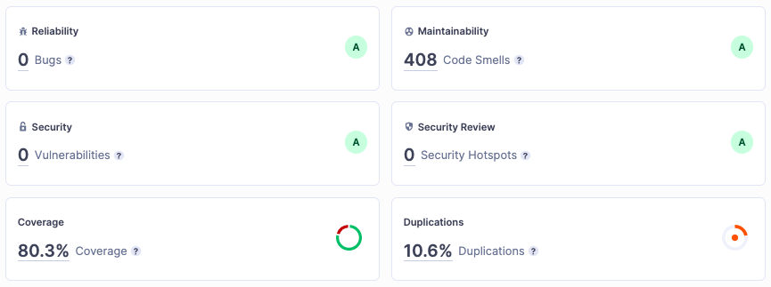

# Testing Scope

The scope of testing revolved around verifying the compliance of the product as per the specifications published by MOSIP using below the devices:

* Registration devices for iris, face and fingerprint
* Authentication devices for iris, face and fingerprint

The compliance tool kit was tested with the below biometric specifications:

1. SBI 
1. SDK
  1. Quality Check
  2. 1:N Match
  3. Extraction
  4. Conversion 

# Test Execution Statistics

## SBI Testing
The Secure Biometric Interface (SBI) is used to interface with biometric devices. The compliance tool kit was tested to ensure that the interface built by the device provider is following the specs and security rules defined in the SBI spec.

### For Authentication Devices using MOSIP's Mock SBI
The MOSIP’s Mock SBI has been tested for compliance with the specifications across 37 test cases. Test cases specific to quality and user interactions have been tested with real devices rather than mock.

|**Scenarios**| **Finger** | **Iris** | **Face** |
|-------------|------------|----------|----------|
| Total       | 14         | 13       | 10       |
| Passed      | 14         | 13       | 10       |
| Pending     | 0          | 0        | 0        |
| Failed      | 0          | 0        | 0        |
| **Test Rate (%)** | 100% | 100% | 100% |
| **Pass Rate (%)** | 100% | 100% | 100% |

### For Registration Devices using MOSIP's Mock SBI
The MOSIP’s Mock SBI has been tested for compliance with the specifications across 49 test cases. Test cases specific to quality and user interactions have been tested with real devices rather than mock.

|**Scenarios**| **Finger** | **Iris** | **Face** |
|-------------|------------|----------|----------|
| Total       | 22         | 14       | 13       |
| Passed      | 22         | 14       | 13       |
| Pending     | 0          | 0        | 0        |
| Failed      | 0          | 0        | 0        |
| **Test Rate (%)** | 100% | 100% | 100% |
| **Pass Rate (%)** | 100% | 100% | 100% |

### For Authentication Devices using MOSIP's real SBI
The MOSIP’s real SBI has been tested for compliance with the specification only for fingerprint devices. 

|**Scenarios**| **Finger** | **Iris** | **Face** |
|-------------|------------|----------|----------|
| Total       | 14         | 13       | 10       |
| Passed      | 9          | 0        | 0        |
| Pending     | 0          | 13       | 10       |
| Failed      | 5          | 0        | 0        |
| **Test Rate (%)** | 100% | 0% | 0% |
| **Pass Rate (%)** | 64%  | 0% | 0% |

### For Authentication Devices using MOSIP's real SBI (only finger)
The MOSIP’s real SBI has been tested for compliance with the specifications for iris, face and fingerprint devices. 

|**Scenarios**| **Finger** | **Iris** | **Face** |
|-------------|------------|----------|----------|
| Total       | 22         | 14       | 13       |
| Passed      | 22         | 14       | 13       |
| Pending     | 0          | 0        | 0        |
| Failed      | 0          | 0        | 0        |
| **Test Rate (%)** | 100% | 100% | 100% |
| **Pass Rate (%)** | 100% | 100% | 100% |

## SDK Testing
The SDK implementation has been tested to support quality check, 1:N match, extraction, and conversion of biometrics.

**Out of scope**: Segmentation testing

|**Scenarios**.  | **With Mock SDK** | **With Real SDK** |
|----------------|-------------------|-------------------|
| Total          | 76                | 76                |
| Passed         | 36                | 27                |
| Pending        | 9                 | 0                 |
| Failed         | 31                | 11                |
| Not Applicable | 0                 | 28                |
| **Test Rate (%)** | 88% | 50% |
| **Pass Rate (%)** | 47% | 36% |

# Sonar Report

