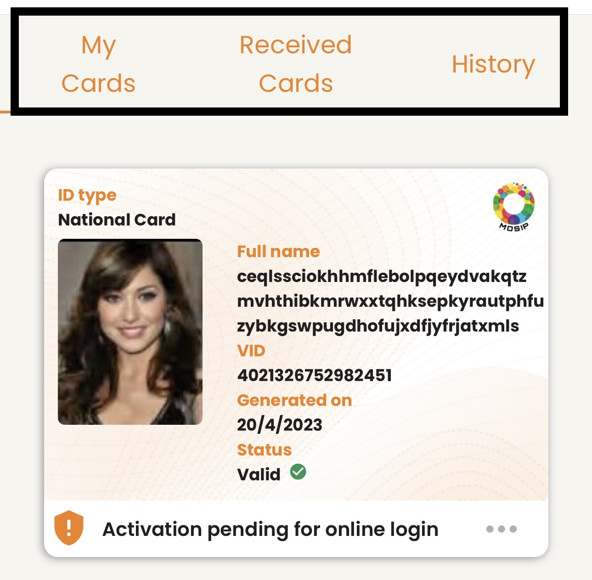
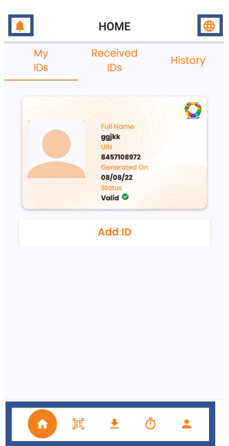
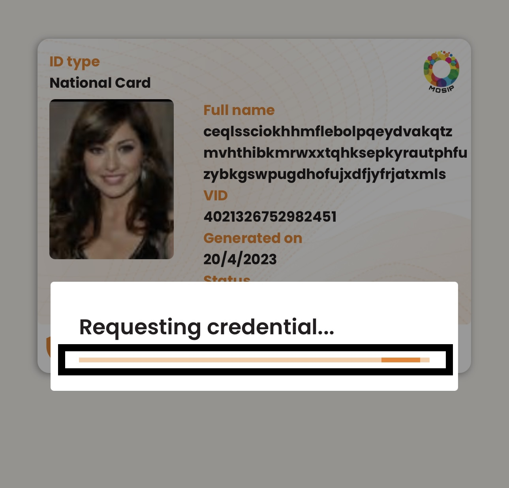
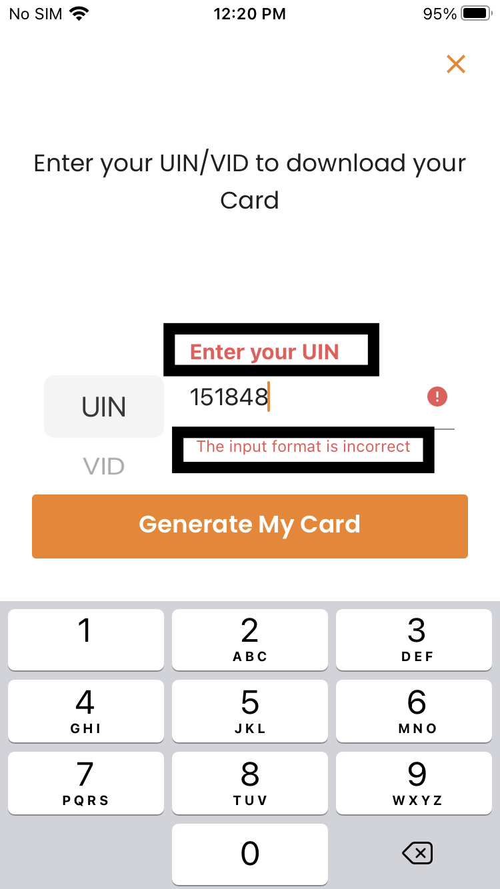
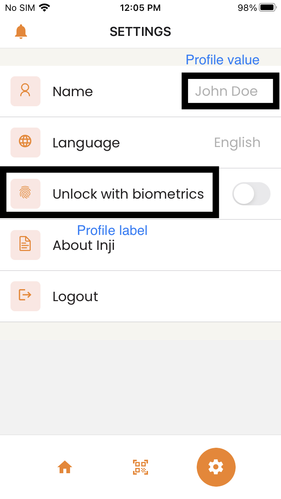

# UI customization

## CSS Themes

Currently, Inji supports two themes:

* orange
* purple

We can customize the application by adding a new file under `components/ui/themes` and import that file in `components/ui/styleUtils.ts` and assign that file to `Theme` variable in it.

```
Example:-
    components/ui/styleUtils.ts

    import { PurpleTheme } from './PurpleTheme';
    export const Theme = PurpleTheme;
```

### Logo and Background Images

To change the MOSIP logo:

```
MosipLogo = require(path of logo you want to use, in string format)

Example:-
MosipLogo = require('../../assets/mosip-logo.png')
```

To change the profile logo which is available as a demo while loading the vc details:

```
ProfileIcon = require(path of logo you want to use, in string format)

Example:-
ProfileIcon: require('../../assets/placeholder-photo.png')
```

To change the `CloseCard` details background:

```
CloseCard = require(path of the image you want to use, in string format)

-width: 363 pixels
-height: 236 pixels

Example:-
CloseCard: require('../../assets/ID-closed.png')
```

To change the `OpenCard` card details background:

```
OpenCard = require(path of the image you want to use, in string format)

-width: 363 pixels
-height: 623 pixels

Example:-
  OpenCard: require('../../assets/ID-open.png')
```

### Colours

To change the colour of `TabItemText`:



```
export const DefaultTheme = {
  Colors: {
    TabItemText: colors.Orange,
    ...
  }
}
```

To change the colour of the Details Label Text:


```
export const DefaultTheme = {
  Colors: {
      DetailsLabel: colors.Orange,
    ...
  }
}
```

To change the colour of Details Value Text:


```
export const DefaultTheme = {
  Colors: {
      Details: Colors.Black,
    ...
  }
}
```

To change the colour of `AddId`button text and background:


```
export const DefaultTheme = {
  Colors: {
     AddIdBtnBg: colors.Orange,
      AddIdBtnTxt: colors.Orange,
    ...
  }
}
```

To change the colour of Icons:



```
export const DefaultTheme = {
  Colors: {
      Icon: colors.Orange,
    ...
  }
}
```

To change the Background colour of icons:


```
export const DefaultTheme = {
  Colors: {
       IconBg: colors.Orange,
    ...
  }
}
```

To change the colour of the Loading Transition:




```
export const DefaultTheme = {
  Colors: {
       Loading: colors.Orange,
    ...
  }
}
```

To change the colour of the Error message:



```
export const DefaultTheme = {
  Colors: {
      errorMessage: Colors.Red,
    ...
  }
}
```

To change the colour of noUinText:


```
export const DefaultTheme = {
  Colors: {
       noUinText : colors.Orange,
    ...
  }
}
```

To change the colours of the profile Label and Profile values:



```
export const DefaultTheme = {
  Colors: {
     profileLabel: Colors.Black,
     profileValue: Colors.Grey,
    ...
  }
}
```

To change the colour of profileVersion:


```
export const DefaultTheme = {
  Colors: {
      profileVersion: Colors.Grey,
    ...
  }
}
```
