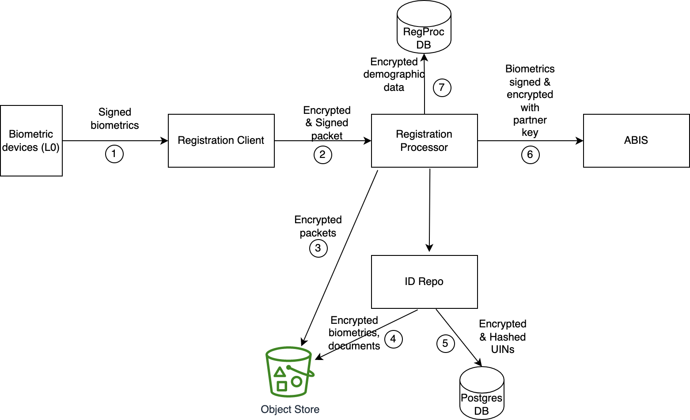
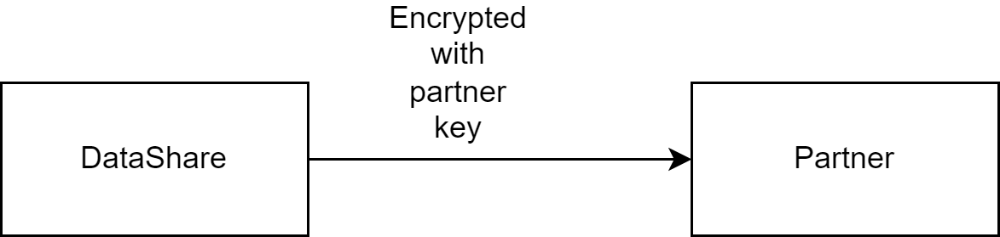
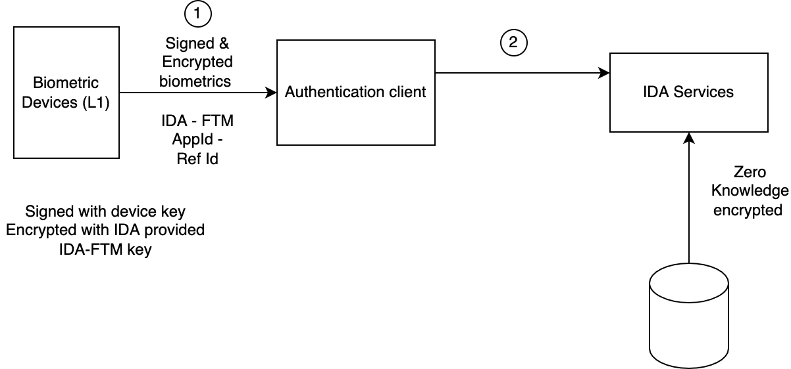

# Data Protection

Security of user data is given highest priority in MOSIP.  Data is protected in flight and rest using strong cryptographic techniques.  All operations on decrypted data are done in-memory. 

Various flows with encryption are illustrated below.  Refer [Keys](keys.md) for all references of the type 'Kx' and 'KPx'.

## Registration data flow 

1. Biometrics are signed by private key of device provider (PK2). The signature is verified by the registration client. 
2. Registration client signs packet using TPM key of the machine (K10), and encrypts packet using MOSIP public key specific to (registration center, machine id) combination (K11). 
3. Registration processor stores packets created in (2) "as is" in Object Store. 
4. ID Repo encrypts biometrics, demographics and documents and stores them in Object Store. (K7.1,K7.2,K7.3)
5. The UINs are hashed, encrypted and stored in `uin` table of `mosip_idrepo` DB. (K7.4)
6. Biometrics are shared encrypted with ABIS partner's key (PK1). 
7. Registration processor stores encrypted demographic data in `mosip_regprc` db. (K11)

## Datashare

Data shared with all partners like ABIS, Print, Adjudication, IDA etc. is encrypted using partners' public key.  Note that IDA is also a partner, however, a special partner in the sense that data is additionally zero-knowledge encrypted before sending to IDA (see section below).

## Zero knowledge encryption
ID Authentication module (IDA) is an independent module and may be hosted by several providers. IDA hosts all the biometric templates and demographic data. A unique additional protection is provided here to make sure that mass decryption of user data is very difficult to achieve.  The data can only be decrypted if user's UIN is provided.  Here is the encryption scheme: 

### Encryption and share by Credential Service
1. Generate master symmetric encryption key K9.
1. Generate 10,000 symmetric keys' pool (ZKn). Encrypt each ZKn with K9 and store in DB. (K12)
1. Randomly select one key from ZKn, decrypt using K9.
1. Derive new key ZKn' = ZKn + UIN/VID/APPID.
1. Encrypt biometric templates and demographics.
    *  BIO = encrypt(bio/demo with ZKn').
1. Encrypt ZKn (this is done to share ZKn with IDA).
    * ZKn-IDA = encrypt(ZKn with K22)
1. Share the following with IDA:
    1. ZKn-IDA
    1. BIO
    1. Random index (0 - 9999) 
    1. SHA-256 hash of UIN/VID/APPID
1. Share data in step 7 via standard [Datashare encryption](#datashare) (which encrypts entire data with PK8). 

### Decryption by IDA
1. Generate master symmetric encryption key K18.
1. Decrypt data in Step 8 above using PK8.
1. Decrypt ZKn-IDA with K22 to get ZKn.
1. Encrypt ZKn with K18 and store at random index.
1. BIO data is stored as is.

## ID authentication flow

1. L1 devices contain FTM chip to encrypt biometrics at source and send to Authentication client.  The FTM chip contains IDA provided FTM key. The data is also signed by device key.
2. Authentication client further encrypts the auth request with IDA-PARTNER public key.
3. IDA decrypts zero knowledge data as given in [Step 4](#encryption-and-share-by-credential-service) and the performs a demographic and/or biometric authentication.
4. Match result is returned to Auth client.  In case of KYC, the KYC attributes are encrypted with Partner's public key (as in Datashare).  

