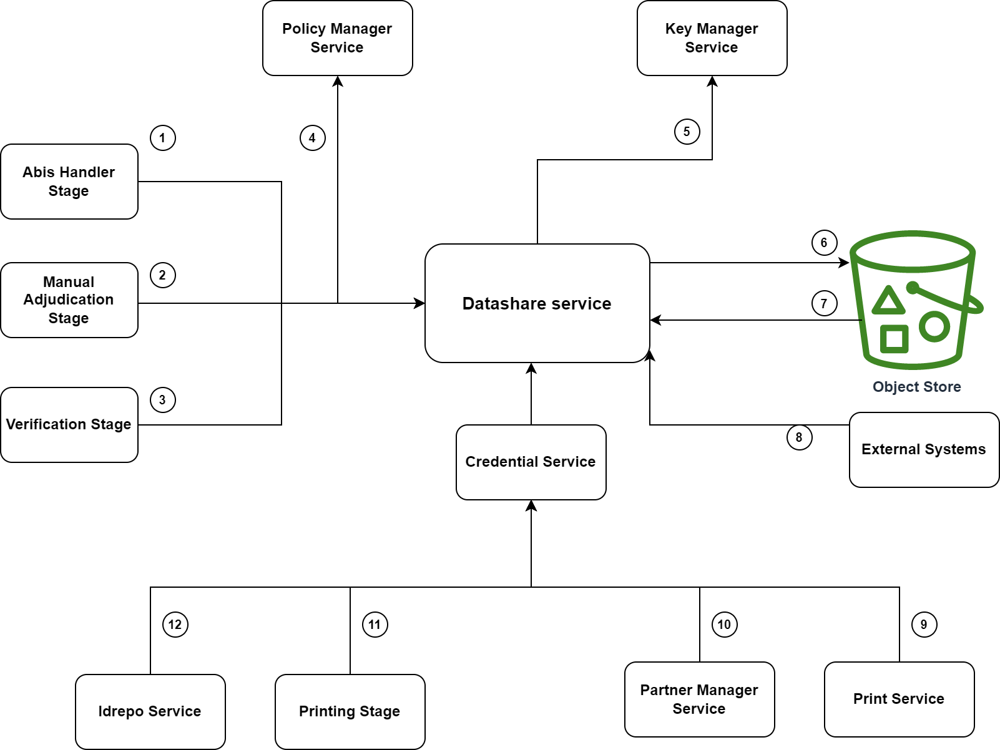

# Datashare    

## Overview
The Datashare service is used to share data with other entrusted services and partners. The mechanism is share is the following: 
1. Retrieves and stores data to be shared in [Object Store](storage.md#object-store) and returns a Datashare URL.
1. Fetches data from Object Store when the Datashare URL is called.

Sharing of data is controlled by [Datashare policy](partner-policies.md#datashare-policy).

Data is encrypted before sharing with partners. Learn more about [datashare encryption](data-protection.md#datashare). 

The relationship of Datashare Service with other services is explained here. _NOTE: The numbers do not signify sequence of operations or control flow. Arrows indicate the data flow._

1. Abis Handler Stage creates datashare for abis.
2. Manual Adjudication Stage creates datashare for adjudication.
3. Verification Stage creates datashare for verification.
4. Datashare Service calls [Policy Manager Service](partner-management-services.md#policy-management-service) to get policy for creating share.
5. Datashare Service calls Keymanager Service to encrypt data as per policy.
6. Stores datashare inside [object store](storage.md#object-store).
7. Retrieves datashare from object store when datashare url is called.
8. External systems like [Abis](abis.md), Print System, Adjudication system etc. calls Datashare Service to get the datashare.
9. Print Service creates uin pdf and uploads to datashare through Credential.
10. [Partner Manager Service](partner-management-services.md) creates credential for CA certificates to be used by [ID Authentication](id-authentication.md).
11. Printing Stage creates credential for Printing systems and sends the data through datashare.
12. Idrepo Service sends data to ID Authentication system through Credential.

