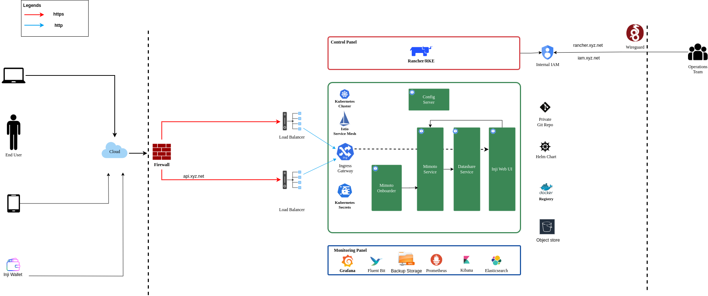

# Inji Deployment Guide


## How is this guide organized?

This Installation Guide is structured as below:

1. System Requirements
2. Deploy Prerequisites
3. Deploy Inji Web

### Deployment Architecture \[TODO]

<figure><figcaption><p>Inji Web Deployment Architecture</p></figcaption></figure>

## Prerequisites

### Tools and utilities

* [Ansible](https://docs.ansible.com/ansible/latest/installation_guide/intro_installation.html).
* [Rancher](inji-wallet/inji-web/rancher).
* Command line utilities:
  * kubectl
  * helm
  * rke (rke version: v1.3.10)
  * istioctl (istioctl version: v1.15.0)
*   Helm repos:

    ```sh
    helm repo add bitnami https://charts.bitnami.com/bitnami
    helm repo add mosip https://mosip.github.io/mosip-helm

    ```

## System Requirements

Ensure all required hardware and software dependencies are prepared before proceeding with the installation.

* Hardware, Network and Certificate requirements

### Hardware, network and certificate requirements

### Hardware Requirements

* Virtual Machines (VMs) can use any operating system as per convenience.
* For this installation guide, Ubuntu OS is referenced throughout.

| Sl no. | Purpose                                                                 | vCPU's | RAM   | Storage (HDD) | no. of VM's | HA                                   |
|--------|-------------------------------------------------------------------------|--------|-------|---------------|-------------|---------------------------------------|
| 1.     | Wireguard Bastion Host                                                 | 2      | 4 GB  | 8 GB          | 1           | (ensure to setup active-passive)     |
| 2.     | Observation Cluster nodes                                              | 2      | 8 GB  | 32 GB         | 2           | 2                                     |
| 3.     | Observation Nginx server (use Loadbalancer if required)                | 2      | 4 GB  | 16 GB         | 1           | Nginx+                                |
| 4.     | Inji Stack Cluster nodes along with Nginx server, Use Loadbalancer if required | 8      | 32 GB  | 64 GB         | 3           | Allocate etcd, control plane and worker accordingly |

### Network Requirements

* All the VM's should be able to communicate with each other.
* Need stable Intra network connectivity between these VM's.
* All the VM's should have stable internet connectivity for docker image download (in case of local setup ensure to have a locally accessible docker registry).
* Server Interface requirement as mentioned in below table:

| Sl no. | Purpose                  | Network Interfaces                                                                                                                                                                                                 |
|--------|--------------------------|--------------------------------------------------------------------------------------------------------------------------------------------------------------------------------------------------------------------|
| 1.     | Wireguard Bastion Host   | *One Private interface*: that is on the same network as all the rest of nodes (e.g.: inside local NAT Network).<br><br>*One public interface*: Either has a direct public IP, or a firewall NAT (global address) rule that forwards traffic on 51820/udp port to this interface IP. |
| 2.     | K8 Cluster nodes         | One internal interface: with internet access and that is on the same network as all the rest of nodes (e.g.: inside local NAT Network).                                                                          |
| 3.     | Observation Nginx server | One internal interface: with internet access and that is on the same network as all the rest of nodes (e.g.: inside local NAT Network).                                                                          |
| 4.     | Inji Nginx server        | *One internal interface*: that is on the same network as all the rest of nodes (e.g.: inside local NAT Network).<br><br>*One public interface*: Either has a direct public IP, or a firewall NAT (global address) rule that forwards traffic on 443/tcp port to this interface IP. |

### DNS requirements \[TODO]

| Sl No. | Domain Name                  | Mapping Details                                           | Purpose                                                                                     |
|--------|------------------------------|----------------------------------------------------------|---------------------------------------------------------------------------------------------|
| 1.     | rancher.xyz.net              | Private IP of Nginx server or load balancer for Observation cluster | Rancher dashboard to monitor and manage the Kubernetes cluster.                            |
| 2.     | keycloak.xyz.net             | Private IP of Nginx server for Observation cluster       | Administrative IAM tool (Keycloak). This is for the Kubernetes administration.             |
| 3.     | sandbox.xyz.net              | Private IP of Nginx server for MOSIP cluster             | Index page for links to different dashboards of MOSIP environment. (Not for production/UAT use) |
| 4.     | api-internal.sandbox.xyz.net | Private IP of Nginx server for MOSIP cluster             | Internal APIs are exposed through this domain. Accessible privately over Wireguard channel. |
| 5.     | api.sandbox.xyz.net          | Public IP of Nginx server for MOSIP cluster              | All publicly usable APIs are exposed using this domain.                                     |
| 6.     | iam.sandbox.xyz.net          | Private IP of Nginx server for MOSIP cluster             | MOSIP uses an OpenID Connect server (default: Keycloak) to manage access across services. Accessible over Wireguard. |
| 7.     | postgres.sandbox.xyz.net     | Private IP of Nginx server for MOSIP cluster             | Points to the Postgres server. Connect via port forwarding over Wireguard.                 |
| 8.     | onboarder.sandbox.xyz.net    | Private IP of Nginx server for MOSIP cluster             | Accessing reports of MOSIP partner onboarding over Wireguard.                              |
| 9.     | injiweb.sandbox.xyz.net      | Public IP of Nginx server for MOSIP cluster              | Accessing Inji Web portal publicly.                                                        |
| 10.    | injicertify.sandbox.xyz.net  | Public IP of Nginx server for MOSIP cluster              | Accessing Inji Certify portal publicly.                                                    |
| 11.    | injiverify.sandbox.xyz.net   | Public IP of Nginx server for MOSIP cluster              | Accessing Inji Verify portal publicly.                                                     |

### Certificate requirements

As only secured https connections are allowed via nginx server will need below mentioned valid ssl certificates:

1. Wildcard SSL Certificate for the Observation Cluster:
   * A valid wildcard SSL certificate for the domain used to access the Observation cluster.
   * This certificate must be stored inside the Nginx server VM for the Observation cluster.
   * For example, a domain like \*.org.net could serve as the corresponding example.
2. Wildcard SSL Certificate for the Inji K8s Cluster:
   * A valid wildcard SSL certificate for the domain used to access the inji Kubernetes cluster.
   * This certificate must be stored inside the Nginx server VM for the inji cluster.
   * For example, a domain like \*.sandbox.xyz.net could serve as the corresponding example.

## Tools to be installed on Personal Computers (Tools for Secure Access)

Follow the steps mentioned [here](https://github.com/mosip/k8s-infra/tree/v1.2.0.2/mosip/on-prem#prerequisites) to install the required tools on your personal computer to create and manage the k8 cluster using RKE1.

### Wireguard

Secure access solution that establishes private channels to Observation and inji clusters.

_If you already have a Wireguard bastion host then you may skip this step._

* A Wireguard bastion host (Wireguard server) provides a secure private channel to access the Observation and inji cluster.
* The host restricts public access and enables access to only those clients who have their public key listed in the Wireguard server.
* Wireguard listens on UDP port51820.

#### Setup Wireguard Bastion server

1. Create a Wireguard server VM with above mentioned Hardware and Network requirements.
2. Open ports and Install docker on Wireguard VM.

* create a copy of `hosts.ini.sample` as `hosts.ini` and update the required details for wireguard VM `cp hosts.ini.sample hosts.ini`
* execute ports.yml to enable ports on VM level using ufw: `ansible-playbook -i hosts.ini ports.yaml`


**Note**:

* Permission of the pem files to access nodes should have 400 permission. `sudo chmod 400 ~/.ssh/privkey.pem`
* These ports are only needed to be opened for sharing packets over UDP.
* Take necessary measure on firewall level so that the Wireguard server can be reachable on 51820/udp publically.
* Make sure to clone the [k8s-infra](https://github.com/mosip/k8s-infra/tree/v1.2.0.2/mosip/on-prem#prerequisites) github repo for required scripts in above steps and perform the steps from linked directory.
* If you already have Wireguard server for the VPC used you can skip the setup Wireguard Bastion server section.
* execute docker.yml to install docker and add user to docker group:

```yaml
    ansible-playbook -i hosts.ini docker.yaml
```


4.  Setup Wireguard server

    * SSH to wireguard VM
    * Create directory for storing wireguard config files.

    ```sh
       mkdir -p wireguard/config
    ```

    * Install and start wireguard server using docker as given below:

    ```sh
    sudo docker run -d \
    --name=wireguard \
    --cap-add=NET_ADMIN \
    --cap-add=SYS_MODULE \
    -e PUID=1000 \
    -e PGID=1000 \
    -e TZ=Asia/Calcutta \
    -e PEERS=30 \
    -p 51820:51820/udp \
    -v /home/ubuntu/wireguard/config:/config \
    -v /lib/modules:/lib/modules \
    --sysctl="net.ipv4.conf.all.src_valid_mark=1" \
    --restart unless-stopped \
    ghcr.io/linuxserver/wireguard
    ```


**Note**:

* Increase the no. of peers above in case more than 30 wireguard client confs (-e PEERS=30) are needed.
* Change the directory to be mounted to wireguard docker as per need. All your wireguard confs will be generated in the mounted directory (`-v /home/ubuntu/wireguard/config:/config`).


#### Setup Wireguard Client on your PC and follow the below steps

1. Install [Wireguard client](https://www.wireguard.com/install/) on your PC.
2. Assign `wireguard.conf`:

* SSH to the wireguard server VM.
* `cd /home/ubuntu/wireguard/config`
* Assign one of the PR for yourself and use the same from the PC to connect to the server.
*   Create `assigned.txt` file to assign the keep track of peer files allocated and update everytime some peer is allocated to someone.

    ```sh
    peer1 :   peername
    peer2 :   xyz
    ```
* Use `ls` cmd to see the list of peers.
* Get inside your selected peer directory, and add mentioned changes in `peer.conf`:
  * `cd peer1`
  * `nano peer1.conf`
    * Delete the DNS IP.
    * Update the allowed IP's to subnets CIDR ip . e.g. 10.10.20.0/23
* Share the updated `peer.conf` with respective peer to connect to wireguard server from Personel PC.
* Add `peer.conf` in your PC’s `/etc/wireguard` directory as `wg0.conf`.

3. Start the wireguard client and check the status:

```sh
sudo systemctl start wg-quick@wg0
sudo systemctl status wg-quick@wg0
```

4. Once connected to wireguard, you should be now able to login using private IP’s.

## Observation cluster setup and configuration

The observation cluster is a Kubernetes cluster used for monitoring and managing the overall infrastructure. It includes tools like Rancher for cluster management, Keycloak for IAM, and other monitoring and logging tools. Setting it up ensures that the infrastructure is properly monitored, managed, and secured.

### Observation K8s Cluster setup:

1. Install all the required tools mentioned in pre-requisites for the PC.

* [kubectl](https://kubernetes.io/docs/tasks/tools/#kubectl).
* [helm](https://helm.sh/docs/intro/install/).
* [Ansible](https://docs.ansible.com/ansible/latest/installation_guide/intro_installation.html).
* rke (version 1.3.10)
* istioctl (version v1.15.0)

2. Setup Observation Cluster node VM’s as per the hardware and network requirements as mentioned above.
3. Setup passwordless SSH into the cluster nodes via pem keys. (Ignore if VM’s are accessible via pem’s).
   * Generate keys on your PC `ssh-keygen -t rsa`
   * Copy the keys to remote observation node VM’s `ssh-copy-id <remote-user>@<remote-ip>`
   * SSH into the node to check password-less SSH `ssh -i ~/.ssh/<your private key> <remote-user>@<remote-ip>`


**Note**:

* Make sure the permission for `privkey.pem` for ssh is set to 400.
* Clone [`k8s-infra`](https://github.com/mosip/k8s-infra/tree/v1.2.0.2/rancher/on-prem) and move to required direcyory as per hyperlink.


4. Setup Observation cluster following [steps](https://docs.mosip.io/1.2.0/deploymentnew/v3-installation/on-prem-installation-guidelines#observation-k8s-cluster-setup-and-configuration).
5. Once cluster setup is completed, setup k8's cluster ingress and storage class following [steps](https://docs.mosip.io/1.2.0/deploymentnew/v3-installation/on-prem-installation-guidelines#observation-k8s-cluster-ingress-and-storage-class-setup).
6. Once Observation K8 cluster is created and configured setup nginx server for same using [steps](https://docs.mosip.io/1.2.0/deploymentnew/v3-installation/on-prem-installation-guidelines#setting-up-nginx-server-for-observation-k8s-cluster).
7. Once Nginx server for observation plane is done, continue with [installation of required apps:](https://docs.mosip.io/1.2.0/deploymentnew/v3-installation/on-prem-installation-guidelines#observation-k8s-cluster-apps-installation).

* Install Rancher UI.

## Deploy Inji Web

### Inji K8 Cluster setup

#### K8 Cluster setup

1. [k8s-infra](https://github.com/mosip/k8s-infra/tree/v1.2.0.1) : contains the scripts to install and configure Kubernetes cluster with required monitoring, logging and alerting tools.
2. Clone the Kubernetes Infrastructure Repository:

make sure to use the released tag. Specifically v1.2.0.2.

```sh
git clone -b v1.2.0.2 https://github.com/mosip/k8s-infra.git
cd k8s-infra/mosip/onprem
```

3. Create copy of hosts.ini.sample as hosts.ini. Update the IP addresses.
   1. Open the ports for the nodes: Execute [`ports.yml`](https://github.com/mosip/k8s-infra/tree/v1.2.0.2/mosip/on-prem#ports) to open all the required ports.
   2. Docker installation: Install [Docker](https://github.com/mosip/k8s-infra/tree/v1.2.0.2/mosip/on-prem#docker) on all the required VM's.
4. Create [RKE1 K8](https://github.com/mosip/k8s-infra/tree/v1.2.0.2/mosip/on-prem#rke-cluster-setup) cluster for Inji services hosting.
5. Apply global config map: https://github.com/mosip/k8s-infra/blob/v1.2.0.2/mosip/global\_configmap.yaml.sample
6. [Import](https://github.com/mosip/k8s-infra/tree/v1.2.0.2/mosip/on-prem#register-the-cluster-with-rancher) newly created K8 cluster to Rancher UI.

#### Nginx for Inji K8 Cluster

1. Setup [Nginx](https://github.com/mosip/k8s-infra/tree/v1.2.0.2/mosip/on-prem/nginx) for exposing services from newly created Inji K8 cluster.

#### K8 Cluster Configuration

* Setup [NFS](https://github.com/mosip/k8s-infra/tree/v1.2.0.2/nfs#nfs-setup) for persistence in k8 cluster as well as standalone VM (Nginx VM).
* Setup [Monitoring](https://github.com/mosip/k8s-infra/tree/v1.2.0.2/monitoring#cluster-monitoring) for K8 cluster Monitoring.
* Setup [Logging](https://github.com/mosip/k8s-infra/tree/v1.2.0.2/logging#logging) for K8 cluster.
* Setup [Istio](https://github.com/mosip/k8s-infra/tree/v1.2.0.2/mosip/on-prem/istio#istio) and kiali.

## Deploying Inji

###Pre-requisites
* `inji-stack-config` configmap: For inji K8's env, `inji-stack-config` configmap in `default` namespace contains Domain related information. Follow below steps to add domain details for `inji-stack-config` configmap.
* Update the domain names in `inji-stack-cm.yaml` correctly for your environment.
    ```
    kubectl apply -f - <<EOF
    ## The data here is of generic interest to modules in different namespaces hence this is marked as inji-stack-config.
    ## Replace your domain names here.
    ## api-host:  External public access. (Typically required only in production rollouts).
    ## api-internal-host: Internal secure access over Wireguard.
    ## By default all domains and subdomains listed below point to api-internal-host. Modify this default behavior ONLY in production rollout as follows:
    apiVersion: v1
    kind: ConfigMap
    metadata:
      name: inji-stack-config
      namespace: default
    data:
      inji-version: develop
      installation-domain: sandbox.xyz.net
      api-host: api.sandbox.xyz.net
      iam-external-host: iam.sandbox.xyz.net
      api-internal-host: api-internal.sandbox.xyz.net
      injiweb-host: injiweb.sandbox.xyz.net
      injiverify-host: injiverify.sandbox.xyz.net
      injicertify-host: injicertify.sandbox.xyz.net
      inji-postgres-host: postgres.sandbox.xyz.net
      esignet-mock-host: esignet-mock.sandbox.xyz.net
      mosipid-identity-esignet-host: esignet-mosipid.sandbox.xyz.net
      esignet-insurance-host: esignet-insurance.sandbox.xyz.net
      minio-host: minio.sandbox.mosip.net
    EOF
    ```

### Postgres installation

* [Postgres installation](https://github.com/mosip/mosip-infra/tree/v1.2.0.2/deployment/v3/external/postgres)

### Object store installation
* [Object store installation](https://github.com/mosip/mosip-infra/tree/v1.2.0.2/deployment/v3/external/object-store)


### conf-secret installation

* [conf-secret installation](https://github.com/mosip/mosip-infra/tree/v1.2.0.2/deployment/v3/mosip/conf-secrets)

### config-server installation

* Create a `values.yaml` file that will contain the configuration for the chart and send it to your config-server installation.
  ```
   touch values.yaml
  ```
* Review `values.yaml` and make sure git repository parameters are as per your installation and enable only the required environment variables.

    ````
    gitRepo:
      uri: https://github.com/mosip/inji-config
      version: release-0.8.x
      ## Folders within the base repo where properties may be found.
      searchFolders: ""
      private: false
      ## User name of user who has access to the private repo. Ignore for public repo
      username: ""
      token: ""
    
    envVariables:
      - name: SPRING_CLOUD_CONFIG_SERVER_OVERRIDES_MOSIP_API_PUBLIC_HOST
        valueFrom:
          configMapKeyRef:
            name: inji-stack-config
            key: api-host
        enabled: true
    
      - name: SPRING_CLOUD_CONFIG_SERVER_OVERRIDES_MOSIP_API_INTERNAL_HOST
        valueFrom:
          configMapKeyRef:
            name: inji-stack-config
            key: api-internal-host
        enabled: true
    
      - name: SPRING_CLOUD_CONFIG_SERVER_OVERRIDES_MOSIP_PARTNER_CRYPTO_P12_PASSWORD
        valueFrom:
          secretKeyRef:
            key: mosip-partner-crypto-p12-password
            name: conf-secrets-various
        enabled: false
    
      - name: SPRING_CLOUD_CONFIG_SERVER_OVERRIDES_MPARTNER_DEFAULT_MOBILE_SECRET
        valueFrom:
          secretKeyRef:
            key: mpartner_default_mobile_secret
            name: keycloak-client-secrets
        enabled: false
    
      - name: SPRING_CLOUD_CONFIG_SERVER_OVERRIDES_KEYCLOAK_INTERNAL_URL
        valueFrom:
          configMapKeyRef:
            name: keycloak-host
            key: keycloak-internal-url
        enabled: false
    
      - name: SPRING_CLOUD_CONFIG_SERVER_OVERRIDES_KEYCLOAK_EXTERNAL_URL
        valueFrom:
          configMapKeyRef:
            name: keycloak-host
            key: keycloak-external-url
        enabled: false
    
      - name: SPRING_CLOUD_CONFIG_SERVER_OVERRIDES_KEYCLOAK_INTERNAL_HOST
        valueFrom:
          configMapKeyRef:
            name: keycloak-host
            key: keycloak-internal-host
        enabled: false
    
      - name: SPRING_CLOUD_CONFIG_SERVER_OVERRIDES_KEYCLOAK_EXTERNAL_HOST
        valueFrom:
          configMapKeyRef:
            name: keycloak-host
            key: keycloak-external-host
        enabled: false
    
      - name: SPRING_CLOUD_CONFIG_SERVER_OVERRIDES_DB_DBUSER_PASSWORD
        valueFrom:
          secretKeyRef:
            name: db-common-secrets
            key: db-dbuser-password
        enabled: false
    
      - name: SPRING_CLOUD_CONFIG_SERVER_OVERRIDES_S3_ACCESSKEY
        valueFrom:
          configMapKeyRef:
            name: s3
            key: s3-user-key
        enabled: false
    
      - name: SPRING_CLOUD_CONFIG_SERVER_OVERRIDES_S3_REGION
        valueFrom:
          configMapKeyRef:
            name: s3
            key: s3-region
        enabled: false
    
      - name: SPRING_CLOUD_CONFIG_SERVER_OVERRIDES_S3_SECRETKEY
        valueFrom:
          secretKeyRef:
            name: s3
            key: s3-user-secret
        enabled: false
    
      - name: SPRING_CLOUD_CONFIG_SERVER_OVERRIDES_MOSIP_ESIGNET_HOST
        valueFrom:
          configMapKeyRef:
            key: esignet-host
            name: inji-stack-config
        enabled: false
        
      - name: SPRING_CLOUD_CONFIG_SERVER_OVERRIDES_MOSIP_ESIGNET_MOCK_HOST
        valueFrom:
          configMapKeyRef:
            key: esignet-mock-host
            name: inji-stack-config
        enabled: true
    
      - name: SPRING_CLOUD_CONFIG_SERVER_OVERRIDES_MOSIPID_IDENTITY_ESIGNET_HOST
        valueFrom:
          configMapKeyRef:
            key: mosipid-identity-esignet-host
            name: inji-stack-config
        enabled: false
    
      - name: SPRING_CLOUD_CONFIG_SERVER_OVERRIDES_MOSIP_ESIGNET_INSURANCE_HOST
        valueFrom:
          configMapKeyRef:
            key: esignet-insurance-host
            name: inji-stack-config
        enabled: false  
    
      - name: SPRING_CLOUD_CONFIG_SERVER_OVERRIDES_MOSIP_INJI_DATASHARE_HOST
        valueFrom:
          configMapKeyRef:
            key: inji-datashare-host
            name: inji-stack-config
        enabled: false
    
      - name: SPRING_CLOUD_CONFIG_SERVER_OVERRIDES_MOSIP_INJIWEB_HOST
        valueFrom:
          configMapKeyRef:
            key: injiweb-host
            name: inji-stack-config
        enabled: true
    
      - name: SPRING_CLOUD_CONFIG_SERVER_OVERRIDES_MOSIP_INJIVERIFY_HOST
        valueFrom:
          configMapKeyRef:
            key: injiverify-host
            name: inji-stack-config
        enabled: true
    
      - name: SPRING_CLOUD_CONFIG_SERVER_OVERRIDES_MOSIP_INJICERTIFY_HOST
        valueFrom:
          configMapKeyRef:
            key: injicertify-host
            name: inji-stack-config
        enabled: true
    
    ````

* Create a file named configserver.sh:
  ```
  touch confiserver.sh
  ```
* Open the file and paste the following content into it in the same directory where values.yaml is created.
    ````
    #!/bin/bash
    # Installs config-server
    ## Usage: ./install.sh [kubeconfig]
    
    if [ $# -ge 1 ] ; then
    export KUBECONFIG=$1
    fi
    
    NS=config-server
    CHART_VERSION=12.0.1
    
    read -p "Is conf-secrets module installed?(Y/n) " yn
    if [ $yn = "Y" ]; then read -p "Is values.yaml for config-server chart set correctly as part of Pre-requisites?(Y/n) " yn; fi
    if [ $yn = "Y" ]
    then
    echo Create $NS namespace
    kubectl create ns $NS
    
        # set commands for error handling.
        set -e
        set -o errexit   ## set -e : exit the script if any statement returns a non-true return value
        set -o nounset   ## set -u : exit the script if you try to use an uninitialised variable
        set -o errtrace  # trace ERR through 'time command' and other functions
        set -o pipefail  # trace ERR through pipes
    
        echo Istio label
        kubectl label ns $NS istio-injection=enabled --overwrite
        helm repo update
    
        UTIL_URL=https://raw.githubusercontent.com/mosip/mosip-infra/master/deployment/v3/utils/copy_cm_func.sh
        COPY_UTIL=./copy_cm_func.sh
        DST_NS=config-server # DST_NS: Destination namespace
        wget -q $UTIL_URL -O copy_cm_func.sh && chmod +x copy_cm_func.sh
        echo Copy configmaps and secrets
        $COPY_UTIL configmap inji-stack-config default $NS
        if kubectl -n conf-secrets get secret conf-secrets-various >/dev/null 2>&1; then
            $COPY_UTIL secret conf-secrets-various conf-secrets $NS
        else
            echo "Skipping copy, conf-secrets-various secret not found"
        fi
        if kubectl -n s3 get configmap s3 >/dev/null 2>&1 && kubectl -n s3 get secret s3 >/dev/null 2>&1; then
            $COPY_UTIL configmap s3 s3 $NS
            $COPY_UTIL secret s3 s3 $NS
        else
            echo "Skipping copy, s3 config or secret not found"
        fi
    
        echo Installing config-server
        helm -n $NS install config-server mosip/config-server -f values.yaml --wait --version $CHART_VERSION
        echo Installed Config-server.
    else
    echo Exiting the MOSIP installation. Please meet the pre-requisites and than start again.
    kill -9 `ps --pid $$ -oppid=`; exit
    fi
    ````

* Run the Script
  ```
  chmod +x confiserver.sh
  ./confiserver.sh
  ```

### Artifactory installation

* [artifactory installation](https://github.com/mosip/artifactory-ref-impl/tree/v0.10.0-INJI/deploy)
<!-- 
  * **Note**: When installing Datashare and Mimoto, ensure that the active\_profile\_env parameter in the config-map of the config-server-share is correctly set. Use the following environment profiles based on the respective services: default,inji-default, standalone.

### datashare installation

* datashare installation: https://github.com/mosip/mosip-infra/tree/v1.2.0.2/deployment/v3/mosip/datashare

-->

### mimoto installation


* mimoto installation: https://github.com/mosip/mimoto/tree/develop/deploy

### Inji web and datashare installation

* [Inji web and datashare installation](https://github.com/mosip/inji-web/tree/v0.10.0/helm/inji-web)

* **Note**: After installing inji web and datashare, ensure that the active_profile_env parameter in the config-map of the config-server-share is correctly set to: default,inji-default,standalone.
