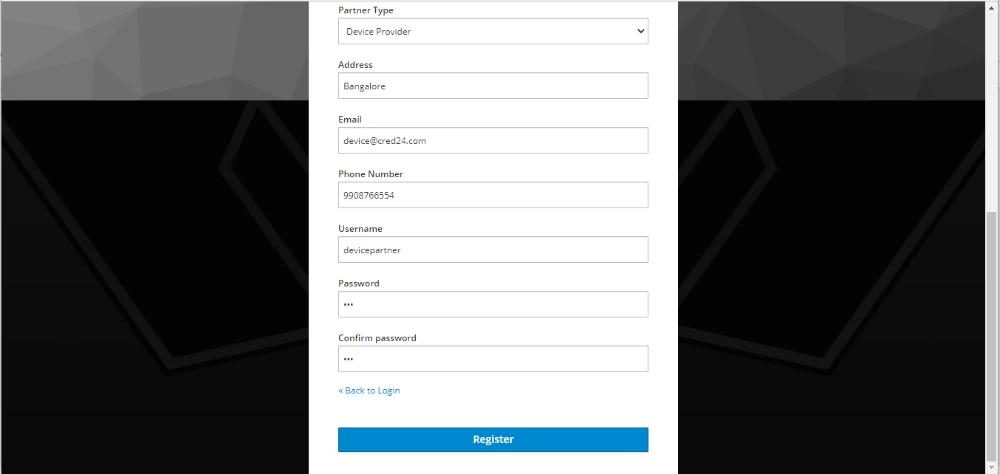

# Device Provider

## Overview
This guide enables the Device provider partner to use the partner portal effectively. Below is the workflow:

* Partner self-registers through the portal.
* Partner admin uploads CA certificate.
* Partner admin/ Partner uploads the partner certificate.
* Partner admin/ Partner creates device details.
* Partner admin approves/rejects device details.
* Partner admin/ Partner creates SBI details.
* Partner admin approves/rejects SBI details.
* Partner admin/ Partner maps devices and SBI.

### Self-registration

* The Device Provider partner can register themselves on MOSIP PMS portal by clicking **Register** on the landing page.
* They need to fill up a form with the details below:
    * First and Last name
    * Organization Name
    * Partner type (Device Provider)
    * Address, e-mail, phone number
    * Username and password

  

To view the details entered, click **Home** to see the dashboard.

### Upload of Certificates

#### CA Certificate upload

The Partner admin needs to upload the CA certificate to enable the partner for using the portal. To do so, the Partner admin:

1. Clicks **Upload CA Certificate** option on the left navigation pane of the partner portal.
2. Selects the Partner Domain.
3. Chooses the certificate to upload (only files with extensions as .cer or .pem).
4. Clicks **Upload**. 

The uploaded certificates can be viewed by clicking on `View Certificates-> View`.

#### Partner Certificate upload

Similarly, the Partner certificates can be added by the Partner admin/ partner.

The certificate can be uploaded by clicking **Home-> Upload Certificate -> Upload**.

The certificate can be viewed by clicking **Home-> View Certificate ->View**.

