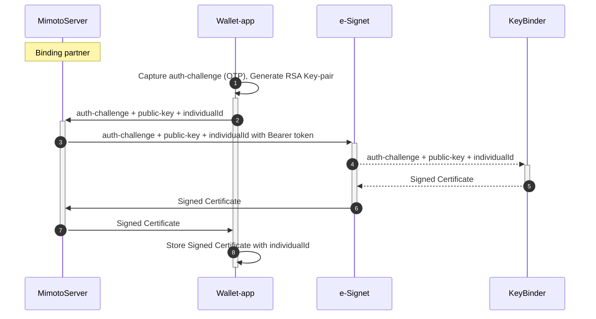

## Digital Wallet Integration

e-Signet provides endpoints to bind a public key to an individual.


[e-Signet.yml](.gitbook/assets/e-Signet.yml)


Once the public key is successfully bound to an `individualId`, the server-signed certificate and it's `walletUserId` is returned back to the wallet-app.
Wallet-app should store the certificate in a secure storage mapped with `walletUserId`.

_Note_: Binding multiple VIDs with a public key through a particular binding partner will always return the same `walletUserId`. However, only the latest server-signed certificate is valid.

## How to use a Server-signed certificate?

Server-signed certificate is used in the QR-code login flow of e-Signet.
1. The end user scans the QR code on e-Signet UI using the digital wallet app.
2. Digital wallet app reads the link-code in the scanned QR code.
3. Digital wallet sends request to e-Signet server to start a transaction with the link-code.
   
   [e-Signet.yml](.gitbook/assets/e-Signet.yml)
   
4. On successful link, e-Signet server responds back with supported list of authentication factors namely WLA(Wallet Local Auth).
5. Digital wallet app, locally authenticates the end user. (Ex: selfie authentication)
6. On successful local verification of end-user, wallet app creates a JWT signed with Certificate bound to the end-user. This signed JWT is sent to the e-Signet server.
   
   [e-Signet.yml](.gitbook/assets/e-Signet.yml)
   
7. Digital wallet captures the end-user consent on sharing his/her data with the relying party.
   
   [e-Signet.yml](.gitbook/assets/e-Signet.yml)
   
8. e-Signet UI now automatically detects the successful consent on the link-code and redirects the end-user to relying party portal with a authorization code.

_Note_: With 1.0.0, WLA is the only digital wallet supported authentication factor.

