# End User Guide

This is a concise user guide for end users that will guide you through the various features and functionalities provided by Inji.

## Installing Inji

Please navigate to the Play Store or App Store for iOS, select the **Install** option, and kindly wait for the installation process to complete.

#### On Android device

<figure><figcaption>
Installation of Inji on Android mobile device
</figcaption></figure>

#### On iOS device

<figure><figcaption>
Installation of Inji on iOS device
</figcaption></figure>

### First launch of the app

* Upon launching the app, the MOSIP logo will be displayed before the language filter appears.&#x20;
* The chosen language will be reflected within the app interface. Subsequently, a four-page tutorial for the Inji will be presented, followed by the option to secure the app.
* &#x20;This can be achieved through either a PIN or utilizing the device's Biometrics (such as fingerprint or facial recognition). Once the setting is done, users will be directed to the app's home page.

<figure>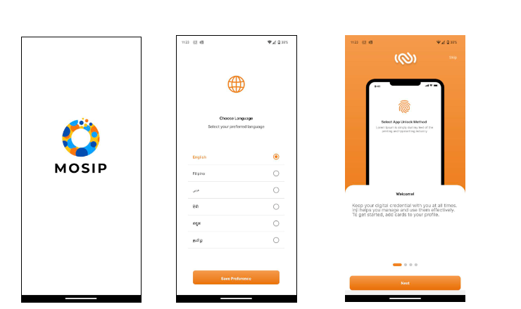<figcaption>
First launch 
</figcaption></figure>

<figure>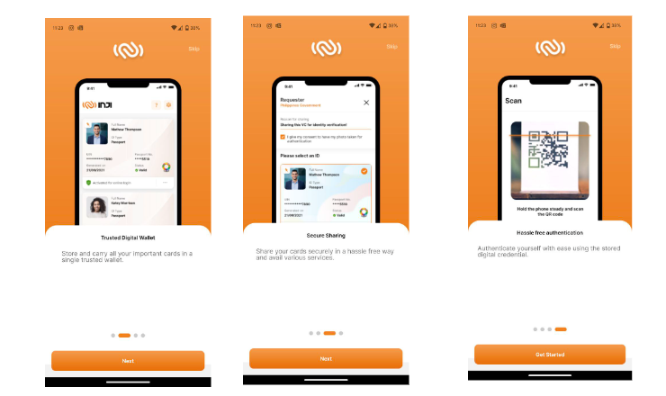<figcaption>
Tooltips 
</figcaption></figure>

<figure><figcaption>
Setting up the app
</figcaption></figure>

## Downloading VC

To download VC, there are three methods:

* Downloading VC using the UIN/ VID feature
* Downloading VC using the Application ID feature
* Download VC via eSignet

**Downloading VC using UIN/ VID/ AID**

* On the home page, you will find a plus "+" symbol. Clicking on this symbol will display a list of issuers from which you can download VCs.&#x20;
* Look for the issuer that offers the option to download via UIN and VID. Clicking on this option will present you with the option to download VC from AID and VID.&#x20;
* Fill in the required information in the text box according to your needs, and then click on the **Generate Card** button.&#x20;
* You will be prompted to enter an OTP on the next page, and once you do so, the download will begin automatically.

<figure>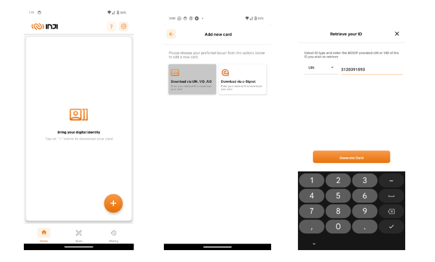<figcaption>
Selecting the <strong>Download via UIN, VID, AID option</strong>
</figcaption></figure>

<figure>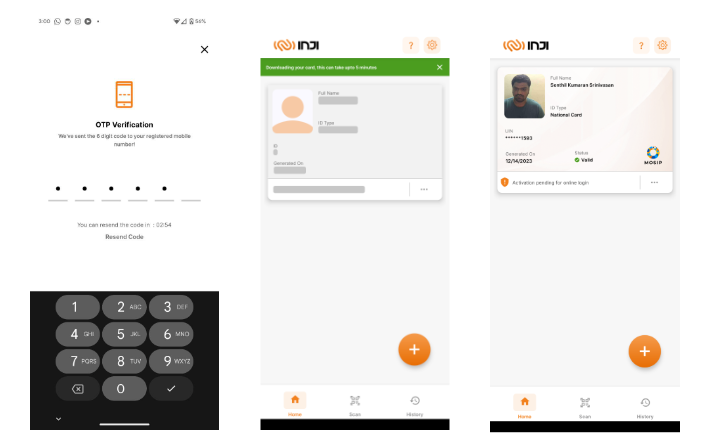<figcaption>
<strong>OTP Verification</strong> and <strong>Requesting for Credential</strong>
</figcaption></figure>

**Downloading VC via eSignet**

* On the home page, there will be a plus "+" symbol that displays the list of issuers available to download VCs from.&#x20;
* Select the issuer that states **Download via eSignet**. Once clicked, the browser will open and take you to the eSignet page.&#x20;
* There will be an option to **Login with OTP**, which should be selected.
* A text box should be filled with your VID and the captcha should be completed in order to enable the **Get OTP** button.&#x20;
* Upon activation, the system will redirect to the One-Time Password (OTP) validation page. After successfully inputting the correct OTP, the user will be taken back to the application, landing on the loading screen. Following the completion of the download process, the user will be returned to the home page.

<figure>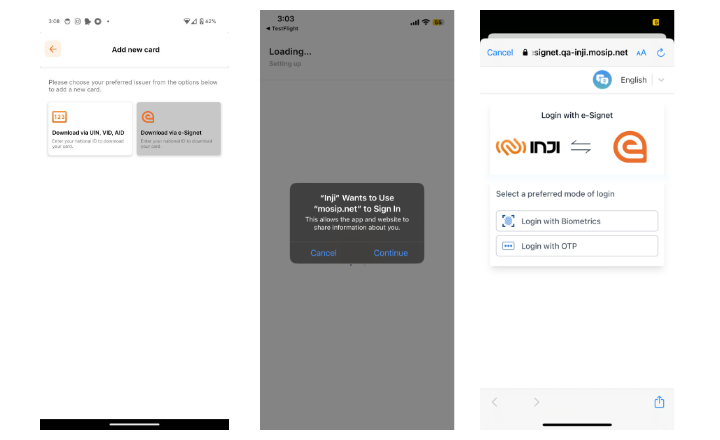<figcaption>
Selecting the <strong>Download via eSignet</strong>
</figcaption></figure>

<figure>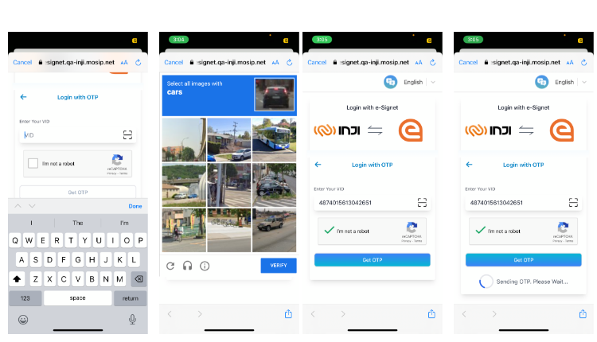<figcaption>
User opts for <strong>Login with OTP option</strong>
</figcaption></figure>

<figure>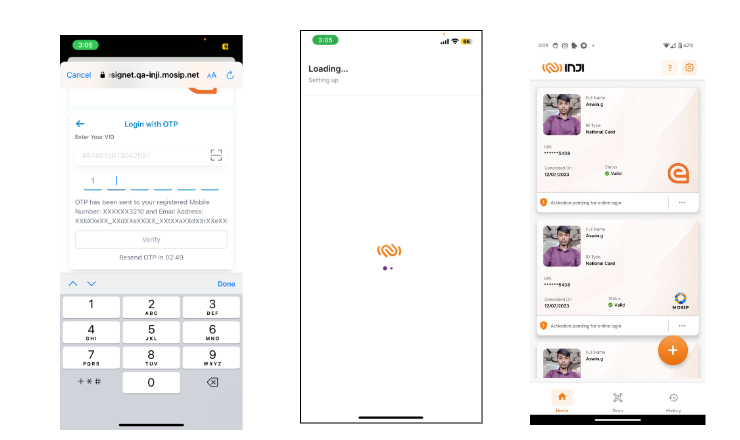<figcaption>
Successful download of VC
</figcaption></figure>

### Detailed View of the downloaded VC

Once we click on the downloaded VC, it will open as a detailed view.

<figure>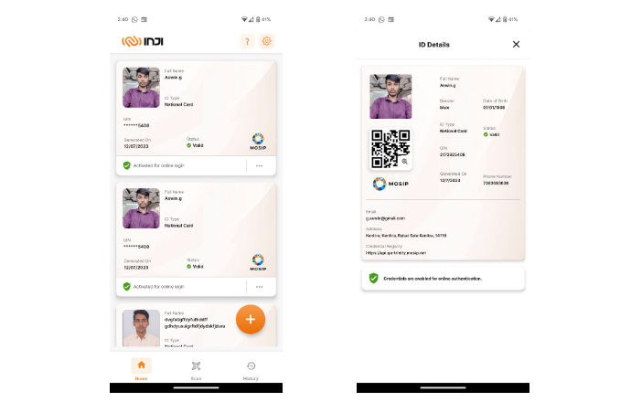<figcaption></figcaption></figure>

### Viewing history of the downloaded VC

After we have completed several scenarios, when we navigate to the history page, we can find it by selecting the third icon located in the bottom right corner. This page will display a comprehensive list of all the events that have occurred.

<figure><figcaption>
History View
</figcaption></figure>

### Pinning a VC

After clicking on the ellipsis button on the downloaded VC, a button will appear allowing for the VC to be pinned. Selecting this option will pin the specific VC to the top of the screen.

### Activating VC

There are two ways to activate the VC:

* &#x20;The second option is to click on the activate button found in the detailed view.&#x20;
* Upon clicking the **Activate** button, a confirmation alert message will be prompted. Once permission is granted, the user will be directed to an OTP screen. After entering the correct OTP, the VC will be activated and projected on the screen with the same message.

<figure>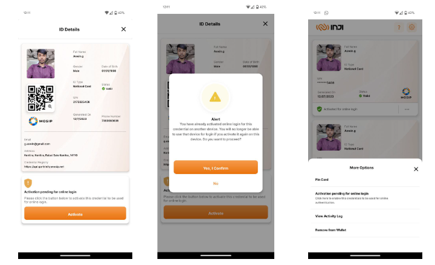<figcaption>
User clicks on <strong>Activate button</strong>
</figcaption></figure>

<figure>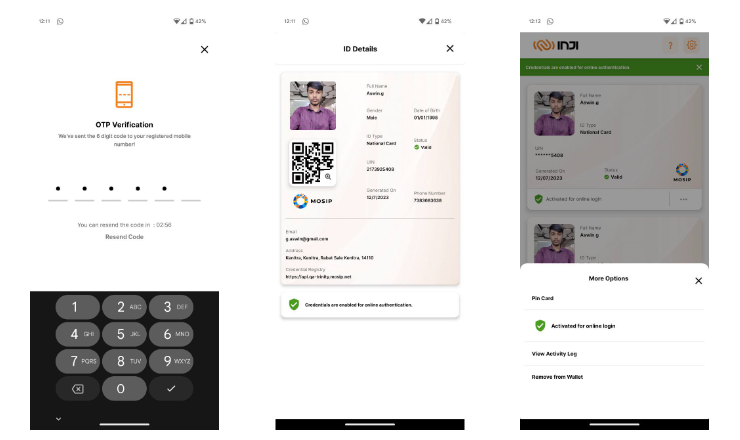<figcaption>
VC activated for online login
</figcaption></figure>

### Deleting VC

* The process of removing a VC involves locating the three-dot menu on the downloaded VC.&#x20;
* From there, the option to remove the card will be available. Select the option **Remove from Wallet**. Upon clicking this option, a confirmation prompt will appear asking for confirmation.&#x20;
* If the confirmation is selected, the VC will be successfully removed from the system.

<figure>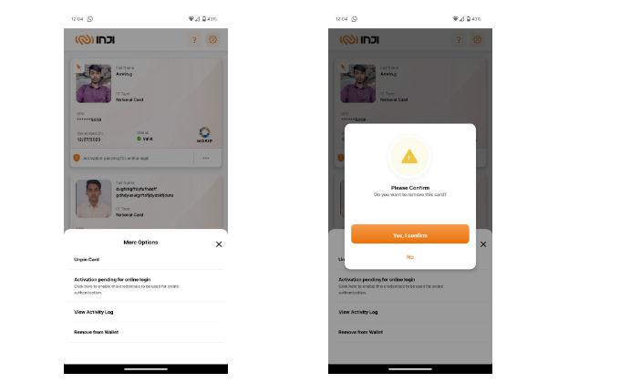<figcaption></figcaption></figure>

