# End User Guide

This document serves as a concise user guide for end users, providing comprehensive information on the features and functionalities offered by Inji.

## Installing Inji

Please navigate to the Play Store or App Store for iOS, select the **Install** option, and kindly wait for the installation process to complete.

#### On Android device

<figure>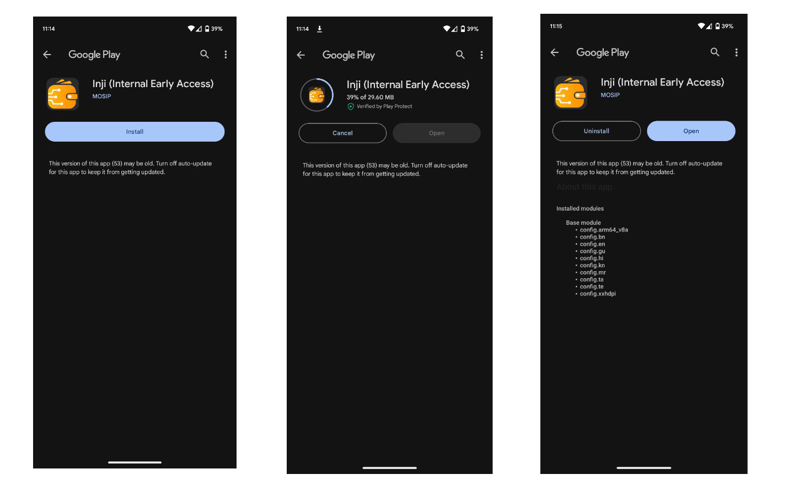<figcaption>
Installation of Inji on Android mobile device
</figcaption></figure>

#### On iOS device

<figure><figcaption>
Installation of Inji on iOS device
</figcaption></figure>

### First launch of the app

* Upon launching the app, the MOSIP logo will be displayed before the language filter appears.
* The chosen language will be reflected within the app interface. Subsequently, a four-page tutorial for the Inji will be presented, followed by the option to secure the app.
* This can be achieved through either a PIN or utilizing the device's Biometrics (such as fingerprint or facial recognition). Once the setting is done, users will be directed to the app's home page.

**On Android device**

<figure>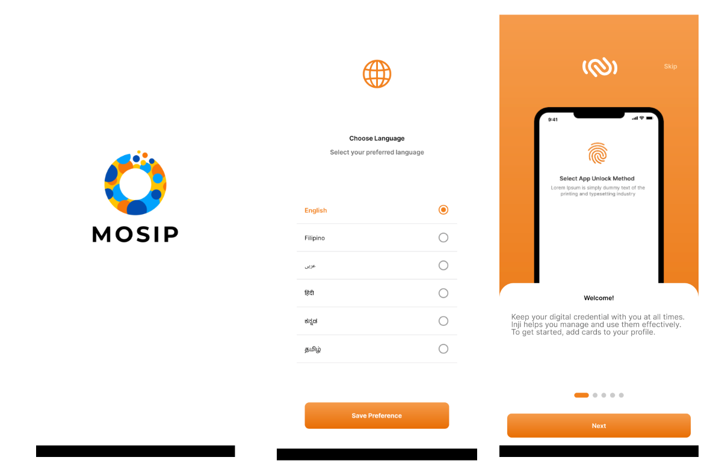<figcaption></figcaption></figure>

<figure>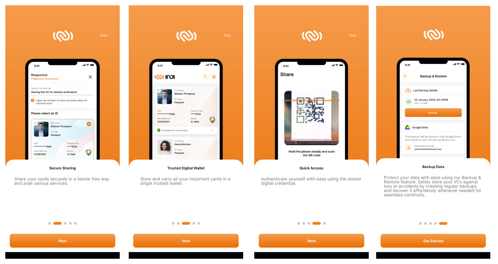<figcaption></figcaption></figure>

<figure>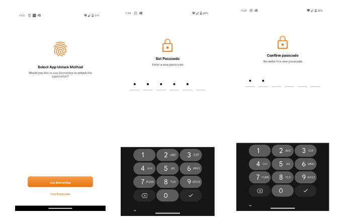<figcaption>
Setting up the app
</figcaption></figure>

## Downloading VC

To download VC, there are three methods:

* Downloading VC using the UIN / VID feature
* Downloading VC using the Application ID feature
* Download VC via eSignet

**Downloading VC using UIN / VID / AID**

To download MOSIP issued VC, using OTP method, user can directly provide UIN / VID and connect to the IDA.

* On the home page, there will be a plus "+" symbol that displays the list of issuers available to download VCs from.
* Select the issuer that states **Download <Issuer> Credentials via OTP**.
* Enter the UIN / VID and enter the OTP sent to your registered email ID.
* Download the VC.

<figure><figcaption></figcaption></figure>

<figure><figcaption></figcaption></figure>

**Downloading VC via eSignet**

Below sections are going to detail as how Inji mobile wallet as an OIDC client to OpenID4VCI method of downloading a VC and illustrated implementations.

**Download MOSIP credentials**:

This method of MOSIP VC download illustrates the **OpenID4VCI** method of download using UIN / VID issued to the resident. In this, eSignet plays the authentication and authorisation end point to connect to the credential provider (in this case, it is MOSIP). To understand more about Onboarding Mimoto (Inji BFF) as an OIDC client to support credential issuance from any issuer who support OpenID4VCI protocol refer [here](https://docs.mosip.io/inji/inji-mobile-wallet/customization-overview/credential_providers).

**Download Sunbird credentials**

This method of VC download illustrates the **OpenID4VCI** method of download using KBA (Knowledge Based Authentication). In this, eSignet plays the authentication, authorisation and credential issuance end point to connect to the credential provider (in this case, it is Sunbird). To understand more about Onboarding Mimoto (Inji BFF) as an OIDC client to support credential issuance from any issuer who support OpenID4VCI protocol refer [here](https://docs.mosip.io/inji/inji-mobile-wallet/customization-overview/credential_providers).

* On the home page, there will be a plus "+" symbol that displays the list of issuers available to download VCs from.
* Select the issuer that states **Download via eSignet**. Once clicked, the browser will open and take you to the eSignet page.
* In The authorization page (eSignet page), user has to enter the details related to that credentials which they are aware of. In this sample implementation, Its Policy Number, Policy Name, and Date of Birth.
* Upon Authorization, the user will be taken back to the application, landing on the loading screen. Following the completion of the download process, the user will be returned to the home page, where the Downloaded Credential will be available.

<figure><figcaption></figcaption></figure>

<figure><figcaption></figcaption></figure>

**Appendix**:

* The term “identifier” in the architecture diagram refers to the unique identifier which can be used to download the credential on the esignet login Page
* eSignet supports Various types of authorizations, ACR value is configured based on the Issuers' need to include the authorization mode in the authorization page
* Types of Authorization Supported for Credential Download by eSignet are:

  * **Login With OTP**: Credential download using OTP Based authentication to authorize the user
    
    **Illustrated Implementation**: MOSIP National ID credentials download
  * **Login With KBA**: Credential download using KBA to authorize the user. The knowledge (as described by the credential 
    issuer to authorize) is exposed to eSignet from Registry (Issuer) through eSignet Issuance Plugins
  
    **Illustrated Implementation**: Sunbird Insurance ID credentials download 

### Detailed view of the downloaded VC

Once we click on the downloaded VC, it will open as a detailed view.

<figure><figcaption></figcaption></figure>

### Viewing history of the downloaded VC

After we have completed several scenarios, when we navigate to the history page, we can find it by selecting the third icon located in the bottom right corner. This page will display a comprehensive list of all the events that have occurred.

<figure>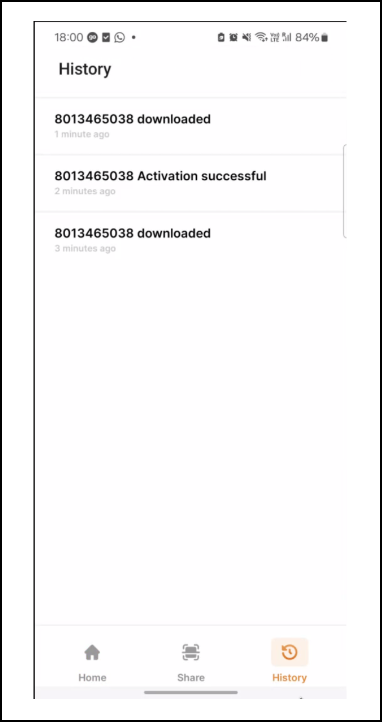<figcaption></figcaption></figure>

### Sharing Credentials

Prerequisites:

* Two or more devices with Inji installed are required for sharing credentials.
* All required permissions like Bluetooth, location and camera access are enabled on both the devices.
* The parties involved are usually a Resident (sharing party) who wishes to share their credentials with a Relying party (receiving party), which could be a banker, health worker, or other professional service.

Let us understand the process of sharing credentials using an example. Suppose a Resident wishes to share their credentials with a Relying/ Requesting party through the receiver's phone. The following steps outline the procedure for both parties involved:

**On the Sharing Party' phone:**

* The resident opens the Scanner by clicking on the `Scan` button, the application now prompts for permission.
* Upon granting the necessary permissions, the app opens a camera where the resident can scan the QR code of the recipient's phone.
* Once the QR code is successfully scanned, both phones will establish a connection.
* The resident then needs to choose a downloaded VC and select either the **Share** option or the **Share with Selfie** option.
* The **Share** button will solely share the VC, while the **Share with Selfie** option will verify if the sender's face matches the photo in the VC before proceeding to share.

<figure>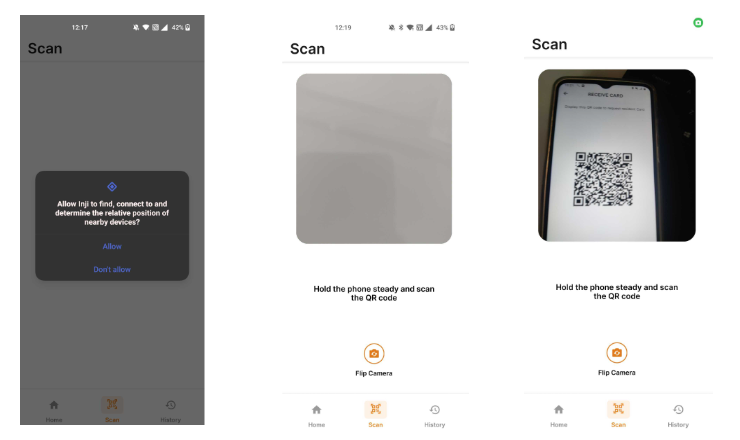<figcaption></figcaption></figure>

<figure>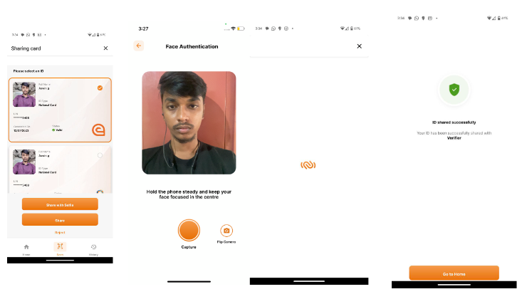<figcaption></figcaption></figure>

**On the Relying Party' phone**:

* This functionality is only available on Android devices. To access it, the receiver needs to navigate to the settings page and locate the `Receive Cards` option.
* On selecting this option, it will open the QR code page. For the relying party to be able to receive a card, the resident needs to scan the QR code using a sharing phone. Once the QR code is scanned and shared, the relying party will receive the VC and be able to preview its contents.
* To view the received cards, they would need to access the settings page and find the `Received Cards` section. Clicking on this section will display the received cards. If the receiver has not received any card, this section will be empty.
* Please note that the relying party can only view the received cards and will not be able to share or perform other actions with them.

<figure>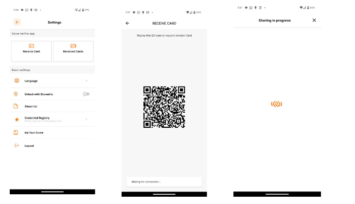<figcaption></figcaption></figure>

<figure>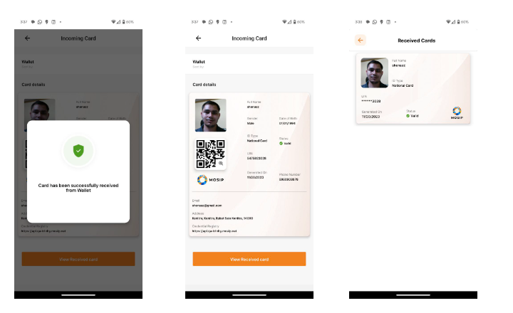<figcaption></figcaption></figure>

### Pinning a VC

After clicking on the ellipsis button on the downloaded VC, a button will appear allowing for the VC to be pinned. Selecting this option will pin the specific VC to the top of the screen.

<figure>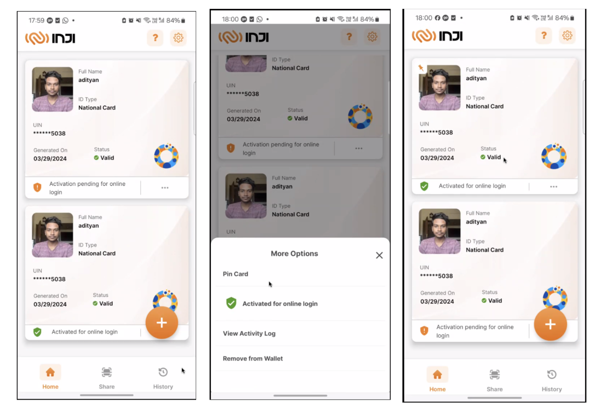<figcaption></figcaption></figure>

### Activating a VC

There are two ways to activate the VC:

* The second option is to click on the activate button found in the detailed view.
* Upon clicking the **Activate** button, a confirmation alert message will be prompted. Once permission is granted, the user will be directed to an OTP screen. After entering the correct OTP, the VC will be activated and projected on the screen with the same message.

<figure>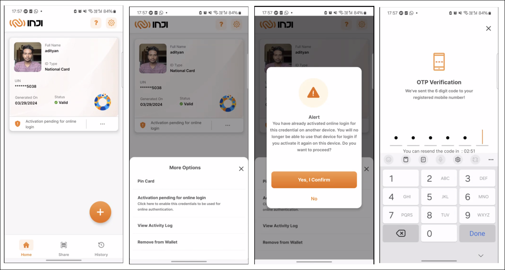<figcaption></figcaption></figure>

<figure>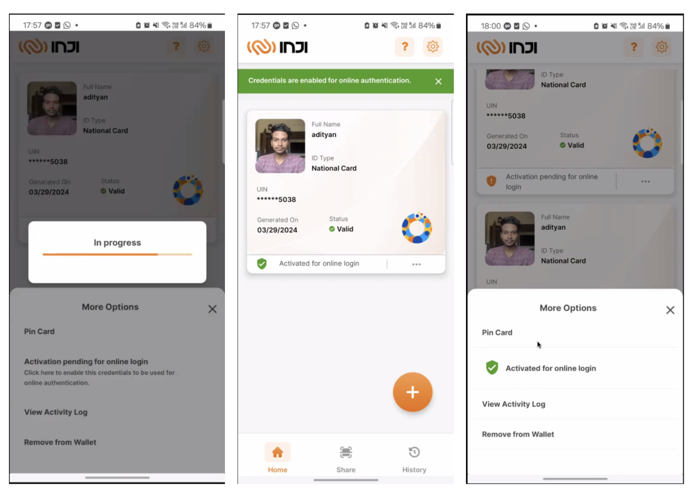<figcaption></figcaption></figure>

### Deleting a VC

* The process of removing a VC involves locating the three-dot menu on the downloaded VC.
* From there, the option to remove the card will be available. Select the option **Remove from Wallet**. Upon clicking this option, a confirmation prompt will appear asking for confirmation.
* If the confirmation is selected, the VC will be successfully removed from the system.

<figure><figcaption></figcaption></figure>

## Data backup and restore

### Backup

In order to backup VCs, user has to choose their preference of the cloud based on the device they are using.

1. Firstly, user has to go to settings and click on the Backup and Restore menu option.
2. User should consent for the app to use the drive, and once consented, application displays backup and restore screen.
3. In this screen, user can manually take a backup by clicking on the Backup button and this asynchronously happens allowing the user to use the application.
4. User will be notified on success or failure.

### Data backup - Android

<figure><figcaption></figcaption></figure>

<figure><figcaption></figcaption></figure>

### Data backup- ios

<figure><figcaption></figcaption></figure>

### Restore

In order to restore backed up VCs, user has to choose their preference of the cloud based on the device and use the same google/apple ID which they used for taking backup.

1. Firstly, user has to go to settings and click on the Backup and Restore menu option.
2. User should consent for the app to use the drive, and once consented, application displays backup and restore screen.
3. User find the details of latest backup details in Last Backup Details section.
4. In this screen, user can manually restore a backup by clicking on the Restore button and this asynchronously happens allowing the user to use the application.
5. User will be notified on success or failure.

### Restore - Android

<figure><figcaption></figcaption></figure>

<figure><figcaption></figcaption></figure>

### Restore - ios

<figure><figcaption></figcaption></figure>

<figure><figcaption></figcaption></figure>
