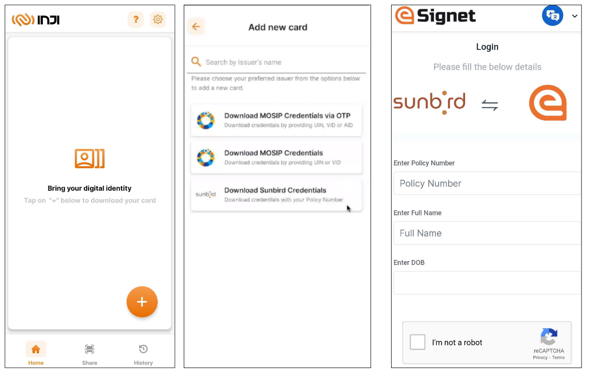
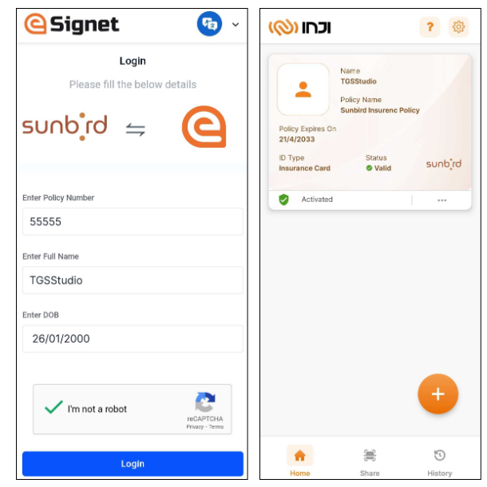

# Knowledge Based Identification

Knowledge Based Identification (KBI) is a security measure to verify the identity of an individual based on information that is typically known only to the individual being authenticated. This method relies on the understanding that the person requesting access to a system or service possesses certain private information that only the legitimate user would know.

In KBI, users are often asked to provide answers to specific questions or prompts that are related to their personal history or identity. These questions could cover a range of topics like:

1. Personal information (e.g., date of birth, address, social security number)
2. Account related details (e.g., last transaction amount, account creation date)
3. Preferences or history (e.g., favorite colour, first pet's name)

eSignet has expanded its authentication options to include KBI as one of its factors. With eSignet's integration capabilities, existing ID repositories storing user specific details can now be easily integrated with eSignet. This integration enables OpenID based login, allowing users to access relying party services seamlessly.


Note:

1. The authentication factor can be referred to as either Knowledge Based Authentication (KBA) or Knowledge Based Identification (KBI). However, from the eSignet’s perspective, we will specifically refer to the authentication method as Knowledge Based Identification (KBI).
2. Given the relatively low level of assurance provided by Knowledge Based Identification  (KBI), we recommend that Knowledge Based Authentication (KBA) / Knowledge Based Identification (KBI) should be used for the issuance of Verifiable Credentials (VC) or certificates rather than serving as a primary method of authentication.&#x20;


The below mentioned scenario describes a user attempting to download a VC (Verifiable Credential) from the list of VC issuers through their mobile wallet (for example., Inji Wallet). The user is verified using Knowledge Based Identification (KBI) through eSignet.

### Prerequisite:

1. The Resident has installed a mobile wallet (for example., Inji app) on their mobile device
2. The Resident has received the policy number from their insurance provider, which would be required for KBI

### Steps

1. The resident accesses their digital wallet (e.g., Inji Wallet) and taps on the plus '+' button.
2. Resident selects their preferred issuer from the available list.
3. Resident provides their **Policy Number**, **Full Name**, and **Date of Birth** as credentials for KBI login.
4. The resident clicks on the Login button.
5. Upon successful completion, the user downloads their Insurance Card into their digital wallet (Inji Wallet).

<figure><figcaption></figcaption></figure>

<figure><figcaption></figcaption></figure>

