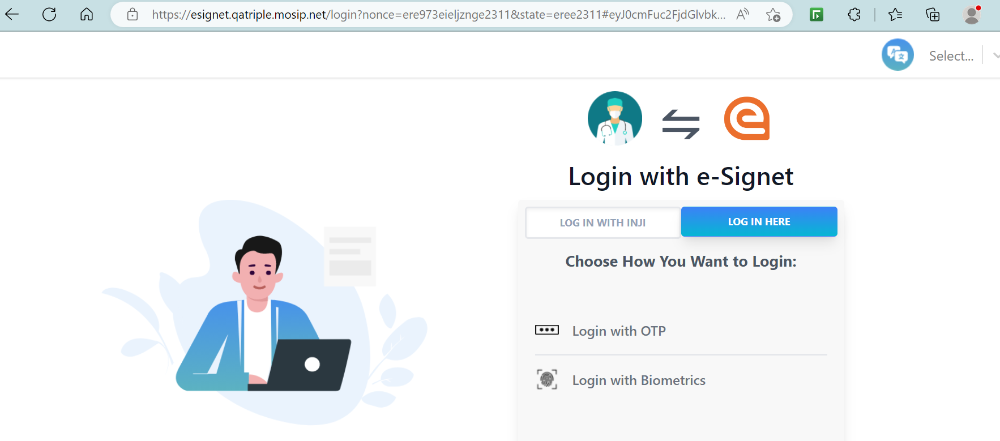
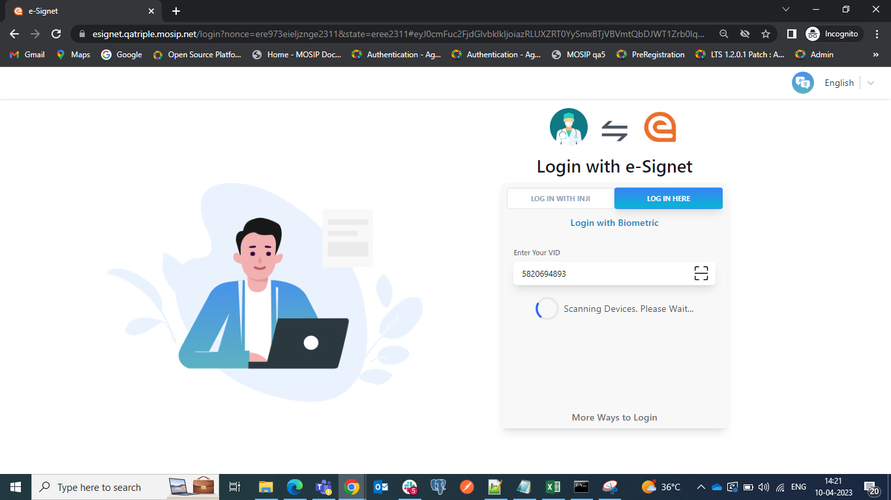
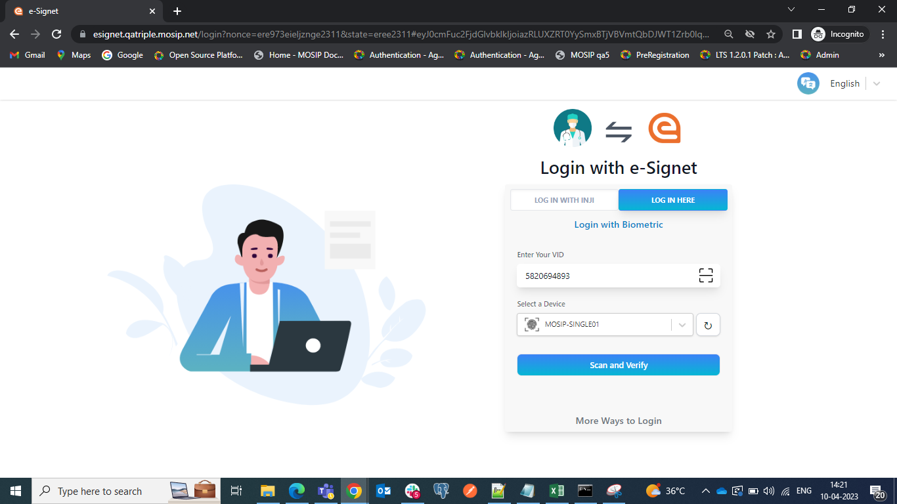
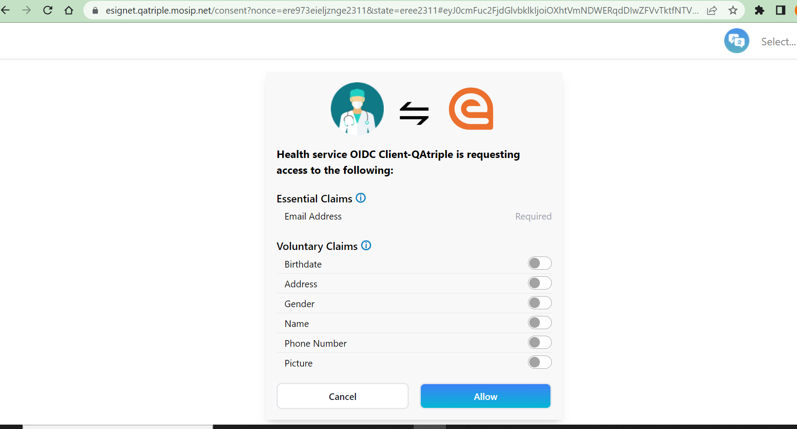

# Login flow for Biometrics based authentication

1\. Resident clicks on `Sign In with e-Signet`. 

They are navigated to the login screen where they can choose the way they want to log in.

2\. The resident clicks on LOG In HERE -> `More Ways to Login`.

3\. To get started with login using biometrics, the resident clicks `Login with Biometrics`.

4\. Resident needs to enter valid VID in the `Enter Your VID` text field.

5\. Next, the resident selects a device (face/ iris/ finger) and provides their biometrics.

With e-Signet version 1.0, we have a `Refresh` button added to display the list of newly connected devices.

6\. The resident clicks on the `Scan and Verify` button.

7\. The resident is then navigated to the Consent page. On this page, the **Essential** and **Voluntary** claims are displayed.


The consent screen is presented solely to the resident if consent has not previously been obtained. Additionally, a timer is incorporated onto the Consent screen, allowing the resident to provide a response within the designated time frame. In the event that the allotted time elapses, residents will be redirected to the relying party user interface.



8\. The resident is given the option to choose from a list of Authorized scopes and Voluntary claims. The Essential claims are mandatory and cannot be modified. In e-Signet v1.1.0, a `master toggle button` has been added to allow residents to select all the options at once, if desired.

9\. The resident clicks on the `Allow` button. The system navigates the resident to the User Profile page and the page displays their details based on the consent provided.

