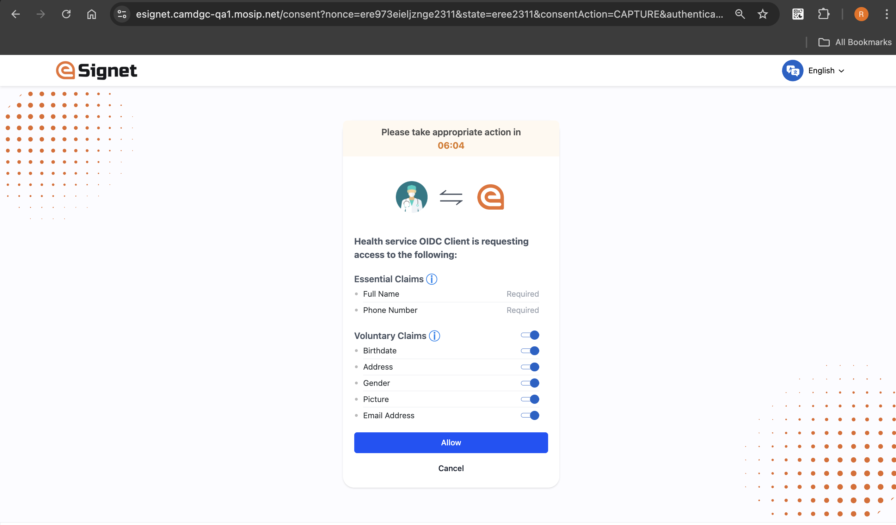

# Login with OTP


**Prerequisites:**\
The resident is issued with a unique virtual ID for a country's foundation ID. In the below demo application, which is a health portal, the resident is registered with MOSIP and has a valid UIN or VID.


1\. On the portal, the resident clicks on the button _**Sign In with eSignet**_.

<figure><figcaption>
Sign in with eSignet
</figcaption></figure>

The login screen appears and the resident is displayed with the options they can choose for login.

2\. To get started with login with OTP authentication, the resident clicks on _**Login with OTP**_ option.

<figure><figcaption>
Login with OTP
</figcaption></figure>

3\. The resident needs to enter a valid VID in the _**Enter Your VID**_ text field and check the box 'I'm not a robot'.

The OTP-based authentication is now secured with a captcha.

<figure><figcaption>
Enter your UIN/VID
</figcaption></figure>

4\. Next, the resident clicks on the _**Get OTP**_ button.

<figure><figcaption>
Get OTP Page
</figcaption></figure>

5\. The resident receives the OTP on the registered channel (either by phone or email).

6\. The resident needs to enter the valid OTP received and click on the _**Verify**_ button.

<figure><figcaption>
Verify OTP 
</figcaption></figure>

7\. The resident is then navigated to the Consent page. On this page, the **Essential** and **Voluntary** claims are displayed.

<figure><figcaption>
Voluntary Claims page
</figcaption></figure>


The consent screen is presented solely to the resident if consent has not previously been obtained. Additionally, a timer is incorporated into the Consent screen, allowing the resident to respond within the designated time frame. If the allotted time elapses, residents will be redirected to the relying party user interface.


8\. The resident is given the option to choose from a list of Authorized scopes and Voluntary claims. The Essential claims are mandatory and cannot be modified. A **master toggle button** has been added to allow residents to select all the options at once if desired.

<figure><figcaption>
Vlountary Claims page
</figcaption></figure>

9\. The resident should now click the _**Allow**_ button. The system navigates the resident to the **User Profile** page which displays all the personal information based on the consent provided.

<figure><figcaption>
Profile page
</figcaption></figure>
