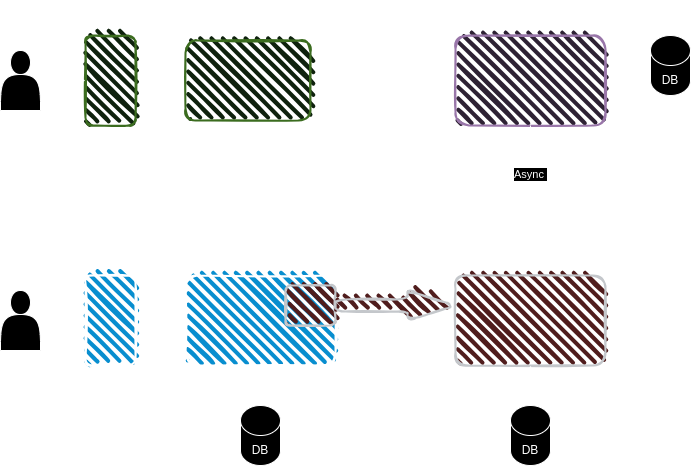

# Login with Password


**Prerequisites:**

The resident is registered with a username and password using eSignet's Signup portal. In the below demo application, we are using resident's phone number as username.

Below diagram depicts how eSignet Signup portal is setup with the MOSIP registry and IDA system.



1\. On the portal, the resident clicks on the button _**Sign In with eSignet**_.

The login screen appears, and the resident is displayed with the options they can choose for login.


**Note:**\
If the `acr_values` query parameter is presented with only one `acr` in the authorize URL, then the login options page is skipped, and resident is directly taken to the login page.


2\. The resident needs to enter a registered username in the _**Enter 8–9-digit mobile number**_ and password in the _**Enter password**_ text field and check the box 'I'm not a robot'.

The password-based authentication is secured with a captcha.

4\. Next, the resident clicks on the _**Continue**_ button.


Note:&#x20;

* Login with password form also has link _**Sign Up With Unified Login**_ to navigate to the Signup portal, if the resident is still not registered.
* _**Forgot password**_ link is also available for resident to navigate to signup portal to reset the password.
* Resident can resume back login after successful registration as well as after successful reset of password.


5\. The resident is then navigated to the Consent page. On this page, the **Essential** and **Voluntary** claims are displayed.


The consent screen is presented solely to the resident if consent has not previously been obtained. Additionally, a timer is incorporated into the Consent screen, allowing the resident to provide a response within the designated time frame. In the event that the allotted time elapses, residents will be redirected to the relying party user interface.


6\. The resident should now click the _**Allow**_ button. The system navigates the resident to the **User Profile** page which displays all the personal information based on the consent provided.

