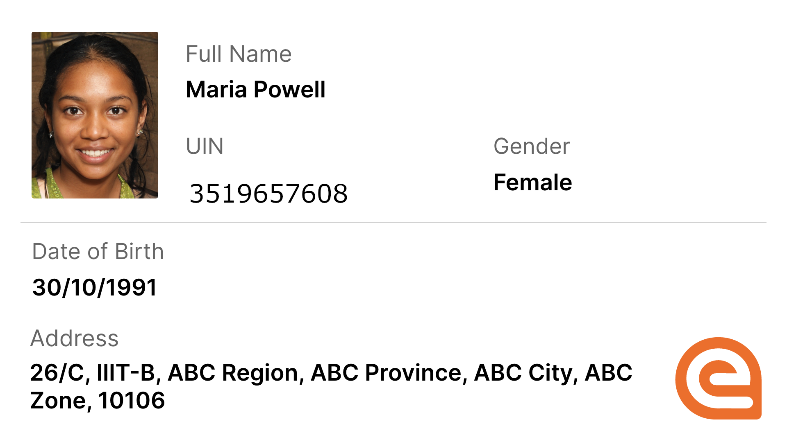
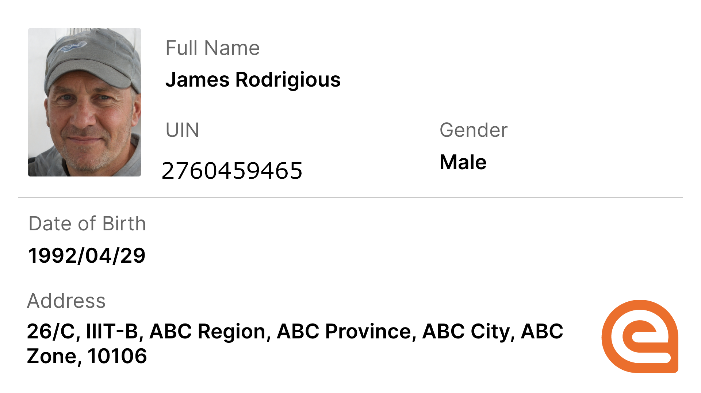
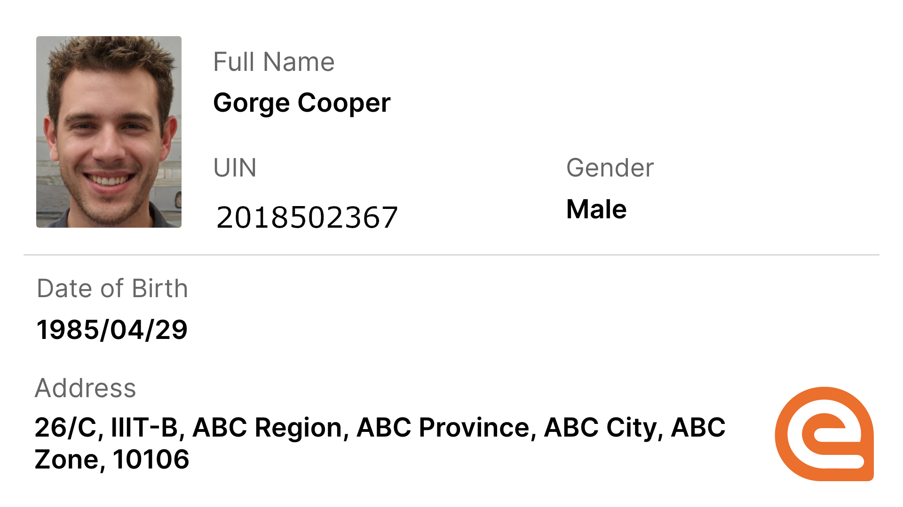
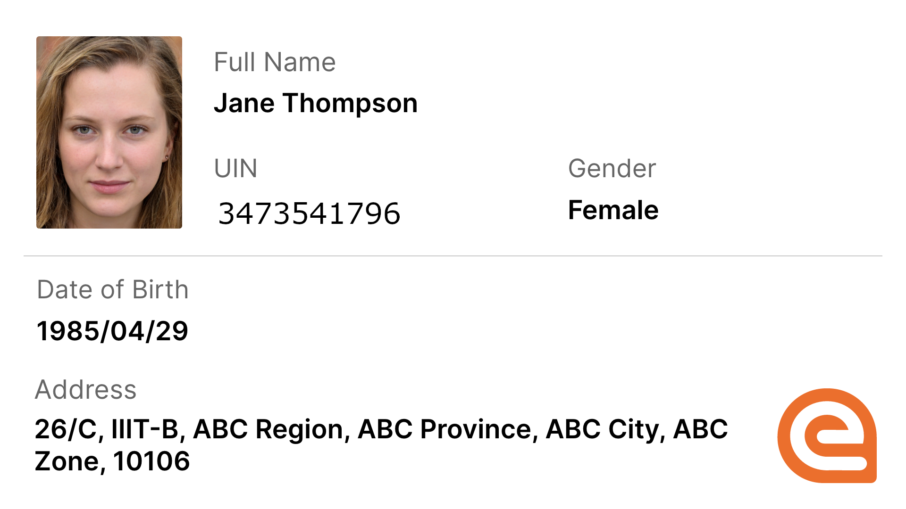

# Using Mock Data

While you want to explore eSignet you can use the following deployment in our 'Collab-Environment'.

* Collab MOSIP Deployment
* Collab Mock-Data based Deployment

### Exploring eSignet with MOSIP Deployment in Collab Environment

#### Personas - MOSIP Foundational ID

You can use one of following personas and UINs on the respective cards

<table><thead><tr><th width="133.12109375">Name</th><th width="135.40234375">UIN</th><th width="111.59375">Gender</th><th width="142.11328125">DOB</th><th>Address</th></tr></thead><tbody><tr><td>Maria Powell</td><td>3519657608</td><td>Female</td><td>30/10/1991</td><td>26/C, IIIT-B, ABC Region, ABC City, ABC Zone, 10106</td></tr><tr><td>James Rodrigious</td><td>2760459465</td><td>Male</td><td>29/04/1992</td><td>26/C, IIIT-B, ABC Region, ABC City, ABC Zone, 10106</td></tr><tr><td>George Cooper</td><td>2018502367</td><td>Male</td><td>29/04/1985</td><td>26/C, IIIT-B, ABC Region, ABC City, ABC Zone, 10106</td></tr><tr><td>Jane Thompson</td><td>3473541796</td><td>Female</td><td>29/04/1985</td><td>26/C, IIIT-B, ABC Region, ABC City, ABC Zone, 10106</td></tr></tbody></table>

 

 

Individual images are included to facilitate **selfie authentication** for the Inji application.


**Note:** The data used for these Virtual IDs (VIDs) is entirely fictitious, and the images displayed are AI-generated from an [external website](https://this-person-does-not-exist.com/en).


#### Personas - MOCK IDs and UINs

Name: Dr. William Anderson -&#x20;

* UIN: 2345890124
* Age: 56
* DOB: 14/05/1968
* Email: [william.anderson55@example.com](mailto:william.anderson55@example.com)
* Phone Number: [+91-9090909088](tel:+919090909088)
* Address - 26/C, IIIT-B, ABC Province, ABC Region ABC Zone, -10106, ABC

\
Name: Jasmine Robinson

* UIN: 3945691120
* Age: 19
* DOB: 03/04/2005
* Email: [jasmine.robinson05@example.com](mailto:jasmine.robinson05@example.com)
* Phone Number: [+91-9090909087](tel:+919090909087)
* Address - 26/C, IIIT-B, ABC Province, ABC Region ABC Zone, -10105, ABC

Name: Michael Chen 

1. UIN: 6819805520
2. Age: 37
3. DOB: 22/08/1987
4. Email:[michael.chen87@example.com](mailto:michael.chen87@example.com)
5. Phone Number: [+91-9090909086](tel:+919090909086)
6. Address - 26/C, IIIT-B, ABC Province, ABC Region ABC Zone, -10104, ABC

Name: Sara Al-Mansouri 

* UIN: 8294297335
* Age: 27
* DOB: 11/01/1998
* Email: [sara.almansouri98@example.com](mailto:sara.almansouri98@example.com)
* Phone Number: [+91-9090909085](tel:+919090909085)
* Address - 26/C, IIIT-B, ABC Province, ABC Region ABC Zone, -10103, ABC

#### Steps to use eSignet

Access the Collab Health Portal [**here**](https://healthservices-esignet-mock.collab.mosip.net/). We have developed a **mock health portal** that functions as a **relying party web portal**. As an end user, you can simulate accessing online health services by logging in with your **national ID** via eSignet.

#### OTP Authentication

To simplify exploring it with a 'Collab MOSIP Identity Deployment' eSignet supports OTP authentication.

* You can use any of the provided [personas](using-mock-data.md#personas) above for testing.
* The default OTP for testing is "111111" (six ones).

For a step-by-step guide on logging in with OTP using eSignet, refer to [this detailed guide](../end-user-guide/health-portal/login-with-otp.md).
