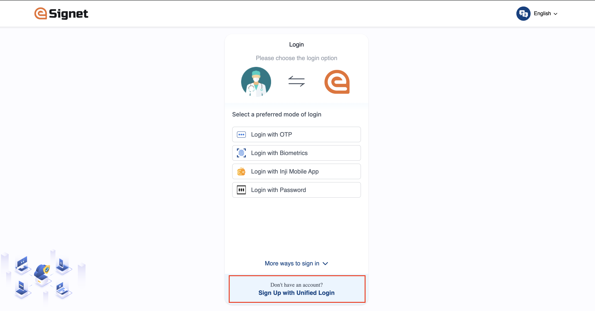
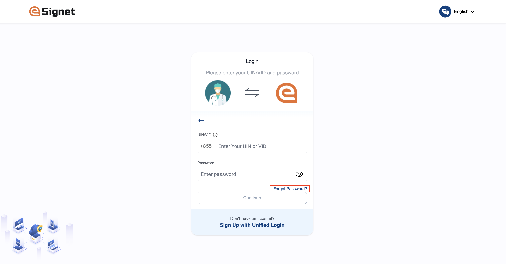
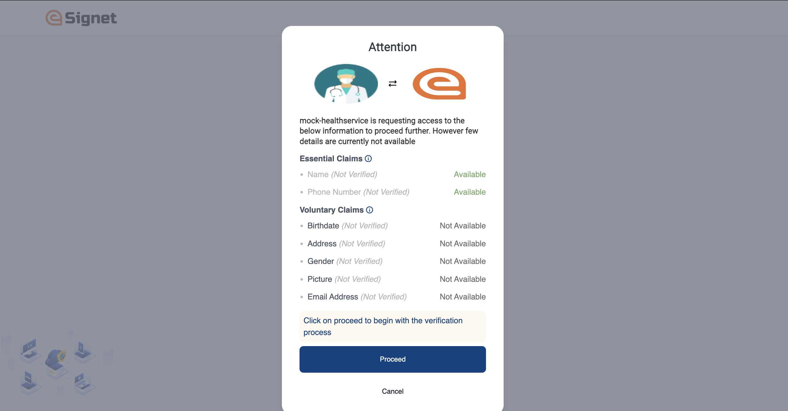

# Integration with eSignet portal

### **Overview**  <a href="#overview" id="overview"></a>

The Signup module is designed with a flexible architecture that allows it to integrate with any Identity Provider (IdP). In this setup, we have provisioned its integration with **eSignet** to enable seamless user onboarding and identity verification.

To enable this integration, please refer to the configuration details provided in the sections below.

### **Display Signup Option on Authentication Screen** <a href="#display-signup-option-on-authentication-screen-only-heading-update" id="display-signup-option-on-authentication-screen-only-heading-update"></a>

Ensure that the option for SignUp is visible to the user when they land on the authentication screen. This can be configured by adjusting the relevant display settings or UI properties within the eSignet configuration.

<figure><figcaption><p><strong>SignUp Option on Authentication Screen</strong></p></figcaption></figure>

Below property should be marked as true, if the signup banner should be displayed. If not required, a banner can be hidden by setting the flag to false. By default, the signup banner is enabled as shown below:

```javascript
mosip.esignet.ui.signup.config = 
{
  'signup.banner': true,
  'signup.url': '${mosip.signup.domain.url}/signup'
};
```

### **Configuring Forgot Password** <a href="#configuring-forgot-password-only-heading-update" id="configuring-forgot-password-only-heading-update"></a>

For password-based authentication, the "Forgot Password" link is enabled by default on the authentication screen. To disable this link, set the corresponding flag to **false** in the configuration as shown below:

```javascript
mosip.esignet.ui.forgot-password.config = 
{
  'forgot-password': true,
  'forgot-password.url': '${mosip.signup.domain.url}/reset-password'
};
```

<figure><figcaption><p>Forgot Password Page</p></figcaption></figure>

### **Consent for Unavailable Claims**

For the Identity (eKYC) verification process, eSignet includes a built-in feature to inform the user when certain verified claims are unavailable. A popup is displayed, showing details of the missing claims and prompting the user to initiate the verification process. Detailed consent regarding the Personally Identifiable Information (PII) that will be captured during the verification will be handled through the SignUp portal.

<figure><figcaption><p>Claim Details Page</p></figcaption></figure>
