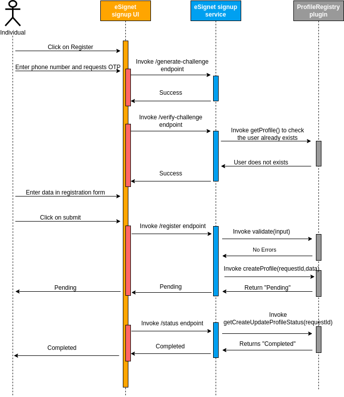

# Profile Registry Plugin

### What is Profile Registry Plugin? 

ID registry plugin enables eSignet's Signup service to integrate with any Id registry system. This essentially means that eSignet now does away with tight integration with MOSIP ID-repository and makes way for any ID Repository system to be integrated with eSignet.


The dependency on the MOSIP ID repository has been removed in eSignet Sign Up Service versions 1.1.0 and above.


### Sequence Diagram 

Please refer to the sequence diagram below for the detailed working flow of the profile registry plugin.

<figure><figcaption>
Profile Registry Plugin
</figcaption></figure>

### Profile Registry Plugin Interface 

Please [refer here](https://github.com/mosip/esignet-signup/blob/master/signup-integration-api/src/main/java/io/mosip/signup/api/spi/ProfileRegistryPlugin.java) for the Profile Registry Plugin interface.
