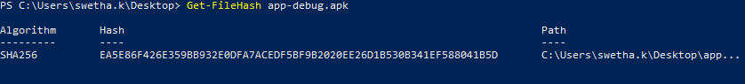

# Hash Generation

Generation and Verification of Hash for SBI and SDK:

* In order to maintain the integrity of the SBI/SDK software solution, a cryptographic hash function has been implemented. This function has been thoroughly tested by CTK and found to be compliant with the MOSIP specification.
* It is a requirement for partners to calculate the HASH of the software solution using the SHA256 hash function, regardless of the technology environment in which the devices will be utilized.
* Furthermore, the calculated HASH of the solution should remain unchanged, allowing countries or relying parties to recalculate the HASH and validate the software's integrity prior to deployment.
* In the event that the software undergoes any changes, the partner must calculate a new HASH and retest the solution using CTK in order to maintain their compliance status.

## Hash Generation for Android App:

* The Blake2b or SHA256 algorithms can be utilized to calculate the hash value of an APK file.
* Blake2b produces digests with a byte size ranging from 1 to 64 and is specifically designed for 64-bit systems.
* SHA256 is an unkeyed cryptographic hashing method that generates a 256-bit hash outcome from an input of variable length.
* The hash value of an APK file can be determined using Windows PowerShell, which defaults to employing the SHA256 algorithm.
* The hash value will be altered in the event of any modifications made to the APK file. Conversely, the hash value will remain constant if no changes are made.

<figure><figcaption></figcaption></figure>
