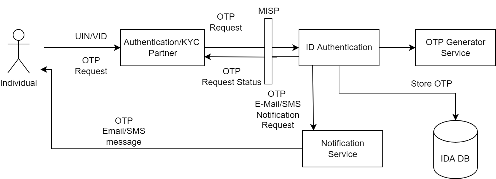
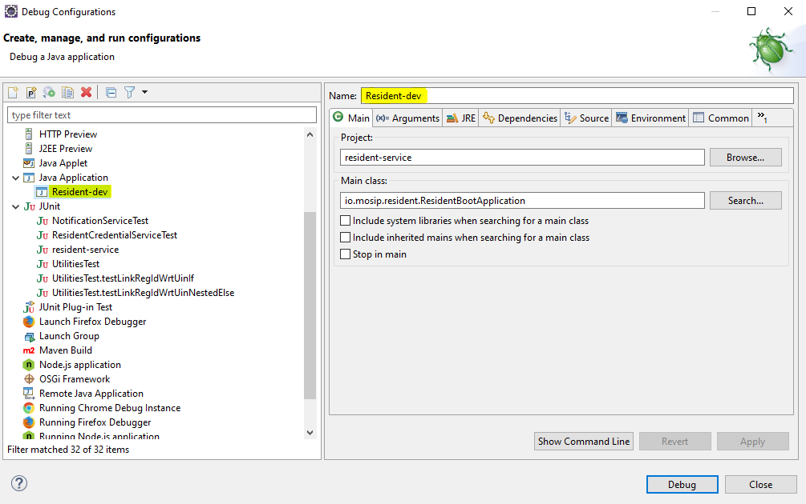
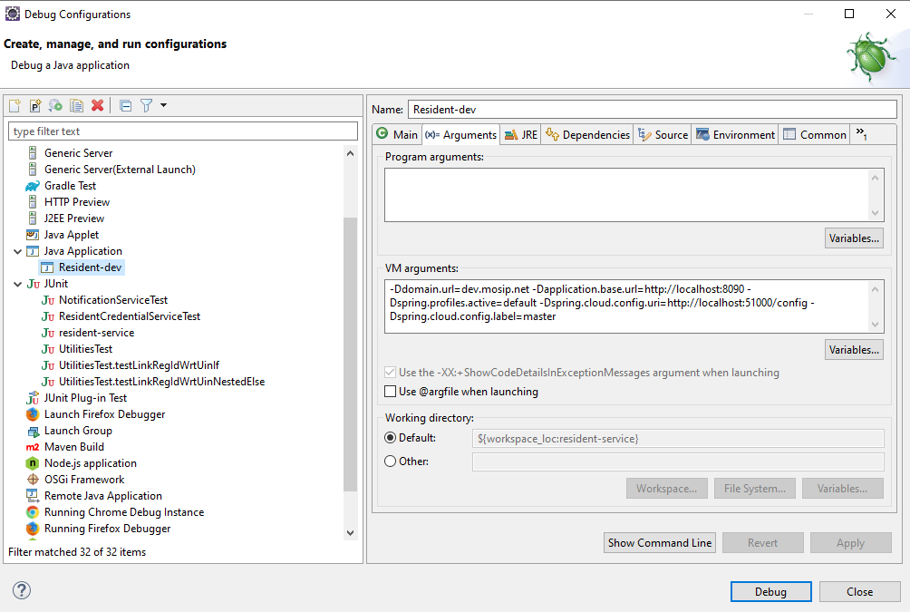

# ID Authentication OTP Service Developers' Guide

## Overview
OTP Request Service is used by Authentication/e-KYC Partners to generate OTP for an individual's UIN/VID. The generated OTP is stored in IDA DB for validation during OTP Authentication.


The documentation here will guide you through the prerequisites required for the developer' setup.


## Software setup

Below are a list of tools required in ID Repository Services:

1. JDK 11
2. Any IDE (like Eclipse, IntelliJ IDEA)
3. Apache Maven (zip folder)
4. pgAdmin
5. Postman
6. Git
7. Notepad++ (optional)
8. lombok.jar (file)
9. settings.xml (document)


Follow the steps below to set up ID Repository Services on your local system:

1. Download `lombok.jar` and `settings.xml` from [here](https://github.com/mosip/documentation/tree/1.2.0/docs/_files/id-authentication-config-files).

2. Unzip Apache Maven and move the unzipped folder in ```C:\Program Files``` and `settings.xml` to "conf" folder `C:\Program Files\apache-maven-3.8.4\conf`.

3. Install Eclipse, open the `lombok.jar` file and wait for some time until it completes the scan for Eclipse IDE and then click `Install/Update`.


4. Check the Eclipse installation folder `C:\Users\userName\eclipse\jee-2021-12\eclipse` to see if the `lombok.jar` is added. By doing this, you don't have to add the dependency of `lombok` in your `pom.xml` file separately as it is auto-configured by Eclipse.

5. Configure the JDK (Standard VM) with your Eclipse by traversing through `Preferences → Java → Installed JREs`.


 
## Code setup

For the code setup, clone the repository and follow the guidelines mentioned in the [Code Contributions](https://docs.mosip.io/1.2.0/community/code-contributions).

### Importing and building of a project

1. Open the project folder where `pom.xml` is present.
1. Open command prompt from the same folder.
1. Run the command `mvn clean install -Dgpg.skip=true` to build the project and wait for the build to complete successfully.
1. After building of a project, open Eclipse and select `Import Projects → Maven → Existing Maven Projects → Next → Browse to project directory → Finish`.
1. After successful importing of project, update the project by right-click on `Project → Maven → Update Project`.


## Environment setup

1. For the environment setup, you need an external JAR that is available [here](https://oss.sonatype.org/#nexus-search;gav~~kernel-auth-adapter~1.2.0-SNAPSHOT~~) with different versions. (E.g.: You can download `kernel-auth-adapter.jar` and add to project `Libraries → Classpath → Add External JARs → Select Downloaded JAR → Add → Apply and Close`).


2. Clone [mosip-config repository](https://github.com/mosip/mosip-config).

3. Create an empty folder inside the `mosip-config` with `sandbox-local` name and then copy and paste all config files inside `sandbox-local` folder except `.gitignore, README and LICENSE`.

4. As Id Authentication is using two properties files, `id-authentication-default` and `application-default`, you will have to configure them according to your environment.    The same files are available [here](https://github.com/mosip/documentation/tree/1.2.0/docs/_files/id-authentication-config-files) for reference.

Properties to be updated:

`application-default.properties`
* `mosip.mosip.resident.client.secret = <current_password>`.
* `db.dbuser.password=<password>`.
* `mosip.kernel.xsdstorage-uri=file:///home/user/Desktop/tspl/mosip-config/sandbox-local/`(i.e. `sandbox-local` folder location).
*  Comment this out `auth.server.admin.issuer.internal.uri` in `application-default.properties` file because you already have this `auth.server.admin.issuer.uri` , and hence there is no need of `auth.server.admin.issuer.internal.uri`.
*  `mosip.identity.mapping-file=<Path_to_identity_mapping_json_file>`. (For Example: `file:///home/user/Desktop/tspl/mosip-config/sandbox-local/identity-mapping.json`)

`id-authentication-default.properties`
* ......
* ......

5. To run the server, two files are required- [kernel-config-server.jar](https://oss.sonatype.org/#nexus-search;gav~~kernel-config-server~1.2.0-SNAPSHOT~~) and [config-server-start.bat](https://github.com/mosip/documentation/blob/1.2.0/docs/_files/id-repository-config-files/config-server-start.bat).

6. Put both the files in the same folder and change the location attribute to `sandbox-local` folder in `config-server-start.bat` file and also check the version of `kernel-config-server.jar` towards the end of the command. 

 Example:
 
  `java -jar -Dspring.profiles.active=native  -Dspring.cloud.config.server.native.search-locations=file:C:\Users\myDell\mosipProject\mosip-config\sandbox-local -Dspring.cloud.config.server.accept-empty=true  -Dspring.cloud.config.server.git.force-pull=false -Dspring.cloud.config.server.git.cloneOnStart=false -Dspring.cloud.config.server.git.refreshRate=0 kernel-config-server-1.2.0-20201016.134941-57.jar`.

7. Run the server by opening the `config-server-start.bat` file.


The server should now be up and running. 

Below are the configurations to be done in Eclipse:

1. Open Eclipse and run the project for one time as `Java application`, so that it will create a Java application which you can see in debug configurations and then change its name. (e.g.: project name with environment - "Auth-Otp-Service-Dev").



2. Open the arguments and pass this `-Ddomain.url=dev.mosip.net -Dapplication.base.url=http://localhost:8090 -Dspring.profiles.active=default -Dspring.cloud.config.uri=http://localhost:51000/config -Dspring.cloud.config.label=master` in VM arguments. 

3. Here, the domain URL represents the environment on which you are working (eg., it can be ```dev2.mosip.net``` or ```qa3.mosip.net```).



4. Click Apply and then debug it (starts running).

## Authentication OTP Service API
* For API documentation, refer [here](https://docs.mosip.io/1.2.0/api).
​
* The APIs can be tested with the help of **Swagger-UI**. 
​
* Swagger is an interface description language for describing restful APIs expressed using JSON. You can access Swagger-UI of identity-services for localhost from `...`.
