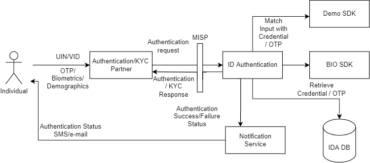
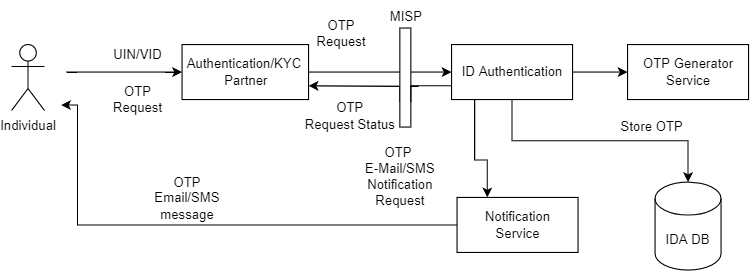
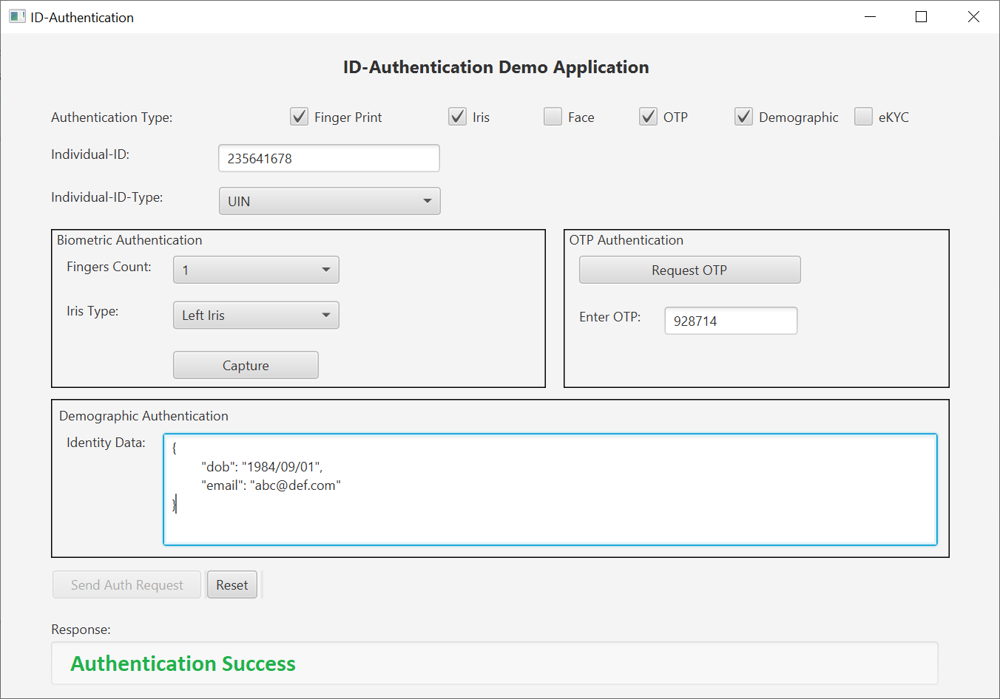

# ID Authentication Services

## Overview
ID Authentication (IDA) module of MOSIP consists of the following services:
1. Authentication Services
1. OTP Service
1. Internal Services

## Authentication Services
The services mentioned below are used by Authentication/e-KYC Partners.
* Authentication service- used to authenticate an individual's UIN/VID using one ore more authentication types.
* KYC Authentication service- used to request e-KYC for an individul's UIN/VID using one ore more authentication types.

## OTP Request Service
OTP Request Service is used by Authentication/e-KYC Partners to generate OTP for an individual's UIN/VID. The generated OTP is stored in IDA DB for validation during OTP Authentication.

## Internal Services
1. Internal Authentication Service - The authentication service used by internal MOSIP modules such as Resident Service, Registration Processor and Registration Client to authenticate individuals.
2. Internal OTP Service - used by Resident Service to generate OTP for an Individual for performing OTP Authentication.
3. Authentication Transaction History Service - used by Resident Service to retrieve paginated list of authentication and OTP Request transactions for an individual. 

### Credential issuance callback
* [ID Authentication](id-authentication.md) uses credential data of the individuals for performing authentication. 
* This credential is requested by [ID Repository](id-repository.md) upon any UIN insertion/update or VID creation. 
* The credential is created by Credential Service uploaded to [Datashare](datashare.md) service and the Datashare URL sent to ID-Authentication using [WebSub](websub.md) message. 
* WebSub invokes the credential-issuance callback in [ID Authentication](id-authentication.md) where the credential data is downloaded from Datashare and then stored into IDA DB.

## Key generation 

ID Authentication needs the below [keys](keys.md) to be generated during the deployment for usage in Authentication Service.

1. `IDA IDENTITY_CACHE`(K18) symmetric key to encrypt and decrypt the Zero-knowledge 10K random keys
2. `IDA ROOT` master key(K15)), `IDA module` master key(K16), `IDA-SIGN` master key
3.  Base keys `CRED_SERVICE`(K22), `IDA-FIR`(K21), `INTERNAL`(K19), `PARTNER`(K20)

## Authentication client demo app

This is a reference application to demonstrate how authentication and KYC can be performed by [Authentication Partners](partners.md#partner-types). 

Refer to the [repository](https://github.com/mosip/authentication-demo-ui/tree/1.2.0-rc2) for more details.

Below is the sample authentication demo UI image.

## Configuration
Refer to [ID Authentication Configuration Guide](https://github.com/mosip/id-authentication/blob/release-1.2.0/docs/configuration.md).

## API
Refer [API Documentation](https://mosip.github.io/documentation/1.2.0-rc2/1.2.0-rc2.html).

## Source code 
[Github repo](https://github.com/mosip/id-authentication/tree/1.2.0-rc2).

