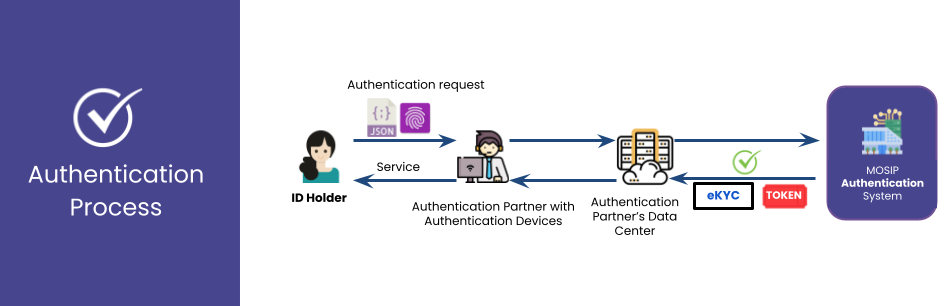

# ✅ ID Authentication

## Overview

MOSIP provides robust identity verification services allowing residents to use their identities across various contexts securely. Once an ID is successfully issued, residents gain access to these verification services. Online identity verification is facilitated through [eSignet](https://docs.esignet.io/), offering a seamless and secure way to authenticate identity. eSignet leverages MOSIP's internal [ID Authentication (IDA)](https://docs.mosip.io/1.2.0/modules/id-authentication-services) module, which operates as a backend process. As a foundational ID system, MOSIP allows various services—both governmental and private—to validate a resident's identity using a single, unified system, eliminating the need for multiple authentication solutions. The typical authentication flow is illustrated below:

## Authentication types

The following types of authentication are offered by MOSIP's ID Authentication (IDA) module and are utilized through **eSignet** for ID verification by external parties:

### Yes/No Authentication

MOSIP offers a _yes/no_ API that can be used for the verification of attributes supplied along with authentication factors. The API verifies the identifier and the provided demographic attributes and also validates other authentication factors such as the OTP or biometrics and responds with a _yes_ or a _no_. Successful verification of the data results in a _yes_. This kind of API can be typically used to support the verification of a limited set of demographic data about the person or for simple presence verification when biometrics are used.

### KYC Authentication

MOSIP additionally offers a KYC API, which can be used to get an authorized set of attributes for the resident in the response of the API. This API is intended for use by authorized relying parties to perform KYC requests. The authentication includes an identifier along with authentication factors such as OTP and biometrics. The information returned is governed by a policy. Different relying parties can be provided with different KYC data based on their needs. The policy helps implement selective disclosure as part of the KYC data. The data thus returned is digitally signed by the server and can be used by the relying party with confidence.

### Multifactor authentication

The authentication APIs support multiple factors. These can be:

* Biometric: Finger, face, iris
* Demographic: Name, date of birth, age, gender, etc.
* OTP: One-Time Password Based on the level of assurance needed for the transaction, the relying party can decide which factors are sufficient for identity verification.
* Password-based authentication.

Biometric authentication is performed using third-party matcher SDK that performs 1:1 matches on a given modality. Each biometric modality is treated as an independent factor in authentication.

## VID

All authentications in MOSIP operate on a 1:1 matching principle. This requires the authentication request to include an identifier for the individual, along with authentication factors to verify the identity. MOSIP supports multiple identifiers for each person, which enhances privacy and prevents profiling. The individual can be authenticated using their UIN or alternate identifiers like VIDs. When a VID is used, additional checks ensure it hasn't expired or been revoked. The expiration of a VID is governed by the policy set during its creation.

To understand VIDs and their characteristics, read more about [VID](id-lifecycle-management/identifiers.md#vid).

## Tokenization

In certain contexts, identity verification can be performed anonymously for one-time use. However, when identity verification is tied to transactions requiring identity assurance, it becomes necessary to link the user's identity to the transaction. This is done by providing relying parties with a "sticky" token identifier, which can serve as a reference ID for the individual in their system. When authentication is successful, the APIs return a token. Depending on the relying party’s policies, the token may be random or "sticky." The relying party is expected to store this token for future reference, customer identification, and audit or redressal purposes.

Learn more about the [Token ID](id-lifecycle-management/identifiers.md#token).

## Relying parties and policies

Read more about [parties and policies](modules/partner-management-services/pms-existing/partner-policies.md).

## Consent

MOSIP has a provision for specifying the user consent associated with an authentication transaction. This can be stored for audit purposes and the authentication flow can be extended to verify the consent if needed.

## Hotlisting

MOSIP has a provision to help protect against the misuse of identity. For any report of lost identity or detection of fraudulent activity by fraud, the module can require the temporary suspension of authentication activities on a user. This is enabled by the hotlisting feature. The authentication service checks if the identifier used is hotlisted and if so, the authentication process is aborted and fails. The hotlisting service can be used by helpdesk and fraud solutions to list and delist the identifiers that need to be blocked temporarily.
