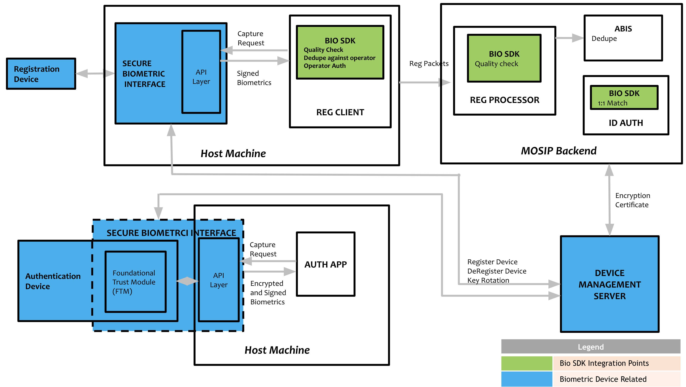

# Biometric SDK

## Biometric SDK

### Biometric SDK

#### Overview

The BioSDK diagram illustrates how MOSIP integrates biometric devices for registration and authentication. It shows the flow of biometric data from capture devices through the Secure Biometric Interface (SBI) to the BioSDK, which performs quality checks, deduplication, and operator authentication.

For registration, signed biometrics are sent to the MOSIP backend, where the BioSDK ensures data quality, ABIS handles deduplication, and ID Auth manages 1:1 matching. During authentication, encrypted biometrics are verified via the authentication app. Device management, including registration, deregistration, and key rotation, is handled by the Device Management Server.



#### Applications

* Registration Client.
* Backend quality check.
* Biometric authentication during onboarding (internal auth).
* ID Authentications.

#### Biometric SDK library

The library is used by the [Registration Client](../../identity-issuance/registration-client/) to perform 1:N match, segmentation, extraction, etc. For more information on integration with Registration Client, refer to the [Registration Client Biometric SDK Integration Guide](https://github.com/mosip/documentation/blob/1.2.0/docs/registration-client-sdk-integration.md).

A simulation of this library is available as [Mock BioSDK](https://github.com/mosip/mosip-mock-services/tree/release-1.2.0/mock-sdk). The same is installed in the [MOSIP sandbox](../../../readme/technology/sandbox-details.md).

#### Biometric SDK service

For 1:1 match and quality check of biometrics at the MOSIP backend, the BioSDK must be running as a service that can be accessed by [Registration Processor](../../identity-issuance/registration-processor/) and [IDA Internal Services](../../identity-verification/id-authentication-services/#internal-services). The service exposes REST APIs specified [here](biometric-sdk.md#api).

A [simulation (mock) service](https://github.com/mosip/biosdk-services/tree/release-1.2.0) has been provided. The mock service loads [mock BioSDK](https://github.com/mosip/mosip-mock-services/tree/release-1.2.0/mock-sdk) internally on the startup and exposes the endpoints to perform 1:N match, segmentation, and extraction as per [IBioAPI](https://github.com/mosip/commons/blob/release-1.2.0/kernel/kernel-biometrics-api/src/main/java/io/mosip/kernel/biometrics/spi/IBioApi.java).

The service may be packaged as a docker running inside the [MOSIP Kubernetes cluster](https://github.com/mosip/mosip-infra/blob/release-1.2.0/deployment/v3/cluster/README.md) or running separately on a server. The scalability of this service must be taken care of depending on the load on the system, i.e., the rate of enrolment and ID authentication.

#### API

1. BioSDK library: [IBioAPIV2](https://github.com/mosip/bio-utils/blob/4a708ba24e9553dc187ecae468b07987744431c8/kernel-biometrics-api/src/main/java/io/mosip/kernel/biometrics/spi/IBioApiV2.java#L15)
2. BioSDK service: TBD.

#### Testing kit

BioSDK server request/response may be tested using the [BioSDK testing kit](https://github.com/mosip/biosdk-testing-kit.git).

#### Configuration

The following properties in [`application-default.properties`](biometric-sdk.md) needs to be updated to integrate the BioSDK library and service with MOSIP.

```properties
mosip.fingerprint.provider=io.mosip.kernel.bioapi.impl.BioApiImpl
mosip.face.provider=io.mosip.kernel.bioapi.impl.BioApiImpl
mosip.iris.provider=io.mosip.kernel.bioapi.impl.BioApiImpl
mosip.ida.biosdk-service.url=http://mock-biosdk-service.default:80
mosip.regproc.biosdk-service.url=http://mock-biosdk-service.default:80
mosip.idrepo.biosdk-service.url=http://mock-biosdk-service.default:80

```

## BIOSDK Scenarios & Sample Payloads

Below are various biometric capture and response scenarios, each accompanied by sample request and response JSON payloads. These examples illustrate how different modalities (such as iris, fingerprint, and face) are represented in the payloads, including normal captures, partial exceptions, and total exceptions.

For a comprehensive understanding of the structure, parameters, and field definitions used in these payloads, refer to the [CBEFF Sample](https://docs.mosip.io/1.2.0/id-lifecycle-management/supporting-components/biometrics/cbeff-xml#cbeff-sample). The CBEFF (Common Biometric Exchange Formats Framework) standard defines the organization of biometric data blocks, metadata, and segment information, ensuring interoperability and consistency across biometric systems.

Each scenario includes:

* A brief description of the use case (e.g., both eyes captured, single finger, exception cases).
* Sample JSON payloads for both request and response, demonstrating the expected structure and key fields.
* Explanations of how to indicate exceptions or missing modalities within the payloads.

Refer to the linked CBEFF documentation for detailed definitions of fields such as `bdb`, `sb`, `quality`, `EXCEPTION`, and others.

## Both Eyes Capture

Sample payload demonstrating a normal capture scenario where in biometric data for both eyes (Left and Right) is collected.**Note**: For now, here with this example we are providing the sample which considers both the eyes (left and right) and have called it normal scenario as this presents a successful capture of data of both the eyes (left and right), however a typical normal scenario will include a successful capture of all the modalities such as both the eyes, all fingers and face.

This request structure is used when capturing both eyes without any exceptions or missing modalities.

#### Sample Request

<details>

<summary>Both Eyes capture: Sample Request</summary>

```json
{
	"sample": {
		"segments": [
			{
				"version": {
					"major": 1,
					"minor": 1
				},
				"cbeffversion": {
					"major": 1,
					"minor": 1
				},
				"birInfo": {
					"integrity": false
				},
				"bdbInfo": {
					"index": "d118f98b-1556-495b-9678-bd567bf3062e",
					"format": {
						"organization": "Mosip",
						"type": "9"
					},
					"creationDate": {
						"date": {
							"year": 2025,
							"month": 5,
							"day": 7
						},
						"time": {
							"hour": 11,
							"minute": 28,
							"second": 19,
							"nano": 371670900
						}
					},
					"type": [
						"IRIS"
					],
					"subtype": [
						"Left"
					],
					"level": "RAW",
					"purpose": "ENROLL",
					"quality": {
						"algorithm": {
							"organization": "HMAC",
							"type": "SHA-256"
						},
						"score": 100
					}
				},
				"bdb":[], // RklSADAyMA\..... 
				"sb": [], // ZXlKNE5XTWlP.....
				"others": {
					"SPEC_VERSION": "0.9.5",
					"RETRIES": "1",
					"FORCE_CAPTURED": "false",
					"EXCEPTION": "false",
					"PAYLOAD": "{\n    \"digitalId\": \"ewogICAgImFsZyI6ICJSUzI1NiIsCiAgICAidHlwIjogIkpXVCIsCiAgICAieDVjIjogWwogICAgICAgICJNSUlEZERDQ0FseWdBd0lCQWdJRU1vWWRPekFOQmdrcWhraUc5dzBCQVFzRkFEQmtNUXN3Q1FZRFZRUUdFd0pWVXpFUk1BOEdBMVVFQ0F3SVZtbHlaMmx1YVdFeEVEQU9CZ05WQkFjTUIwWmhhWEptWVhneEV6QVJCZ05WQkFvTUNrbHlhVlJsWTJoSmJtTXhHekFaQmdOVkJBTU1Fa2x5YVZSbFkyaEpibU1nVTNSaFoybHVaekFlRncweU5UQTFNRGN4TVRFNU16WmFGdzB5TlRBMk1EWXhNVEU1TXpaYU1GQXhDekFKQmdOVkJBWVRBbFZUTVJNd0VRWURWUVFMRXdwTllXNWhaMlZ0Wlc1ME1STXdFUVlEVlFRS0V3cEpjbWxVWldOb1NXNWpNUmN3RlFZRFZRUURFdzVKY21sVVpXTm9JRVJsZG1salpUQ0NBU0l3RFFZSktvWklodmNOQVFFQkJRQURnZ0VQQURDQ0FRb0NnZ0VCQUtkQ1R5Mm9PTm5oWEZEOGl5Y3ZxVkF4dnY2MDJ6SW1mUFJUdzVpTWxTZDZDODlCOEI4SjVVVjA2d1JEVk9hOWN4TzFvcGQ4TktHdEtMdTlRV1dCazRTRGRjQTAxV2xZZjA4bURNVFlvOVVDOG8rNzk0azdKK2RuUDZBR3pTOEhrTkxGQW5vTklpUkpSeTVGR0pjRlFJMUtpVExqRHJKbTRzU3NoeERFZXZpVmt5NWtoNkRSYjMwbUJuakZ5TnBpMHN2ZHFpSUVvZDc3NXFxZEdLVUxNOUp3ay9FamwvVGxLZ29YL3dQMmFLeEJqdjcydWhtL3F5dGp0SkhiMkFSdndjeG9VMUNMVUk4czRsNUVVL0lKYzRsSW1oejc3QUZHS0NUTzg5YW1qYlZPbFZ6SnF0UHVCZUhsTnBaSjVxTnRuOFNzSjlSK3RINmdoUVpORk53VThZOENBd0VBQWFOQ01FQXdIUVlEVlIwT0JCWUVGTi93RzExNkFLOURlb0pSU0pSYTE4TjBmRTE3TUI4R0ExVWRJd1FZTUJhQUZDRU5pcE1NNjZkVHFSVXJBNHVXbG9udnlCUk9NQTBHQ1NxR1NJYjNEUUVCQ3dVQUE0SUJBUUJwVnVpS2YydG94TzBsTU1FNVNMYWhFcGxKQlpNU2kzNHdMcUZKZi92NWtsVkNMaHl0ZDBZa2dRVlB6dytXR0VaaWxIeFkzYkFjZTZDeVQzYjBQZzZFbTJKYjZmMmxwK0ttRUdkOVcrblByYVF2L0MrOFlwV3MrWDJkSm5WTGhsOHpDcWxPV09YQ3JwM1VFZTU5NktyZkxJbFRLUWJBZy9kZ3hPQy9NYzZxTTgvZWpzTFFlaytrdkwvWmVHMjJiSFlPcUFBc3ZTL1RlZ3FOa2E4d2xIYWtOVHNDMWw5aWppeUdUWVlSRytIMStlN3hvUzc2T3paZXFlajhpc1orNk9kZGV2NEs4eTBIaE8xeE1GMUhYUGZhUFdKak5hL0lxY1NTY1lpaWZnMGVobENrNVdDYVNtUlo1R0RhWDF0S3dKbUtydWVjUmFxOFgrRXdWaEgwc1dORiIKICAgIF0KfQ.ewogICAgInNlcmlhbE5vIjogIkRGMDA1MjAwMDAxOTg2OUEiLAogICAgIm1ha2UiOiAiSXJpU2hpZWxkIiwKICAgICJtb2RlbCI6ICJCSzIxMjFVIiwKICAgICJ0eXBlIjogIklyaXMiLAogICAgImRldmljZVN1YlR5cGUiOiAiRG91YmxlIiwKICAgICJkZXZpY2VQcm92aWRlciI6ICJJcmlUZWNoIiwKICAgICJkZXZpY2VQcm92aWRlcklkIjogIklyaVRlY2giLAogICAgImRhdGVUaW1lIjogIjIwMjUtMDUtMDdUMTE6Mjc6MTVaIgp9.pP0tNusUshMxSxFWVkZrDA_T3qk0p1g5ffFjQWp83U26Rk8DDp83btLoQP3n_5Su5g_T0vvbQa4Y9M0uuul4yroe6lArK5tcB4dPNmREs4NKPUlGOyel7w6RYQZ41Uw5vNk7MLyet7zLbwNxCzDj5Nafli1y4pSJMmXpB4Nmdk4VGupSN3vTnbAIlofPhxda1Fj-943Z06Km7ddBo7fHMDsIMlkIvckwmMcxuBE1rMKT6I7s1GzFlM2Ma9IK54qUrGmRUUJzP7HXiB8ga6J1UYSjNe0lofWYaWm0j_PhpqKrIW9JV3lVIX4A_W1ugUGcaHqKidTjNHaSGW6zx11bPA\",\n    \"deviceCode\": \"DF0052000019869A\",\n    \"deviceServiceVersion\": \"0.9.5\",\n    \"bioType\": \"Iris\",\n    \"bioSubType\": \"Left\",\n    \"purpose\": \"Registration\",\n    \"env\": \"Staging\",\n    \"bioValue\": \"<bioValue>\",\n    \"transactionId\": \"61133ef7-1d97-4208-a6fa-4fedca30ac86\",\n    \"timestamp\": \"2025-05-07T11:27:13Z\",\n    \"requestedScore\": \"80\",\n    \"qualityScore\": \"100\"\n}",
					"SDK_SCORE": "100.0"
				}
			},
			{
				"version": {
					"major": 1,
					"minor": 1
				},
				"cbeffversion": {
					"major": 1,
					"minor": 1
				},
				"birInfo": {
					"integrity": false
				},
				"bdbInfo": {
					"index": "34fdeea8-3376-498a-a7ba-e3c4a206b78d",
					"format": {
						"organization": "Mosip",
						"type": "9"
					},
					"creationDate": {
						"date": {
							"year": 2025,
							"month": 5,
							"day": 7
						},
						"time": {
							"hour": 11,
							"minute": 28,
							"second": 19,
							"nano": 371670900
						}
					},
					"type": [
						"IRIS"
					],
					"subtype": [
						"Right"
					],
					"level": "RAW",
					"purpose": "ENROLL",
					"quality": {
						"algorithm": {
							"organization": "HMAC",
							"type": "SHA-256"
						},
						"score": 100
					}
				},
				"bdb": [], // ZXlKNE5XTWlP.....
				"sb": [], // ZXlKNE5XTWlP.....
				"others": {
					"SPEC_VERSION": "0.9.5",
					"RETRIES": "1",
					"FORCE_CAPTURED": "false",
					"EXCEPTION": "false",
					"PAYLOAD": "{\n    \"digitalId\": \"ewogICAgImFsZyI6ICJSUzI1NiIsCiAgICAidHlwIjogIkpXVCIsCiAgICAieDVjIjogWwogICAgICAgICJNSUlEZERDQ0FseWdBd0lCQWdJRU1vWWRPekFOQmdrcWhraUc5dzBCQVFzRkFEQmtNUXN3Q1FZRFZRUUdFd0pWVXpFUk1BOEdBMVVFQ0F3SVZtbHlaMmx1YVdFeEVEQU9CZ05WQkFjTUIwWmhhWEptWVhneEV6QVJCZ05WQkFvTUNrbHlhVlJsWTJoSmJtTXhHekFaQmdOVkJBTU1Fa2x5YVZSbFkyaEpibU1nVTNSaFoybHVaekFlRncweU5UQTFNRGN4TVRFNU16WmFGdzB5TlRBMk1EWXhNVEU1TXpaYU1GQXhDekFKQmdOVkJBWVRBbFZUTVJNd0VRWURWUVFMRXdwTllXNWhaMlZ0Wlc1ME1STXdFUVlEVlFRS0V3cEpjbWxVWldOb1NXNWpNUmN3RlFZRFZRUURFdzVKY21sVVpXTm9JRVJsZG1salpUQ0NBU0l3RFFZSktvWklodmNOQVFFQkJRQURnZ0VQQURDQ0FRb0NnZ0VCQUtkQ1R5Mm9PTm5oWEZEOGl5Y3ZxVkF4dnY2MDJ6SW1mUFJUdzVpTWxTZDZDODlCOEI4SjVVVjA2d1JEVk9hOWN4TzFvcGQ4TktHdEtMdTlRV1dCazRTRGRjQTAxV2xZZjA4bURNVFlvOVVDOG8rNzk0azdKK2RuUDZBR3pTOEhrTkxGQW5vTklpUkpSeTVGR0pjRlFJMUtpVExqRHJKbTRzU3NoeERFZXZpVmt5NWtoNkRSYjMwbUJuakZ5TnBpMHN2ZHFpSUVvZDc3NXFxZEdLVUxNOUp3ay9FamwvVGxLZ29YL3dQMmFLeEJqdjcydWhtL3F5dGp0SkhiMkFSdndjeG9VMUNMVUk4czRsNUVVL0lKYzRsSW1oejc3QUZHS0NUTzg5YW1qYlZPbFZ6SnF0UHVCZUhsTnBaSjVxTnRuOFNzSjlSK3RINmdoUVpORk53VThZOENBd0VBQWFOQ01FQXdIUVlEVlIwT0JCWUVGTi93RzExNkFLOURlb0pSU0pSYTE4TjBmRTE3TUI4R0ExVWRJd1FZTUJhQUZDRU5pcE1NNjZkVHFSVXJBNHVXbG9udnlCUk9NQTBHQ1NxR1NJYjNEUUVCQ3dVQUE0SUJBUUJwVnVpS2YydG94TzBsTU1FNVNMYWhFcGxKQlpNU2kzNHdMcUZKZi92NWtsVkNMaHl0ZDBZa2dRVlB6dytXR0VaaWxIeFkzYkFjZTZDeVQzYjBQZzZFbTJKYjZmMmxwK0ttRUdkOVcrblByYVF2L0MrOFlwV3MrWDJkSm5WTGhsOHpDcWxPV09YQ3JwM1VFZTU5NktyZkxJbFRLUWJBZy9kZ3hPQy9NYzZxTTgvZWpzTFFlaytrdkwvWmVHMjJiSFlPcUFBc3ZTL1RlZ3FOa2E4d2xIYWtOVHNDMWw5aWppeUdUWVlSRytIMStlN3hvUzc2T3paZXFlajhpc1orNk9kZGV2NEs4eTBIaE8xeE1GMUhYUGZhUFdKak5hL0lxY1NTY1lpaWZnMGVobENrNVdDYVNtUlo1R0RhWDF0S3dKbUtydWVjUmFxOFgrRXdWaEgwc1dORiIKICAgIF0KfQ.ewogICAgInNlcmlhbE5vIjogIkRGMDA1MjAwMDAxOTg2OUEiLAogICAgIm1ha2UiOiAiSXJpU2hpZWxkIiwKICAgICJtb2RlbCI6ICJCSzIxMjFVIiwKICAgICJ0eXBlIjogIklyaXMiLAogICAgImRldmljZVN1YlR5cGUiOiAiRG91YmxlIiwKICAgICJkZXZpY2VQcm92aWRlciI6ICJJcmlUZWNoIiwKICAgICJkZXZpY2VQcm92aWRlcklkIjogIklyaVRlY2giLAogICAgImRhdGVUaW1lIjogIjIwMjUtMDUtMDdUMTE6Mjc6MTVaIgp9.pP0tNusUshMxSxFWVkZrDA_T3qk0p1g5ffFjQWp83U26Rk8DDp83btLoQP3n_5Su5g_T0vvbQa4Y9M0uuul4yroe6lArK5tcB4dPNmREs4NKPUlGOyel7w6RYQZ41Uw5vNk7MLyet7zLbwNxCzDj5Nafli1y4pSJMmXpB4Nmdk4VGupSN3vTnbAIlofPhxda1Fj-943Z06Km7ddBo7fHMDsIMlkIvckwmMcxuBE1rMKT6I7s1GzFlM2Ma9IK54qUrGmRUUJzP7HXiB8ga6J1UYSjNe0lofWYaWm0j_PhpqKrIW9JV3lVIX4A_W1ugUGcaHqKidTjNHaSGW6zx11bPA\",\n    \"deviceCode\": \"DF0052000019869A\",\n    \"deviceServiceVersion\": \"0.9.5\",\n    \"bioType\": \"Iris\",\n    \"bioSubType\": \"Right\",\n    \"purpose\": \"Registration\",\n    \"env\": \"Staging\",\n    \"bioValue\": \"<bioValue>\",\n    \"transactionId\": \"61133ef7-1d97-4208-a6fa-4fedca30ac86\",\n    \"timestamp\": \"2025-05-07T11:27:13Z\",\n    \"requestedScore\": \"80\",\n    \"qualityScore\": \"100\"\n}",
					"SDK_SCORE": "100.0"
				}
			}
		],
		"others": {}
	},
	"modalitiesToExtract": [
		"IRIS"
	],
	"flags": {
		"iris.format": "Iris"
	}
}
```

</details>

#### Sample Response

<details>

<summary>Both Eyes Capture: Sample Response</summary>

```json
{
	"version": "0.9",
	"responsetime": "2025-05-07T13:28:58.379Z",
	"response": {
		"statusCode": 200,
		"statusMessage": "OK",
		"response": {
			"version": null,
			"cbeffversion": null,
			"birInfo": null,
			"segments": [
				{
					"version": {
						"major": 1,
						"minor": 1
					},
					"cbeffversion": {
						"major": 1,
						"minor": 1
					},
					"birInfo": {
						"creator": null,
						"index": null,
						"payload": null,
						"integrity": false,
						"creationDate": null,
						"notValidBefore": null,
						"notValidAfter": null
					},
					"bdbInfo": {
						"challengeResponse": null,
						"index": "d118f98b-1556-495b-9678-bd567bf3062e",
						"format": {
							"organization": "Mosip",
							"type": "9"
						},
						"encryption": null,
						"creationDate": {
							"date": {
								"year": 2025,
								"month": 5,
								"day": 7
							},
							"time": {
								"hour": 11,
								"minute": 28,
								"second": 19,
								"nano": 371670900
							}
						},
						"notValidBefore": null,
						"notValidAfter": null,
						"type": [
							"IRIS"
						],
						"subtype": [
							"Left"
						],
						"level": "PROCESSED",
						"product": null,
						"captureDevice": null,
						"featureExtractionAlgorithm": null,
						"comparisonAlgorithm": null,
						"compressionAlgorithm": null,
						"purpose": "VERIFY",
						"quality": {
							"algorithm": {
								"organization": "HMAC",
								"type": "SHA-256"
							},
							"score": 100,
							"qualityCalculationFailed": null
						}
					},
					"bdb": [], // ZXlKNE5XTWlP.....
					"sb": null,
					"birs": null,
					"sbInfo": null,
					"others": {}
				},
				{
					"version": {
						"major": 1,
						"minor": 1
					},
					"cbeffversion": {
						"major": 1,
						"minor": 1
					},
					"birInfo": {
						"creator": null,
						"index": null,
						"payload": null,
						"integrity": false,
						"creationDate": null,
						"notValidBefore": null,
						"notValidAfter": null
					},
					"bdbInfo": {
						"challengeResponse": null,
						"index": "34fdeea8-3376-498a-a7ba-e3c4a206b78d",
						"format": {
							"organization": "Mosip",
							"type": "9"
						},
						"encryption": null,
						"creationDate": {
							"date": {
								"year": 2025,
								"month": 5,
								"day": 7
							},
							"time": {
								"hour": 11,
								"minute": 28,
								"second": 19,
								"nano": 371670900
							}
						},
						"notValidBefore": null,
						"notValidAfter": null,
						"type": [
							"IRIS"
						],
						"subtype": [
							"Right"
						],
						"level": "PROCESSED",
						"product": null,
						"captureDevice": null,
						"featureExtractionAlgorithm": null,
						"comparisonAlgorithm": null,
						"compressionAlgorithm": null,
						"purpose": "VERIFY",
						"quality": {
							"algorithm": {
								"organization": "HMAC",
								"type": "SHA-256"
							},
							"score": 100,
							"qualityCalculationFailed": null
						}
					},
					"bdb": [], // Sample data for Right Iris
					"sb": null,
					"birs": null,
					"sbInfo": null,
					"others": {}
				}
			],
			"others": {}
		}
	},
	"errors": []
}

```

</details>

## Partial Exceptions

In some scenarios, not all biometric modalities can be successfully captured. For example, if only one eye (left or right) is captured and the other is unavailable due to a medical or physical exception, the request and response payloads must indicate this partial exception.

A partial exception occurs when:

* Only a subset of the required modalities or subtypes (e.g., only the left iris) is captured.
* The remaining modalities or subtypes (e.g., right iris) are marked as exception.

In the request payload, the segment corresponding to the missing or exceptional modality will have:

* `"EXCEPTION": "true"` in the `others` field.
* A `quality.score` of `0` in the `bdbInfo`.
* Typically, empty or omitted `bdb` and `sb` fields.

The response will reflect the same, indicating which segments were processed normally and which were marked as exceptions. This allows downstream systems to distinguish between successfully captured biometrics and those unavailable due to exceptions.

Refer to the sample request and response below for a single-eye capture with a partial exception for the other eye.

### Single Eye - Exception Capture (Sample Request)

This scenario demonstrates a partial exception where only one eye (e.g., left iris) is successfully captured, while the other (right iris) may be unavailable due to a medical or physical reason. The request payload marks the missing eye as an exception, allowing the system to process available biometrics while recording the exception for the other.

<details>

<summary>Sample Request</summary>

```json

{
	"sample": {
		"segments": [
			{
				"version": {
					"major": 1,
					"minor": 1
				},
				"cbeffversion": {
					"major": 1,
					"minor": 1
				},
				"birInfo": {
					"integrity": false
				},
				"bdbInfo": {
					"index": "1964589a-8c67-4fa3-8f81-ccc5d9863ee9",
					"format": {
						"organization": "Mosip",
						"type": "9"
					},
					"creationDate": {
						"date": {
							"year": 2025,
							"month": 5,
							"day": 7
						},
						"time": {
							"hour": 12,
							"minute": 13,
							"second": 41,
							"nano": 831325700
						}
					},
					"type": [
						"IRIS"
					],
					"subtype": [
						"Left"
					],
					"level": "RAW",
					"purpose": "ENROLL",
					"quality": {
						"algorithm": {
							"organization": "HMAC",
							"type": "SHA-256"
						},
						"score": 100
					}
				},
				"bdb": [], //ZXlKNE5XTWlP.....
				"sb": [], // ZXlKNE5XTWlP.....
				"others": {
					"SPEC_VERSION": "0.9.5",
					"RETRIES": "1",
					"FORCE_CAPTURED": "false",
					"EXCEPTION": "false",
					"PAYLOAD": "{\n    \"digitalId\": \"ewogICAgImFsZyI6ICJSUzI1NiIsCiAgICAidHlwIjogIkpXVCIsCiAgICAieDVjIjogWwogICAgICAgICJNSUlEZERDQ0FseWdBd0lCQWdJRU1vWWRPekFOQmdrcWhraUc5dzBCQVFzRkFEQmtNUXN3Q1FZRFZRUUdFd0pWVXpFUk1BOEdBMVVFQ0F3SVZtbHlaMmx1YVdFeEVEQU9CZ05WQkFjTUIwWmhhWEptWVhneEV6QVJCZ05WQkFvTUNrbHlhVlJsWTJoSmJtTXhHekFaQmdOVkJBTU1Fa2x5YVZSbFkyaEpibU1nVTNSaFoybHVaekFlRncweU5UQTFNRGN4TVRFNU16WmFGdzB5TlRBMk1EWXhNVEU1TXpaYU1GQXhDekFKQmdOVkJBWVRBbFZUTVJNd0VRWURWUVFMRXdwTllXNWhaMlZ0Wlc1ME1STXdFUVlEVlFRS0V3cEpjbWxVWldOb1NXNWpNUmN3RlFZRFZRUURFdzVKY21sVVpXTm9JRVJsZG1salpUQ0NBU0l3RFFZSktvWklodmNOQVFFQkJRQURnZ0VQQURDQ0FRb0NnZ0VCQUtkQ1R5Mm9PTm5oWEZEOGl5Y3ZxVkF4dnY2MDJ6SW1mUFJUdzVpTWxTZDZDODlCOEI4SjVVVjA2d1JEVk9hOWN4TzFvcGQ4TktHdEtMdTlRV1dCazRTRGRjQTAxV2xZZjA4bURNVFlvOVVDOG8rNzk0azdKK2RuUDZBR3pTOEhrTkxGQW5vTklpUkpSeTVGR0pjRlFJMUtpVExqRHJKbTRzU3NoeERFZXZpVmt5NWtoNkRSYjMwbUJuakZ5TnBpMHN2ZHFpSUVvZDc3NXFxZEdLVUxNOUp3ay9FamwvVGxLZ29YL3dQMmFLeEJqdjcydWhtL3F5dGp0SkhiMkFSdndjeG9VMUNMVUk4czRsNUVVL0lKYzRsSW1oejc3QUZHS0NUTzg5YW1qYlZPbFZ6SnF0UHVCZUhsTnBaSjVxTnRuOFNzSjlSK3RINmdoUVpORk53VThZOENBd0VBQWFOQ01FQXdIUVlEVlIwT0JCWUVGTi93RzExNkFLOURlb0pSU0pSYTE4TjBmRTE3TUI4R0ExVWRJd1FZTUJhQUZDRU5pcE1NNjZkVHFSVXJBNHVXbG9udnlCUk9NQTBHQ1NxR1NJYjNEUUVCQ3dVQUE0SUJBUUJwVnVpS2YydG94TzBsTU1FNVNMYWhFcGxKQlpNU2kzNHdMcUZKZi92NWtsVkNMaHl0ZDBZa2dRVlB6dytXR0VaaWxIeFkzYkFjZTZDeVQzYjBQZzZFbTJKYjZmMmxwK0ttRUdkOVcrblByYVF2L0MrOFlwV3MrWDJkSm5WTGhsOHpDcWxPV09YQ3JwM1VFZTU5NktyZkxJbFRLUWJBZy9kZ3hPQy9NYzZxTTgvZWpzTFFlaytrdkwvWmVHMjJiSFlPcUFBc3ZTL1RlZ3FOa2E4d2xIYWtOVHNDMWw5aWppeUdUWVlSRytIMStlN3hvUzc2T3paZXFlajhpc1orNk9kZGV2NEs4eTBIaE8xeE1GMUhYUGZhUFdKak5hL0lxY1NTY1lpaWZnMGVobENrNVdDYVNtUlo1R0RhWDF0S3dKbUtydWVjUmFxOFgrRXdWaEgwc1dORiIKICAgIF0KfQ.ewogICAgInNlcmlhbE5vIjogIkRGMDA1MjAwMDAxOTg2OUEiLAogICAgIm1ha2UiOiAiSXJpU2hpZWxkIiwKICAgICJtb2RlbCI6ICJCSzIxMjFVIiwKICAgICJ0eXBlIjogIklyaXMiLAogICAgImRldmljZVN1YlR5cGUiOiAiRG91YmxlIiwKICAgICJkZXZpY2VQcm92aWRlciI6ICJJcmlUZWNoIiwKICAgICJkZXZpY2VQcm92aWRlcklkIjogIklyaVRlY2giLAogICAgImRhdGVUaW1lIjogIjIwMjUtMDUtMDdUMTI6MTI6MzFaIgp9.n7KnKGjO0vNMyhuXBGMl_z-iarKadc1i0_auV7s7ehQY31TLAkKPmFEi8zEJlDh4f9KB-L7HescoYIM_MdEYwCpInema_K5bhpY_3QSj_5sKQmTnQSYIRAEp8twNblrDJYxaK6dY83DzOZyJV-mif7rWw4IGgA7OMH1qDLYrQ1eoFraSb2_YS9b0N_tHcZbkr-Q_q-ZzqdBylIpUuh3KuIMPzcgwFwRwn8yIrtONj-fg-wo03E5wfpNRmOiLxa5qdLp_5ZzG2MDfRtsSYLoh2-E-Ms_H50C6tLVNMB8FBJhVx0RLNXMI_M4a6p_EGmfUUNAKMsOI1XNZ8VJAv9H5YQ\",\n    \"deviceCode\": \"DF0052000019869A\",\n    \"deviceServiceVersion\": \"0.9.5\",\n    \"bioType\": \"Iris\",\n    \"bioSubType\": \"Left\",\n    \"purpose\": \"Registration\",\n    \"env\": \"Staging\",\n    \"bioValue\": \"<bioValue>\",\n    \"transactionId\": \"0ad321b6-18e4-4e0e-9b7a-c33a00e443da\",\n    \"timestamp\": \"2025-05-07T12:12:30Z\",\n    \"requestedScore\": \"80\",\n    \"qualityScore\": \"100\"\n}",
					"SDK_SCORE": "100.0"
				}
			},
			{
				"version": {
					"major": 1,
					"minor": 1
				},
				"cbeffversion": {
					"major": 1,
					"minor": 1
				},
				"birInfo": {
					"integrity": false
				},
				"bdbInfo": {
					"index": "9f9b9c04-99f2-4620-bbed-e2463e1678ca",
					"format": {
						"organization": "Mosip",
						"type": "9"
					},
					"creationDate": {
						"date": {
							"year": 2025,
							"month": 5,
							"day": 7
						},
						"time": {
							"hour": 12,
							"minute": 13,
							"second": 41,
							"nano": 831325700
						}
					},
					"type": [
						"IRIS"
					],
					"subtype": [
						"Right"
					],
					"level": "RAW",
					"purpose": "ENROLL",
					"quality": {
						"algorithm": {
							"organization": "HMAC",
							"type": "SHA-256"
						},
						"score": 0
					}
				},
				"others": {
					"SPEC_VERSION": "",
					"RETRIES": "0",
					"FORCE_CAPTURED": "false",
					"EXCEPTION": "true",
					"PAYLOAD": "",
					"SDK_SCORE": "0.0"
				}
			}
		],
		"others": {}
	},
	"modalitiesToExtract": [
		"IRIS"
	],
	"flags": {
		"iris.format": "Iris"
	}
}


```

</details>

### Single Eye - Exception Response (Sample Response - Right Eye iris data not captured)

This sample response shows a partial exception scenario wherein only the left iris is processed successfully, while the right iris is marked as an exception (not captured). The left segment contains processed data, and the right segment has `"EXCEPTION": "true"` and a quality score of `0`, indicating the exception.

<details>

<summary>Sample Response</summary>

```json

{
	"version": "0.9",
	"responsetime": "2025-05-07T13:48:27.596Z",
	"response": {
		"statusCode": 200,
		"statusMessage": "OK",
		"response": {
			"version": null,
			"cbeffversion": null,
			"birInfo": null,
			"segments": [
				{
					"version": {
						"major": 1,
						"minor": 1
					},
					"cbeffversion": {
						"major": 1,
						"minor": 1
					},
					"birInfo": {
						"creator": null,
						"index": null,
						"payload": null,
						"integrity": false,
						"creationDate": null,
						"notValidBefore": null,
						"notValidAfter": null
					},
					"bdbInfo": {
						"challengeResponse": null,
						"index": "1964589a-8c67-4fa3-8f81-ccc5d9863ee9",
						"format": {
							"organization": "Mosip",
							"type": "9"
						},
						"encryption": null,
						"creationDate": {
							"date": {
								"year": 2025,
								"month": 5,
								"day": 7
							},
							"time": {
								"hour": 12,
								"minute": 13,
								"second": 41,
								"nano": 831325700
							}
						},
						"notValidBefore": null,
						"notValidAfter": null,
						"type": [
							"IRIS"
						],
						"subtype": [
							"Left"
						],
						"level": "PROCESSED",
						"product": null,
						"captureDevice": null,
						"featureExtractionAlgorithm": null,
						"comparisonAlgorithm": null,
						"compressionAlgorithm": null,
						"purpose": "VERIFY",
						"quality": {
							"algorithm": {
								"organization": "HMAC",
								"type": "SHA-256"
							},
							"score": 100,
							"qualityCalculationFailed": null
						}
					},
					"bdb": [], // ZXlKNE5XTWlP.....
					"sb": null,
					"birs": null,
					"sbInfo": null,
					"others": {}
				}
				{
				"version": {
					"major": 1,
					"minor": 1
				},
				"cbeffversion": {
					"major": 1,
					"minor": 1
				},
				"birInfo": {
					"integrity": false
				},
				"bdbInfo": {
					"index": "9f9b9c04-99f2-4620-bbed-e2463e1678ca",
					"format": {
						"organization": "Mosip",
						"type": "9"
					},
					"creationDate": {
						"date": {
							"year": 2025,
							"month": 5,
							"day": 7
						},
						"time": {
							"hour": 12,
							"minute": 13,
							"second": 41,
							"nano": 831325700
						}
					},
					"type": [
						"IRIS"
					],
					"subtype": [
						"Right"
					],
					"level": "RAW",
					"purpose": "ENROLL",
					"quality": {
						"algorithm": {
							"organization": "HMAC",
							"type": "SHA-256"
						},
						"score": 0
					}
				},
				"others": {
					"SPEC_VERSION": "",
					"RETRIES": "0",
					"FORCE_CAPTURED": "false",
					"EXCEPTION": "true",
					"PAYLOAD": "",
					"SDK_SCORE": "0.0"
				}
			}
			],
			"others": {}
		}
	},
	"errors": []
}

```

</details>

## Total Exceptions

'Entire Modality Marked as Exception' This scenario occurs when all required subtypes of a modality (e.g., both eyes for iris, all fingers for fingerprint, or face) cannot be captured due to medical or physical reasons. In the sample request, both left and right iris segments have `EXCEPTION": true` `quality.score` of `0`, indicating that no valid biometric data was collected for either eye. The same approach applies for all fingers or face if those modalities are unavailable.

### Both Eyes (Left and Right - Total Exception) Sample Request

**Note**: For total exception the scenario considered here is only for both the eyes only i.e. Right and Left eyes (and not all modalities such as fingers, face etc.)

<details>

<summary>Sample Request</summary>

```json

{
	"sample": {
		"segments": [
			{
				"version": {
					"major": 1,
					"minor": 1
				},
				"cbeffversion": {
					"major": 1,
					"minor": 1
				},
				"birInfo": {
					"integrity": false
				},
				"bdbInfo": {
					"index": "aa597540-0866-40fd-a303-6ea82ccb9ca0",
					"format": {
						"organization": "Mosip",
						"type": "9"
					},
					"creationDate": {
						"date": {
							"year": 2025,
							"month": 5,
							"day": 7
						},
						"time": {
							"hour": 11,
							"minute": 25,
							"second": 18,
							"nano": 450031100
						}
					},
					"type": [
						"IRIS"
					],
					"subtype": [
						"Left"
					],
					"level": "RAW",
					"purpose": "ENROLL",
					"quality": {
						"algorithm": {
							"organization": "HMAC",
							"type": "SHA-256"
						},
						"score": 0
					}
				},
				"others": {
					"SPEC_VERSION": "",
					"RETRIES": "0",
					"FORCE_CAPTURED": "false",
					"EXCEPTION": "true",
					"PAYLOAD": "",
					"SDK_SCORE": "0.0"
				}
			},
			{
				"version": {
					"major": 1,
					"minor": 1
				},
				"cbeffversion": {
					"major": 1,
					"minor": 1
				},
				"birInfo": {
					"integrity": false
				},
				"bdbInfo": {
					"index": "043518b0-2a13-4702-9327-4060b532d5ee",
					"format": {
						"organization": "Mosip",
						"type": "9"
					},
					"creationDate": {
						"date": {
							"year": 2025,
							"month": 5,
							"day": 7
						},
						"time": {
							"hour": 11,
							"minute": 25,
							"second": 18,
							"nano": 450031100
						}
					},
					"type": [
						"IRIS"
					],
					"subtype": [
						"Right"
					],
					"level": "RAW",
					"purpose": "ENROLL",
					"quality": {
						"algorithm": {
							"organization": "HMAC",
							"type": "SHA-256"
						},
						"score": 0
					}
				},
				"others": {
					"SPEC_VERSION": "",
					"RETRIES": "0",
					"FORCE_CAPTURED": "false",
					"EXCEPTION": "true",
					"PAYLOAD": "",
					"SDK_SCORE": "0.0"
				}
			}
		],
		"others": {}
	},
	"modalitiesToExtract": [
		"IRIS"
	],
	"flags": {
		"iris.format": "Iris"
	}
}

```

</details>

### Both Eyes (Left and Right - Total Exception) Sample Response

**Note**: For total exception the scenario considered here is only for both the eyes i.e. Left and Right eyes (and not all modalities such as finguers, face etc.)\
Here the response shows `EXCEPTION": true` and the quality score is `0`.

<details>

<summary>Sample Response</summary>

```json

{
	"sample": {
		"segments": [
			{
				"version": {
					"major": 1,
					"minor": 1
				},
				"cbeffversion": {
					"major": 1,
					"minor": 1
				},
				"birInfo": {
					"integrity": false
				},
				"bdbInfo": {
					"index": "aa597540-0866-40fd-a303-6ea82ccb9ca0",
					"format": {
						"organization": "Mosip",
						"type": "9"
					},
					"creationDate": {
						"date": {
							"year": 2025,
							"month": 5,
							"day": 7
						},
						"time": {
							"hour": 11,
							"minute": 25,
							"second": 18,
							"nano": 450031100
						}
					},
					"type": [
						"IRIS"
					],
					"subtype": [
						"Left"
					],
					"level": "RAW",
					"purpose": "ENROLL",
					"quality": {
						"algorithm": {
							"organization": "HMAC",
							"type": "SHA-256"
						},
						"score": 0
					}
				},
				"others": {
					"SPEC_VERSION": "",
					"RETRIES": "0",
					"FORCE_CAPTURED": "false",
					"EXCEPTION": "true",
					"PAYLOAD": "",
					"SDK_SCORE": "0.0"
				}
			},
			{
				"version": {
					"major": 1,
					"minor": 1
				},
				"cbeffversion": {
					"major": 1,
					"minor": 1
				},
				"birInfo": {
					"integrity": false
				},
				"bdbInfo": {
					"index": "043518b0-2a13-4702-9327-4060b532d5ee",
					"format": {
						"organization": "Mosip",
						"type": "9"
					},
					"creationDate": {
						"date": {
							"year": 2025,
							"month": 5,
							"day": 7
						},
						"time": {
							"hour": 11,
							"minute": 25,
							"second": 18,
							"nano": 450031100
						}
					},
					"type": [
						"IRIS"
					],
					"subtype": [
						"Right"
					],
					"level": "RAW",
					"purpose": "ENROLL",
					"quality": {
						"algorithm": {
							"organization": "HMAC",
							"type": "SHA-256"
						},
						"score": 0
					}
				},
				"others": {
					"SPEC_VERSION": "",
					"RETRIES": "0",
					"FORCE_CAPTURED": "false",
					"EXCEPTION": "true",
					"PAYLOAD": "",
					"SDK_SCORE": "0.0"
				}
			}
		],
		"others": {}
	},
	"modalitiesToExtract": [
		"IRIS"
	],
	"flags": {
		"iris.format": "Iris"
	}
}

```

</details>

## Other Modalities

### Fingers

#### Just One Finger Capture - Sample Request

This example demonstrates a sample request payload to capture just one finger (e.g., right thumb). The JSON includes metadata, quality score, and sample data for only one finger segment, following the standard structure used for all modalities.

<details>

<summary>Sample Request</summary>

```json

{
	"sample": {
		"segments": [
			{
				"version": {
					"major": 1,
					"minor": 1
				},
				"cbeffversion": {
					"major": 1,
					"minor": 1
				},
				"birInfo": {
					"integrity": false
				},
				"bdbInfo": {
					"index": "6aa4ee19-2106-4691-95e8-edbd0ad65f2f",
					"format": {
						"organization": "Mosip",
						"type": "7"
					},
					"creationDate": {
						"date": {
							"year": 2025,
							"month": 5,
							"day": 7
						},
						"time": {
							"hour": 11,
							"minute": 35,
							"second": 34,
							"nano": 247309200
						}
					},
					"type": [
						"FINGER"
					],
					"subtype": [
						"Right",
						"Thumb"
					],
					"level": "RAW",
					"purpose": "ENROLL",
					"quality": {
						"algorithm": {
							"organization": "HMAC",
							"type": "SHA-256"
						},
						"score": 90
					}
				},
				"bdb": [], // RklSADAyMA\.....
				"sb": [], // ZXlKNE5XTWlP.....
				"others": {
					"SPEC_VERSION": "0.9.5",
					"RETRIES": "1",
					"FORCE_CAPTURED": "false",
					"EXCEPTION": "false",
					"PAYLOAD": "{\"digitalId\":\"eyJhbGciOiJSUzI1NiIsInR5cCI6IkpXVCIsIng1YyI6WyJNSUlEdVRDQ0FxT2dBd0lCQWdJR0FaWkhVbENmTUFzR0NTcUdTSWIzRFFFQkN6Q0JrVEVMTUFrR0ExVUVCaE1DU1U0eEVqQVFCZ05WQkFnTUNWUmxiR0Z1WjJGdVlURU1NQW9HQTFVRUJ3d0RTRmxFTVN3d0tnWURWUVFLRENOT1VISnBiV1VnVkdWamFHNXZiRzluYVdWeklGQnlhWFpoZEdVZ1RHbHRhWFJsWkRFY01Cb0dBMVVFQ3d3VFRsQnlhVzFsSUZSbFkyaHViMnh2WjJsbGN6RVVNQklHQTFVRUF3d0xUbEJ5YVcxbFJGQkxUVk13SGhjTk1qVXdOREU0TURVeE5EVTVXaGNOTWpVd05qRTNNRFV4TkRVNVdqQ0JqVEVmTUIwR0ExVUVBeE1XT1RNNU5qVXpNREk1TGxKbFlXeFRZMkZ1TFVjeE1ERVRNQkVHQTFVRUN4TUtVM1Z3Y21WdFlTQkpSREVRTUE0R0ExVUVDaE1IVTNWd2NtVnRZVEVhTUJnR0ExVUVCeE1SVW1Wd2RXSnNhV01nYjJZZ1MyOXlaV0V4R2pBWUJnTlZCQWdURVZKbGNIVmliR2xqSUc5bUlFdHZjbVZoTVFzd0NRWURWUVFHRXdKTFVqQ0NBU0l3RFFZSktvWklodmNOQVFFQkJRQURnZ0VQQURDQ0FRb0NnZ0VCQUtlcUQ2S1FZbmYwQjcyb29sM1ZldTNSNUNReDI3endhK2JTUGdHQlNIR3NVSzBKWlZrU2dtZkQrVFBSUzNOd3pKTzI4OEgyUkxxNmk0MWVzbVJMUkdDUnlWZUh1MTZOZzhtWmk5Y0t0L1JhQTZLM3RUWUxEZEU3cUliK2NYMHJqYVhDZG9KQ1kvYm5jRGRQNGFwaWxDWmhZM216Yi96NXJQRS84S1UvdnVvNm1QVHEwZEZsL1FLRDl1RlRvbDlyM0ZWMVVYUklRZFlicUVUSW4rampoaHZIenhLUDZMRUxDVkJKd1JrQURDNEdCNHZraFF3ZkNTVDgwN3Rva1REVkRHeVRKY2h3MWR0Q1M3NExnRk9HaWpzdlJzM050Qk5DQXErait1Q3g4aHkxV0RxR0kwMVRXbisxS09EZ1EwSzVySUM4RFcyd2FKc09MUW1iMW5zb0xTRUNBd0VBQWFNZE1Cc3dEQVlEVlIwVEJBVXdBd0VCL3pBTEJnTlZIUThFQkFNQ0FZWXdDd1lKS29aSWh2Y05BUUVMQTRJQkFRQ25CRnZGNERyYVBZMldLbG5yNkt4elFyWUlHejZyZktiNlN6aTRIMkk5MFBrZnc4T3Y4bS8rZ28xTU5JeHBJUkFkTnZmeXZIVFk3QTExSlhsQitBeGZTMm15THl0Z3pmNVNDVjhnUGNtZTlLYlY0VXRjWVp1VlpqNHNBTUtQR2czMmo0aWdIc0dTRnJlZVovdmlqZWxNNnFNVlpVa3RQMkswNnhkdVJ4c2c4aDNXSGM5Z3BtRHpyeU5VWlNxa29LL25UcUN3aVFBNnBoMVpKUk9mNHFaY0xpQVAwTHF1SUs3aTBnbUwzTlNKU2JBLzdmaHduemVoM2ErajlXYXJZZmRjYlNORDN3V05XR1k3NEp2Wm9IMktpS1ZaRUI0bjZCbDRPbWtaME9FQ3cwYmpSdG1MbUthTWtGbVJzWFV0VDFadElCT2lnU1JwNmk1eWduNzhOQldqIl19.eyJkYXRlVGltZSI6IjIwMjUtMDUtMDdUMTE6MzA6MTJaIiwiZGV2aWNlU3ViVHlwZSI6IlNsYXAiLCJtb2RlbCI6IlJlYWxTY2FuLUcxMCIsInR5cGUiOiJGaW5nZXIiLCJtYWtlIjoiU3VwcmVtYSBJRCIsInNlcmlhbE5vIjoiOTM5NjUzMDI5IiwiZGV2aWNlUHJvdmlkZXIiOiJOUHJpbWUgVGVjaG5vbG9naWVzIFByaXZhdGUgTGltaXRlZCIsImRldmljZVByb3ZpZGVySWQiOiJOUHJpbWVEUEtNUyJ9.Pm_TEw9AGM8dmInCvsw8vZBbJQppHMFX6aCotMZovWqg2RaIn5poQpCctzdOsR5kDED5pvIlahEF0cal0xA9EWus0i-wPpB7p4WJPKHHN7XSPOzkb5bopDZSHbfQ1_RyK6v8LQDAQIAEvhuk1xtfdw5LjEMpk3K8D5uBx7GsfJSRdkrCRvjmyndtShn7g1XiRbpelkb5sFp91QKztkge_X5YQY1oq8hw2J-1sHPknUP4BDc1vVo62TQrY8OOYLMdt3zu1hl1iVfXJvXv0DYSwZ0v5t9pC_D9TvUcEEXg5iTsRXwDcCuOjX74mquea6bXQlcNEF0e8Dmw-53SR9Yceg\",\"deviceCode\":\"939653029\",\"deviceServiceVersion\":\"0.9.5.8\",\"bioSubType\":\"Right Thumb\",\"purpose\":\"Registration\",\"env\":\"Staging\",\"bioType\":\"Finger\",\"bioValue\":\"<bioValue>\",\"transactionId\":\"a9d50790-915e-4945-93a4-75493dfb3308\",\"timestamp\":\"2025-05-07T11:30:12Z\",\"requestedScore\":\"40\",\"qualityScore\":\"90\"}",
					"SDK_SCORE": "90.0"
				}
			},
		
		],
		"others": {}
	},
	"modalitiesToExtract": [
		"FINGER"
	],
	"flags": {
		"finger.format": "fingerprint"
	}
}


```

</details>

#### Just One Finger Capture - Sample Response

Sample response for a scenario where only a single finger (e.g., right thumb) has been captured and processed. This response demonstrates the structure and key fields returned by the BioSDK when biometric data for just one finger is provided.

<details>

<summary>Sample Response</summary>

```json

{
	"version": "0.9",
	"responsetime": "2025-05-07T13:33:05.251Z",
	"response": {
		"statusCode": 200,
		"statusMessage": "OK",
		"response": {
			"version": null,
			"cbeffversion": null,
			"birInfo": null,
			"segments": [
				{
					"version": {
						"major": 1,
						"minor": 1
					},
					"cbeffversion": {
						"major": 1,
						"minor": 1
					},
					"birInfo": {
						"creator": null,
						"index": null,
						"payload": null,
						"integrity": false,
						"creationDate": null,
						"notValidBefore": null,
						"notValidAfter": null
					},
					"bdbInfo": {
						"challengeResponse": null,
						"index": "6aa4ee19-2106-4691-95e8-edbd0ad65f2f",
						"format": {
							"organization": "Mosip",
							"type": "7"
						},
						"encryption": null,
						"creationDate": {
							"date": {
								"year": 2025,
								"month": 5,
								"day": 7
							},
							"time": {
								"hour": 11,
								"minute": 35,
								"second": 34,
								"nano": 247309200
							}
						},
						"notValidBefore": null,
						"notValidAfter": null,
						"type": [
							"FINGER"
						],
						"subtype": [
							"Right",
							"Thumb"
						],
						"level": "PROCESSED",
						"product": null,
						"captureDevice": null,
						"featureExtractionAlgorithm": null,
						"comparisonAlgorithm": null,
						"compressionAlgorithm": null,
						"purpose": "VERIFY",
						"quality": {
							"algorithm": {
								"organization": "HMAC",
								"type": "SHA-256"
							},
							"score": 90,
							"qualityCalculationFailed": null
						}
					},
					"bdb": [], // RklSADAyMA\.....
					"sb": null,
					"birs": null,
					"sbInfo": null,
					"others": {}
				}
			],
			"others": {}
		}
	},
	"errors": []
}

```

</details>

### Face

#### Face - Sample Request

This sample JSON request represents a biometric capture payload for a face modality.

<details>

<summary>Sample Request</summary>

```json

{
	"sample": {
		"segments": [
			{
				"version": {
					"major": 1,
					"minor": 1
				},
				"cbeffversion": {
					"major": 1,
					"minor": 1
				},
				"birInfo": {
					"integrity": false
				},
				"bdbInfo": {
					"index": "b71dc768-0e49-4ea1-a71f-3d15637a87b2",
					"format": {
						"organization": "Mosip",
						"type": "8"
					},
					"creationDate": {
						"date": {
							"year": 2025,
							"month": 5,
							"day": 7
						},
						"time": {
							"hour": 11,
							"minute": 38,
							"second": 11,
							"nano": 683644600
						}
					},
					"type": [
						"FACE"
					],
					"subtype": [],
					"level": "RAW",
					"purpose": "ENROLL",
					"quality": {
						"algorithm": {
							"organization": "HMAC",
							"type": "SHA-256"
						},
						"score": 66
					}
				},
				"bdb": [], //Sample BDB data
				"sb": [], //Sample SB data
				"others": {
					"SPEC_VERSION": "0.9.5",
					"RETRIES": "1",
					"FORCE_CAPTURED": "false",
					"EXCEPTION": "false",
					"PAYLOAD": "{\"digitalId\":\"eyJhbGciOiJSUzI1NiIsInR5cCI6IkpXVCIsIng1YyI6WyJNSUlEeURDQ0FyQ2dBd0lCQWdJR0FaWmM1NFVyTUEwR0NTcUdTSWIzRFFFQkN3VUFNSUdWTVFzd0NRWURWUVFHRXdKSlRqRVNNQkFHQTFVRUNBd0pWRVZNUVU1SFFVNUJNUkl3RUFZRFZRUUhEQWxJV1VSRlVrRkNRVVF4TERBcUJnTlZCQW9NSTA1UWNtbHRaU0JVWldOb2JtOXNiMmRwWlhNZ1VISnBkbUYwWlNCTWFXMXBkR1ZrTVJ3d0dnWURWUVFMREJOT1VISnBiV1VnVkdWamFHNXZiRzluYVdWek1SSXdFQVlEVlFRRERBbE9VSEpwYldWRVVGTXdIaGNOTWpVd05ESXlNRGswT1RVNFdoY05NalV3TmpJeE1EazBPVFU0V2pDQmxERXRNQ3NHQTFVRUF4TWtURVl6TURBdE1qZ3lSVGc1TVRnM1EwTXdMa3hsYm05MmJ5QkdTRVFnVjJWaVkyRnRNUkF3RGdZRFZRUUxFd2RPVUZKVVpXTm9NUnd3R2dZRFZRUUtFeE5PVUhKcGJXVWdWR1ZqYUc1dmJHOW5hV1Z6TVJJd0VBWURWUVFIRXdsSWVXUmxjbUZpWVdReEVqQVFCZ05WQkFnVENWUmxiR0Z1WjJGdVlURUxNQWtHQTFVRUJoTUNTVTR3Z2dFaU1BMEdDU3FHU0liM0RRRUJBUVVBQTRJQkR3QXdnZ0VLQW9JQkFRQ3k5S0I5cFNxak1Dd1Y5eWl4NjBjQ2dlNTJvcjJkSDZrYms1bmFoQVo0SXNKeWpZZEc0VjlxR3F4N2Jrd2VGWnBHVjZKSjNaSHZXS2NwdVlFMTlxSXJ5S1ZMVHNlVXFaaUNyNjZiTWlKcU9DVzVhWTI5ajF2bi9jaVJVNlZzdzJWaHZLZ3dVaFArUHc4UmpKUFQ5dUVuNHdoUWVEeCtFUHhYcldTZTFqczhGWTg1OGNBMmNNVFJVbmwxYWJjS3NSUmpBd01RaVZSOTBwOVphWFh2WlZQVFBjbWViMnNXMi9oODJEbjhmRTJKMm10ZFFGdVhDQ1ZGWGxxSlIvS2NtdE9sWjJGZk9JdlI3OFRQUkIxcTlaVHVsQnVGMnRRVEdvMnk3MEZTMHpnSksveTBFcktSWUlua2M3YzM1T20wOTJWMXNmYTJHZ21VRmU5Q1ZKU1FYVDBQQWdNQkFBR2pIVEFiTUF3R0ExVWRFd1FGTUFNQkFmOHdDd1lEVlIwUEJBUURBZ0dHTUEwR0NTcUdTSWIzRFFFQkN3VUFBNElCQVFBZW9icFR6RGpJeXAyS041SW1pZXU1dmpoWnVXcTJJRHJVWGtIT1VRMzcvaFJES1JqZUhGdmJEbFJDNk5JaThUUjlEM1dzOUw2dUkydFNSOGY2RW80NkY3ajNwNTIyclpxcmtqZVdyYkNhUXM1RGNJTjBDblBFTWwrcnFvNUpPbit1bGF5M2dyMHVQaWEveVZyTkFHRjZqZzdMakZpODQzUWFCMzFHRDF1TDlhbE4zNWZqU1RYNXVkaDVhN05KL0ZSK2xpc2hYUVNPVlRKMmVBeUxseTRsOXR0ZG9aU3E5ME16NlNMOW05WmJRdkRlTDdOMC9JV1N2eUxUUDBMMHdoOE9ueGtVZU5sMkxKM2xLdk8rYnBIQUh6MnhzTjF5VjFsSEhoVVRFR2thYzRid0NuR1hIc3UwK2FPZEtDSFZDaGxYZ0kxemVYQmczWnZNZmNJU2hjMWoiXX0.eyJkYXRlVGltZSI6IjIwMjUtMDUtMDdUMTE6Mzc6NDJaIiwiZGV2aWNlU3ViVHlwZSI6IkZ1bGwgZmFjZSIsIm1vZGVsIjoiTGVub3ZvIEZIRCBXZWJjYW0iLCJ0eXBlIjoiRmFjZSIsIm1ha2UiOiJMZW5vdm8iLCJzZXJpYWxObyI6IkxGMzAwLTI4MkU4OTE4N0NDMCIsImRldmljZVByb3ZpZGVyIjoiTlByaW1lIFRlY2hub2xvZ2llcyBQdnQuIEx0ZC4iLCJkZXZpY2VQcm92aWRlcklkIjoiTlByaW1lRFBTIn0.Op8f1FlvrHkvtsM7Z5Cl3dQZ7twVfYowlQ_854lEQkrVbVNWMmef-2cRCTY8a6A4c0l-fkDFCXlR6nGG7KsYhettp3mEz0XRcIziGagR5xNePfOUw61M6qor4ImcD_HPd3mDGnBHkp1GsThVSenlePfbnCXuS7Y5M9dFwDG8PMVi8eh6VZQksZj8pdinpSgVIsv1A8OdXrLiY4ORpHO6sEJ2_nH5URmmKI8bws9RwIiFalE-GlJop6D4EP2zCVli8qe6elhVyvijO1Xfywqb5E623pEYFb95MeTohYb18TKSZCHFgjHXxLSSBtmZs8D4h2lvZAoAjfvVhF2Fh_35kg\",\"deviceCode\":\"LF300-282E89187CC0\",\"deviceServiceVersion\":\"0.9.5.2\",\"bioSubType\":\"null\",\"purpose\":\"Registration\",\"env\":\"Staging\",\"bioType\":\"Face\",\"bioValue\":\"<bioValue>\",\"transactionId\":\"0c669587-08e7-48ea-9bea-9b61438a4b5b\",\"timestamp\":\"2025-05-07T11:37:42Z\",\"requestedScore\":\"60\",\"qualityScore\":\"66\"}",
					"SDK_SCORE": "0.0"
				}
			}
		],
		"others": {}
	},
	"modalitiesToExtract": [
		"FACE"
	],
	"flags": {
		"face.format": "face"
	}
}


```

</details>

**Face - Sample Response**

This sample JSON response represents a biometric capture payload for a face modality.

<details>

<summary>Sample Response</summary>

```json

{
	"version": "0.9",
	"responsetime": "2025-05-07T13:36:33.796Z",
	"response": {
		"statusCode": 200,
		"statusMessage": "OK",
		"response": {
			"version": null,
			"cbeffversion": null,
			"birInfo": null,
			"segments": [
				{
					"version": {
						"major": 1,
						"minor": 1
					},
					"cbeffversion": {
						"major": 1,
						"minor": 1
					},
					"birInfo": {
						"creator": null,
						"index": null,
						"payload": null,
						"integrity": false,
						"creationDate": null,
						"notValidBefore": null,
						"notValidAfter": null
					},
					"bdbInfo": {
						"challengeResponse": null,
						"index": "b71dc768-0e49-4ea1-a71f-3d15637a87b2",
						"format": {
							"organization": "Mosip",
							"type": "8"
						},
						"encryption": null,
						"creationDate": {
							"date": {
								"year": 2025,
								"month": 5,
								"day": 7
							},
							"time": {
								"hour": 11,
								"minute": 38,
								"second": 11,
								"nano": 683644600
							}
						},
						"notValidBefore": null,
						"notValidAfter": null,
						"type": [
							"FACE"
						],
						"subtype": [],
						"level": "RAW",
						"product": null,
						"captureDevice": null,
						"featureExtractionAlgorithm": null,
						"comparisonAlgorithm": null,
						"compressionAlgorithm": null,
						"purpose": "ENROLL",
						"quality": {
							"algorithm": {
								"organization": "HMAC",
								"type": "SHA-256"
							},
							"score": 66,
							"qualityCalculationFailed": null
						}
					},
					"bdb": [], // RklSADAyMA\.....
					"sb": null,
					"birs": null,
					"sbInfo": null,
					"others": {}
				}
			],
			"others": {}
		}
	},
	"errors": []
}

```

</details>
