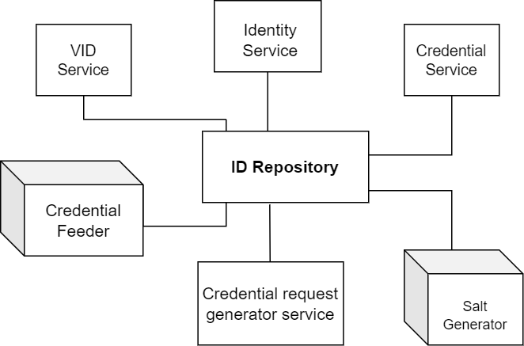
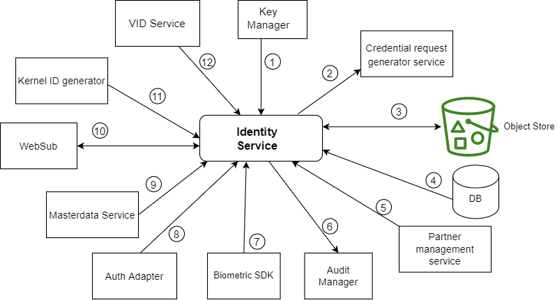
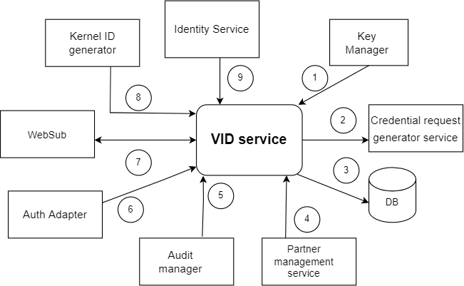
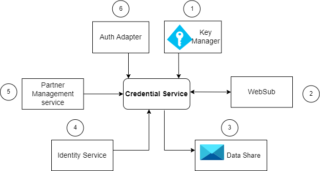
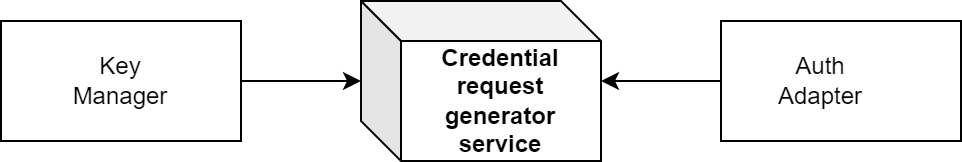

# ID Repository

## Overview
ID Repository contains the records of identity of an individual, and provides API based mechanism to store, retrieve and update identity details by other MOSIP modules. ID Repository is used by [Registration Processor](registration-processor.md), [ID Authentication](id-authentication-services.md) and [Resident Services](resdient-services.md)

## Services
ID Repository module consists of the following components:
1. Identity service
1. VID service 
1. Credential service
1. Credential Request Generator service
1. Credential Feeder 
1. Salt generator 

## Identity service
* Stores, updates, retrieves identity information and also to 
* Retrieves and updates [UIN](identifiers.md#uin) status.

Identity service uses Biometric SDK (server) to extract templates from provided biometric data.

Above is the entity relationship diagram illustrated for Identity service.
*NOTE:* The numbers do not signify sequence of operations or control flow. Arrows indicate the data flow.

1. [Key Manager](keymanager.md) encrypts/decrypts data.
2. Credential request generator issues credentials for new/updated UIN data.
3. [Object Store](storage.md#object-store) stores/retrieves biometrics and demographic documents.
4. All demographic data of UIN and references to biometric and demographic files stored in object store are stored in `mosip_idrepo` DB.
5. [Partner management service](partner-management-services.md) retrieves online verification partners to issue credentials.
6. Audit logs are logged into Audit Manager.
7. Biometric SDK extracts the templates for input biometric data.
8. Auth Adapter integrates with KeyCloak for authentication.
9. Masterdata service retreives Identity schema based on input schema version.
10. [WebSub](websub.md) publishes events related to UIN updation and auth type status updates.
11. Kernel ID generator generates UIN.
12. VID service fetches the list of VIDs associated with UIN to issue credential of update UIN and to create and activate draft VID.

## VID service
VID Service provides functionality to create/update Virtual IDs mapped against an UIN. It also provides the facility to update status of VID. VIDs are created based on the VID policy defined in the configuration.

1. Key Manager encrypts/decrypts data.
2. Credential request generator issues credentials for new/updated UIN data.
3  All VID related data is stored in `mosip_idmap` DB.
4. Partner management service retrieves online verification partners to issue credentials.
5. Audit logs are logged into Audit Manager.
6. Auth Adapter integrates with KeyCloak for authentication.
7. WebSub publish events related to VID updation.
8. Kernel ID generator generates VID.
9. Identity service checks the status of UIN to create VID.

## Credential service

1. Key Manager encrypts/decrypts data and also used to sign data.
2. WebSub subscribes to get notifications related to credential status from IDA.
3. [DataShare](datashare.md) creates datashare url for sharable attributes.
4. Identity service retrieves identity data for UIN/VID.
5. Partner management service retrieves policies related to credential type and also retrieves policy for bio-extraction.
6. Auth Adapter integrates with KeyCloak for authentication.

### Credential types

Credential types represents the credential issuance policy to each partner. It identifies the credential data that needs to be sent back to partners along with the shareable properties.

Default supported credential types are:
1. `auth`: It is used to issue credential data to authentication partners using auth policy.
2. `qrcode`: qrcode type is used for qrcode partners to issue qrcode related credential data.
3. `euin`: It is used to issue credential data to partners who wish to download euin card using euin policy.
4. `reprint`: Reprint auth type is used for issuing credential information to reprint partners.
5. `vercred`: To issue verifiable credentials to partners, vercred credential type is used.

## Credential request generator service
This service creates request for credential issuance.

1. Key Manager encrypts/decrypts data.
2. Auth Adapter integrates with KeyCloak for authentication.

## Credential feeder
This job will feed the existing UIN/ VID identity information to newly deployed IDA instance.

## Salt generator 
This is a one-time job that populates salts that are used to hash and encrypt data for Identity and VID services. This job must be executed before deploying these services.  The following tables are populated:
* `uin_hash_salt` in `mosip_idrepo` DB.
* `uin_encrypt_salt` in `mosip_idmap` DB.

In MOSIP sandbox the job is run [here](https://github.com/mosip/mosip-infra/blob/1.2.0-rc2/deployment/v3/mosip/idrepo/install.sh).

## API
Refer [API Documentation](https://mosip.github.io/documentation/1.2.0-rc2/1.2.0-rc2.html).

## Source code 
[Github repo](https://github.com/mosip/id-repository/tree/1.2.0-rc2).

