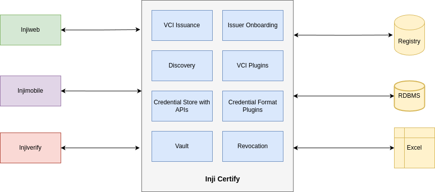

# Functional Overview

**Inji Certify** is a powerful tool that enables issuers to seamlessly connect with existing data sources to issue verifiable credentials. This section provides an understanding of the key functionalities of Inji Certify. Overall, Inji Certify serves as a versatile solution for both organizations and individuals looking to issue and manage digitally verifiable credentials efficiently. By connecting with existing databases and offering configurable credential schemas, it caters to diverse use cases across different sectors and industries.

**Inji Certify is designed for two main user groups:**

1. **Organizations:**
   * Organizations seeking to issue digitally verifiable credentials to their users, such as:
     * Educational institutions issuing academic certificates or transcripts.
     * Employers issue employment certificates, offer letters, or salary slips.
     * Government agencies issue identity documents, licenses, or permits.
   * These organizations can leverage Inji Certify to streamline the credential issuance process, ensuring authenticity and security while reducing manual efforts.
2. **Individuals:**
   * Individuals who need to attest or certify details about others, such as:
     * Tuition teachers issue weekly test or quiz certificates.
     * Employers issuing personalized letters of recommendation.
     * Professionals providing certifications or endorsements for specific skills or achievements.
   * Inji Certify empowers individuals to generate and manage verifiable credentials for various purposes, enhancing trust and credibility in their interactions.

<figure><figcaption></figcaption></figure>

**Below are the key features provided by Inji Certify:**

1. **Credential Issuance:**
   * Simplifies issuer onboarding by automating key generation and configuration, reducing manual steps.
2. **Ease of Installation:**
   * Seamlessly connects Docker-compose scripts for quick and hassle-free deployment.
   * Provides documentation for data registry plugins, empowering organizations to utilize existing data sources efficiently.
3. **Multiple VC Format Support:**
   * **JSON-LD Support:**
     * Ensures compliance with **W3C VC v1.1 standards,** promoting interoperability and adherence to industry specifications.
   * **SD-JWT Support **_**(Coming Soon)**_**:**
     * Upcoming SD-JWT support enhances token-based authentication and authorization capabilities, strengthening security.
4. **Plugable Datasources Support:**_**(Coming Soon)**_
   * Facilitates credential issuance from existing databases, improving efficiency and accessibility.
5. **Seamless Issuer Onboarding **_**(Coming Soon)**_
6. **Revocation Mechanism**_**(Coming Soon)**_
7. **Vault Integration **_**(Coming Soon)**_

**Inji** **Certify** simplifies the issuance of verifiable credentials by seamlessly integrating with existing databases and providing configurable credential schemas. With support for JSON-LD format, it ensures compatibility and compliance with industry standards. To follow the detailed installation guide to set up Inji Certify please click [**here**](https://docs.mosip.io/inji/inji-certify/build-and-deploy/local-setup) and start issuing credentials with ease.
