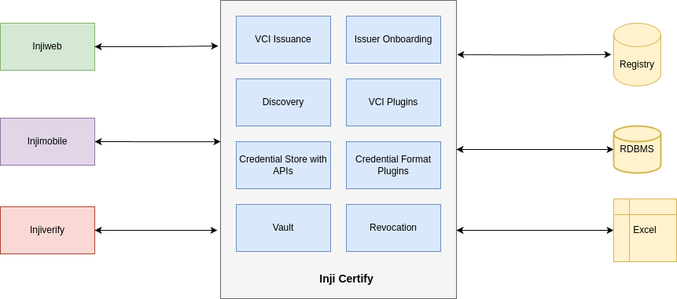

# Test

Inji Certify is a powerful tool that enables issuers to seamlessly connect with existing data sources to issue verifiable credentials. This Functional Overview provides an understanding of the key functionalities of Inji Certify’s first version. It serves as a versatile solution for both organizations and individuals looking to issue and manage digitally verifiable credentials efficiently. By connecting with existing databases and offering configurable credential schemas, it caters to diverse use cases across different sectors and industries.

## Who is the intended user of Inji Certify?

The intended users of Inji Certify are divided into two main groups:

### 1. Organizations

**Types of Organizations**

* **Educational Institutions**: Such as universities, colleges, and training centers that need to issue academic certificates, diplomas, transcripts, and other educational credentials.
* **Employers**: Companies and businesses that issue employment certificates, offer letters, salary slips, and letters of recommendation to employees.
* **Government Agencies**: Entities that issue identity documents, licenses, permits, and other official certifications.
* **Professional Associations**: Organizations that issue professional certifications, licenses, and endorsements for specific skills or achievements.

### Benefits for Organizations

* **Streamlined Credential Issuance**: Automates the process of issuing verifiable credentials, reducing manual work and administrative overhead.
* **Enhanced Security**: Ensures that issued credentials are authentic and tamper-proof.
* **Interoperability**: Supports industry standards, making credentials easily verifiable by other systems and platforms.

### 2. Individuals

**Types of Individuals**

* **Educators**: Tuition teachers, tutors, and trainers who need to issue certificates for completed courses, tests, or quizzes.
* **Employers**: Small business owners and managers who issue personalized letters of recommendation or verification of employment.
* **Professionals**: Freelancers, consultants, and other professionals who provide certifications or endorsements for skills, achievements, and project completions.

**Benefits for Individuals**

* **Empowerment**: Allows individuals to create and manage verifiable credentials for various purposes, enhancing trust and credibility in their professional and personal interactions.
* **Ease of Use**: Simplifies the process of generating and storing digital credentials.
* **Verification**: Ensures that credentials issued by individuals are recognized as authentic and verifiable.

<figure><figcaption></figcaption></figure>

## Overall Purpose

Inji Certify is designed to meet the needs of both organizations and individuals by providing a robust, secure, and easy-to-use platform for issuing and managing verifiable credentials. By supporting multiple data formats and integrating seamlessly with existing databases, Inji Certify caters to diverse use cases across various sectors and industries.

## Key Features of Inji Certify

### Credential Issuance

* **Verifiable Credential Issuance**: Seamlessly issues verifiable credentials with enhanced integration capabilities, including:
  * **MOSIP Identity Plugin**: Integrates with MOSIP for identity verification.
  * **Sunbird Plugin**: Facilitates seamless integration with Sunbird services.
  * **Mock IDA Plugin**: Allows for testing and development purposes.
  * **Data Provider Plugins:** These plugins fetch relevant data from external sources or registries. They retrieve the necessary information and return it to Inji Certify as a JSON object. Inji Certify then utilizes this data to generate and issue the corresponding VCs.
    * **Current Data Provider Plugins:**
      * Mock CSV Data Provider Plugin
      * Postgres Data Provider Plugin
* **Ease of Installation**: Utilizes Docker-compose scripts for quick deployment. Includes comprehensive documentation for efficient utilization of data registry plugins.

### Multiple VC Format Support

* **JSON-LD Support**: Ensures compliance with W3C VC v1.1 standards, promoting interoperability and adherence to industry specifications.

### Future Enhancements

* **Simplified Issuer Onboarding**: Automates key generation and configuration to reduce manual steps for new issuers.
* **Pluggable Data Sources Support**: Enables credential issuance directly from existing databases, enhancing efficiency and accessibility.
* **Revocation Mechanism**: Introduces a robust method to revoke credentials when necessary, ensuring credential integrity.
* **Vault Integration**: Enhances security and management of credentials with advanced vault integration capabilities.
* **SD-JWT Support**: Strengthens security through enhanced token-based authentication and authorization capabilities.
* **Multi-tenancy**: Supports multiple issuers on a single instance of Inji Certify, ensuring data segregation and security for diverse organizational needs.
