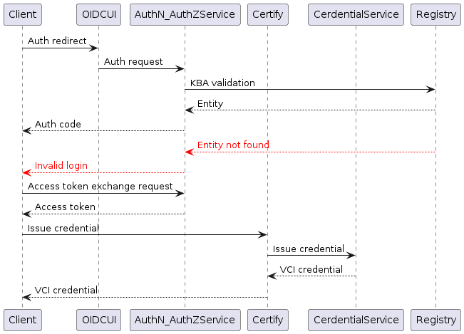

# Workflow

<figure><figcaption></figcaption></figure>

**Understanding the workflow:**

The workflow for credential issuance in the described scenario can be summarized as follows:

1. **Initiation of Credential Request**:
   * The identity owner (user) begins the credential request process by accessing the service's landing page.
2. **Authentication Process**:
   * The user is directed to an authentication page managed by a backend system that implements OpenID Connect (OIDC).
   * The user's personally identifiable information (PII) is sent to the authentication layer for verification against the identity registry.
3. **Issuance of Authentication Code**:
   * Upon successful verification, the authentication layer generates an authentication code. This code is typically valid for a single use and is provided to third-party web services.
4. **Token Retrieval**:
   * The third-party web service retrieves an access token using the authentication code received from eSignet.
5. **Passing the Access Token to Certify Service**:
   * The access token obtained from the third-party web service is passed to the Certify service.
6. **Credential Issuance**:
   * Certify service verifies the access token to ensure its validity.
   * Once verified, Certify uses its credential service to issue the requested credential.
   * The issued credential is then passed back to the identity owner (user) through the appropriate channels, completing the credential issuance process.


**Note:** The authentication layer, we will take an example here as eSignet, to have a better understanding of the workflow and this facilitates secure verification of user identities through a robust backend implementing OpenID Connect.


#### **Workflow Summary**

This workflow ensures that the credential issuance process is secure and follows best practices for identity verification and token management. It leverages OpenID Connect for authentication, integrates with eSignet for identity verification, and utilizes access tokens to facilitate secure communication between services. By following this structured approach, Inji Certify ensures that credentials are issued reliably and securely to authorized identity owners.
