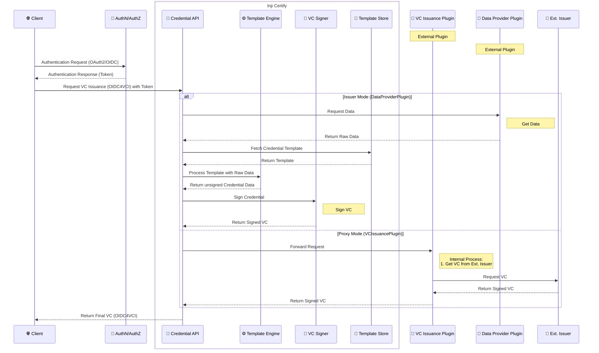

<!--

@description [IV Release 0.10.0]
@version [Version Number]
@author [Keshav Singh]
@date [Feb 10 2025 by Hitesh Jain]
@note [This might need a change with 0.11.0 release, ask PO]

-->

# Workflow

```mermaid
sequenceDiagram
    participant Client as 🌐 Client
    participant AuthN_AuthZ as 🔑 AuthN/AuthZ
    box Inji Certify #E6F3FF
        participant CredentialAPI as 🔗 Credential API
        participant TemplateEngine as ⚙️ Template Engine
        participant VCSigner as 🔏 VC Signer
        participant TemplateDB as 💾 Template Store
    end
    participant VCIssuancePlugin as 🔌 VC Issuance Plugin
    participant DataProviderPlugin as 🔌 Data Provider Plugin
    participant ExternalIssuer as 🏦 Ext. Issuer

    Note over VCIssuancePlugin: External Plugin
    Note over DataProviderPlugin: External Plugin

    Client->>AuthN_AuthZ: Authentication Request (OAuth2/OIDC)
    AuthN_AuthZ-->>Client: Authentication Response (Token)

    Client->>CredentialAPI: Request VC Issuance (OIDC4VCI) with Token
    alt Issuer Mode (DataProviderPlugin)
        CredentialAPI->>DataProviderPlugin: Request Data
        Note right of DataProviderPlugin: Get Data
        DataProviderPlugin-->>CredentialAPI: Return Raw Data

        CredentialAPI->>TemplateDB: Fetch Credential Template
        TemplateDB-->>CredentialAPI: Return Template

        CredentialAPI->>TemplateEngine: Process Template with Raw Data
        TemplateEngine-->>CredentialAPI: Return unsigned Credential Data

        CredentialAPI->>VCSigner: Sign Credential
        Note right of VCSigner: Sign VC
        VCSigner-->>CredentialAPI: Return Signed VC


    else Proxy Mode (VCIssuancePlugin)
        CredentialAPI->>VCIssuancePlugin: Forward Request
        Note right of VCIssuancePlugin: Internal Process:<br/>1. Get VC from Ext. Issuer
        VCIssuancePlugin->>ExternalIssuer: Request VC
        ExternalIssuer-->>VCIssuancePlugin: Return Signed VC
        VCIssuancePlugin-->>CredentialAPI: Return Signed VC

    end

    CredentialAPI-->>Client: Return Final VC (OIDC4VCI)

```

# Overview

Inji Certify is a platform designed to manage and facilitate the issuance of Verifiable Credentials (VCs). It features a modular architecture that supports both direct issuance and proxying of VCs from external sources. It interacts with external digital wallets via APIs.

The workflow for credential issuance in the described scenario can be summarized as follows:

## Digital Wallet (External)

 * Description: Digital wallets are external applications used by users to store and manage their VCs. Inji Certify does not include a built-in wallet. Instead, it provides APIs for seamless integration with various wallet providers.

### API Layer

 * Description: This layer serves as the entry point for all interactions with Inji Certify, including requests from external Digital Wallets. It handles routing, authorization (using OAuth2 OpenID Connect), and request validation.

### Core  Layer (Internal Components within the Blue Box)

This section comprises the core components responsible for VC processing:

 * **VC Signer**:

  * Description: Digitally signs Verifiable Credentials to guarantee authenticity and integrity.

* **Template Engine**:

  * Description: Manages templates for different VC types, populating them with data before signing.

* **Keymanager Service**:

  * Description: Securely stores and manages the cryptographic keys used for signing VCs.

### Data Sources Layer (Bottom Left)**

  * **Description**: This layer encompasses the databases and data stores holding the information required to generate VCs in "issuer mode".

 

### Plugins (Middle Bottom)

Inji Certify operates in two primary modes via its plugin system:

 * **Issuer Mode (using Data Provider Plugin)**:

  * **Data Provider Plugin**: Retrieves data from various sources (databases, APIs, etc.) to populate VC templates. In this mode, Inji Certify generates and issues VCs directly.

 * **Proxy Mode (using VC Issuance Plugin)**:

  * **VC Issuance Plugin**: Handles the specifics of proxying VCs issued by external sources. In this mode, Inji Certify does not generate the VC itself, but acts as a conduit for VCs issued elsewhere.

 * **Audit Plugin**: Logs all significant events related to VC Issuance and other events.

### External Verifiable Credentials Issuers (Bottom Right)

**Description**: Represents external entities that issue VCs. Inji Certify can operate in "proxy mode" to distribute VCs from these external issuers.

### Infrastructure Components (Bottom)

 * **Postgres DB**: The main database.

 * **Cache**: The caching system.

 * **HSM** (Hardware Security Module): For secure key management.

 <!-- 
 Update - Before IV Release 0.10.0

 1. **Initiation of Credential Request**:
   * The identity owner (user) begins the credential request process by accessing the service's landing page.
2. **Authentication Process**:
   * The user is directed to an authentication page managed by a backend system that implements OpenID Connect (OIDC), We can consider example of eSignet here (Check the note below this section for eSignet).
   * The user's personally identifiable information (PII) is sent to the authentication layer for verification against the identity registry.
3. **Issuance of Authentication Code**:
   * Upon successful verification, the authentication layer generates an authentication code. This code is typically valid for a single use and is provided to third-party web services.
4. **Token Retrieval**:
   * The third-party web service retrieves an access token using the authentication code received from eSignet.
5. **Passing the Access Token to Certify Service**:
   * The access token obtained from the third-party web service is passed to the Certify service.
6. **Credential Issuance**:
   * Certify service verifies the access token to ensure its validity.
   * Once verified, Certify uses its credential service to issue the requested credential.
   * The issued credential is then passed back to the identity owner (user) through the appropriate channels, completing the credential issuance process.


**Note:** The authentication layer, we will take an example here as eSignet, to have a better understanding of the workflow and this facilitates secure verification of user identities through a robust backend implementing OpenID Connect.


#### **Workflow Summary**

This workflow ensures that the credential issuance process is secure and follows best practices for identity verification and token management. It leverages OpenID Connect for authentication, integrates with eSignet for identity verification, and utilizes access tokens to facilitate secure communication between services. By following this structured approach, Inji Certify ensures that credentials are issued reliably and securely to authorized identity owners.
 
 -->