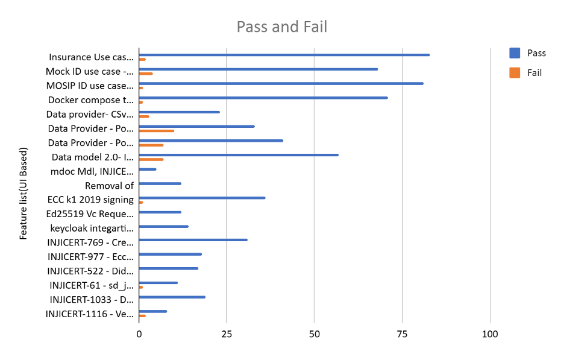

# Test Report

## Testing Scope

The scope of testing is to verify fitment to the specification from the perspective of&#x20;

* Functionality
* Deployability
* Configurability
* Customizability

Verification is performed not only from the end user perspective but also from the System Integrator (SI) point of view. Hence Configurability and Extensibility of the software is also assessed. This ensures readiness of software for use in multiple countries. Since MOSIP is an “API First” product platform.

Testing scope has been focused on the following features:

* Inji certify Docker compose testing (Data provider CSV plugin, Data provider Postgres plugin)
* Insurance, MosipId and Mock (Issuance and Data provider (Postgres plugin)), which covered Land registry use case
* Integration with Inji Web and Inji verify
* ECCR1 signing of VC request
* Did:key signing – scope from automation
* Credential config APIs
* DB upgrade scripts testing, Backward complatibility - from Docker setup
* Sd\_jwt format (Draft implementation)
* Revocation feature (Draft implementation)

## Test Approach 

Persona based approach has been adopted to perform the IV\&V, by simulating test scenarios that resemble real-time implementation.&#x20;

A Persona is a fictional character/user profile created to represent a user type that might use a product/or a service in a similar way. Persona based testing is a software testing technique that puts software testers in the customer's shoes, assesses their needs from the software and thereby determines use cases/scenarios that the customers will execute. The persona needs may be addressed through any of the following.

* Functionality
* Deployability
* Configurability
* Customizability

The verification methods may differ based on how the need was addressed.

## Verified configuration 

Verification is performed on configurations as mentioned below

* Default configuration
  * English

## Feature Health 

<figure><figcaption></figcaption></figure>


Note:

For Esignet compatibility

* eSignet 1.5.1 from released env
* Docker compose testing – esignet from collab env by default


## Test execution statistics 

### Functional test results 

Below are the test metrics by performing functional testing. The process followed was black box testing which based its test cases on the specifications of the software component under test. Functional test was performed in combination of individual module testing as well as integration testing. Test data were prepared in line with the user stories. Expected results were monitored by examining the user interface. The coverage includes GUI testing, System testing, and End-To-End flows across multiple configurations. The testing cycle included simulation of multiple identity schema and respective UI schema configurations.&#x20;

<table><thead><tr><th width="299.2734375" valign="top">Total</th><th valign="top">Passed</th><th valign="top"></th><th valign="top"></th></tr></thead><tbody><tr><td valign="top">747</td><td valign="top">723</td><td valign="top">21</td><td valign="top">2</td></tr><tr><td valign="top">Test Rate: 99%, With Pass Rate: 97% and Fail Rate: 3%</td><td valign="top"></td><td valign="top"></td><td valign="top"></td></tr></tbody></table>

Automation Statistics&#x20;

* Sunbird use case

<table><thead><tr><th width="294.9140625" valign="top">Total</th><th valign="top">Passed</th><th valign="top">Failed</th><th valign="top">Ignored</th><th valign="top">Known issues</th></tr></thead><tbody><tr><td valign="top">442</td><td valign="top">72</td><td valign="top">0</td><td valign="top">336</td><td valign="top">34</td></tr><tr><td valign="top">Test Rate: 100%, With Pass Rate: 90% and Fail Rate: 10%</td><td valign="top"></td><td valign="top"></td><td valign="top"></td><td valign="top"></td></tr></tbody></table>

* Mock Use case

<table data-header-hidden><thead><tr><th valign="top"></th><th valign="top"></th><th valign="top"></th><th valign="top"></th><th valign="top"></th></tr></thead><tbody><tr><td valign="top">Total</td><td valign="top">Passed</td><td valign="top">Failed</td><td valign="top">Ignored</td><td valign="top">Known issues</td></tr><tr><td valign="top">442</td><td valign="top">50</td><td valign="top">0</td><td valign="top">358</td><td valign="top">34</td></tr><tr><td valign="top">Test Rate: 100%, With Pass Rate: 94.4% and Fail Rate: 5.6%</td><td valign="top"></td><td valign="top"></td><td valign="top"></td><td valign="top"></td></tr></tbody></table>

&#x20;\- Mock (Data provider) Landregistry Use case

<table data-header-hidden><thead><tr><th valign="top"></th><th valign="top"></th><th valign="top"></th><th valign="top"></th><th valign="top"></th></tr></thead><tbody><tr><td valign="top">Total</td><td valign="top">Passed</td><td valign="top">Failed</td><td valign="top">Ignored</td><td valign="top">Known Issues</td></tr><tr><td valign="top">442</td><td valign="top">209</td><td valign="top">0</td><td valign="top">199</td><td valign="top">34</td></tr><tr><td valign="top">Test Rate: 100%, With Pass Rate: 94.6% and Fail Rate: 5.4%</td><td valign="top"></td><td valign="top"></td><td valign="top"></td><td valign="top"></td></tr></tbody></table>

&#x20;MosipId Use case

<table data-header-hidden><thead><tr><th valign="top"></th><th valign="top"></th><th valign="top"></th><th valign="top"></th><th valign="top"></th></tr></thead><tbody><tr><td valign="top">Total</td><td valign="top">Passed</td><td valign="top">Failed</td><td valign="top">Ignored</td><td valign="top">Known Issues</td></tr><tr><td valign="top">442</td><td valign="top">64</td><td valign="top">0</td><td valign="top">344</td><td valign="top">34</td></tr><tr><td valign="top">Test Rate: 100%, With Pass Rate: 85.3% and Fail Rate: 14.7%</td><td valign="top"></td><td valign="top"></td><td valign="top"></td><td valign="top"></td></tr></tbody></table>


Note: Ignored scenarios are not related to particular use cases and 34 scenarios are known issues can be tracked from INJICERT-681, INJICERT-1118, INJICERT-1176


### Detailed Test Metrics 

Below are the detailed test metrics by performing manual/automation testing. The project metrics are derived from Defect density, Test coverage, Test execution coverage, test tracking and efficiency.

The various metrics that assist in test tracking and efficiency are as follows:

* Passed Test Cases Coverage: It measures the percentage of passed test cases. (Number of tests passed / Total number of tests executed) x 100
* Failed Test Case Coverage: It measures the percentage of all the failed test cases. (Number of failed tests / Total number of test cases executed) x 100

## Tested with Components 

<table><thead><tr><th valign="top">Module/Repo</th><th valign="top">Image</th><th valign="top">POM version</th><th valign="top">Dependent artifactID</th><th valign="top">Comments</th></tr></thead><tbody><tr><td valign="top">Inji-certify-mosipid</td><td valign="top">mosipqa/inji-certify-with-plugins:0.12.x</td><td valign="top"> </td><td valign="top">Digital-credential-plugin - 0.5.0</td><td valign="top"> </td></tr><tr><td valign="top">Inji-certify-mock</td><td valign="top">mosipqa/inji-certify-with-plugins:0.12.x</td><td valign="top"> </td><td valign="top">Digital-credential-plugin - 0.5.0</td><td valign="top"> </td></tr><tr><td valign="top">Inji-certify-Insurance</td><td valign="top">mosipqa/inji-certify-with-plugins:0.12.x</td><td valign="top"> </td><td valign="top">Digital-credential-plugin - 0.5.0</td><td valign="top">
 

 
</td></tr><tr><td valign="top">Inji-certify- landregistry</td><td valign="top">mosipqa/inji-certify-with-plugins:0.12.x</td><td valign="top"> </td><td valign="top">Digital-credential-plugin - 0.5.0</td><td valign="top"> </td></tr><tr><td valign="top">Mdoc-mdl</td><td valign="top">mosipqa/inji-certify-with-plugins:0.12.x</td><td valign="top"> </td><td valign="top">Digital-credential-plugin - 0.5.0</td><td valign="top"> </td></tr><tr><td valign="top">Inji-config</td><td valign="top">Releasing from release-0.10.x branch</td><td valign="top"> </td><td valign="top">Digital-credential-plugin - 0.5.0</td><td valign="top"><a href="https://github.com/mosip/inji-config/tree/release-0.8.x">https://github.com/mosip/inji-config/tree/release-0.10.x</a></td></tr><tr><td valign="top">eSignet</td><td valign="top">eSignet-1.5.1</td><td valign="top"> </td><td valign="top"> </td><td valign="top"> </td></tr><tr><td valign="top">Keymanager</td><td valign="top">As a library</td><td valign="top">
1.3.0-beta.4(1.3.0-SNAPSHOT)

 
</td><td valign="top"> </td><td valign="top">Getting release with branch name release-1.3.x</td></tr></tbody></table>

&#x20;
