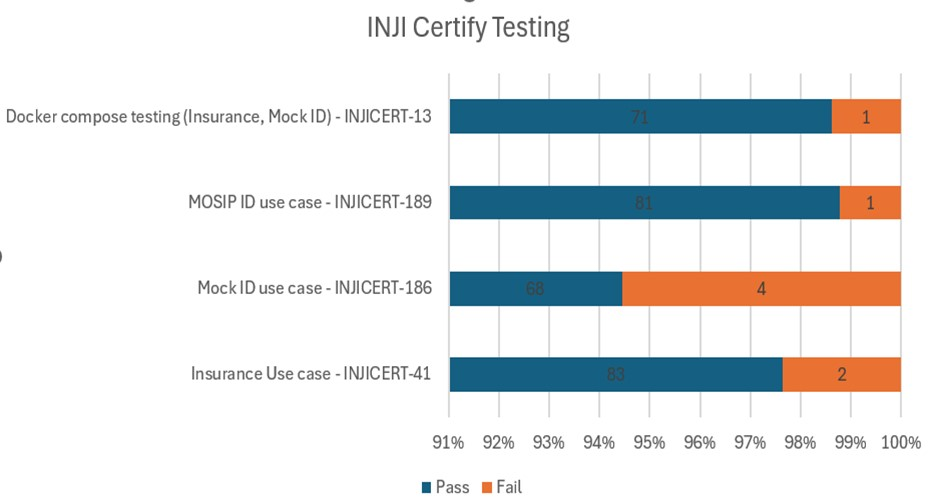

# Test Report

## Testing Scope

The scope of testing is to verify fitment to the specification from the perspective of

* Functionality
* Deployability
* Configurability
* Customizability

Verification is performed not only from the end user perspective but also from the System Integrator (SI) point of view. Hence Configurability and Extensibility of the software are also assessed. This ensures the readiness of software for use in multiple countries. Since MOSIP is an “API First” product platform.

The testing scope has been focused on the following features:

* Inji certify Docker compose testing(VCI segregations)
* Docker compose testing for Insurance and Mock ID use case
* Inji certify - Insurance use case using namespace
* Inji certify - Mock IDA use case using namespace
* Inji certify - MOSIP ID use case using namespace(verified using idrepo UIN/VIDs only)
* Integration with INJI Web

## Swaggers links

[https://injicertify-mosipid.qa-inji.mosip.net/v1/certify/swagger-ui/index.html#/](https://injicertify-mosipid.qa-inji.mosip.net/v1/certify/swagger-ui/index.html#/)

[https://injicertify-mock.qa-inji.mosip.net/v1/certify/swagger-ui/index.html#/](https://injicertify-mock.qa-inji.mosip.net/v1/certify/swagger-ui/index.html#/)

[https://injicertify-insurance.qa-inji.mosip.net/v1/certify/swagger-ui/index.html#/](https://injicertify-insurance.qa-inji.mosip.net/v1/certify/swagger-ui/index.html#/)

## Test Approach

Persona based approach has been adopted to perform the IV\&V, by simulating test scenarios that resemble a real-time implementation.

A Persona is a fictional character/user profile created to represent a user type that might use a product/or a service in a similar way. Persona based testing is a software testing technique that puts software testers in the customer's shoes, assesses their needs from the software, and thereby determines use cases/scenarios that the customers will execute. The persona's needs may be addressed through any of the following.

* Functionality
* Deployability
* Configurability
* Customizability

The verification methods may differ based on how the need was addressed.

## Verified configuration

Verification is performed on configurations as mentioned below

* Default configuration
  * English

## Feature Health

<figure><figcaption>
Feature Health
</figcaption></figure>


**Note:**

1. UINs/VIDs generated with ID Repo were only used in verifying MOSIP ID, and Reg-Client UINs were not verified.
2. The Sunbird registry was pointing to Sunbird dev.


## Test execution statistics

### Functional test results 

Below are the test metrics by performing functional testing. The process followed was black box testing which based its test cases on the specifications of the software component under test. The functional test was performed in combination with individual module testing as well as integration testing. Test data were prepared in line with the user stories. Expected results were monitored by examining the user interface. The coverage includes GUI testing, System testing, End-To-End flows across multiple configurations. The testing cycle included the simulation of multiple identity schema and respective UI schema configurations.

| Total | Passed | Failed | NA |
| ----- | ------ | ------ | -- |
| 313   | 305    | 8      | 0  |

**Test Rate:** 100%, With **Pass Rate:** 97% and **Fail Rate:** 3%

### Detailed Test metrics

Below are the detailed test metrics by performing manual/automation testing. The project metrics are derived from Defect density, Test coverage, Test execution coverage, test tracking, and efficiency.

The various metrics that assist in test tracking and efficiency are as follows:

●  Passed Test Cases Coverage: It measures the percentage of passed test cases. (Number of passed tests / Total number of tests executed) x 100

●  Failed Test Case Coverage: It measures the percentage of all the failed test cases. (Number of failed tests / Total number of test cases executed) x 100

## Tested with Components

<table><thead><tr><th>Module/Repo</th><th>Image</th><th width="128">POM version</th><th width="205">Dependent artifactID</th><th>Comments</th></tr></thead><tbody><tr><td>Inji-certify-mosipid</td><td>mosipqa/inji-certify:0.9.x</td><td> </td><td>Digital-credential-plugin - 0.2.1</td><td> </td></tr><tr><td>Inji-certify-mock</td><td>mosipqa/inji-certify:0.9.x</td><td> </td><td>Digital-credential-plugin - 0.2.1</td><td> </td></tr><tr><td>Inji-certify-Insurance</td><td>mosipqa/inji-certify:0.9.x</td><td> </td><td>Digital-credential-plugin - 0.2.1</td><td> </td></tr><tr><td>Inji-config</td><td>mosipqa/config-server:1.1.2</td><td> </td><td> </td><td><a href="https://github.com/mosip/inji-config/tree/release-0.2.x">https://github.com/mosip/inji-config/tree/release-0.2.x</a></td></tr><tr><td>Keymanager</td><td> </td><td>1.3.0-Snapshot</td><td> </td><td> </td></tr><tr><td>Commons</td><td> </td><td>1.3.0-Snapshot</td><td> </td><td> </td></tr><tr><td>Artifactory-certify</td><td>mosipqa/artifactory-server:0.9.1-INJI</td><td> </td><td> </td><td> </td></tr><tr><td>eSignet</td><td>
eSignet-1.4.1

mosipid/esignet:1.4.1
</td><td> </td><td> </td><td> </td></tr></tbody></table>

The Github link for the xls file is [**here**.](https://github.com/mosip/test-management/tree/master/inji-certify/0.9.1)
