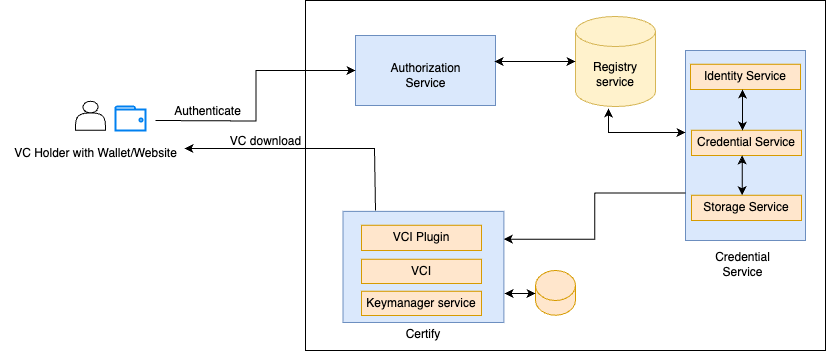

# Components

Inji Certify leverages the following components (from existing building blocks/products):

<figure><figcaption></figcaption></figure>

1.  eSignet (v1.4.0): VCI microservice and Authentication microservice

    **a. eSignet service**:

    * Implements OpenID Connect flows that help the relying party perform quick and easy integrations using pre-existing libraries for user verification.
    * Exposes API for VCI Issuance which internally connects with credential service and sends the Verifiable Credential (VC) issued by the service as a response

    **b. OIDC UI:**

    * The user interface component of eSignet, Manages user authentication and user consent. Integrates with the REST endpoints provided by esignet-service.&#x20;

    **c. Authenticator Plugin:**

    * provides methods to authenticate the end-user with control of the supported authentication factors. There is a default plugin implemented for Sunbird Registry.
2.  Certify(v0.9.0): VCI microservice

    **a. VCI:**

    * Exposes API for VCI Issuance which internally connects with credential service and sends the Verifiable Credential (VC) issued by the service as a response.

    **b. VC Issuance Plugin:**

    * Provides support to generate credentials from existing datasouce. There is a default plugin implemented for Sunbird Registry.
3.  Sunbird RC (v2.0.0): Identity microservice, Schema microservice, and Cred microservice.

    **a. Identity Service :**&#x20;

    * The central lynchpin to maintain identities across the system. All identities in Sunbird-RC are DID-compliant and are web-resolvable. The other microservices (Credential Schema Service and Credential Service) depend on this for generating any identity.&#x20;
    * Docker Image: [http://ghcr.io/sunbird-rc/sunbird-rc-identity-service:v2.0.0-rc1](http://ghcr.io/sunbird-rc/sunbird-rc-identity-service:v2.0.0-rc1) &#x20;
    * Depends on the vault (healthy), database. \

    **b. Credential Schema service:**  &#x20;

    * Stores the schema of the Verifiable Credential along with the associated view template.&#x20;
    * Docker Image: [http://ghcr.io/sunbird-rc/sunbird-rc-credential-schema:v2.0.0-rc1](http://ghcr.io/sunbird-rc/sunbird-rc-credential-schema:v2.0.0-rc1) &#x20;
    * Depends on identity service, and database.&#x20;

&#x20;       **c. Credential service:**&#x20;

* Core issuance service. Called with the payload, which is then transformed into a W3C-compliant Verifiable Credential in JSON-LD format. The payload is then signed using the private key which was generated as part of the original Issuer creation.&#x20;
* Docker Image: [https://github.com/sunbird-rc/sunbird-rc-core/pkgs/container/sunbird-rc-credentials-service](https://github.com/sunbird-rc/sunbird-rc-core/pkgs/container/sunbird-rc-credentials-service)
* Depends on identity service, schema service, and database.

&#x20;      **d. Vault Service:**&#x20;

* To be included as a dependency along with the pg.
* Hashi Corp vault is the Keystore which acts as the vault service.&#x20;
* Identity service is dependent on the vault service.&#x20;
* Stores key pairs and secrets for the issuers.
