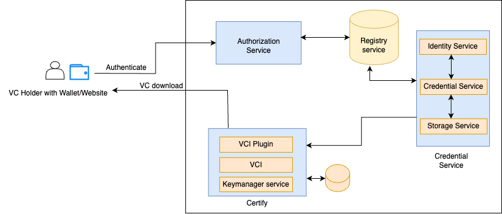

# Overview

Inji Certify is a platform designed to manage and facilitate the issuance of Verifiable Credentials (VCs). It features a modular architecture that supports both direct issuance and proxying of VCs from external sources. It interacts with external digital wallets via APIs.

<figure><figcaption></figcaption></figure>

 * This layered component diagram represents the architecture of the Inji Certify system.

 * The diagram is organized into four distinct layers, each representing a different aspect of the system's functionality: 

 1. **API Layer**:
 * This layer serves as the entry point for external interactions with the system.

 * It exposes various APIs that allow clients to interact with the underlying services.

 2. **VC Signer and Template Engine**:
 * This layer is responsible for the creation and signing of Verifiable Credentials (VCs).

 * The Template Engine component within this layer handles the generation of credential templates.

 * The VC Signer component ensures that the credentials are properly signed and verifiable.

 3. **Keymanager Service**:
 * This layer manages cryptographic keys used for signing and verifying credentials.
 * It ensures the secure storage and retrieval of keys, and handles key rotation and management tasks.

 4. **Plugin interaction**:
 * This foundational layer consists of three plugins that provide essential services to the upper layers:

 * **Data Provider Plugins:** These plugins fetch relevant data from external sources or registries. They retrieve the necessary information and return it to Inji Certify as a JSON object. Inji Certify then utilizes this data to generate and issue the corresponding VCs..

 * **Audit Plugin**: Tracks and logs actions within the system for auditing purposes.
 * **VC Issuance Plugin**: Exposes API for VCI Issuance which internally connects with credential service and sends the Verifiable Credential (VC) issued by the service as a response.

Each layer builds upon the services provided by the layer below it, creating a modular and scalable architecture for the Inji Certify system.

<!--

Hitesh Jain provided content
Also copy the sequence diagram.....from this JIRA Ticket - 

https://mosip.atlassian.net/browse/INJICERT-842

Overview

Inji Certify is a platform designed to manage and facilitate the issuance of Verifiable Credentials (VCs). It features a modular architecture that supports both direct issuance and proxying of VCs from external sources. It interacts with external digital wallets via APIs.

Digital Wallet (External)

Description: Digital wallets are external applications used by users to store and manage their VCs. Inji Certify does not include a built-in wallet. Instead, it provides APIs for seamless integration with various wallet providers.

API Layer

Description: This layer serves as the entry point for all interactions with Inji Certify, including requests from external Digital Wallets. It handles routing, authorization (using OAuth2 OpenID Connect), and request validation.

Core  Layer (Internal Components within the Blue Box)

This section comprises the core components responsible for VC processing:

VC Signer:

Description: Digitally signs Verifiable Credentials to guarantee authenticity and integrity.

Template Engine:

Description: Manages templates for different VC types, populating them with data before signing.

Keymanager Service:

Description: Securely stores and manages the cryptographic keys used for signing VCs.

Data Sources Layer (Bottom Left)

Description: This layer encompasses the databases and data stores holding the information required to generate VCs in "issuer mode".

 

Plugins (Middle Bottom)

Inji Certify operates in two primary modes via its plugin system:

Issuer Mode (using Data Provider Plugin):

Data Provider Plugin: Retrieves data from various sources (databases, APIs, etc.) to populate VC templates. In this mode, Inji Certify generates and issues VCs directly.

 

Proxy Mode (using VC Issuance Plugin):

VC Issuance Plugin: Handles the specifics of proxying VCs issued by external sources. In this mode, Inji Certify does not generate the VC itself, but acts as a conduit for VCs issued elsewhere.

Audit Plugin: Logs all significant events related to VC Issuance and other events.

External Verifiable Credentials Issuers (Bottom Right)

Description: Represents external entities that issue VCs. Inji Certify can operate in "proxy mode" to distribute VCs from these external issuers.

 

Infrastructure Components (Bottom)

Postgres DB: The main database.

Cache: The caching system.

HSM (Hardware Security Module): For secure key management.

>

<!-- 

Very Old content

1.  eSignet (v1.4.0): VCI microservice and Authentication microservice

    **a. eSignet service**:

    * Implements OpenID Connect flows that help the relying party perform quick and easy integrations using pre-existing libraries for user verification.
    * Exposes API for VCI Issuance which internally connects with credential service and sends the Verifiable Credential (VC) issued by the service as a response

    **b. OIDC UI:**

    * The user interface component of eSignet, Manages user authentication and user consent. Integrates with the REST endpoints provided by esignet-service.&#x20;

    **c. Authenticator Plugin:**

    * provides methods to authenticate the end-user with control of the supported authentication factors. There is a default plugin implemented for Sunbird Registry.

2.  Certify(v0.9.0): VCI microservice

    **a. VCI:**

    * Exposes API for VCI Issuance which internally connects with credential service and sends the Verifiable Credential (VC) issued by the service as a response.

    **b. VC Issuance Plugin:**

    * Provides support to generate credentials from existing datasouce. There is a default plugin implemented for Sunbird Registry.
3.  Sunbird RC (v2.0.0): Identity microservice, Schema microservice, and Cred microservice.

    **a. Identity Service :**&#x20;

    * The central lynchpin to maintain identities across the system. All identities in Sunbird-RC are DID-compliant and are web-resolvable. The other microservices (Credential Schema Service and Credential Service) depend on this for generating any identity.&#x20;
    * Docker Image: [http://ghcr.io/sunbird-rc/sunbird-rc-identity-service:v2.0.0-rc1](http://ghcr.io/sunbird-rc/sunbird-rc-identity-service:v2.0.0-rc1) &#x20;
    * Depends on the vault (healthy), database. \

    **b. Credential Schema service:**  &#x20;

    * Stores the schema of the Verifiable Credential along with the associated view template.&#x20;
    * Docker Image: [http://ghcr.io/sunbird-rc/sunbird-rc-credential-schema:v2.0.0-rc1](http://ghcr.io/sunbird-rc/sunbird-rc-credential-schema:v2.0.0-rc1) &#x20;
    * Depends on identity service, and database.&#x20;

&#x20;       **c. Credential service:**&#x20;

* Core issuance service. Called with the payload, which is then transformed into a W3C-compliant Verifiable Credential in JSON-LD format. The payload is then signed using the private key which was generated as part of the original Issuer creation.&#x20;
* Docker Image: [https://github.com/sunbird-rc/sunbird-rc-core/pkgs/container/sunbird-rc-credentials-service](https://github.com/sunbird-rc/sunbird-rc-core/pkgs/container/sunbird-rc-credentials-service)
* Depends on identity service, schema service, and database.

&#x20;      **d. Vault Service:**&#x20;

* To be included as a dependency along with the pg.
* Hashi Corp vault is the Keystore which acts as the vault service.&#x20;
* Identity service is dependent on the vault service.&#x20;
* Stores key pairs and secrets for the issuers.

-->
